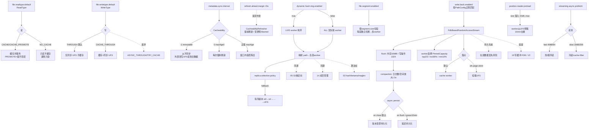

# 01 · 客户端文件系统与读写路径

> 场景组:`alluxio.user.*`(读写/文件/块/流/副本/位置读/写回缓存等)+ `alluxio.client.*` + `alluxio.stream.*`
> 配置数:**118** · 别名 17 · 废弃 0 · 数据来源:`PropertyKey.java` · 生成表:`_data/gen_table.py 01`

---

## 1. 本组概览

这是**应用侧最常调**的一组——决定 Spark / Presto / PyTorch / HDFS Client 通过 Alluxio 读写时的默认行为、缓存策略、元数据新鲜度、副本与一致性哈希路由。绝大多数 Scope 为 `CLIENT`(仅客户端进程读取),少量 `ALL`(需客户端+服务端一致)。

八个子场景:

| 子场景 | 关键配置 | 核心矛盾 |
|---|---|---|
| 读写默认类型 | `file.readtype.default`、`file.writetype.default`、`block.size.bytes.default` | 缓存 vs 直通 / 一致性 vs 性能 |
| 元数据加载与同步 | `file.metadata.load.type`、`file.metadata.sync.interval`、`file.metadata.refresh.ahead.margin.ms` | 新鲜度 vs 元数据开销 |
| TTL 与副本 | `file.create.ttl(.action)`、`file.replication.*`、`replica.*` | 空间回收 / 可用性 vs 成本 |
| 一致性哈希路由 | `dynamic.consistent.hash.ring.enabled`、`consistent.hash.ring.versioning.*` | 缓存亲和 vs 环稳定性 |
| 位置读预取 | `position.reader.preload.*`、`position.reader.streaming.*` | 冷读延迟 vs UFS 压力 |
| 写回缓存(write cache) | `write.cache.*`(约 25 项) | 写吞吐/随机写 vs 内存与一致性风险 |
| 客户端连接池 | `*.client.pool.*`、`index.service.*` | 复用/并发 vs 资源占用 |
| 引擎集成 | `presto.*`、`virtual.path.mapping.*`、`hdfs.*` | 兼容性 |

---

## 2. 配置清单速查表(全量 118 项)

<!-- 由 _data/gen_table.py 01 生成;说明列为官方 description 的中文精简 -->

### 2.1 读写默认与整体行为
| 配置项 | 默认值 | 类型 | Scope | 一致性 | 说明 |
|---|---|---|---|---|---|
| `alluxio.user.file.readtype.default` | CACHE | enum | CLIENT | — | 默认读类型:CACHE_PROMOTE / CACHE / NO_CACHE 等 |
| `alluxio.user.file.writetype.default` | THROUGH | enum | CLIENT | WARN | 默认写类型:CACHE_THROUGH / THROUGH / ASYNC_THROUGH 等 |
| `alluxio.user.block.size.bytes.default` | 64MiB | dataSize | CLIENT | WARN | Alluxio 文件默认块大小 |
| `alluxio.user.file.buffer.bytes` | 8MiB | dataSize | CLIENT | WARN | 读写文件缓冲区大小 |
| `alluxio.user.file.reserved.bytes` | =块大小 | dataSize | CLIENT | WARN | 写入时在 worker 预留的空间;调小可提升小于块的并发写 |
| `alluxio.user.file.write.tier.default` | 0(首层) | int | CLIENT | WARN | 写块选择的默认存储层 |
| `alluxio.user.file.write.init.max.duration` | 2min | duration | CLIENT | — | worker 未就绪时,写初始化的最大重试时长 |
| `alluxio.client.list.status.from.ufs.enabled` | true | boolean | ALL | ENFORCE | 直接经 UFS iterateStatus 列举、绕过 worker |
| `alluxio.client.write.to.ufs.enabled` | true | boolean | ALL | ENFORCE | 客户端同时写 worker(缓存)与 UFS |
| `alluxio.user.block.avoid.eviction.policy.reserved.size.bytes` | 0MiB | dataSize | CLIENT | WARN | LocalFirstAvoidEvictionPolicy 预留空间 |
| `alluxio.user.file.target.media` | — | string | CLIENT | — | 存块时偏好的介质类型 |
| `alluxio.user.file.set.attribute.noop.enabled` | false | boolean | CLIENT | IGNORE | setAttribute 变空操作(部分 UFS 不支持时避异常) |
| `alluxio.user.file.include.operation.id` | true | boolean | CLIENT | WARN | 指定文件系统操作携带唯一 operation id |
| `alluxio.user.file.delete.unchecked` | false | boolean | CLIENT | — | 递归删持久化目录前是否校验 UFS 与 Alluxio 同步 |
| `alluxio.user.default.delete.all.replicas` | false | boolean | ALL | ENFORCE | 删除时查找并删除文件全部副本 |
| `alluxio.user.uri.fragment.ignored` | false | boolean | — | WARN | 解析路径时忽略 URI fragment(兼容 AWS Glue 等) |

### 2.2 元数据加载与同步
| 配置项 | 默认值 | 类型 | Scope | 一致性 | 说明 |
|---|---|---|---|---|---|
| `alluxio.user.file.metadata.load.type` | ONCE | enum | CLIENT | WARN | UFS 元数据加载行为:ALWAYS / ONCE / NEVER |
| `alluxio.user.file.metadata.sync.interval` | -1 | duration | CLIENT | WARN | 操作前同步 UFS 元数据的间隔;-1 不同步,0 每次同步 |
| `alluxio.user.file.metadata.refresh.ahead.margin.ms` | 15s | duration | CLIENT | WARN | 元数据快照过期前的提前刷新余量 |
| `alluxio.user.file.metadata.real.content.hash` | false | boolean | SERVER | WARN | 从 UFS 加载时是否取真实内容 hash |
| `alluxio.user.file.list.cache.async.update.enable` | true | boolean | CLIENT | WARN | 异步更新变更文件列表的元数据 |
| `alluxio.user.update.file.accesstime.disabled` | false | boolean | CLIENT | WARN | (实验)客户端不更新文件访问时间 |

### 2.3 TTL 与副本
| 配置项 | 默认值 | 类型 | Scope | 一致性 | 说明 |
|---|---|---|---|---|---|
| `alluxio.user.file.create.ttl` | 无TTL | duration | CLIENT | — | 用户创建文件的存活时间 |
| `alluxio.user.file.create.ttl.action` | FREE | enum | CLIENT | — | TTL 到期动作:FREE / DELETE_ALLUXIO / DELETE |
| `alluxio.user.file.replication.min` | 1 | int | CLIENT | — | 文件最小副本数 |
| `alluxio.user.file.replication.max` | -1 | int | CLIENT | — | 文件最大副本数;负值=无上限 |
| `alluxio.user.file.replication.durable` | 1 | int | CLIENT | — | ASYNC_THROUGH 写在持久化前的目标副本数 |
| `alluxio.user.replica.selection.policy` | RANDOM | enum | ALL | ENFORCE | 指定副本数时的副本选择策略 |
| `alluxio.user.replica.prefer.cached.replicas` | false | boolean | ALL | IGNORE | 优先选择已缓存文件的副本 |
| `alluxio.user.replica.prioritize.local.worker` | false | boolean | ALL | ENFORCE | 优先选择同节点部署的 worker |
| `alluxio.user.replica.placement.rule.store.etcd.refresh.interval` | 10s | duration | ALL | IGNORE | etcd 副本放置规则库刷新间隔 |
| `alluxio.user.file.persist.on.rename` | false | boolean | CLIENT | — | rename 后异步持久化(配合以 rename 提交的计算框架) |
| `alluxio.user.file.persistence.initial.wait.time` | 0 | duration | CLIENT | — | 启动持久化任务前的等待;-1=仅经 rename/CLI 持久化 |

### 2.4 一致性哈希路由
| 配置项 | 默认值 | 类型 | Scope | 一致性 | 说明 |
|---|---|---|---|---|---|
| `alluxio.user.dynamic.consistent.hash.ring.enabled` | true | boolean | CLIENT | ENFORCE | 用存活 worker 构建哈希环(否则含失联 worker) |
| `alluxio.user.consistent.hash.ring.versioning.enabled` | false | boolean | ALL | ENFORCE | 哈希环显式版本化,支持批量更新后提交 |
| `alluxio.user.consistent.hash.ring.versioning.max.history.retained` | 20 | int | ALL | ENFORCE | etcd 中保留的环历史版本数 |

### 2.5 位置读预取(position reader preload / streaming)
| 配置项 | 默认值 | 类型 | Scope | 一致性 | 说明 |
|---|---|---|---|---|---|
| `alluxio.user.position.reader.preload.data.enabled` | false | boolean | CLIENT | IGNORE | 让 worker 从 UFS 预载后续数据,提升冷读 |
| `alluxio.user.position.reader.preload.data.size` | 256MiB | dataSize | CLIENT | IGNORE | worker 端预载数据量 |
| `alluxio.user.position.reader.preload.data.file.size.threshold.min` | 2GiB | dataSize | CLIENT | IGNORE | 触发预载的最小文件大小(别名 ...threshold) |
| `alluxio.user.position.reader.preload.data.file.size.threshold.max` | 0(无限) | dataSize | CLIENT | IGNORE | 触发预载的最大文件大小 |
| `alluxio.user.position.reader.preload.dedup.cache.ttl` | 10min | duration | CLIENT | IGNORE | 预载去重缓存 TTL |
| `alluxio.user.position.reader.streaming.async.prefetch.part.length` | 4MiB | dataSize | CLIENT | IGNORE | 快池:每个异步预取分片长度(别名 ...fast...) |
| `alluxio.user.position.reader.streaming.async.prefetch.thread` | 64 | int | CLIENT | IGNORE | 快池:异步预取线程数(全流共享) |
| `alluxio.user.position.reader.streaming.slow.async.prefetch.part.length` | 1MiB | dataSize | CLIENT | IGNORE | 慢池:分片长度 |
| `alluxio.user.position.reader.streaming.slow.async.prefetch.thread` | 256 | int | CLIENT | IGNORE | 慢池:异步预取线程数 |

### 2.6 写回缓存(write cache 系列)
| 配置项 | 默认值 | 类型 | Scope | 一致性 | 说明 |
|---|---|---|---|---|---|
| `alluxio.user.write.back.enabled` | false | boolean | CLIENT | IGNORE | 为指定路径启用本地写回缓存 |
| `alluxio.user.write.cache.in.memory.write.buffer.size` | 16MiB | dataSize | CLIENT | — | 刷入 page store 前的内存写缓冲上限 |
| `alluxio.user.write.cache.max.write.operation.number` | 1024 | int | CLIENT | — | 随机写流的最大写操作数(超过触发 flush) |
| `alluxio.user.write.cache.writer.thread.pool.size` | 1024 | int | CLIENT | — | 并行写多副本的线程池大小 |
| `alluxio.user.write.cache.async.prefetch.enabled` | false | boolean | CLIENT | — | 随机访问写缓存流的异步预读 |
| `alluxio.user.write.cache.async.prefetch.memory.limit` | 32MiB | dataSize | CLIENT | — | 异步预读内存上限 |
| `alluxio.user.write.cache.async.prefetch.thread.number` | 16 | int | CLIENT | — | 异步预读线程数 |
| `alluxio.user.write.cache.asycn.page.store.file.persist.task.thread.number` | 64 | int | CLIENT | — | 写缓存异步 page store 文件持久化任务线程数 |
| `alluxio.user.write.cache.trigger.compaction.on.write.log.count` | 1024 | int | ALL | — | 触发 compaction 的写日志数 |
| `alluxio.user.write.cache.max.write.logs.per.block.for.compaction` | 8 | int | ALL | — | 每块用于 compaction 的最大写日志数 |
| `alluxio.user.write.cache.compaction.space.amplification.percent` | 50 | int | ALL | — | 触发 compaction 的空间放大百分比阈值 |
| `alluxio.user.write.cache.compaction.space.amplification.min.file.size` | 64MiB | dataSize | ALL | — | 触发空间放大检查的最小逻辑文件大小 |
| `alluxio.user.write.cache.submit.compaction.task.to.worker.enabled` | true | boolean | ALL | — | 是否把 compaction 任务提交给 worker |
| `alluxio.user.write.cache.trigger.async.persist.on.file.closed.enabled` | true | boolean | CLIENT | — | 文件关闭时触发异步持久化 |
| `alluxio.user.write.cache.trigger.async.persist.on.file.flushed.enabled` | false | boolean | CLIENT | — | 文件 flush 时触发异步持久化 |
| `alluxio.user.write.cache.trigger.async.persist.grace.duration.on.file.flushed` | 10min | duration | CLIENT | — | flush 触发异步持久化的宽限期 |
| `alluxio.user.write.cache.random.access.ufs.page.store.enabled` | false | boolean | CLIENT | — | 随机写缓存把 page store 持久化到挂载 UFS 而非 worker |
| `alluxio.user.write.cache.random.access.ufs.page.store.path` | — | string | CLIENT | — | UFS page store 模式下的持久化 Alluxio 路径 |
| `alluxio.user.write.cache.multi.workspace.ufs.base.path` | — | string | CLIENT | — | 多工作区模式下写缓存数据的 UFS 基路径 |
| `alluxio.user.write.cache.workspace.gc.time` | 1h | duration | CLIENT | — | 非活跃工作区可被回收的时长 |
| `alluxio.user.write.cache.workspace.orphan.file.check.period` | 30min | duration | CLIENT | — | 工作区孤儿 UFS 文件检查间隔 |
| `alluxio.user.write.cache.transient.copy.read.fallback.enabled` | false | boolean | CLIENT | — | 命中瞬态副本规则且本地副本可证等价时,从写缓存服务读 |
| `alluxio.user.write.cache.worker.selection.policy.type` | — | enum | CLIENT | WARN | 写缓存路径的 worker 选择策略覆盖(默认复用读侧) |
| `alluxio.user.write.cache.pinned.capacity.policy.top.fraction` | 2/3 | double | CLIENT | WARN | 写缓存选 worker:按剩余 pinned 容量恒保留的比例 |
| `alluxio.user.write.cache.pinned.capacity.policy.inclusion.percent` | 30 | int | CLIENT | WARN | 剩余 pinned 容量高于此百分比的 worker 恒保留 |
| `alluxio.user.write.cache.pinned.capacity.policy.min.remaining.percent` | 10 | int | CLIENT | WARN | 剩余 pinned 容量低于此百分比的 worker 剔除 |
| `alluxio.user.upload.manager.concurrency` | 16 | int | CLIENT | WARN | 从写回缓存异步上传 UFS 的并发 |

### 2.7 客户端连接池与 index service
| 配置项 | 默认值 | 类型 | Scope | 一致性 | 说明 |
|---|---|---|---|---|---|
| `alluxio.user.block.worker.client.pool.max` | 1024 | int | CLIENT | WARN | block worker 客户端池最大数(别名 ...pool.size) |
| `alluxio.user.block.worker.client.pool.min` | 0 | int | CLIENT | WARN | block worker 客户端池最小数 |
| `alluxio.user.block.worker.client.pool.gc.threshold` | 24h | duration | CLIENT | WARN | 空闲超此阈值则关闭 block worker 客户端 |
| `alluxio.user.file.master.client.pool.size.max` | 500 | int | CLIENT | WARN | fs master 客户端池最大数(别名 ...client.threads) |
| `alluxio.user.file.master.client.pool.size.min` | 0 | int | CLIENT | WARN | fs master 客户端池最小数(长驻进程建议 0) |
| `alluxio.user.file.master.client.pool.gc.interval` | 120sec | duration | CLIENT | WARN | fs master 客户端池 GC 检查间隔 |
| `alluxio.user.file.master.client.pool.gc.threshold` | 120sec | duration | CLIENT | WARN | 空闲超此阈值则关闭 fs master 客户端 |
| `alluxio.user.index.service.parallelism` | — | int | CLIENT | IGNORE | (client.)index service 线程数 |
| `alluxio.client.index.service.client.cache.idle.timeout` | 1day | duration | CLIENT | WARN | index service 客户端缓存空闲超时 |
| `alluxio.client.index.service.list.batch.size` | 1000 | int | CLIENT | WARN | 列目录批大小(对齐多数对象存储) |
| `alluxio.client.index.service.list.timeout` | 10min | duration | CLIENT | WARN | listChildren 流式 RPC 绝对超时 |
| `alluxio.client.index.service.list.inactivity.timeout` | 0 | duration | CLIENT | WARN | 每批不活跃超时;>0 时超时取消流 |
| `alluxio.user.multiplexed.worker.client.enabled` | true | boolean | CLIENT | IGNORE | 客户端-worker gRPC 连接多路复用优化 |

### 2.8 流式读写超时/缓冲(streaming)
| 配置项 | 默认值 | 类型 | Scope | 一致性 | 说明 |
|---|---|---|---|---|---|
| `alluxio.user.streaming.data.read.timeout` | 3m | duration | CLIENT | WARN | 读数据响应最大等待(别名含 network.data.timeout) |
| `alluxio.user.streaming.data.write.timeout` | 3m | duration | CLIENT | WARN | 写一个 chunk 的最大等待 |
| `alluxio.user.streaming.reader.chunk.size.bytes` | 1MiB | dataSize | CLIENT | WARN | 远程读最大 chunk 大小 |
| `alluxio.user.streaming.writer.chunk.size.bytes` | 1MiB | dataSize | CLIENT | WARN | 远程写最大 chunk 大小 |
| `alluxio.user.streaming.reader.buffer.size.messages` | 16 | int | CLIENT | WARN | 远程读客户端缓冲消息数 |
| `alluxio.user.streaming.writer.buffer.size.messages` | 16 | int | CLIENT | WARN | 远程写客户端缓冲消息数 |
| `alluxio.user.streaming.reader.close.timeout` | 5s | duration | CLIENT | WARN | 关闭流式读客户端超时 |
| `alluxio.user.streaming.writer.close.timeout` | 30min | duration | CLIENT | WARN | 关闭写客户端超时 |
| `alluxio.user.streaming.writer.flush.timeout` | 30min | duration | CLIENT | WARN | 写数据 flush 完成超时 |
| `alluxio.user.streaming.zerocopy.enabled` | true | boolean | CLIENT | WARN | 客户端处理数据流是否启用零拷贝 |

### 2.9 段读 / 引擎集成 / 其它
| 配置项 | 默认值 | 类型 | Scope | 一致性 | 说明 |
|---|---|---|---|---|---|
| `alluxio.user.file.segment.enabled` | false | boolean | ALL | — | 分段读(可多 worker),别名 dora.file.segment.read.enabled |
| `alluxio.user.file.segment.size` | 1GB | dataSize | ALL | — | 段大小;同文件所有客户端必须一致 |
| `alluxio.user.file.passive.cache.enabled` | false | boolean | CLIENT | WARN | 从远程 worker(非UFS)读时是否缓存到本地 worker |
| `alluxio.user.ufs.block.read.concurrency.max` | 无限 | int | CLIENT | WARN | 单 UFS 块在单 worker 上的最大并发读 |
| `alluxio.user.ufs.block.location.all.fallback.enabled` | true | boolean | CLIENT | WARN | UFS 块位置无 co-located worker 时返回全部 worker |
| `alluxio.user.get.preferred.workers.from.presto.enabled` | false | boolean | CLIENT | IGNORE | getFileBlockLocations 按哈希返回首选 presto worker |
| `alluxio.user.presto.get.workers.interval` | 5s | duration | CLIENT | IGNORE | 向 presto/trino coordinator 拉活跃 worker 的间隔 |
| `alluxio.user.presto.uri.for.getting.workers` | localhost:8080 | string | CLIENT | IGNORE | presto/trino coordinator 的 worker 列表 URI |
| `alluxio.user.presto.uri.request.user` | admin | string | CLIENT | IGNORE | 请求 presto/trino URI 的用户头 |
| `alluxio.user.virtual.path.mapping.enabled` | false | boolean | CLIENT | IGNORE | 启用虚拟路径映射 |
| `alluxio.user.virtual.path.mapping.class` | RuleBasedPathMapping | class | CLIENT | IGNORE | 路径映射实现类 |
| `alluxio.user.virtual.path.mapping.rule.file.path` | ${conf}/path_mapping.json | string | CLIENT | IGNORE | 规则文件路径 |
| `alluxio.user.virtual.path.mapping.cross.ufs.buffer.size` | 64KiB | int | ALL | ENFORCE | 跨 UFS rename 的传输缓冲 |
| `alluxio.user.hdfs.client.exclude.mount.info.on.list.status` | false | boolean | CLIENT | IGNORE | HDFS 客户端 list status 时排除挂载信息 |
| `alluxio.user.app.id` | — | string | CLIENT | — | 客户端标识(用于 metrics 等) |
| `alluxio.user.hostname` | — | string | CLIENT | WARN | Alluxio 客户端主机名 |
| `alluxio.user.date.format.pattern` | MM-dd-yyyy HH:mm:ss:SSS | string | CLIENT | — | CLI/Web UI 日期格式 |
| `alluxio.user.block.read.metrics.enabled` | false | boolean | CLIENT | — | 记录详细块读指标 |
| `alluxio.user.ufs.client.metrics.enabled` | false | boolean | ALL | WARN | (实验)记录每次客户端调用的指标 |
| `alluxio.user.file.meta.parquet.dir` | ${work}/file_meta_download | string | CLIENT | WARN | 从 worker 下载的 parquet 存放目录 |
| `alluxio.stream.consistency.check.enabled` | false | boolean | ALL | WARN | 保证数据流生命周期内的数据一致性 |
| `alluxio.stream.consistency.check.update.worker.cache` | true | boolean | ALL | WARN | 流发现不一致时尽力通知相关 worker |
| `alluxio.user.file.waitcompleted.poll` | 1sec | duration | CLIENT | WARN | waitCompleted 轮询完成状态的间隔 |
| `alluxio.user.local.reader.chunk.size.bytes`(见 02 组重叠命名) | — | — | — | — | 见 02 组 |

> 完整 118 项以 `_data/gen_table.py 01` 为准;上表按子场景重排,便于对照第 3 节深挖。

---

## 3. 逐项深度分析(充分细节)

> 本组 118 项按配置族逐一深挖,覆盖每个有分量的族:读类型 → 写类型 → 块/缓冲/层/预留 → 元数据加载与同步 → 段读 → 一致性哈希路由 → 副本选择 → **客户端写回缓存(约25项)** → 位置读预取(preload + fast/slow双池)→ 流式读写超时/缓冲/零拷贝 → 连接池 → index service(大目录列举)→ Presto/Trino 集成 → 虚拟路径映射 → UFS 块读/直通开关 → 流一致性校验 → TTL/持久化 → 杂项。关键族均翻 enterprise 代码求证(客户端入口为 `dora/core/client/fs`)。

### 3.1 读类型 `file.readtype.default`(枚举 `ReadType`,默认 `CACHE`)

> 代码:`dora/core/common/src/main/java/alluxio/client/ReadType.java`;proto 枚举 `ReadPType`(`file_system_master.proto`)。`ReadType` 仅 3 个值(与旧版 Alluxio 的 `MUST_CACHE` 等无关),内部映射到 `AlluxioStorageType`。

| 值 | AlluxioStorageType | 行为 | 适用 |
|---|---|---|---|
| `NO_CACHE`(1) | `NO_STORE` | 只读、**不缓存**;若已在 Alluxio,也不触发数据迁移/淘汰(不污染) | 一次性全扫、临时读、保护热数据 |
| `CACHE`(2,**默认**) | `STORE` | 需从 UFS 读时**写入本地 worker 最高层**;不在层间搬数据 | 通用 |
| `CACHE_PROMOTE`(3) | `PROMOTE` | 同 CACHE,且若数据已在 Alluxio 则**提升到最高存储层** | 分层存储(多 tier)下的热点优化 |

- **代码级要点**:`isCache()` 对 `CACHE`/`CACHE_PROMOTE` 都返回 true;`isPromote()` 仅 `CACHE_PROMOTE`。三者语义差异只在"是否缓存"与"是否搬到顶层",不涉及 UFS 写。
- **取舍**:默认 `CACHE` 会让**扫描类作业把冷数据灌进缓存挤占热数据**——大表全扫应显式 `NO_CACHE`。DORA 单层 page store 为主时,`CACHE_PROMOTE` 与 `CACHE` 差异有限(无多 tier 则等价,**建议验证** target 集群是否配了多 tier)。

### 3.2 写类型 `file.writetype.default`(枚举 `WriteType`,默认 `THROUGH`)

> 代码:`dora/core/common/src/main/java/alluxio/client/WriteType.java`。枚举 6 个值,但**两个已 `@Deprecated`**;`getAlluxioStorageType()`/`getUnderStorageType()` 决定"是否缓存 + 是否同步落 UFS"。

| 值 | 缓存(isCache) | UFS(isThrough→SYNC_PERSIST) | 状态 | 语义 |
|---|---|---|---|---|
| `MUST_CACHE`(1) | 否* | 否(NO_PERSIST) | 现役 | 只保证写进 Alluxio 存储否则失败;**不落 UFS**(易丢) |
| `TRY_CACHE`(2) | 是 | 否 | ⚠️废弃(v0.8) | 尽力缓存,不推荐 |
| `CACHE_THROUGH`(3) | 是 | 是(同步) | 现役 | 缓存 + **同步**写 UFS;写后即读命中 |
| `THROUGH`(4,**默认**) | 否 | 是(同步) | 现役 | 不缓存,**同步**写 UFS;数据安全,写后读需回源 |
| `ASYNC_THROUGH`(5) | 否* | 否(异步) | ⚠️废弃(v3.0) | 先写缓存、异步持久化;配合 `file.replication.durable` |
| `NONE`(6) | 否 | 否 | 仅开发测试 | 既不落 Alluxio 也不落 UFS |

- **代码级要点**:`isCache()` 只对 `CACHE_THROUGH`/`TRY_CACHE` 为真(注意 `MUST_CACHE` 不算 isCache,其 storageType 走 STORE 分支的另一路);`isThrough()` 对 `CACHE_THROUGH`/`THROUGH` 为真 → 映射 `SYNC_PERSIST`。**PropertyKey 的官方 description 已只列 `CACHE_THROUGH` 与 `THROUGH` 两个"推荐值"**,`ASYNC_THROUGH`/`TRY_CACHE` 虽存在但已废弃。
- ⚠️ **跨入口不一致**:客户端默认 `THROUGH`(不缓存)与 [05 组](05-worker-s3-gateway.md) S3 网关默认 `CACHE_THROUGH`(缓存)**行为不同**——同一份数据经不同入口写,缓存命中率不一致,混合部署需显式对齐。
- **`file.replication.durable`(默认 1)**:专为 `ASYNC_THROUGH` 服务——文件持久化前在 Alluxio 内维持的目标副本数,持久化前用副本对冲丢失风险。因 `ASYNC_THROUGH` 已废弃,该项现实意义有限。

### 3.3 块大小 / 缓冲 / 写层 / 预留(写路径基础参数)
- **`block.size.bytes.default`(64MiB)**:新建 Alluxio 文件的**分块粒度**,影响并发读写单元与元数据数量。改动需与下游作业 split 逻辑协调。
- **`file.buffer.bytes`(8MiB)**:客户端读写文件的用户态缓冲区大小。
- **`file.reserved.bytes`(默认 = block.size)**:写入时在 worker 上预留的空间。description 明确"**调小可提升小于块的并发写**"——小文件密集写场景可下调,避免每次都按整块预留。
- **`file.write.tier.default`(默认 0 = 首层)**:选择写入的存储层。**取值语义精细**(代码 description):非负从顶向下(0=第一层…),超过层数则取最后一层;**负值从底向上**(-1=最后一层,-2=倒数第二…);绝对值超范围则取对应端。用于把写导向 SSD/HDD 特定层。
- **`block.avoid.eviction.policy.reserved.size.bytes`(0MiB)**:仅 `LocalFirstAvoidEvictionPolicy` 作为块位置策略时生效——在 worker 上预留一块空间以"避免淘汰"。默认 0 即不预留。
- **`file.write.init.max.duration`(2min)**:worker 需要但未就绪时,写初始化的最大重试时长(worker 滚动/扩容期间的写健壮性)。

### 3.4 元数据加载与同步(数据新鲜度核心)

> 代码求证:`FileSystemOptionsUtils`(`dora/core/client/fs/.../client/rpc/grpc/FileSystemOptionsUtils.java`)把这些配置转成 RPC 的 `FileSystemMasterCommonPOptions.CacheControl`;`DoraCacheClient.CacheabilityRefresher` 实现读流中途刷新。

- **`file.metadata.load.type`(`LoadMetadataPType`,默认 `ONCE`)**:proto 枚举 `NEVER(0)/ONCE(1)/ALWAYS(2)`。
  - `NEVER`:路径不在 Alluxio 就直接返回 not-found,**从不查 UFS**。
  - `ONCE`(默认):首次(缓存窗口内)从 UFS 加载一次,之后走缓存。
  - `ALWAYS`:每次都查 UFS(最新但慢),绕过元数据缓存。
  - 代码级:值写入 `GetStatusPOptions.loadMetadataType` 发给服务端;**当 `sync.interval` 非负(启用同步)时,sync 优先,load.type 让位**。
- **`file.metadata.sync.interval`(默认 `-1`)**:代码里经 `cacheabilityFromSyncInterval()` 转成 `Cacheability`:
  - `-1`(负)→ `Cacheability.immutable()`:元数据视为**不变**,操作前**从不**同步 UFS → 外部改写 UFS 会读到旧元数据/幽灵文件。
  - `0` → `maxAge(0)`:**每次操作强制刷新**(最新,但每次操作多一次往返)。
  - 正值(如 `1min`)→ `maxAge(interval)`:窗口内容忍陈旧,折中。
  - 该项 description 标注"kept around for backwards compatibility",在启用 cache filter 时会被更细的机制取代(**建议验证**新版是否已迁移到 cacheControl 全链)。
- **`file.metadata.refresh.ahead.margin.ms`(15s)**:由 `CacheabilityRefresher`(`DoraCacheClient` 内部类,实现 `NettyDataReader.ReadRequestRefresher`)使用——**读流进行中**若 `now + margin >= validUntil`(缓存元数据快照即将过期),就**提前**发 `maxAge=0` 的 `GetStatusPRequest` 主动刷新;若刷新发现 `validSince` 前移(UFS 变更),**抛 `AbortedException` 中止读**防止读到混合版本。这是"操作路径削毛刺 + 长读一致性保护"的关键机制。
- **`file.metadata.real.content.hash`(false,SERVER)**:从 UFS 加载时是否取**真实内容 hash**(而非 etag/size 近似)。开启更准但更慢。
- **`file.list.cache.async.update.enable`(true)**:由 `AlluxioCacheUpdateManager`(`client/file/index/`)使用——文件增删后更新**客户端 index service 的目录列表缓存**。开启(默认)时用 `ElasticThreadPool`(大小 = `file.master.client.pool.size.max`)**异步**更新,不阻塞调用者;关闭则在调用线程**同步**更新(即时但阻塞)。
- **`update.file.accesstime.disabled`(false,实验)**:客户端不更新文件访问时间——省一次写,但依赖 atime 的应用会异常。

### 3.5 段读 `file.segment.*`(多 worker 分布单文件,只读)

> 代码:`DoraCacheFileSystem`(第 628/934 行左右)+ `SegmentUtils`(`dora/core/common/.../file/SegmentUtils.java`)+ `SegmentedPositionReader` + `DoraFileSegmentReadable`。

- **`file.segment.enabled`(false,ALL,别名 `dora.file.segment.read.enabled`)**:开启后读请求被**按段切分,数据从多个 worker 拉取**——把单个大文件的服务负载分散到多台 worker。**仅只读工作负载**。
- **`file.segment.size`(1GB,ALL)**:段大小。代码 `SegmentUtils.segmentsOfSpan(fileId, fileLength, segmentSize, start, len)` 把读跨度切成 `SegmentRange` 列表;**每段单独作为一致性哈希键**(段 0 用文件路径本身以与元数据同 locality,段 index>0 用 `fileId:index`)→ 不同段落到不同 worker。
- ⚠️ **一致性硬约束**:description 明确"**同一文件所有客户端必须约定同一段大小**"——因为段边界是哈希键的一部分,取值不一致会导致段划分错乱、命中不同 worker。故 Scope=ALL。

### 3.6 一致性哈希路由 `dynamic.consistent.hash.ring.*` / `consistent.hash.ring.versioning.*`

> 代码:`FileSystemContext.GetWorkerListType`(ALL/LIVE/LOST)+ `ReplicaPlacementManager`(`client/routing/multicluster/`)+ `ConsistentHashPolicy`(`client/routing/hash/`)。

- **`dynamic.consistent.hash.ring.enabled`(true,CLIENT,ENFORCE)**:代码里决定取哪种 worker 列表构环——
  - `true`(默认)→ `GetWorkerListType.LIVE`:**只用存活 worker** 构环。worker 抖动/滚动重启时环变化 → 短暂缓存重分布,但不会路由到死节点。
  - `false` → `GetWorkerListType.ALL`:用**含失联** worker 的全量列表构环。环更稳定,但可能把请求路由到失联节点(需靠副本 fallback 兜底,见 3.7)。
- **`consistent.hash.ring.versioning.enabled`(false,ALL,ENFORCE)**:把环**显式版本化**,支持"批量增删 worker 后一次性提交",避免扩缩容期间环随每个成员变更频繁抖动(每抖一次就重分布一批缓存)。开启后常配合 worker 侧 `auto.commit.membership.change.on.startup`(**建议验证**该联动)。
- **`consistent.hash.ring.versioning.max.history.retained`(20,ALL,ENFORCE)**:etcd 里保留的环历史版本数——扩缩容跨多个刷新周期时保留历史,支持回溯/渐进迁移。
- **跨组关联**:客户端据此把 path→负责 worker,与 [05 组](05-worker-s3-gateway.md) S3 重定向、[14 组](14-membership-etcd.md) 成员管理同源;**worker 选择算法本身(consistent hash / ketama / maglev)配置在 [03 组](03-client-net-rpc.md)**,本组只控"用哪批 worker + 是否版本化"。

### 3.7 副本选择 `replica.selection.policy` / `replica.*`(枚举 `ReplicaSelectionPolicy`)

> 代码:`ReplicaSelectionPolicy.java`(带 `mFallbackEnabled` 标志)+ `ReplicaPlacementManager.choosePreferredWorkersInOrder()` + `MultipleWorkerDataReader`(顺序 fallback)。

- **`replica.selection.policy`(默认 `RANDOM`,ALL,ENFORCE)**:指定副本数时选哪个副本。6 个值 = 3 种策略 × 是否 fallback:

| 值 | fallback | 选择行为 |
|---|---|---|
| `CLIENT_FIXED` | 是 | 按 hash(path, clientId) **确定性**选;同 client 对同 path 恒选同一 worker,不同 client 不同 |
| `GLOBAL_FIXED` | 是 | 一致顺序**不打乱**;所有 client 对同 path 选同一副本(即"fallback based replication",全可用时近似无副本) |
| `RANDOM`(默认) | 是 | 每次随机选存活副本;**均衡流量最好,但涉及写时一致性风险最大** |
| `*_NO_FALLBACK_RETRY` | 否 | 同上三种,但**关闭 worker 重试** |
- **fallback 机制(代码级)**:fallback 开启时 `ReplicaPlacementManager` 返回一个**有序存活副本列表**,`MultipleWorkerDataReader` 顺序尝试:worker0 失败 → 记入全局失败集 → 试 worker1 → … → 全失败才抛异常(客户端可再 fallback 到 UFS)。关闭 fallback 则只用列表首个,不重试。**这正是 3.6 里 `dynamic.hash.ring=false`(可能路由到失联节点)的兜底**。
- **`replica.prioritize.local.worker`(false,ALL,ENFORCE)**:开启后 `getLocalWorker()` 找与 client `NODE_LABEL` 匹配的本地 worker 并**置于候选列表首位**(同机零网络)。
- **`replica.prefer.cached.replicas`(false,ALL,IGNORE)**:优先选**已缓存该文件**的副本(提升命中,减回源)。
- **`default.delete.all.replicas`(false,ALL,ENFORCE)**:删除时查找并删**全部副本**;false 则只删一致性哈希主 worker 上的。多副本部署建议开。
- **`file.replication.min`(1)/`max`(-1=无上限)**:Alluxio 空间内文件的目标最小/最大副本数。
- **`replica.placement.rule.store.etcd.refresh.interval`(10s,ALL,IGNORE)**:etcd 副本放置规则库的刷新间隔。

### 3.8 客户端写回缓存(write cache,约 25 项——本组最复杂子系统)

> DORA 客户端**写回缓存**先在本地缓冲/暂存写、再异步持久化到 UFS,面向随机写/追加写与训练 checkpoint。默认整体关闭(`write.back.enabled=false`)。实现主体在 `client/file/pfs/`(`FdbBasedRandomAccessStream`、`CompactionTriggerHelper`、`AsyncPersistHelper`、`PageStoreManager`)+ `client/file/ufs/`(`LocalWriteBackCacheFileSystem`、`UploadManager`)。⚠️ **这套写回缓存建立在 [19 组](19-write-ttl-quota.md) 的写缓冲底座上,底层随机写流是 FDB-backed 的,故本族与 19 组的 `dual.buffer.file.system.type=GENERIC_FDB_BACKED_V2` 强相关(建议验证 client 侧对 V1/V2 的依赖边界)。**

#### 3.8.1 启用与路径匹配
- **`write.back.enabled`(false,CLIENT,IGNORE)**:总开关。"configured paths"由 `LocalWriteBackCacheFileSystem.localWriteBackEnabledForPath()` 判定——从**动态配置的 `PathConfig` 正则规则**里逐条匹配 URI,命中且 `isLocalWriteBackEnabled()` 才对该路径启用;FUSE 隐藏文件(`\.fuse_hidden.*`)排除。即**按路径规则**而非全局一刀切。

#### 3.8.2 写触发链(flush)
`FdbBasedRandomAccessStream` 中两条触发线:
- **`in.memory.write.buffer.size`(16MiB)**:累计所有未持久化写记录的内存缓冲 ≥ 16MiB → `persistLogicalPageStoreIfNeeded()` **异步** flush 到 page store。
- **`max.write.operation.number`(1024)**:写操作记录数 ≥ 1024(`positionWrite`/`appendWrite` 中判断)→ `syncFlushAnyway()` **同步** flush → 再触发 compaction + 提交 FDB metastore。
- **`writer.thread.pool.size`(1024)**:`MultiReplicaWriteBufferFileOutStream` 用一个静态 bounded 池(core 4 / max 1024)**并行写多副本**,futures join 后返回。
- **`asycn.page.store.file.persist.task.thread.number`(64,注意源码拼写 `asycn`)**:page store 文件持久化任务的弹性线程池(caller-runs 拒绝策略)。

#### 3.8.3 随机写异步预读(read-ahead)
- **`write.cache.async.prefetch.enabled`(false)** + **`.memory.limit`(32MiB)** + **`.thread.number`(16)**:开启后随机访问写缓存流用 `AsyncReadAheadManager` + `ReadAheadTracker` 检测顺序读并预取相关日志条目,内存受 32MiB 限;日志视图刷新/截断时重置预读状态。是"读-改-写"随机流的读加速。

#### 3.8.4 Compaction(控写日志数与空间放大)
`CompactionTriggerHelper` 中**任一**条件触发:
- **写日志数**:`trigger.compaction.on.write.log.count`(1024)。**每文件阈值 = max(maxLogsPerBlock × blockCount, 1024)**,其中 `maxLogsPerBlock = max(max.write.logs.per.block.for.compaction=8, ceil(blockSize / 16MiB))`。
- **空间放大**:`compaction.space.amplification.percent`(50)→ 物理占用 ≥ 逻辑大小 × 1.5(文件级 `shouldCompactBasedOnStorage`,块级 `shouldCompactBasedOnBlockStorage`)时触发;仅当逻辑文件 ≥ `compaction.space.amplification.min.file.size`(64MiB)才检查(小文件跳过,省开销)。
- **`submit.compaction.task.to.worker.enabled`(true,ALL)**:把 compaction 任务提交给 worker 执行(候选 worker 可与副本位置不同以均衡负载)。

#### 3.8.5 异步持久化到 UFS(async persist)
`AsyncPersistHelper` 三个触发点:
- **`trigger.async.persist.on.file.closed.enabled`(true,CLIENT)**:文件 close 且**版本有变**(`versionOnOpen != lastUpdatedLogicVersion`)时持久化。默认行为。
- **`trigger.async.persist.on.file.flushed.enabled`(false)**:flush 时也持久化。
- **`trigger.async.persist.grace.duration.on.file.flushed`(10min)**:flush 触发时**延迟** = max(rule.delayMs, 10min),避免多次 flush 造成持久化流量放大。持久化上下文(下次重试时间戳等)存 FDB metastore。

#### 3.8.6 落点:worker vs UFS page store
- **`random.access.ufs.page.store.enabled`(false)** + **`.path`**:`PageStoreManager.writeToPageStore()` 按此开关在 `writePageStoreFileToUfs()`(落挂载 UFS,省 worker 内存、增 UFS IO)与 `writePageStoreFileToWorkers()`(落 worker)间路由;UFS 布局按 `bucket_%s/ino_%s`。

#### 3.8.7 多工作区(multi-workspace)
- 当 19 组 `dual.buffer.file.system.type = MULTI_WORKSPACE_GENERIC` 时启用:
  - **`multi.workspace.ufs.base.path`**:各 workspace 在此下建子目录(会话级隔离,支持并发多文件写隔离与独立清理)。
  - **`workspace.gc.time`(1h)**:非活跃 workspace 可回收的时长。
  - **`workspace.orphan.file.check.period`(30min)**:检查工作区孤儿 UFS 文件的周期。

#### 3.8.8 瞬态拷贝读回退
- **`transient.copy.read.fallback.enabled`(false)**:路径命中**瞬态拷贝规则**且本地缓存副本**可证等价**(同版本/状态)时,从写缓存服务读(`ReadonlyRandomAccessStream` 路由)——省一次回源。

#### 3.8.9 写缓存 worker 选择:pinned 容量策略(重点算法)
> 代码:`PinnedCapacityBasedPolicy`(`client/routing/location/`)+ 测试 `PinnedCapacityBasedPolicyTest`。当 `write.cache.worker.selection.policy.type` **未设**时,写缓存**复用读侧策略**;设为该值则用下述 pinned 容量算法(`WorkerLocationPolicyType.PINNED_CAPACITY_BASED`)。

四步构建候选并选定(每 worker 的"剩余 pinned 比"= max(0, pinnedCap − pinnedUsed) / pinnedCap):
1. **排序**:仅存活 worker,按剩余 pinned 比**降序**(平局按 identity 串)。
2. **建候选池(两条件并集)**:
   - A:头部 `top.fraction`(2/3)的 worker,`topCount = max(ranked.size × 2/3, 请求副本数)`(至少含请求数)。
   - B:剩余比 > `inclusion.percent`(30%,即未满 70%)的所有 worker。
   - 合并 = 取前 topCount,再向后延伸直到比值跌破 30% 阈值。**含义:重载时用头部 2/3;轻载时把所有 >30% 空余的都纳入。**
3. **剔尾**:若池大于请求数,从尾部(低剩余比)剔除剩余比 < `min.remaining.percent`(10%)的 worker;但**绝不把池砍到少于请求副本数**。
4. **确定性选定**:仍超量则用 `Random(fileId.hashCode())` 洗牌后取前 N——**同 fileId 恒映射同一 worker 子集(重试幂等),不同 fileId 分散(负载均衡)。**
- **三参协同**:`top.fraction`(纳入头部比例)拉高候选下限;`inclusion.percent`(30)决定轻载时纳入面;`min.remaining.percent`(10)是硬底线,防往快满的 worker 写。

#### 3.8.10 异步上传 UFS
- **`upload.manager.concurrency`(16)**:`UploadManager` 创建 16 个单线程 executor(caller-runs)并发从写回缓存上传 UFS,另有 5s 周期的调度器处理 delete/rename/失败监控。

### 3.9 位置读预取(冷读优化):worker 预载 + 客户端 fast/slow 双池

> 两个独立机制,代码在 `PositionReadFileInStream`(worker 预载)与 `AsyncPrefetchCache`(客户端异步预取)。

#### 3.9.1 worker 端从 UFS 预载(preload)
- **`position.reader.preload.data.enabled`(false)**:开启后让 worker **从 UFS 预载后续数据**,改善冷读顺序吞吐。
- **触发门槛(代码级)**:`dataPreloadEnabled = enabled && length > min && (max<=0 || length < max)`——**仅当文件大小落在 `(threshold.min=2GiB, threshold.max=0=无限)` 内**才预载。小文件不值得预载,超大文件可设 max 上限排除。
- **`preload.dedup.cache.ttl`(10min)**:静态 `Cache<path, Boolean> PRELOADED_FILES`,同一 UFS 路径 10min 内**不重复发预载 RPC**(去重,防同一文件被反复预载)。
- **`preload.data.size`(256MiB)**:名义预载量;但代码里 `cacheData(status, 0, length)` **实际预载整文件**,该参数当前未被主动使用(**建议验证**是否历史/预留字段)。预载经 `DoraCacheClient.cacheData()` 异步 gRPC `CacheDataRequest` 发给负责 worker,worker 后台从 UFS 拉进 page cache。

#### 3.9.2 客户端异步预取(fast/slow 双池)
- **`streaming.async.prefetch.part.length`(4MiB,别名 fast)/`.thread`(64)**:**快池**,大分片、少线程。
- **`streaming.slow.async.prefetch.part.length`(1MiB)/`.thread`(256)**:**慢池**,小分片、多线程(更多线程扛慢 IO)。
- **代码级机制**:两个池都是 `AsyncPrefetchCache` 里的**静态 JVM 级单例**,**所有流共享**。`PositionReadFileInStream.shouldUseSlowThreadPool()` 决定用哪池:开启 slow 开关后,cache-filter 读(无 DoraCacheClient)与冷读(inAlluxio% < 100% 且段读关)走慢池,否则走快池。预取量随顺序读**渐增**,读跳跃超阈值则按比例(约 65%)**减半**;文件切成 part,第 0 片由调用线程同步读,后续片提交异步 FutureTask;多流活跃时按 `池大小 × 系数 / 活跃流数` **自适应降每流并发**防饥饿。
- **取舍**:线程全流共享,高并发流场景需评估 64+256 线程总量与内存(part × maxParts × 流数)。

### 3.10 流式读写:超时 / 缓冲 / chunk / 零拷贝(`streaming.*`)
面向**远程 worker** 的数据面流控;多数有 `network.*` 旧别名(迁移到 `streaming.*`)。
- **超时**:`data.read.timeout`(3m,等一个读响应)、`data.write.timeout`(3m,写一个 chunk)、`reader.close.timeout`(5s)、`writer.close.timeout`(30min)、`writer.flush.timeout`(30min)。⚠️ 写侧 close/flush 超时默认长达 30min——大写/慢 UFS 下防误杀,但**卡住时前台阻塞久**,需按业务权衡。
- **chunk 大小**:`reader.chunk.size.bytes`/`writer.chunk.size.bytes`(各 1MiB)——远程读/写的最大 chunk。
- **缓冲消息数**:`reader.buffer.size.messages`/`writer.buffer.size.messages`(各 16)——客户端缓冲的消息数(消息 = 命令响应 / 数据 chunk / gRPC 流事件)。
- **`streaming.zerocopy.enabled`(true)**:处理数据流时启用零拷贝,减内存拷贝开销。

### 3.11 客户端连接池(数据面 + 元数据面)
- **block worker 客户端池**(数据面):`pool.max`(1024,别名 `pool.size`)、`pool.min`(0)、`pool.gc.threshold`(24h,空闲超时关闭)。24h 偏长——短生命周期客户端可调小尽早回收。
- **fs master 客户端池**(元数据面):`pool.size.max`(500,别名 `client.threads`)、`pool.size.min`(0,description 明确"**长驻进程应设 0**"避免长期占用 master 连接)、`pool.gc.interval`(120s,GC 检查间隔)、`pool.gc.threshold`(120s,空闲超时)。
- **`multiplexed.worker.client.enabled`(true)**:开启 gRPC 内建的**连接多路复用**优化 client↔worker 通信、回收不活跃资源。默认开。

### 3.12 index service(客户端大目录列举 / FUSE 元数据)

> 代码:`client/file/index/`(`ClientIndexService`、`GrpcIndexServiceClient(Cache)`、`DistributedIndexServiceClient`)。这是 DORA 客户端**并行列举海量目录**(对象存储百万文件)的服务,主要服务 FUSE / list 场景。

- **`index.service.parallelism`(默认 min(4,CPU))**:`ClientIndexService.DEFAULT_POOL` 的 ForkJoinPool 大小,并行列举用。
- **`index.service.list.batch.size`(1000)**:列目录每批条目数,对齐多数对象存储的 list 分页。
- **`index.service.list.timeout`(10min)**:server-streaming `listChildren` RPC 的**绝对**截止(设宽因百万文件预热是合法长操作;修复前是无界 hang)。
- **`index.service.list.inactivity.timeout`(0=禁用)**:**每批**不活跃超时——收到新批就重置计时,让合法长列举无限跑、同时对 mid-stream 卡死的 worker 快速失败;默认 0(仅靠绝对截止),可设 30s 开启(待 worker 侧取消支持成熟,**建议验证**)。
- **`index.service.client.cache.idle.timeout`(1day)**:`GrpcIndexServiceClientCache` 里缓存的 index client 空闲超时,超时关闭其 gRPC channel。高 pod churn 环境应调小(如 1h)以尽早回收死 channel。

### 3.13 Presto/Trino 集成(缓存亲和)

> 代码:Hadoop 适配层 `dora/core/client/hdfs/.../hadoop/FileSystem.java` 的 `getFileBlockLocations()` → `getPreferredWorkers()`。

- **`get.preferred.workers.from.presto.enabled`(false)**:开启后 `getFileBlockLocations` 用一致性哈希按**文件路径**返回**首选 Presto/Trino worker**——目的是**缓存亲和**:让"将处理该 split 的 Presto worker"与"缓存该数据的 Alluxio worker"是同一台,减少跨节点搬数据。
- **拉取机制(代码级)**:向 `presto.uri.for.getting.workers`(默认 `http://localhost:8080/v1/node`)发 `HttpGet`,带 `X-Trino-User: presto.uri.request.user`(默认 admin),解析节点 JSON,**过滤 recentFailureRatio > 0.1 的不健康节点**;结果按 `presto.get.workers.interval`(5s)缓存,过期才重拉;再用 `ConsistentHashPolicy` 把文件路径哈希到首选节点、转成 Hadoop `BlockLocation[]`。

### 3.14 虚拟路径映射(`virtual.path.mapping.*`)

> 代码:`RuleBasedPathMapping`(`dora/core/common/.../client/file/virtualpath/`)。

- **`virtual.path.mapping.enabled`(false)** + **`.class`(`RuleBasedPathMapping`)** + **`.rule.file.path`(`${conf}/path_mapping.json`)**:把 Alluxio 路径按规则**映射到另一 UFS 路径**(如数据迁移期把 `/old/...` 透明重定向到 `s3://new-bucket/...`)。规则含 `src` 正则、`dst`(一或多个 Mustache 模板,可引用捕获组 `$1`)、可选 `exclude`;`apply(path)` 逐规则匹配、渲染模板、返首个命中;支持带/不带 `alluxio://` 前缀重试。
- **`virtual.path.mapping.cross.ufs.buffer.size`(64KiB,ALL,ENFORCE)**:**跨 UFS rename**(源/目标不同 UFS,需逐字节拷贝)时每次传输/flush 的缓冲大小。

### 3.15 直连 UFS 与块读并发(client.* + ufs.*)
- **`client.write.to.ufs.enabled`(true,ALL,ENFORCE)**:开启时客户端**同时**写 worker(缓存进 paging store)与 UFS(永久存储)——**此模式下客户端需要 UFS 凭证**。关闭则不直写 UFS。
- **`client.list.status.from.ufs.enabled`(true,ALL,ENFORCE)**:直接经 UFS `iterateStatus` API 列举、**绕过 worker**。对象存储大目录列举更直接。
- **`ufs.block.read.concurrency.max`(无限)**:单个 UFS 块在单台 block worker 上的最大并发读者数——防单块热点打爆某 worker 的 UFS 连接。
- **`ufs.block.location.all.fallback.enabled`(true)**:UFS 块位置与任何 Alluxio worker 都不 co-located(或为空)时,**返回全部 worker 作为候选**,避免无候选。
- **`file.passive.cache.enabled`(false)**:从**远程 worker**(非 UFS)读时是否顺带缓存到**本地** worker(别名 `worker.s3.async.passive.cache.enabled`)。开启增本地命中但增副本占用。

### 3.16 流一致性校验(`stream.consistency.check.*`)
- **`stream.consistency.check.enabled`(false,ALL,WARN)**:保证**单个数据流生命周期内**的一致性——若文件内容在读流进行中被改,**流失败**,调用方需重读整文件。默认关(多数场景文件不变)。
- **`stream.consistency.check.update.worker.cache`(true,ALL,WARN)**:上一项触发不一致时,客户端**尽力通知相关 worker** 有版本变化 → 集群丢弃过期缓存,下次读到最新。与 3.4 的 `CacheabilityRefresher` 抛 AbortedException 是互补的一致性保护。

### 3.17 TTL 与持久化触发(客户端侧)
- **`file.create.ttl`(无 TTL)** + **`file.create.ttl.action`(`TtlAction`,默认 `FREE`)**:用户创建文件的存活时间与到期动作。proto 枚举 `TtlAction`:`DELETE(0)` 删数据+元数据、`FREE(1)` 仅释放 Alluxio 缓存(保留 UFS)、`DELETE_ALLUXIO(2)` 删 Alluxio 内数据与元数据。⚠️ **默认 FREE 只释缓存不删 UFS**;要真删得显式 `DELETE`。系统级 TTL 扫描机制见 [19 组](19-write-ttl-quota.md)。
- **`file.persist.on.rename`(false)**:rename 后**异步持久化**——配合以 rename 提交结果的计算框架(Spark/MR 的 commit)。
- **`file.persistence.initial.wait.time`(0)**:启动持久化任务前的等待;`-1` = **仅经 rename/persist CLI 持久化**,其它情况不自动持久化(避免 `ASYNC_THROUGH` 下 rename 的重对象拷贝)。应小于 master 的 `persistence.max.total.wait.time`。
- **`file.delete.unchecked`(false)**:递归删**持久化目录**前是否校验 UFS 与 Alluxio 同步;开启跳过校验(快但可能漏删/误判)。
- **`file.waitcompleted.poll`(1s)**:`waitCompleted` 轮询文件完成状态的间隔。

### 3.18 杂项与运维/兼容开关
- **`file.set.attribute.noop.enabled`(false,IGNORE)**:`setAttribute` 变**空操作**——部分 UFS 不支持 setAttribute,开启避免异常。
- **`file.include.operation.id`(true)**:指定文件系统操作携带唯一 operation id(用于去重/幂等/审计追踪)。
- **`uri.fragment.ignored`(false)**:解析路径时忽略 URI fragment(兼容 AWS Glue 等把 `#` 当业务字符的应用)。
- **`hdfs.client.exclude.mount.info.on.list.status`(false,IGNORE)**:HDFS 客户端 list status 时从响应排除挂载信息(兼容期望纯文件列表的应用)。
- **`file.target.media`(空)**:存块时偏好的介质类型(SSD/HDD/MEM),配合分层/介质选择。
- **`app.id`(随机)/`hostname`/`date.format.pattern`**:客户端标识(用于 metrics/审计)、主机名、CLI/Web UI 日期格式。
- **`block.read.metrics.enabled`(false)/`ufs.client.metrics.enabled`(false,实验)**:是否记录详细块读指标 / 每次客户端调用指标——排障用,默认关以省开销。
- **`file.meta.parquet.dir`(`${work}/file_meta_download`)**:从 worker 下载的 parquet 元数据存放目录。

---

## 4. 配置关联关系图

---

## 5. 典型场景配置组合建议

| 场景 | 推荐组合 | 理由 |
|---|---|---|
| **大表一次性全扫** | `file.readtype.default=NO_CACHE` | 不把冷数据灌进缓存、保护热数据(ReadType→NO_STORE) |
| **分层存储热点** | `file.readtype.default=CACHE_PROMOTE`(确认有多 tier) | 命中数据提升到最高层 |
| **UFS 会被外部改写** | `file.metadata.sync.interval=1min`(或更短)+ 默认 `refresh.ahead.margin` | 避免读到旧元数据/幽灵文件;长读中途自动刷新 |
| **强新鲜度(外部频繁改)** | `file.metadata.sync.interval=0` + `metadata.load.type=ALWAYS` | 每次操作强制查 UFS(代价高) |
| **写后立即读** | `file.writetype.default=CACHE_THROUGH` | 写入即缓存,后续读命中 |
| **写安全优先** | `file.writetype.default=THROUGH`(默认) | 同步落 UFS,无缓存丢失窗口 |
| **训练/随机写 checkpoint** | `write.back.enabled=true`(配 PathConfig 正则)+ 调 `write.cache.in.memory.write.buffer.size`/`writer.thread.pool.size` | 平滑随机写、异步持久化;仅对匹配路径启用 |
| **写缓存均衡到多 worker** | `write.cache.worker.selection.policy.type=PINNED_CAPACITY_BASED` + 调 `top.fraction`/`inclusion`/`min.remaining` | 按剩余 pinned 容量分散写、护近满 worker |
| **写缓存省 worker 内存** | `write.cache.random.access.ufs.page.store.enabled=true` + `.path` | page store 落挂载 UFS(增 UFS IO) |
| **超大文件冷读顺序扫** | `position.reader.preload.data.enabled=true`(文件 >2GiB) | worker 预载 UFS,改善冷读吞吐;10min 去重 |
| **高并发冷读流** | 评估 `streaming.slow.async.prefetch.thread`(256)/`part.length` | 慢池服务冷读,防线程/内存打爆 |
| **超大目录列举(百万文件/FUSE)** | `client.list.status.from.ufs.enabled=true` + 调 `index.service.parallelism`/`list.batch.size`;必要时 `list.inactivity.timeout=30s` | 并行列举 + 对卡死 worker 快失败 |
| **段读分散大文件负载** | `file.segment.enabled=true` + 全客户端统一 `file.segment.size` | 单文件多 worker 服务(仅只读) |
| **长驻服务(如推理网关)** | `file.master.client.pool.size.min=0`、`block.worker.client.pool.gc.threshold` 调小 | 及时回收空闲连接 |
| **Presto/Trino 部署** | `get.preferred.workers.from.presto.enabled=true` + `presto.uri.*` | 按引擎 worker 拓扑做缓存亲和 |
| **数据迁移期路径透明重定向** | `virtual.path.mapping.enabled=true` + 规则文件 | 旧路径映射到新 UFS,应用无感 |
| **多副本部署** | `replica.prefer.cached.replicas=true` + `default.delete.all.replicas=true` | 命中缓存副本、删时清全部副本 |

---

## 6. 风险与注意事项

1. **读/写默认类型的跨入口不一致**:客户端 `writetype=THROUGH`(不缓存)vs S3 网关 `CACHE_THROUGH`(缓存);混合入口需显式对齐,否则同一数据缓存行为/命中率不一致。
2. **废弃写类型仍可选**:`ASYNC_THROUGH`(v3.0 废弃)、`TRY_CACHE`(v0.8 废弃)在枚举里仍存在但不推荐;`file.replication.durable` 只对 `ASYNC_THROUGH` 有意义,新部署应用 `CACHE_THROUGH`/`THROUGH`。
3. **`metadata.sync.interval=-1` 的陈旧风险**:代码里 `-1` → `Cacheability.immutable()`,操作前从不同步;外部改写 UFS 场景必调有限值(否则读到旧元数据/幽灵文件)。`refresh.ahead.margin` 只在读流中途起削毛刺/一致性保护作用,不替代 sync.interval。
4. **写回缓存的持久化前数据风险**:write cache 把写与持久化解耦,`async persist on close/flush` 前数据在缓冲/page store,节点故障丢失;关键数据用同步落 UFS 或评估副本。**多工作区 `workspace.*` 与孤儿文件回收需运维关注。**
5. **写回缓存与 19 组底座耦合**:客户端写回缓存(`FdbBasedRandomAccessStream`/PFS)建立在 [19 组](19-write-ttl-quota.md) 写缓冲之上,底层为 FDB-backed;部分能力可能依赖 `dual.buffer.file.system.type=GENERIC_FDB_BACKED_V2`(建议验证 client 侧 V1/V2 依赖边界)。
6. **写回缓存仅按路径规则生效**:`write.back.enabled=true` 非全局——需在动态配置里配 `PathConfig` 正则匹配路径,漏配则该路径不走写回缓存(排障易忽略)。
7. **`ALL` / `ENFORCE` 项需客户端+服务端一致**:如 `consistent.hash.ring.versioning.*`、`dynamic.consistent.hash.ring.enabled`、`replica.selection.policy`、`default.delete.all.replicas`、`file.segment.*`、`client.write.to.ufs.enabled`、`client.list.status.from.ufs.enabled`、`virtual.path.mapping.cross.ufs.buffer.size`——客户端单方改会与集群行为冲突。
8. **段读一致性**:`file.segment.size` 要求**同一文件的所有客户端取值一致**——段边界是一致性哈希键的一部分,取值不一致会分段错乱、命中不同 worker。且**仅支持只读**。
9. **`dynamic.hash.ring=false` 需副本兜底**:用含失联 worker 的全量列表构环,可能路由到死节点;须靠 `replica.selection.policy` 的 fallback(有序副本→UFS)兜底,否则读失败率上升。
10. **`replica.selection.policy=RANDOM` 的写一致性风险**:代码注释明确 RANDOM 均衡流量最好但涉及写时一致性问题最大;有并发写的路径慎用。
11. **TTL 默认动作是 FREE 不删 UFS**:`file.create.ttl.action=FREE` 只释放 Alluxio 缓存、保留 UFS 数据;要真删须显式 `DELETE`,否则以为清理了其实 UFS 还在。
12. **写侧 close/flush 超时默认 30min**:`streaming.writer.close/flush.timeout=30min`——卡住时前台阻塞极久,慢 UFS/大写场景是双刃剑,需按业务权衡。
13. **`client.write.to.ufs.enabled=true` 需 UFS 凭证**:该模式客户端直写 UFS,客户端进程必须持有 UFS 凭证,凭证下发/隔离需规划。
14. **预取线程全局共享**:fast(64)+slow(256)双池是 JVM 级静态单例,所有流共享;高并发流进程需评估线程与内存(part × maxParts × 流数)总量。
15. **别名项(17)**:如 `block.worker.client.pool.max`←`...pool.size`、`file.master.client.pool.size.max`←`...client.threads`、多个 `streaming.*`←`network.*` 旧别名、`position.reader.streaming.async.prefetch.*`←`...fast...`、`file.segment.*`←`dora.file.segment.*`——旧配置仍可用但建议迁移到新名。

---

## 跨组关联速览
- [02-client-cache](02-client-cache.md) —— 客户端本地页缓存(`user.client.cache.*`),与读类型配合
- [03-client-net-rpc](03-client-net-rpc.md) —— worker 选择算法、gRPC/netty、重试(本组路由的底层)
- [04-worker-page-store](04-worker-page-store.md) —— 服务端 page store(写缓存/预取的落点)
- [05-worker-s3-gateway](05-worker-s3-gateway.md) —— S3 入口默认行为对照
- [14-membership-etcd](14-membership-etcd.md) —— 一致性哈希环与成员管理
- [19-write-ttl-quota](19-write-ttl-quota.md) —— 写缓冲 `alluxio.write.*`、TTL、配额

---

## 附录A:本组全量配置清单(脚本生成)

> 由 `_data/gen_table.py 01-client-fs-io` 生成,逐 key 一行,保证覆盖本组**全部 118 项**(与上文按子场景组织的中文速查表互补;此处描述为官方英文原文,便于精确检索)。

| 配置项 | 默认值 | 类型 | Scope | 一致性 | 状态 | 说明 |
|---|---|---|---|---|---|---|
| `alluxio.client.index.service.client.cache.idle.timeout` | "1day" | duration | CLIENT | WARN | — | Idle timeout for cached index service clients. Entries that have not been accessed for this duration are evicted and their underlying gRPC channel ... |
| `alluxio.client.index.service.list.batch.size` | 1000 | int | CLIENT | WARN | — | Batch size for listing directories. Default to 1000 which aligns with most object storage systems. |
| `alluxio.client.index.service.list.inactivity.timeout` | "0" | duration | CLIENT | WARN | — | Per-batch inactivity timeout for the server-streaming listChildren RPC. When > 0, cancels the stream if the server fails to deliver the next batch ... |
| `alluxio.client.index.service.list.timeout` | "10min" | duration | CLIENT | WARN | — | Absolute deadline applied to the server-streaming listChildren RPC. Set generously because legitimate large-directory listings (e.g. prewarm of a m... |
| `alluxio.client.index.service.parallelism` | — | int | CLIENT | IGNORE | — | Number of threads used by the client index service |
| `alluxio.client.list.status.from.ufs.enabled` | true | boolean | ALL | ENFORCE | — | Whether or not to enable client list status directly from UFS,with the UFS iterateStatus API, bypassing worker |
| `alluxio.client.write.to.ufs.enabled` | true | boolean | ALL | ENFORCE | — | Whether or not to enable client writing data directly to UFS. If enabled, client writes data to worker (to be cached in Paging Store) and to UFS (t... |
| `alluxio.stream.consistency.check.enabled` | false | boolean | ALL | WARN | — | When this is enabled, Alluxio guarantees data consistency for the life cycle of a data stream. If the file contents changes during an ongoing strea... |
| `alluxio.stream.consistency.check.update.worker.cache` | true | boolean | ALL | WARN | — | When this is enabled, if a data stream fails on observing data inconsistency, the client will best-effort notify all relevant workers about a poten... |
| `alluxio.user.app.id` | — | string | CLIENT | — | — | The custom id to use for labeling this client's info, such as metrics. If unset, a random long will be used. This value is displayed in the client ... |
| `alluxio.user.block.avoid.eviction.policy.reserved.size.bytes` | "0MiB" | dataSize | CLIENT | WARN | — | The portion of space reserved in a worker when using the LocalFirstAvoidEvictionPolicy class as block location policy. |
| `alluxio.user.block.read.metrics.enabled` | false | boolean | CLIENT | — | — | Whether detailed block read metrics will be recorded and sink. |
| `alluxio.user.block.size.bytes.default` | "64MiB" | dataSize | CLIENT | WARN | — | Default block size for Alluxio files. |
| `alluxio.user.block.worker.client.pool.gc.threshold` | "24h" | duration | CLIENT | WARN | — | A block worker client is closed if it has been idle for more than this threshold. |
| `alluxio.user.block.worker.client.pool.max` | 1024 | int | CLIENT | WARN | 别名:alluxio.user.block.worker.client.pool.size | The maximum number of block worker clients cached in the block worker client pool. |
| `alluxio.user.block.worker.client.pool.min` | 0 | int | CLIENT | WARN | — | The minimum number of block worker clients cached in the block worker client pool. |
| `alluxio.user.consistent.hash.ring.versioning.enabled` | false | boolean | ALL | ENFORCE | — | If enabled, the consistent hash ring will be explicitly versioned to support batching updates and commiting afterwards. |
| `alluxio.user.consistent.hash.ring.versioning.max.history.retained` | 20 | int | ALL | ENFORCE | — | Max number of history versions of the hash ring retained in etcd. |
| `alluxio.user.date.format.pattern` | "MM-dd-yyyy HH:mm:ss:SSS" | string | CLIENT | — | — | Display formatted date in cli command and web UI by given date format pattern. |
| `alluxio.user.default.delete.all.replicas` | false | boolean | ALL | ENFORCE | — | If true, the client will attempt to find all replicas of a file and delete them. Otherwise, the client will only delete from the main worker for th... |
| `alluxio.user.dynamic.consistent.hash.ring.enabled` | true | boolean | CLIENT | ENFORCE | — | If true, use live worker list to build consistent hash ring. Otherwise, use all worker list that includes lost workers to build consistent hash ring. |
| `alluxio.user.file.buffer.bytes` | "8MiB" | dataSize | CLIENT | WARN | — | The size of the file buffer to use for file system reads/writes. |
| `alluxio.user.file.create.ttl` | Constants.NO_TTL | duration | CLIENT | — | — | Time to live for files created by a user, no ttl by default. |
| `alluxio.user.file.create.ttl.action` | TtlAction.FREE | enum | CLIENT | — | — | When file's ttl is expired, the action performs on it. Options: FREE(default), DELETE_ALLUXIO or DELETE |
| `alluxio.user.file.delete.unchecked` | false | boolean | CLIENT | — | — | Whether to check if the UFS contents are in sync with Alluxio before attempting to delete persisted directories recursively. |
| `alluxio.user.file.include.operation.id` | true | boolean | CLIENT | WARN | — | Whether to send a unique operation id with designated filesystem operations. |
| `alluxio.user.file.list.cache.async.update.enable` | true | boolean | CLIENT | WARN | — | Whether to enable asynchronous update of metadata of changed file list. |
| `alluxio.user.file.master.client.pool.gc.interval` | "120sec" | duration | CLIENT | WARN | — | The interval at which file system master client GC checks occur. |
| `alluxio.user.file.master.client.pool.gc.threshold` | "120sec" | duration | CLIENT | WARN | — | A fs master client is closed if it has been idle for more than this threshold. |
| `alluxio.user.file.master.client.pool.size.max` | 500 | int | CLIENT | WARN | 别名:alluxio.user.file.master.client.threads | The maximum number of fs master clients cached in the fs master client pool. |
| `alluxio.user.file.master.client.pool.size.min` | 0 | int | CLIENT | WARN | — | The minimum number of fs master clients cached in the fs master client pool. For long running processes, this should be set to zero. |
| `alluxio.user.file.meta.parquet.dir` | format("${%s}/file_meta_download", Name.WORK_DIR) | string | CLIENT | WARN | — | A directory where stores parquets downloaded from workers. |
| `alluxio.user.file.metadata.load.type` | LoadMetadataPType.ONCE | enum | CLIENT | WARN | — | The behavior of loading metadata from UFS. When information about a path is requested and the path does not exist in Alluxio, metadata can be loade... |
| `alluxio.user.file.metadata.real.content.hash` | false | boolean | SERVER | WARN | — | Whether to get real content hash of file when the file is loaded from UFS. |
| `alluxio.user.file.metadata.refresh.ahead.margin.ms` | "15s" | duration | CLIENT | WARN | — | The time margin between when to refresh a file's metadata and when the snapshot of the file's metadata expires. The ahead-of-time refresh will redu... |
| `alluxio.user.file.metadata.sync.interval` | "-1" | duration | CLIENT | WARN | — | The interval for syncing UFS metadata before invoking an operation on a path. -1 means no sync will occur. 0 means Alluxio will always sync the met... |
| `alluxio.user.file.passive.cache.enabled` | false | boolean | CLIENT | WARN | 别名:alluxio.worker.s3.async.passive.cache.enabled | Whether to cache files to local Alluxio workers when the files are read from remote workers (not UFS). |
| `alluxio.user.file.persist.on.rename` | false | boolean | CLIENT | — | — | Whether or not to asynchronously persist any files which have been renamed. This is helpful when working with compute frameworks which use rename t... |
| `alluxio.user.file.persistence.initial.wait.time` | "0" | duration | CLIENT | — | — | Time to wait before starting the persistence job. When the value is set to -1, the file will be persisted by rename operation or persist CLI but wi... |
| `alluxio.user.file.readtype.default` | ReadType.CACHE | enum | CLIENT | — | — | Default read type when creating Alluxio files. Valid options are `CACHE_PROMOTE` (move data to highest tier if already in Alluxio storage, write da... |
| `alluxio.user.file.replication.durable` | 1 | int | CLIENT | — | — | The target replication level of a file created by ASYNC_THROUGH writesbefore this file is persisted. |
| `alluxio.user.file.replication.max` | -1 | int | CLIENT | — | — | The target max replication level of a file in Alluxio space. Setting this property to a negative value means no upper limit. |
| `alluxio.user.file.replication.min` | 1 | int | CLIENT | — | — | The target min replication level of a file in Alluxio space. |
| `alluxio.user.file.reserved.bytes` | format("${%s}", Name.USER_BLOCK_SIZE_BYTES_DEFAULT) | dataSize | CLIENT | WARN | — | The size to reserve on workers for file system writes.Using smaller value will improve concurrency for writes smaller than block size. |
| `alluxio.user.file.segment.enabled` | false | boolean | ALL | — | 别名:alluxio.dora.file.segment.read.enabled | Whether to enabled segmented read of files, possibly from multiple workers. If enabled, read requests will be split into segments, and data is pull... |
| `alluxio.user.file.segment.size` | "1GB" | dataSize | ALL | — | 别名:alluxio.dora.file.segment.size | Size of a file segment that will be cached and read independently on multiple workers. Note for a given file, all clients must agree on a common se... |
| `alluxio.user.file.set.attribute.noop.enabled` | false | boolean | CLIENT | IGNORE | — | If enabled, setAttribute acts as noop. As some UFS don't support setAttribute operation, enable this configuration to avoid exception. |
| `alluxio.user.file.target.media` | — | string | CLIENT | — | — | Preferred media type while storing file's blocks. |
| `alluxio.user.file.waitcompleted.poll` | "1sec" | duration | CLIENT | WARN | 别名:alluxio.user.file.waitcompleted.poll.ms | The time interval to poll a file for its completion status when using waitCompleted. |
| `alluxio.user.file.write.init.max.duration` | "2min" | duration | CLIENT | — | — | Controls how long to retry initialization of a file write, when Alluxio workers are required but not ready. |
| `alluxio.user.file.write.tier.default` | Constants.FIRST_TIER | int | CLIENT | WARN | — | The default tier for choosing a where to write a block. Valid option is any integer. Non-negative values identify tiers starting from top going dow... |
| `alluxio.user.file.writetype.default` | WriteType.THROUGH | enum | CLIENT | WARN | — | Default write type when creating Alluxio files. Valid options are `CACHE_THROUGH` (try to cache, write to UnderFS synchronously), `THROUGH` (no cac... |
| `alluxio.user.get.preferred.workers.from.presto.enabled` | false | boolean | CLIENT | IGNORE | — | If enabled, the getFileBlockLocations in FileSystemEE will return the preferred presto workers by consistent hash algorithm given the exact file path. |
| `alluxio.user.hdfs.client.exclude.mount.info.on.list.status` | false | boolean | CLIENT | IGNORE | — | If enabled, the mount info will be excluded from the response when a HDFS client calls alluxio to list status on a directory. |
| `alluxio.user.hostname` | — | string | CLIENT | WARN | — | The hostname to use for an Alluxio client. |
| `alluxio.user.multiplexed.worker.client.enabled` | true | boolean | CLIENT | IGNORE | — | When set to true, this property enables optimized gRPC communication between client and workers, leveraging gRPC built-in functions to multiplex co... |
| `alluxio.user.position.reader.preload.data.enabled` | false | boolean | CLIENT | IGNORE | — | If enabled, the client will ask worker to preload the following data from UFS, if it is not cached. Turning this on improves the cold read performa... |
| `alluxio.user.position.reader.preload.data.file.size.threshold.max` | "0" | dataSize | CLIENT | IGNORE | — | The max file size threshold that triggers the worker data preload. 0 means no limit. |
| `alluxio.user.position.reader.preload.data.file.size.threshold.min` | "2GiB" | dataSize | CLIENT | IGNORE | 别名:alluxio.user.position.reader.preload.data.file.size.threshold | The min file size threshold that triggers the worker data preload. |
| `alluxio.user.position.reader.preload.data.size` | "256MiB" | dataSize | CLIENT | IGNORE | — | The preload data size to load on worker. |
| `alluxio.user.position.reader.preload.dedup.cache.ttl` | "10min" | duration | CLIENT | IGNORE | — | The TTL for the user position reader preload dedup cache. |
| `alluxio.user.position.reader.streaming.async.prefetch.part.length` | "4MiB" | dataSize | CLIENT | IGNORE | 别名:alluxio.user.position.reader.streaming.fast.async.prefetch.part.length | The file will be divided into many small parts and fetch asynchronously by different threads. This configuration is used to set the length of each ... |
| `alluxio.user.position.reader.streaming.async.prefetch.thread` | 64 | int | CLIENT | IGNORE | 别名:alluxio.user.position.reader.streaming.fast.async.prefetch.thread | The number of async prefetch thread. All streams will share these threads. |
| `alluxio.user.position.reader.streaming.slow.async.prefetch.part.length` | "1MiB" | dataSize | CLIENT | IGNORE | — | The file will be divided into many small parts and fetch asynchronously by different threads. This configuration is used to set the length of each ... |
| `alluxio.user.position.reader.streaming.slow.async.prefetch.thread` | 256 | int | CLIENT | IGNORE | — | The number of async prefetch thread. All streams will share these threads for the slow pool. |
| `alluxio.user.presto.get.workers.interval` | "5s" | duration | CLIENT | IGNORE | — | Interval for requesting presto/trino coordinator's URI to get the active workers list. By default the interval is 5s. |
| `alluxio.user.presto.uri.for.getting.workers` | "http://localhost:8080/v1/node" | string | CLIENT | IGNORE | — | This is the presto/trino coordinator's URI that is for requesting workers list. |
| `alluxio.user.presto.uri.request.user` | "admin" | string | CLIENT | IGNORE | — | This is the user for requesting presto/trino coordinator's URI. User header is required in some presto/trino environment. |
| `alluxio.user.replica.placement.rule.store.etcd.refresh.interval` | "10s" | duration | ALL | IGNORE | — | The refresh interval of etcd replica placement rule store |
| `alluxio.user.replica.prefer.cached.replicas` | false | boolean | ALL | IGNORE | — | If enabled, clients will prefer replicas where file is cached than others |
| `alluxio.user.replica.prioritize.local.worker` | false | boolean | ALL | ENFORCE | — | If enabled, clients will first choose the worker which is deployed on the same node. |
| `alluxio.user.replica.selection.policy` | ReplicaSelectionPolicy.RANDOM | enum | ALL | ENFORCE | — | The replica selection policy when replica count is specified. |
| `alluxio.user.streaming.data.read.timeout` | "3m" | duration | CLIENT | WARN | 别名:alluxio.user.network.data.timeout.ms; alluxio.user.network.data.timeout; alluxio.user.streaming.data.timeout | The maximum time for an Alluxio client to wait for a data response for read requests from Alluxio worker. Keep in mind that some streaming operatio... |
| `alluxio.user.streaming.data.write.timeout` | "3m" | duration | CLIENT | WARN | — | The maximum time for an Alluxio client to wait for when writing 1 chunk for block writes to an Alluxio worker. This value can be tuned to offset in... |
| `alluxio.user.streaming.reader.buffer.size.messages` | 16 | int | CLIENT | WARN | 别名:alluxio.user.network.reader.buffer.size.messages | When a client reads from a remote worker, the maximum number of messages to buffer by the client. A message can be either a command response, a dat... |
| `alluxio.user.streaming.reader.chunk.size.bytes` | "1MiB" | dataSize | CLIENT | WARN | 别名:alluxio.user.network.reader.chunk.size.bytes | When a client reads from a remote worker, the maximum chunk size. |
| `alluxio.user.streaming.reader.close.timeout` | "5s" | duration | CLIENT | WARN | — | The timeout to close a grpc streaming reader client. If too long, it may add delays to closing clients. If too short, the client will complete the ... |
| `alluxio.user.streaming.writer.buffer.size.messages` | 16 | int | CLIENT | WARN | 别名:alluxio.user.network.writer.buffer.size.messages | When a client writes to a remote worker, the maximum number of messages to buffer by the client. A message can be either a command response, a data... |
| `alluxio.user.streaming.writer.chunk.size.bytes` | "1MiB" | dataSize | CLIENT | WARN | 别名:alluxio.user.network.writer.chunk.size.bytes | When a client writes to a remote worker, the maximum chunk size. |
| `alluxio.user.streaming.writer.close.timeout` | "30min" | duration | CLIENT | WARN | 别名:alluxio.user.network.writer.close.timeout.ms; alluxio.user.network.writer.close.timeout | The timeout to close a writer client. |
| `alluxio.user.streaming.writer.flush.timeout` | "30min" | duration | CLIENT | WARN | 别名:alluxio.user.network.writer.flush.timeout | The timeout to wait for flush to finish in a data writer. |
| `alluxio.user.streaming.zerocopy.enabled` | true | boolean | CLIENT | WARN | 别名:alluxio.user.network.zerocopy.enabled | Whether zero copy is enabled on client when processing data streams. |
| `alluxio.user.ufs.block.location.all.fallback.enabled` | true | boolean | CLIENT | WARN | — | Whether to return all workers as block location if ufs block locations are not co-located with any Alluxio workers or is empty. |
| `alluxio.user.ufs.block.read.concurrency.max` | Integer.MAX_VALUE | int | CLIENT | WARN | — | The maximum concurrent readers for one UFS block on one Block Worker. |
| `alluxio.user.ufs.client.metrics.enabled` | false | boolean | ALL | WARN | — | (Experimental) If this is enabled, Alluxio will record the metrics foreach clients calls. |
| `alluxio.user.update.file.accesstime.disabled` | false | boolean | CLIENT | WARN | — | (Experimental) If this is enabled, the clients doesn't update file access time which may cause issues for some applications. |
| `alluxio.user.upload.manager.concurrency` | 16 | int | CLIENT | WARN | — | Concurrency for asynchronously uploading to ufs from writeback cache. |
| `alluxio.user.uri.fragment.ignored` | false | boolean | — | WARN | — | Ignore the URI fragment when resolving paths. Used for compatibility with some applications like AWS GLUE. |
| `alluxio.user.virtual.path.mapping.class` | "alluxio.client.file.virtualpath.RuleBasedPathMapping" | class | CLIENT | IGNORE | — | The implementation class for path mapping. |
| `alluxio.user.virtual.path.mapping.cross.ufs.buffer.size` | 64 * 1024 | int | ALL | ENFORCE | — | Buffer size for each transferred and flushed data in cross ufs rename. |
| `alluxio.user.virtual.path.mapping.enabled` | false | boolean | CLIENT | IGNORE | — | Whether enable virtual path mapping. |
| `alluxio.user.virtual.path.mapping.rule.file.path` | format("${%s}/path_mapping.json", Name.CONF_DIR) | string | CLIENT | IGNORE | — | Rule file path, only used by RuleBasedPathMapping. |
| `alluxio.user.write.back.enabled` | false | boolean | CLIENT | IGNORE | — | Enable local writeback cache for configured paths. |
| `alluxio.user.write.cache.asycn.page.store.file.persist.task.thread.number` | 64 | int | CLIENT | — | — | The thread number of write cache async page store file persist task. |
| `alluxio.user.write.cache.async.prefetch.enabled` | false | boolean | CLIENT | — | — | If enabled, random access write cache streams prefetch data by asynchronous read-ahead operations with memory limits. |
| `alluxio.user.write.cache.async.prefetch.memory.limit` | "32MiB" | dataSize | CLIENT | — | — | The memory limit for asynchronous read-ahead operations in random access write cache streams. |
| `alluxio.user.write.cache.async.prefetch.thread.number` | 16 | int | CLIENT | — | — | The number of threads for asynchronous read-ahead operations in random access write cache streams. |
| `alluxio.user.write.cache.compaction.space.amplification.min.file.size` | "64MiB" | dataSize | ALL | — | — | The minimum logical file size required to trigger the space amplification check for write cache compaction. If a file's logical size is smaller tha... |
| `alluxio.user.write.cache.compaction.space.amplification.percent` | 50 | int | ALL | — | — | The space amplification percentage threshold that triggers write cache compaction. This value represents the allowed physical storage overhead rela... |
| `alluxio.user.write.cache.in.memory.write.buffer.size` | "16MiB" | dataSize | CLIENT | — | — | The maximum size of the in-memory write buffer for accumulating writes before flushing to the page store. Also used to determine compaction trigger... |
| `alluxio.user.write.cache.max.write.logs.per.block.for.compaction` | 8 | int | ALL | — | — | The maximum number of write logs per block for compaction. |
| `alluxio.user.write.cache.max.write.operation.number` | 1024 | int | CLIENT | — | — | The maximum number of write operations in random access stream. write cache flush will be triggered if the write operations number is more than the... |
| `alluxio.user.write.cache.multi.workspace.ufs.base.path` | — | string | CLIENT | — | — | The base UFS path for storing write cache data when multi-workspace mode is enabled. Each workspace will create its own subdirectory under this path. |
| `alluxio.user.write.cache.pinned.capacity.policy.inclusion.percent` | 30 | int | CLIENT | WARN | — | Used by the write-cache worker selection policy. Any worker whose remaining pinned-cache capacity is above this percentage is always kept in the ca... |
| `alluxio.user.write.cache.pinned.capacity.policy.min.remaining.percent` | 10 | int | CLIENT | WARN | — | Used by the write-cache worker selection policy. Workers whose remaining pinned-cache capacity is below this percentage are dropped from the candid... |
| `alluxio.user.write.cache.pinned.capacity.policy.top.fraction` | 2.0 / 3.0 | double | CLIENT | WARN | — | Used by the write-cache worker selection policy. The fraction [0, 1] of workers, ranked by remaining pinned-cache capacity, that always stay in the... |
| `alluxio.user.write.cache.random.access.ufs.page.store.enabled` | false | boolean | CLIENT | — | — | If enabled, random access write cache streams persist page-store data to a configured mounted UFS path instead of cache workers. |
| `alluxio.user.write.cache.random.access.ufs.page.store.path` | — | string | CLIENT | — | — | The mounted Alluxio path used by random access write cache streams to persist page-store files when UFS page-store mode is enabled. |
| `alluxio.user.write.cache.submit.compaction.task.to.worker.enabled` | true | boolean | ALL | — | — | Whether to enable submitting compaction task to worker. |
| `alluxio.user.write.cache.transient.copy.read.fallback.enabled` | false | boolean | CLIENT | — | — | Whether to serve reads from the write cache when the requested path matches a configured transient-copy rule and the local copy is provably equival... |
| `alluxio.user.write.cache.trigger.async.persist.grace.duration.on.file.flushed` | "10min" | duration | CLIENT | — | — | The grace duration for triggering async persist when a file is flushed. |
| `alluxio.user.write.cache.trigger.async.persist.on.file.closed.enabled` | true | boolean | CLIENT | — | — | Whether to trigger async persist when a file is closed. |
| `alluxio.user.write.cache.trigger.async.persist.on.file.flushed.enabled` | false | boolean | CLIENT | — | — | Whether to trigger async persist when a file is flushed. |
| `alluxio.user.write.cache.trigger.compaction.on.write.log.count` | 1024 | int | ALL | — | — | The number of write logs to trigger compaction. |
| `alluxio.user.write.cache.worker.selection.policy.type` | — | enum | CLIENT | WARN | — | Optional override of applied only when selecting workers for the write cache path. When unset, the write cache reuses the read-side policy. Set to ... |
| `alluxio.user.write.cache.workspace.gc.time` | "1h" | duration | CLIENT | — | — | The time after which an inactive workspace is eligible for garbage collection. Workspaces that have not been accessed within this duration may be c... |
| `alluxio.user.write.cache.workspace.orphan.file.check.period` | "30min" | duration | CLIENT | — | — | The interval between periodic checks for orphan UFS files in the write cache workspace. Orphan files that are no longer referenced by any inode wil... |
| `alluxio.user.write.cache.writer.thread.pool.size` | 1024 | int | CLIENT | — | — | The size of the thread pool used for writing data to multiple replicas in the write buffer in parallel. |
