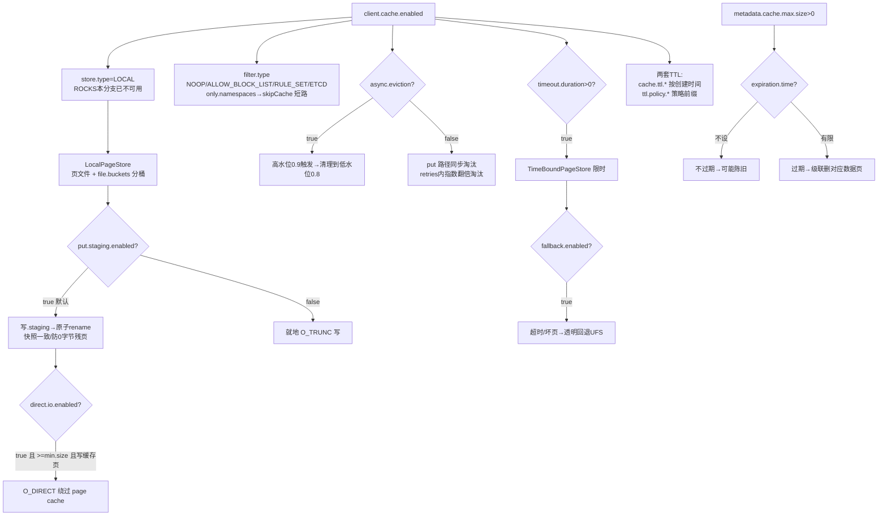

# 02 · 客户端本地缓存 / 元数据缓存

> 场景组:`alluxio.user.client.*`(本地页缓存)+ `alluxio.user.metadata.cache.*` + `alluxio.user.local.*` + `alluxio.user.logs/logging.*`
> 配置数:**56** · 别名 0 · 废弃 2 · 数据来源:`PropertyKey.java` · 生成表:`_data/gen_table.py 02`

---

## 1. 本组概览

本组管**客户端进程内的本地缓存**——独立于 worker 的 page store,直接在应用侧(如 FUSE、SDK)缓存数据页与元数据,减少到 worker 的往返。适用于客户端与 worker 有网络距离、或希望在客户端就近命中的场景。默认整体关闭(`client.cache.enabled=false`)。

五个子场景:

| 子场景 | 关键配置 | 核心矛盾 |
|---|---|---|
| 本地页缓存存储 | `client.cache.enabled`、`cache.dirs`、`cache.size`、`cache.page.size`、`cache.store.type` | 命中率 vs 本地磁盘/内存占用 |
| 淘汰(eviction) | `cache.evictor.type`、`async.eviction.*`(高/低水位) | 命中率 vs 淘汰开销/抖动 |
| 缓存过滤(filter) | `cache.filter.type`、`cache.filter.config.file` | 精准缓存 vs 配置复杂度 |
| TTL / quota | `cache.ttl.*`、`cache.quota.enabled` | 新鲜度/隔离 vs 复杂度 |
| 元数据缓存 | `metadata.cache.max.size`、`metadata.cache.expiration.time` | 元数据加速 vs 陈旧 |
| 客户端 RPC 超时 | `client.get.status.timeout`、`client.slow.rpc.timeout` 等 | 快速失败 vs 误杀慢请求 |

---

## 2. 配置清单速查表(全量 56 项)

### 2.1 本地页缓存:总开关与存储
| 配置项 | 默认值 | 类型 | Scope | 一致性 | 说明 |
|---|---|---|---|---|---|
| `alluxio.user.client.cache.enabled` | false | boolean | CLIENT | WARN | 本地缓存总开关 |
| `alluxio.user.client.cache.dirs` | /tmp/alluxio_cache | list | CLIENT | WARN | 本地缓存目录列表 |
| `alluxio.user.client.cache.size` | 512MiB | list | CLIENT | WARN | 每个缓存目录的最大容量(与 dirs 一一对应) |
| `alluxio.user.client.cache.page.size` | 1MiB | dataSize | CLIENT | WARN | 本地缓存每页大小 |
| `alluxio.user.client.cache.store.type` | LOCAL | enum | CLIENT | WARN | 页存储类型:LOCAL(目录) / ROCKS(RocksDB) |
| `alluxio.user.client.cache.store.overhead` | — | double | CLIENT | WARN | 写盘存储开销的分数(容量换算) |
| `alluxio.user.client.cache.local.store.file.buckets` | 1000 | int | CLIENT | WARN | LOCAL 页存储的文件桶数(唯一文件多时调高) |
| `alluxio.user.client.cache.local.store.put.staging.enabled` | true | boolean | CLIENT | WARN | put 时先写 .staging/ 再原子 rename |
| `alluxio.user.client.cache.local.store.direct.io.enabled` | false | boolean | ALL | WARN | LOCAL 页存储用 O_DIRECT 写(绕过 OS page cache) |
| `alluxio.user.client.cache.local.store.direct.io.min.size` | 128KiB | dataSize | ALL | WARN | 小于此值的写不走 direct I/O |
| `<unresolved:USER_CLIENT_CACHE_LOCAL_STORE_DIRECT_IO_FOR_WRITE_CACHE_ONLY_ENABLED>` | true | boolean | ALL | WARN | direct I/O 仅限写缓存页(模板名) |
| `alluxio.user.client.cache.instream_buffer_size` | 0B | dataSize | CLIENT | WARN | tiny read 的读缓冲大小 |
| `alluxio.user.client.cache.small.file.range` | 0 | dataSize | CLIENT | WARN | 小于此值的数据正常拷贝而非走缓存路径 |
| `alluxio.user.client.cache.include.mtime` | false | boolean | CLIENT | WARN | 计算文件标识时是否含修改时间 |
| `alluxio.user.client.cache.only.namespaces` | gemini:// | list | CLIENT | WARN | 配置 CACHE_ONLY 命名空间 |

### 2.2 淘汰(eviction)
| 配置项 | 默认值 | 类型 | Scope | 一致性 | 说明 |
|---|---|---|---|---|---|
| `alluxio.user.client.cache.evictor.type` | LRU | enum | CLIENT | WARN | 淘汰策略:LRU / LFU 等 |
| `alluxio.user.client.cache.evictor.class` | — | class | CLIENT | WARN | ⚠️已废弃(迁移 cache.filter.type) |
| `alluxio.user.client.cache.evictor.lfu.logbase` | 2.0 | double | CLIENT | WARN | LFU 桶索引的对数底 |
| `alluxio.user.client.cache.evictor.nondeterministic.enabled` | false | boolean | CLIENT | WARN | 从最差 k 个中均匀选(仅 LRU) |
| `alluxio.user.client.cache.eviction.retries` | 10 | int | CLIENT | WARN | 淘汰最大重试次数 |
| `alluxio.user.client.cache.async.eviction.enabled` | false | boolean | CLIENT | WARN | 达到高水位后异步淘汰 |
| `alluxio.user.client.cache.async.eviction.high.water.mark` | 0.9 | double | CLIENT | WARN | 异步淘汰高水位(触发) |
| `alluxio.user.client.cache.async.eviction.low.water.mark` | 0.8 | double | CLIENT | WARN | 异步淘汰低水位(清理至此) |
| `alluxio.user.client.cache.async.eviction.check.interval` | 1min | duration | CLIENT | WARN | 异步淘汰检查间隔 |

### 2.3 缓存过滤(filter)
| 配置项 | 默认值 | 类型 | Scope | 一致性 | 说明 |
|---|---|---|---|---|---|
| `alluxio.user.client.cache.filter.enabled` | true | boolean | CLIENT | WARN | 缓存过滤特性开关 |
| `alluxio.user.client.cache.filter.type` | ETCD | enum | CLIENT | WARN | 过滤类型:NOOP / ALLOW_BLOCK_LIST / ETCD 等 |
| `alluxio.user.client.cache.filter.class` | DefaultCacheFilter | class | CLIENT | WARN | ⚠️已废弃(迁移 cache.filter.type) |
| `alluxio.user.client.cache.filter.config.file` | ${conf}/cache_filter.json | string | CLIENT | WARN | 过滤配置文件位置 |
| `alluxio.user.client.cache.filter.config.check.interval` | 5min | duration | CLIENT | IGNORE | 过滤配置文件热加载检查间隔 |

### 2.4 TTL / quota / 异步 / 回退
| 配置项 | 默认值 | 类型 | Scope | 一致性 | 说明 |
|---|---|---|---|---|---|
| `alluxio.user.client.cache.ttl.enabled` | false | boolean | CLIENT | WARN | 缓存 TTL 淘汰开关 |
| `alluxio.user.client.cache.ttl.check.interval.seconds` | 3600 | long | CLIENT | IGNORE | TTL 检查间隔(秒) |
| `alluxio.user.client.cache.ttl.threshold.seconds` | 10800 | long | CLIENT | IGNORE | TTL 阈值(秒) |
| `alluxio.user.client.cache.quota.enabled` | false | boolean | CLIENT | WARN | 缓存配额支持 |
| `alluxio.user.client.cache.async.write.enabled` | false | boolean | CLIENT | IGNORE | 异步写缓存 |
| `alluxio.user.client.cache.async.write.threads` | 16 | int | CLIENT | IGNORE | 异步缓存线程数 |
| `alluxio.user.client.cache.async.restore.enabled` | true | boolean | CLIENT | IGNORE | 异步恢复缓存状态 |
| `alluxio.user.client.cache.fallback.enabled` | false | boolean | CLIENT | WARN | 本地缓存回退到外部存储 |
| `alluxio.user.client.cache.timeout.duration` | -1 | duration | CLIENT | WARN | 本地缓存 I/O 超时;正值超时后有兜底 |
| `alluxio.user.client.cache.timeout.threads` | 32 | int | CLIENT | WARN | 处理缓存 I/O 超时的线程数 |

### 2.5 元数据缓存
| 配置项 | 默认值 | 类型 | Scope | 一致性 | 说明 |
|---|---|---|---|---|---|
| `alluxio.user.metadata.cache.max.size` | 0 | int | CLIENT | WARN | 缓存元数据的最大路径数(0=关) |
| `alluxio.user.metadata.cache.expiration.time` | — | duration | CLIENT | WARN | 元数据缓存过期时间;不设=不过期 |
| `alluxio.user.metadata.cache.disable.absent.status.cache` | false | boolean | CLIENT | WARN | 禁用"不存在状态"缓存 |

### 2.6 客户端 RPC 超时与连接
| 配置项 | 默认值 | 类型 | Scope | 一致性 | 说明 |
|---|---|---|---|---|---|
| `alluxio.user.client.get.status.timeout` | 3s | duration | WORKER | ENFORCE | block worker 客户端 getStatus 超时 |
| `alluxio.user.client.light.weight.rpc.timeout` | 500ms | duration | WORKER | ENFORCE | 轻量 RPC 超时(不保证成功) |
| `alluxio.user.client.slow.rpc.timeout` | 120s | duration | WORKER | ENFORCE | 慢 RPC 超时 |
| `alluxio.user.client.stream.rpc.timeout` | 15min | duration | CLIENT | ENFORCE | 流式 RPC 超时 |
| `alluxio.user.client.block.worker.pool.acquire.timeout` | 1s | duration | WORKER | ENFORCE | block worker 客户端池获取资源超时 |
| `alluxio.user.client.block.worker.pool.resource.ttl` | 24h | duration | WORKER | ENFORCE | block worker 客户端 TTL(到期回收) |
| `alluxio.user.client.atomic.write.enabled` | false | boolean | CLIENT | IGNORE | Hadoop SDK 原子写 |
| `alluxio.user.client.report.version.enabled` | false | boolean | CLIENT | WARN | 客户端向服务端上报版本信息 |
| `alluxio.user.client.temp.dirs` | /tmp/alluxio | list | CLIENT | — | 客户端临时目录 |
| `alluxio.user.client.unmounted.ufs.fallback.enabled` | false | boolean | CLIENT | WARN | 路径不在挂载表时回退访问而非抛异常 |
| `alluxio.user.local.reader.chunk.size.bytes` | 8MiB | dataSize | CLIENT | WARN | 从本地 worker 读的最大 chunk |
| `alluxio.user.local.writer.chunk.size.bytes` | 64KiB | dataSize | CLIENT | WARN | 向本地 worker 写的最大 chunk |
| `alluxio.user.logging.threshold` | 10s | duration | CLIENT | IGNORE | 客户端 RPC 超此时长则记日志 |
| `alluxio.user.logs.dir` | ${logs}/user | string | — | WARN | CLI 日志目录(内部用) |

---

## 3. 逐项深度分析(充分细节)

> 本组 56 项按配置族逐一深挖,覆盖全部族:总开关与存储形态 → PageStore 实现(LOCAL/direct I/O/staging)→ 淘汰(4 种 evictor + 同步/异步水位)→ 缓存过滤(4 种 filter + CACHE_ONLY)→ TTL(客户端两套)→ quota → 异步 write/restore → timeout/fallback 韧性 → 元数据缓存 → RPC 超时分层 → block worker client pool → 本地读写与外围。核心类都在 `dora/core/client/fs/src/main/java/alluxio/cache/data/`(存储/淘汰)与 `.../client/file/`(filter/metadatacache/rpc)。**注意:客户端缓存与 [04组](04-worker-page-store.md) worker page store 共用同一套 `LocalCacheManager`/`PageStore`/evictor 代码,仅配置前缀不同(`user.client.cache.*` vs `worker.page.store.*`),由 `CacheManagerOptions.create`(客户端)/`createForWorker`(worker)分别装配。**

### 3.1 总开关与存储形态(`cache.enabled` / `dirs` / `size` / `page.size` / `store.type` / `store.overhead`)
- **`client.cache.enabled`(默认 `false`,WARN)**:总开关。开启后应用进程(FUSE/SDK)在本地 `cache.dirs` 直接缓存数据页,读命中不再回 worker。默认关是保守选择(需本地盘、有一致性成本)。
- **`cache.store.type`(默认 `LOCAL`,枚举 `PageStoreType`)**:⚠️ **本代码库的 `PageStoreType` 枚举实际只有 `LOCAL` 一个值**(`PageStoreType.java`);`PageStore.create` 的 switch 只有 `case LOCAL → new LocalPageStore`,其余走 `default: throw IllegalArgumentException("Incompatible PageStore ...")`。property 描述里提到的 `ROCKS`(RocksDB 页存)**在当前 DORA 分支已不可用**——配 `ROCKS` 会在初始化时抛异常(建议验证是否为文档/描述滞后)。因此本组存储实现唯一现役形态就是 `LocalPageStore`:每页一个文件,存于 `<dir>/<pageSize>/<bucket>/<hash(fileId)>/<pageIndex>`。
- **`cache.dirs`(默认 `/tmp/alluxio_cache`,list)× `cache.size`(默认 `512MiB`,list)**:一一对应,可配多目录(多盘)并行,每目录一个 `LocalPageStore`+一个容量。⚠️ 默认在 `/tmp`,生产必改持久化/大容量盘(避免重启清空、`/tmp` 空间不足)。总缓存量 = 各目录容量之和(`LocalCacheManager` 里 `mCacheSize = Σ capacity`)。
- **`cache.page.size`(默认 `1MiB`,dataSize)**:页粒度,也是读放大/命中的关键。小页利于随机读命中、减少读放大,但每文件页数多、目录/inode 压力大;大页利于顺序吞吐、元数据少,但随机读会读入无用字节。页大小编进存储路径(`<pageSize>` 一级目录),**改页大小等于换一套缓存布局,旧页失效**。
- **`cache.store.overhead`(默认未设,double)**:磁盘写入的存储开销分数。`LocalPageStore` 的**有效容量** = `cacheSize / (1 + overheadRatio)`——即预留一部分空间给文件系统/inode 开销,避免写到"名义容量"就把盘写满。⚠️ 该 property **无显式默认**:`PageStoreOptions.create` 仅当用户显式设置时读它,否则回退到 `PageStoreType.LOCAL.getOverheadRatio()` = **0.05(5%)**(即默认按逻辑数据 = 容量/1.05 计)。若同时设了 reserved size,overhead 会被清零(二者互斥)。
- **`local.store.file.buckets`(默认 `1000`,int)**:LOCAL 页存的文件分桶数。页路径里的 `<bucket>` 一级由 `getFileBucket = Math.floorMod(fileId.hashCode(), fileBuckets)` 决定——即**按 fileId 哈希对桶数取模**,把海量文件散布到 `fileBuckets` 个子目录下,避免单个父目录堆积过多 inode(目录项过多会拖慢 lookup)。官方建议保证 `# 唯一文件 / file.buckets ≤ 100000`(1000 桶约可承载 1 亿文件仍均衡);唯一文件数很大时应上调。

### 3.2 LocalPageStore 写路径:staging 原子发布 + direct I/O(O_DIRECT)
> 三个 property 共同刻画 `LocalPageStore` 的 put 落盘细节,是本组最"代码级"的一族。默认写路径:**先写 `.staging/` 临时文件 → 原子 rename 到最终页路径**(`LocalPageStore.put` → `writeStagingFile` → `commit`)。

- **`local.store.put.staging.enabled`(默认 `true`,CLIENT)**:开启后 put 先把页写进 `<dir>/.staging/` 下的临时文件,再 `Files.move(..., ATOMIC_MOVE, REPLACE_EXISTING)` 原子搬到目标页路径。三重收益(代码注释明示):
  1. **快照一致性**:rename 生成新 inode,正在被 POSIX-pinned 零拷贝读的旧 inode(reader 持 FD)仍读到一致的旧内容(passive cache / re-load 并发改写同一页时不撕裂)。
  2. **防 0 字节残页**:磁盘 ENOSPC 发生在 staging 写阶段,永远不会在目标页路径留下半截/0 字节 stub。
  3. **崩溃自愈**:staging 与目标同在 `mRoot` 下(满足 ATOMIC_MOVE 同文件系统要求);崩溃遗留的 staging 孤儿由下次 init 的 `sweepStagingDir()` 清扫。
  - 设 `false` 退化为**就地 `O_TRUNC + write`**(legacy escape hatch,仅当 staging 写触发特定回归时用)。跨文件系统时 ATOMIC_MOVE 不可用,`commit` 回退到 `FileChannel.transferTo`(Linux sendfile)内核态拷贝再删 staging。
- **`local.store.direct.io.enabled`(默认 `false`,ALL)**:开启后 staging 页写用 **O_DIRECT 绕过 OS page cache**(由 `DirectIoPageWriter` 封装)。理由:page store 本身就是缓存,buffered 写会把数据**二次缓存进内核 page cache**(双重占内存),并浪费 CPU 拷贝;direct I/O 避免这层,代价是多一次到对齐缓冲的用户态拷贝。⚠️ 仅 Linux 且文件系统支持 O_DIRECT(ext4/xfs)才行;**不支持的文件系统上 staging 写会直接失败并把错误抛出(不静默回退 buffered)**,以便运维察觉并关掉此开关。只影响 staging 写;metadata、append 写仍 buffered。
- **`local.store.direct.io.min.size`(默认 `128KiB`,ALL)**:direct I/O 的最小写阈值。`shouldAttemptDirectIo` 里 `page.remaining() < minSize` 的小写走 buffered(小写 direct 对齐开销不划算)。设 `0` = 所有 staging 写都尝试 direct。
- **`local.store.direct.io.for.write.cache.only.enabled`(默认 `true`,ALL,模板名 `USER_CLIENT_CACHE_LOCAL_STORE_DIRECT_IO_FOR_WRITE_CACHE_ONLY_ENABLED`)**:`true` 时 direct I/O **仅对写缓存页(write-cache pages)生效**——判据 `UfsFileId.isWriteCacheFileId(pageId.getFileId())`。原因:写缓存页来自**页对齐的池化缓冲**,天然满足 O_DIRECT 对齐、收益最大;其它页(如读缓存回填 read-cache fill)不一定对齐,强走 direct 反而低效,故仍 buffered。`false` 则不检查 file id,任意页都可走 direct。仅在 `direct.io.enabled=true` 时有意义。

### 3.3 淘汰:4 种 evictor 算法(`evictor.type` / `lfu.logbase` / `nondeterministic`)
> `evictor.type`(默认 `LRU`,枚举 `CacheEvictorType`)全取值 = **LRU / LFU / FIFO / RANDOM**(`CacheEvictorType.java`)。工厂 `CacheEvictor.create` 按值 new;淘汰粒度是 page(`PageId`),同步/异步两条淘汰路径共用同一 evictor 实例。

| 值 | 实现类 | 数据结构 | 命中更新(updateOnGet) | 选受害者 | 线程安全 / 开销 |
|---|---|---|---|---|---|
| **LRU**(默认) | `LRUCacheEvictor` | access-order `LinkedHashMap`(synchronized 包裹) | 把页移到访问序末尾 | 取头(最久未用) | `@ThreadSafe`;get/put/evict O(1) |
| **LFU** | `LFUCacheEvictor` | `HashMap` 计数 + `TreeMap<桶, access-order LinkedHashMap>` + `mMinBucket` | 计数+1,按对数桶重定位 | 从最低频桶取 LRU 头 | `@ThreadSafe`(方法级粗锁 `synchronized`);内存/更新开销最大 |
| **FIFO** | `FIFOCacheEvictor` | 单个 `LinkedList` | **noop**(不记访问,纯插入序) | 队头(最早插入) | ⚠️`@NotThreadSafe`;put O(1)、delete O(n) |
| **RANDOM** | `TwoChoiceRandomEvictor` | `HashMap<PageId, 时间戳>`(synchronized) | 记录 `Instant.now()` | 随机抽 2 个,淘汰时间戳更旧者(2-choice) | `@ThreadSafe`;单页 evict 有 O(n) keyset 拷贝(代码有 TODO) |

- **`evictor.lfu.logbase`(默认 `2.0`,double)**:仅 LFU 相关。LFU 用 `bucket = floor(log_logbase(count))`(实现 `log(count)/log(logbase)`,构造时预算 `mDivisor = ln(logbase)`)把页按**访问频率的对数**分桶,桶内再按 LRU。logbase=2 时 count 1→桶0、2-3→桶1、4-7→桶2……**logbase 越大 → 桶越粗、迁移越少、频率区分度越低**;越接近 1 → 桶越细。淘汰从 `mMinBucket`(最低频)桶的 LRU 头开始。
- **`evictor.nondeterministic.enabled`(默认 `false`,CLIENT,"仅 LRU 支持")**:开启后 LRU 换成 `NondeterministicLRUCacheEvictor`——不总选最冷那一个,而是**在 LRU 最冷端的前 k 个候选里均匀随机挑一个淘汰**(`k = mNumOfCandidate = 16`,`ThreadLocalRandom.nextInt(16)` 决定从头往后偏移几个)。目的是**降低多线程同时命中/淘汰同一页的争用与抖动(惊群)**。只支持 LRU:工厂里 `isNondeterministic()` 分支只在 `case LRU` 判断,其它算法忽略此标志;且其批量 evict 强制 `victimNum == 1`。

### 3.4 淘汰:同步重试 vs 异步水位(`eviction.retries` / `async.eviction.*`)
- **`eviction.retries`(默认 `10`,int)**:**同步 put 路径**的淘汰重试上限。`LocalCacheManager.putInternal` 里 `for (i=0; i<=retries; i++)`(默认最多 11 次尝试):每轮 `putAttempt` 淘汰一批受害者并试写;失败按原因处理——`BENIGN_RACING`(与他线程争同一页)/`INSUFFICIENT_SPACE`(淘汰的页不够大)→ `continue` 再淘;`NO_SPACE_LEFT`(磁盘满)→ 置 `forcedToEvict=true` 强制淘汰后重试。**关键放大机制**:每轮把 `i` 传给 `calculateVictimPageAmount(i)`——`i∈[0,8]` 淘汰 `1<<i` 页(1,2,4,…,256),`i>8` 封顶 256,即**每次重试淘汰页数按 2 的幂翻倍**,加速为大页腾空间。
- **异步淘汰**(`async.eviction.enabled` 默认 `false`,由 `PageCacheAsyncEvictionManager` 实现):
  - **`async.eviction.enabled`**:开启后 `LocalCacheManager` 构造时实例化 `PageCacheAsyncEvictionManager`(放入 `AtomicReference`,支持运行时启停),起一个单线程定时器 `watermark-page-eviction`。
  - **`high.water.mark`(0.9)/`low.water.mark`(0.8)**:后台任务对每个目录判断 `cachedBytes >= capacity*high(0.9)` → 触发,然后 `while (cachedBytes > capacity*low(0.8))` **每次淘汰 1 页**循环,直到降到低水位才停。启动前校验 `0<high<=1`、`0<low<1`、`high>low`,否则抛 `IllegalStateException`。
  - **`async.eviction.check.interval`(1min)**:定时器 `scheduleAtFixedRate` 的检查周期,决定后台多久扫一次水位。
  - **好处**:把淘汰从读/写热路径挪到后台,避免命中路径上的同步淘汰毛刺;预留 headroom 让后续 put 走无淘汰快路径。**权衡**:水位间距太小,突发写可能在后台淘汰跟上前触顶,退化为同步淘汰(代码里循环超 60s 到不了低水位会告警"缓存请求比淘汰快")。
  - ⚠️ 同步与异步淘汰**汇聚到同一个 `DefaultPageMetaStore.evictInternal → evictor.evict`**,受害者选择策略由 `evictor.type` 统一决定。

### 3.5 缓存过滤(filter):4 种类型 + CACHE_ONLY(`filter.enabled` / `type` / `config.file` / `check.interval` / `only.namespaces` / `filter.class`)
> Filter 在客户端读/写/元数据路径上,按 UFS 路径判定 **Cacheability**(三态:`immutable` 永不过期 / `skipCache` 不缓存 / `maxAge(ms)` 有过期时间),对 metadata 与 data 两类请求(`RequestType`)分别判定。工厂 `CacheFilter.create` 按 `type` 分发,实例持于 `FileSystemContext`。

- **`filter.enabled`(默认 `true`,CLIENT)**:关闭时 `parseCacheability` 不再调 filter,回退到请求 options 的默认 cache-control(走系统默认缓存、不做路径级过滤);各文件型 filter 也不再解析配置/不起刷新线程。⚠️ 但 **CACHE_ONLY 短路(见下)在检查 enabled 之前就先判,始终生效**。
- **`filter.type`(默认 `ETCD`,枚举 `CacheFilterType` = NOOP / ALLOW_BLOCK_LIST / RULE_SET / ETCD)**:注意 property 描述只列了 3 种,**枚举实际 4 种**(多一个 `RULE_SET`)。逐值(注意枚举名↔实现类名不一致,是易混点):

| 枚举值 | 实现类 | 行为 |
|---|---|---|
| `NOOP` | `DefaultCacheFilter` | 全部缓存,一律返回 `immutable`(永不过期) |
| `ALLOW_BLOCK_LIST` | `PatternBasedCacheFilter` | 单一正则 pattern 列表(`CACHE_ALL`/`ALLOW_LIST`/`BLOCK_LIST`)决定缓存/不缓存;**不区分 metadata/data**(忽略 `type`) |
| `RULE_SET` | `RuleSetBasedCacheFilter` | metadata/data **各一套规则**;支持 `immutable`/`skipCache`/`maxAge`(带过期时间)/`defaultType`——比 ALLOW_BLOCK_LIST 灵活得多 |
| `ETCD`(默认) | `EtcdCacheFilter` | 规则语义同 RULE_SET(metadata/data 两套 `RulePatternSet`),但**来源是 etcd**,通过 `DynamicConfiguration.global().watch` 即时下发(无轮询延迟),由 fsadmin `cachefilter` 系列 CLI 管理 |

- **`filter.config.file`(默认 `${conf}/cache_filter.json`,CLIENT)+ `filter.config.check.interval`(默认 `5min`,IGNORE)——热加载**:仅**文件型 filter**(ALLOW_BLOCK_LIST、RULE_SET)用,基类 `AutoReloadCacheFilter` 起单线程定时器 `cache-filter-config-refresh` 周期检查。⚠️ **变化检测用文件内容 MD5 哈希,不是 mtime**(每次重算 MD5 比较,不同才 reload);reload 用 `ReentrantReadWriteLock` 写锁替换内存规则。文件被删则**保留上一版规则**、不清空。ETCD 与 NOOP 不用文件热加载。
- **`only.namespaces`(默认 `gemini://`,list)——CACHE_ONLY**:`parseCacheability` **最优先**判断 `inCacheOnlyNameSpace(path)`(前缀 `startsWith` 匹配),命中则**直接返回 `skipCache()`**,早于 `filter.enabled` 与任何 filter 逻辑。语义:`gemini://` 这类前缀指向一种**本身就是缓存层的特殊 UFS(gemini-cache)**,再在客户端做本地缓存无意义,故一律跳过。代码注释标为临时 hack(`TODO`)。⚠️ 勿与 worker 侧 `CacheOnlyRead`(只从 worker 缓存读、miss 即抛 NOT_FOUND)混淆——那是 worker 读模式,与本项无关。
- **`filter.class`(默认 `DefaultCacheFilter`,⚠️已废弃)**:工厂已完全不读此 key,统一走 `filter.type` 枚举。迁移:原指 `DefaultCacheFilter` 的配置改为 `type=NOOP`。

### 3.6 客户端 TTL:两套独立机制(`cache.ttl.*`)
> ⚠️ 客户端缓存有**两条不同的 TTL 淘汰路径**,配置来源不同,易混:

- **路径一:`LocalCacheManager` 内的 TTL enforcer**(本组的 `cache.ttl.*`):
  - **`cache.ttl.enabled`(默认 `false`,CLIENT)**:开启后 `LocalCacheManager` 构造 `cache-ttl-enforcer` 单线程 `ScheduledExecutorService`。
  - **`cache.ttl.check.interval.seconds`(默认 `3600`=1h,IGNORE)**:`scheduleAtFixedRate` 周期,多久扫一次。
  - **`cache.ttl.threshold.seconds`(默认 `10800`=3h,IGNORE)**:淘汰谓词——页的 `now - createdTimestamp >= threshold` 即失效并 `invalidate`。即**按页创建时间**的绝对 TTL,与访问无关。
- **路径二:evictor 的 TTL-async 淘汰**(`PageCacheAsyncEvictionManager` 里的 `ttl-page-eviction` 线程):由**全局 [19组](19-write-ttl-quota.md) 的 `alluxio.ttl.policy.enabled` + `alluxio.ttl.eviction.check.interval`(1h)** 控制(`CacheManagerOptions.create` 里读的是 `TTL_POLICY_ENABLED`/`TTL_EVICTION_CHECK_INTERVAL`,不是本组的 `cache.ttl.*`),按 UfsUrl 最长前缀匹配 TTL 策略删过期页。这两套可同时存在。⚠️ 只开本组 `cache.ttl.enabled` 不会启用策略化 TTL,反之亦然。

### 3.7 缓存 quota(`cache.quota.enabled`)
- **`cache.quota.enabled`(默认 `false`,CLIENT)**:开启后本地缓存启用配额支持(`QuotaCacheManager`/`QuotaPageMetaStore`/`QuotaManagedPageStoreDir`,`cache/quota/` 包),按 `CacheScope`(如按 user/table/partition)限制缓存用量并在超限时按 scope 淘汰。与 [19组](19-write-ttl-quota.md) 的全局 `alluxio.quota.*`(集群级配额)是不同层:本项是**客户端本地缓存内的用量隔离**。

### 3.8 异步 write / restore(`async.write.*` / `async.restore.enabled`)
- **`async.write.enabled`(默认 `false`,IGNORE)+ `async.write.threads`(默认 `16`,IGNORE)**:关闭(默认)时 `mustPut` **同步**写页(阻塞调用者直到落盘/失败)。开启后 `mustPut` 把 put 提交到 `async-cache-writer` 弹性线程池(大小 = `async.write.threads`,`RejectPolicy.CALLER_RUNS`——池满时由调用线程直接执行,天然背压),调用者不阻塞;用 `mPendingRequests` 去重(同页已排队则抛 `DUPLICATE_SUBMISSION`)。⚠️ 代码有 TODO 警示:异步路径捕获调用者的 `page` ByteBuffer 稍后读取,**若调用者在 `mustPut` 返回后复用/释放该 buffer(如分布式加载复用一个页缓冲),会污染排队中的写**——异步写需确保 buffer 所有权。
- **`async.restore.enabled`(默认 `true`,IGNORE)**:进程启动时,`LocalCacheManager` 需扫描 `cache.dirs` 恢复已有缓存页的元数据(重建 page metastore)。默认**异步恢复**:后台线程恢复期间缓存先处于 `READ_ONLY`,不阻塞应用启动;恢复完成才转 `READ_WRITE`。关闭则同步恢复(阻塞启动直到扫完,盘上页多时启动慢)。(worker 侧另有 `parallel.restore` 多线程恢复,客户端默认单线程。)

### 3.9 本地缓存 I/O 超时与回退(`cache.timeout.duration` / `timeout.threads` / `fallback.enabled`)—— 韧性一族
- **`cache.timeout.duration`(默认 `-1`,CLIENT)**:本地缓存读/写/删的 I/O 超时。`-1`(默认负值)= **关闭该特性**。正值时 `PageStore.create` 把底层 store 包一层 **`TimeBoundPageStore`**:每个操作经 Guava `SimpleTimeLimiter` 在弹性线程池上执行,超时抛 `IOException`。用途:防慢盘/坏盘把应用线程卡死。
- **`cache.timeout.threads`(默认 `32`,CLIENT)**:`TimeBoundPageStore` 弹性线程池大小(承载被限时的 I/O 任务)。仅 `timeout.duration>0` 时有意义。
- **`fallback.enabled`(默认 `false`,CLIENT)**:与上面配套的韧性开关。`LocalCacheFileInStream.positionedRead` 中,若从页缓存读抛 `IOException`/`RuntimeException`(如坏页、盘错、`TimeBoundPageStore` 超时),且 `fallback.enabled=true`,则**透明回退到外部/UFS 流**(`getExternalFileInStream().positionedRead`)继续读;关闭则异常上抛。⚠️ **`cache.timeout.duration>0` + `fallback.enabled=true` 是一对**:超时 → 回退 → 应用无感,避免慢盘拖垮读。

### 3.10 元数据缓存(`metadata.cache.*`)
> 由 `MetadataCache`(Guava `Cache`)实现,`MetadataCachingFileSystem` 使用,缓存 path 的 `URIStatus`(getStatus)与 list 结果(listStatus)。

- **`metadata.cache.max.size`(默认 `0`=关,int)**:缓存的最大 path 数(Guava `maximumSize`)。开启后 getStatus/listStatus 命中不再往返服务端。官方估算:每 1000 条约 2MB 内存,FUSE 客户端建议 ~20000 条(~40MB)。
- **`metadata.cache.expiration.time`(默认未设,duration)**:设了则 `expireAfterWrite` 过期;**不设 = 不过期**,只在超 max.size 时按 LRU 淘汰。⚠️ 不过期会读到陈旧元数据——外部改写 UFS 的场景**必设有限过期**。
- ⚠️ **非显然机制:元数据过期级联删数据页**。`MetadataCache` 注册了 `RemovalListener`——当某 path 的元数据条目被淘汰/过期移除时,监听器会**顺带调用 `cacheManager.deleteFile(fileId)` 删掉该文件对应的数据页**。即元数据缓存过期不仅刷新元数据,也主动失效对应数据缓存,保证元数据与数据缓存的一致性(避免元数据变了、数据页还是旧的)。
- **`metadata.cache.disable.absent.status.cache`(默认 `false`,CLIENT)**:默认会缓存"文件不存在(absent)"的结果——若期间文件被创建,客户端可能短时仍看不到。设 `true` 禁用不存在结果缓存,牺牲一点性能换"新建即可见"。

### 3.11 客户端 RPC 超时分层(`get.status` / `light.weight.rpc` / `slow.rpc` / `stream.rpc`)
> ⚠️ 四档超时**不直接在调用点读 PropertyKey**,而是集中读入 `ClientWorkerConnectivityPolicyEntity`(动态连通性策略实体,`legacyDefault()`),作为 legacy 静态→动态配置的兜底默认值(运行时可被 etcd 动态配置覆盖)。worker 客户端(`DefaultWorkerClient` / `MultiplexedWorkerClient`,后者默认启用)在每个 RPC 上 `withDeadlineAfter(...)`。四档不改变"有哪些 RPC",只按语义给不同 gRPC deadline:

| 档 | 默认 | 对应 RPC(代码实测) |
|---|---|---|
| `light.weight.rpc.timeout` | 500ms | `ensureVersion()`(版本探活式轻量校验,"不保证成功") |
| `get.status.timeout` | 3s | `getStatus()`(单点取文件状态;bRPC/RDMA 路径 `WorkerMetadataBrpcClient.getStatus` 同用此档) |
| `slow.rpc.timeout` | 120s | `cacheDataNonblocking()`(异步 cacheData,慢的缓存落盘类) |
| `stream.rpc.timeout` | 15min | 流式:`downloadFileFromWorker()`、`acquireRebalanceLoadFiles()`(worker 间大流拉取/rebalance) |

- 另有一档"default"(约 10s,非本组)覆盖绝大多数普通元数据 RPC(create/delete/rename/listStatus 等)。
- **调优取舍**:调小可更快失败/重试(worker 稳定、延迟敏感);调大避免误杀合理的慢请求(大对象/高负载)。均 `Scope=WORKER`、`ENFORCE`,需与服务端一致。
- **`logging.threshold`(默认 `10s`,IGNORE)**:走 `AbstractClient.retryRPC` 的客户端 RPC 耗时 `>=` 阈值则打 WARN 慢日志。⚠️ 注意 `DefaultWorkerClient`/`MultiplexedWorkerClient` **不继承 `AbstractClient`**,其慢调用不由这条阈值记录(主要作用于 coordinator/master 侧 RPC)。

### 3.12 Block worker client pool(`block.worker.pool.acquire.timeout` / `resource.ttl`)
> `WorkerClientPool extends DynamicResourcePool<WorkerClient>`,池化的是**客户端到单个 worker 的 gRPC BlockWorker 连接**(内含 `ManagedChannel` + BlockWorker stub;不是 netty 数据面通道)。`FileSystemContext` 按 (worker 地址 + 冒充用户 + authType) 维护一张 `WorkerClientPool` map,每 worker×用户一个子池,容量由 `USER_BLOCK_WORKER_CLIENT_POOL_MIN/MAX`([03组](03-client-net-rpc.md))控制。

- **`block.worker.pool.acquire.timeout`(默认 `1s`,WORKER,ENFORCE)**:`acquireWith(userState, timeout)` 从池取连接的等待上限。⚠️ **仅当"池已满(达 max)且无空闲连接"时才等待**——1s 内没有连接被 release 回来则抛 `TimeoutException("Acquire resource times out.")`(经 `DynamicResourcePool.acquireInternal` 的 `mNotEmpty.await` 超时),`acquireWith` 包成 `RuntimeException` 上抛。池未满时直接新建连接返回,不等待。调大适合并发高、worker 慢;频繁超时说明 pool.max 偏小或 worker 处理慢。
- **`block.worker.pool.resource.ttl`(默认 `24h`,WORKER,ENFORCE)**:连接的**存活总时长**上限。后台 GC 线程(`worker-client-pool-gc`)周期扫描,`shouldGc()` 满足任一即关闭连接:(1) 空闲时长 > GC 阈值(默认 24h,按 lastAccessTime);(2) **创建时长 > TTL(24h,按 createdAt,与是否空闲无关)**;(3) 用户凭证过期。acquire 时还会 `isHealthy()` 检查(通道未 shutdown),不健康的连接丢弃重取。TTL 存在的意义:防长连接因服务端重启/网络中间设备/凭证轮转而变成"看似健康实则失效"的僵连接,强制周期性重建。

### 3.13 本地读写 chunk 与外围项(`local.reader/writer.chunk` / `atomic.write` / `report.version` / `unmounted.ufs.fallback` / `temp.dirs` / `logs.dir`)
- **`local.reader.chunk.size.bytes`(8MiB)/`local.writer.chunk.size.bytes`(64KiB)(CLIENT)**:语义为"客户端从/向 local worker 读/写的最大 chunk"(本地短路读写)。⚠️ **在当前 DORA 分支无任何生产代码消费**(仅被文档生成测试引用)——属早期本地短路架构(`LocalFileDataReader/Writer`)遗留、DORA(paged worker + gRPC/netty/bRPC 数据面)重构后不再生效的 key(建议验证:是否保留做兼容或应清理)。
- **`instream_buffer_size`(默认 `0B`,CLIENT)**:语义为 tiny read 的读缓冲大小,但 **PropertyKey 有定义、当前代码库无消费者**(建议验证,疑似遗留/预留)。
- **`small.file.range`(默认 `0`,dataSize)**:控制小范围读的 netty 传输方式。`FileChannelDataBuffer.getNettyOutput`:当请求切片 `<= small.file.range` 且不是文件末尾字节时,用 `SmallRangeFileRegion`(改写 `transferTo` 行为)替代 `DefaultFileRegion`。property 描述点明:在**高随机读**场景避免走 `FileChannel#transferTo` 的整块传输,**显著缓解本地磁盘读放大**。`0`(默认)= 不启用(都走 DefaultFileRegion)。
- **`include.mtime`(默认 `false`,CLIENT,别名 `USER_CLIENT_CACHE_IDENTIFIER_INCLUDE_MTIME`)**:计算文件缓存标识时是否含修改时间。用在 **Hadoop SDK 路径**(`LocalCacheFileSystem`):默认缓存标识 = `md5(ufsPath)`;设 `true` 则 = `md5(ufsPath + modificationTime)`。⚠️ **默认关意味着 UFS 文件被覆盖更新(mtime 变但路径不变)时,客户端会命中旧缓存页读到陈旧数据**;若 UFS 文件可能被原地更新,应开启此项,使 mtime 变化后标识变化、自动 miss 重取。
- **`atomic.write.enabled`(默认 `false`,IGNORE)**:Hadoop SDK 的原子写(先写临时文件、完成后 rename,保证 reader 不见半截文件)。
- **`report.version.enabled`(默认 `false`,CLIENT)**:客户端在 gRPC 通道建立时向服务端上报版本信息(用于兼容性诊断,`GrpcChannelBuilder`)。
- **`unmounted.ufs.fallback.enabled`(默认 `false`,CLIENT)**:默认访问不在挂载表的路径抛 `MountPointNotFoundRuntimeException`;开启后客户端**尝试就地创建 UFS 实例、回退直连 UFS**(即使路径未挂载),`DoraCacheFileSystem`/`MultipleUfsFileSystem` 消费。便于访问临时/未挂载存储,但绕过了挂载表的统一治理。
- **`temp.dirs`(默认 `/tmp/alluxio`,list)**:客户端临时目录。
- **`logs.dir`(默认 `${logs}/user`)**:CLI 命令行日志目录,仅内部用(改位置应设环境变量 `$ALLUXIO_USER_LOGS_DIR`)。

---

## 4. 配置关联关系图

---

## 5. 典型场景配置组合建议

| 场景 | 推荐组合 | 理由 |
|---|---|---|
| **客户端与 worker 有网络距离** | `client.cache.enabled=true` + 多 `cache.dirs`/`cache.size`(持久盘,勿用 /tmp) | 就近命中,减少跨网往返 |
| **海量小文件/小页** | `local.store.file.buckets` 调高(保证 # 文件 / buckets ≤ 100000) | 降低单目录文件/inode 压力(⚠️ 本分支 `store.type=ROCKS` 已不可用) |
| **高吞吐、避免淘汰毛刺** | `async.eviction.enabled=true`,水位 0.9/0.8 + 留足间距 | 淘汰移到后台,水位间距要够吸收突发写 |
| **多线程读写争用高(降惊群)** | `evictor.type=LRU` + `evictor.nondeterministic.enabled=true` | 从最冷 16 个候选随机淘汰,降低同选一页的争用 |
| **偏频率的访问模式** | `evictor.type=LFU`(必要时调 `lfu.logbase`) | 兼顾频率+近期性;logbase 大则桶粗迁移少 |
| **元数据密集(list 多)** | `metadata.cache.max.size>0` + `expiration.time=有限值` | 加速元数据、兼顾新鲜度(过期还会级联删对应数据页) |
| **内存敏感** | `local.store.direct.io.enabled=true`(ext4/xfs) + `for.write.cache.only=true`(默认) | O_DIRECT 避免 OS page cache 双重占用;仅对齐的写缓存页走 direct |
| **慢盘/坏盘韧性** | `cache.timeout.duration>0` + `timeout.threads` + `fallback.enabled=true` | 本地缓存 I/O 超时即透明回退 UFS,不卡应用 |
| **写吞吐优先(可控 buffer)** | `async.write.enabled=true` + `async.write.threads` | put 不阻塞调用者(⚠️ 须保证 page buffer 所有权,勿复用) |
| **UFS 文件可能原地更新(Hadoop SDK)** | `include.mtime=true` | mtime 变则缓存标识变、自动 miss 重取,避免读陈旧 |
| **精准缓存(区分 metadata/data / 带过期)** | `filter.type=RULE_SET`(文件)或 `ETCD`(动态下发) | 分类规则 + maxAge;ETCD 无轮询延迟、CLI 管理 |
| **缓存空间按 TTL 回收** | `cache.ttl.enabled=true` + `cache.ttl.check.interval`/`threshold` | 按页创建时间的绝对 TTL 淘汰(独立于全局 ttl.policy) |

---

## 6. 风险与注意事项

1. **`store.type=ROCKS` 在本分支不可用**:`PageStoreType` 枚举实际只有 `LOCAL`,`PageStore.create` 遇非 LOCAL 值抛 `IllegalArgumentException`。property 描述仍提 ROCKS,勿据此配置(建议验证描述是否滞后)。
2. **元数据缓存不过期 → 陈旧**:`metadata.cache.expiration.time` 不设时读到旧元数据;外部改写 UFS 场景必设。注意其过期会经 `RemovalListener` **级联删除对应数据页**——过期时间设太短会连带频繁失效数据缓存、降命中率。
3. **两套客户端 TTL 易混**:本组 `cache.ttl.*`(LocalCacheManager 的 enforcer,按页创建时间)与全局 `alluxio.ttl.policy.*`([19组](19-write-ttl-quota.md),策略化前缀匹配)是**独立两条路径**;开一个不等于开另一个。
4. **异步淘汰水位过近**:high/low 水位间距太小,突发写可能在后台淘汰跟上前触顶,退化为同步淘汰(代码超 60s 到不了低水位会告警)。
5. **异步写的 buffer 所有权风险**:`async.write.enabled=true` 时 `mustPut` 捕获调用者的 `page` ByteBuffer 异步读取,调用者若在返回后复用/释放该 buffer(如分布式加载复用页缓冲)会污染排队写(代码有 TODO)。
6. **本地缓存与 worker page store 是两层缓存**:客户端本地缓存命中不代表 worker 侧命中;两层都占空间,容量需分别规划,避免重复缓存浪费。
7. **direct I/O 平台差异且不静默回退**:O_DIRECT 只支持 Linux ext4/xfs 等;不支持的文件系统上 staging 写**直接失败并抛错**(不回退 buffered),需运维察觉后关掉开关。
8. **FIFO evictor 非线程安全**:`FIFOCacheEvictor` 标 `@NotThreadSafe`,依赖外层 `PageMetaStore` 写锁保护;`nondeterministic` 仅 LRU 支持。
9. **默认目录在 /tmp**:`cache.dirs`(`/tmp/alluxio_cache`)、`temp.dirs`(`/tmp/alluxio`)默认在 /tmp,生产必改持久化/大容量盘。
10. **废弃项(2)**:`cache.evictor.class`、`cache.filter.class` 已废弃 → 迁移到 `*.type`(工厂已不读旧 class key)。
11. **疑似遗留 key(建议验证/勿依赖)**:`local.reader/writer.chunk.size.bytes`、`instream_buffer_size` 在当前 DORA 分支无生产代码消费(本地短路架构重构后的残留)。
12. **RPC 超时是动态兜底值**:四档 RPC 超时经 `ClientWorkerConnectivityPolicyEntity` 兜底,运行时可被 etcd 动态配置覆盖;`logging.threshold` 不覆盖 worker 客户端(不继承 `AbstractClient`)。

---

## 跨组关联速览
- [01-client-fs-io](01-client-fs-io.md) —— 读写类型/元数据同步(与本地缓存命中配合)
- [03-client-net-rpc](03-client-net-rpc.md) —— gRPC/重试(RPC 超时的底层)
- [04-worker-page-store](04-worker-page-store.md) —— 服务端 page store(第二层缓存)
- [19-write-ttl-quota](19-write-ttl-quota.md) —— 全局 TTL/配额语义
