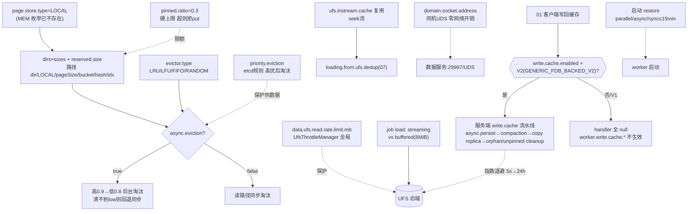

# 04 · Worker Page Store 存储引擎

> 场景组:`alluxio.worker.page.*` / `worker.data.*` / `worker.ramdisk.*` / `worker.ufs.instream.*` / `worker.write.cache.*`(服务端) / `worker.async.page.*` / `priority.eviction.*`
> 配置数:**73** · 别名 4 · 废弃 2 · 数据来源:`PropertyKey.java` · 生成表:`_data/gen_table.py 04`

---

## 1. 本组概览

DORA Worker 以**固定大小的页(page)**存储数据,`PagedDoraWorker` 是数据服务的核心。本组决定:页缓存放在哪(目录/内存)、多大、怎么淘汰、怎么异步持久化、UFS 输入流怎么复用、以及服务端写缓存(write cache)的持久化/compaction/清理。几乎全部 `Scope=WORKER`。

六个子场景:

| 子场景 | 关键配置 | 核心矛盾 |
|---|---|---|
| 页存储形态 | `page.store.type`、`page.store.dirs`、`page.store.sizes`、`page.store.page.size` | 容量/介质 vs 成本 |
| 淘汰(eviction) | `page.store.evictor.type`、`async.eviction.*`(水位)、`priority.eviction.*`、`pinned.file.capacity.limit.ratio` | 命中率 vs 淘汰抖动 |
| 启动恢复(restore) | `page.store.parallel.restore`、`sync.restore.max.blocking.timeout`、`startup.compatibility.scan` | 启动速度 vs 一致性 |
| UFS 读与限流 | `ufs.instream.cache.*`、`data.ufs.read.rate.limit.mb`、`ufs.block.open.timeout` | 复用/保护 UFS vs 时效 |
| 异步页持久化 | `async.page.persistence.*` | 冷读加速 vs 线程/IO |
| 服务端写缓存 | `write.cache.async.persist.*`、`write.cache.compaction.threads`、`write.cache.*.orphan/unpinned.cleanup.*` | 写吞吐/持久化韧性 vs 资源 |

---

## 2. 配置清单速查表(全量 73 项)

### 2.1 页存储形态与容量
| 配置项 | 默认值 | 类型 | Scope | 一致性 | 说明 |
|---|---|---|---|---|---|
| `alluxio.worker.page.store.type` | LOCAL | enum | WORKER | WARN | 页存储类型:LOCAL(目录) / MEM(内存) |
| `alluxio.worker.page.store.dirs` | /tmp/alluxio_cache | list | WORKER | WARN | 页存储目录列表(多盘) |
| `alluxio.worker.page.store.sizes` | 512MiB | list | WORKER | WARN | 每个目录最大容量(与 dirs 对应) |
| `alluxio.worker.page.store.page.size` | 4MiB | dataSize | WORKER | WARN | 每页大小 |
| `alluxio.worker.page.store.reserved.size` | — | dataSize | WORKER | WARN | 每目录预留空间(不计入 sizes,替代废弃的 overhead) |
| `alluxio.worker.page.store.overhead` | 0 | double | WORKER | WARN | ⚠️已废弃(迁移 reserved.size,给绝对值) |
| `alluxio.worker.page.store.max.page.number` | 5000万 | long | WORKER | WARN | 最大缓存页数 |
| `alluxio.worker.page.store.max.page.number.limit.enabled` | false | boolean | WORKER | WARN | 是否按页数上限淘汰 |
| `alluxio.worker.page.store.local.store.file.buckets` | 1000 | int | WORKER | WARN | LOCAL 页存储文件桶数(唯一文件多时调高) |
| `alluxio.worker.page.store.split.file.into.multiple.directories` | false | boolean | WORKER | WARN | 一个文件的页是否分散到多目录 |
| `alluxio.worker.ramdisk.size` | — | dataSize | WORKER | WARN | 每 worker ramdisk 容量(别名 memory.size,建议显式设) |
| `alluxio.worker.data.folder` | /alluxioworker/ | string | WORKER | WARN | 分层存储数据子目录(相对路径) |
| `alluxio.worker.data.folder.permissions` | rwxrwxrwx | string | WORKER | WARN | 数据目录权限 |
| `alluxio.worker.file.buffer.size` | 1MiB | dataSize | — | — | worker 写入分层存储的缓冲 |
| `alluxio.worker.file.meta.extraction.dir` | ${work}/file_meta_extraction | string | WORKER | WARN | rocksdb 文件级元数据导出目录 |

### 2.2 淘汰(eviction)
| 配置项 | 默认值 | 类型 | Scope | 一致性 | 说明 |
|---|---|---|---|---|---|
| `alluxio.worker.page.store.evictor.type` | LRU | enum | WORKER | WARN | 淘汰策略:LRU / LFU 等 |
| `alluxio.worker.page.store.evictor.class` | — | class | WORKER | WARN | ⚠️已废弃(迁移 evictor.type) |
| `alluxio.worker.page.store.evictor.lfu.logbase` | 2.0 | double | WORKER | WARN | LFU 桶索引对数底 |
| `alluxio.worker.page.store.evictor.nondeterministic.enabled` | false | boolean | WORKER | WARN | 从最差 k 个中均匀选(仅 LRU) |
| `alluxio.worker.page.store.eviction.retries` | 10 | int | WORKER | WARN | 淘汰最大重试次数 |
| `alluxio.worker.page.store.async.eviction.enabled` | false | boolean | WORKER | IGNORE | 达高水位后异步淘汰 |
| `alluxio.worker.page.store.async.eviction.high.watermark` | 0.9 | double | WORKER | WARN | 异步淘汰高水位 |
| `alluxio.worker.page.store.async.eviction.low.watermark` | 0.8 | double | WORKER | WARN | 异步淘汰低水位 |
| `alluxio.worker.page.store.async.eviction.check.interval` | 1min | duration | WORKER | WARN | 异步淘汰检查间隔 |
| `alluxio.worker.page.store.pinned.file.capacity.limit.ratio` | 0.3 | double | WORKER | WARN | pinned 文件可占总容量的比例上限 |
| `alluxio.priority.eviction.enabled` | false | boolean | WORKER | WARN | 按优先级淘汰(高优先页后淘汰,别名 ...evictor.priority.enabled) |
| `alluxio.priority.eviction.rule.etcd.polling.interval` | 3s | duration | ALL | — | 从 etcd 拉取优先级规则的间隔 |
| `alluxio.worker.free.space.timeout` | 10sec | duration | WORKER | WARN | 为客户端写等待淘汰腾空间的时长 |

### 2.3 启动恢复(restore)与异步页缓存
| 配置项 | 默认值 | 类型 | Scope | 一致性 | 说明 |
|---|---|---|---|---|---|
| `alluxio.worker.page.store.parallel.restore.enabled` | false | boolean | WORKER | WARN | 启动时并行恢复页 |
| `alluxio.worker.page.store.async.restore.enabled` | false | boolean | WORKER | IGNORE | 异步恢复页 |
| `alluxio.worker.page.store.sync.restore.max.blocking.timeout` | 15min | duration | WORKER | IGNORE | 同步恢复阻塞启动的最长时间 |
| `alluxio.worker.page.store.startup.compatibility.scan` | false | boolean | WORKER | WARN | 启动兼容性扫描(版本不兼容则处理) |
| `alluxio.worker.page.store.async.write.enabled` | false | boolean | WORKER | IGNORE | 异步缓存数据 |
| `alluxio.worker.page.store.async.write.threads` | 16 | int | WORKER | IGNORE | 异步缓存线程数 |
| `alluxio.worker.async.page.persistence.enabled` | false | boolean | WORKER | WARN | 把已加载页异步持久化到页存储 |
| `alluxio.worker.async.page.persistence.threads.max` | 128 | int | WORKER | WARN | 异步持久化线程上限 |
| `alluxio.worker.page.store.read.external.logging.threshold` | 10s | duration | WORKER | WARN | 读外部页超此时长则打日志 |
| `alluxio.worker.page.store.timeout.duration` | -1 | duration | WORKER | WARN | 本地缓存 I/O 超时;正值超时有兜底 |
| `alluxio.worker.page.store.timeout.threads` | 32 | int | WORKER | WARN | 处理缓存 I/O 超时的线程数 |

### 2.4 UFS 读、限流与输入流缓存
| 配置项 | 默认值 | 类型 | Scope | 一致性 | 说明 |
|---|---|---|---|---|---|
| `alluxio.worker.ufs.instream.cache.enabled` | true | boolean | WORKER | ENFORCE | 缓存可 seek 的 UFS 输入流供复用 |
| `alluxio.worker.ufs.instream.cache.expiration.time` | 5min | duration | WORKER | WARN | UFS 输入流缓存过期 |
| `alluxio.worker.ufs.instream.cache.max.size` | 5000 | int | WORKER | WARN | UFS 输入流缓存最大条目 |
| `alluxio.worker.ufs.block.open.timeout` | 5min | duration | WORKER | WARN | 从 UFS 打开块的超时(别名 ...timeout.ms) |
| `alluxio.worker.data.ufs.read.rate.limit.mb` | 0 | int | SERVER | WARN | UFS 读带宽上限(MB/s);0=不限 |
| `alluxio.worker.data.load.streaming.enabled` | true | boolean | WORKER | WARN | 分布式 load 用单流每分区(对象存储为单 ranged GET) |
| `alluxio.worker.data.load.buffer.size` | 8MiB | dataSize | — | — | 非流式分布式 load 的读缓冲 |
| `alluxio.worker.block.heartbeat.interval` | 10sec | duration | WORKER | WARN | 块状态/健康心跳到 master 的间隔(别名 ...interval.ms) |

### 2.5 数据服务网络绑定(域套接字等)
| 配置项 | 默认值 | 类型 | Scope | 一致性 | 说明 |
|---|---|---|---|---|---|
| `alluxio.worker.data.bind.host` | 0.0.0.0 | string | — | — | 数据服务绑定主机(多 NIC) |
| `alluxio.worker.data.bind.device` | — | string | WORKER | WARN | Netty 数据服务绑定网卡 |
| `alluxio.worker.data.hostname` | — | string | — | — | 数据服务主机名 |
| `alluxio.worker.data.port` | 29997 | int | — | — | 数据服务端口 |
| `alluxio.worker.data.server.domain.socket.address` | — | string | WORKER | WARN | UNIX 域套接字路径(同机零网络开销) |
| `alluxio.worker.data.server.domain.socket.as.uuid` | false | boolean | ALL | WARN | 域套接字名是否用唯一 UUID |

### 2.6 服务端写缓存(write cache — 持久化/compaction/清理)
| 配置项 | 默认值 | 类型 | Scope | 一致性 | 说明 |
|---|---|---|---|---|---|
| `alluxio.worker.write.cache.async.persist.threads` | 16 | int | SERVER | — | 异步持久化线程数 |
| `alluxio.worker.write.cache.async.persist.queue.size` | 4096 | int | SERVER | — | 异步持久化队列大小 |
| `alluxio.worker.write.cache.async.persist.max.pending.tasks` | 100万 | int | SERVER | — | 异步持久化最大待处理任务 |
| `alluxio.worker.write.cache.async.persist.initial.retry.duration` | 5s | duration | SERVER | — | 异步持久化初始重试时长 |
| `alluxio.worker.write.cache.async.persist.max.retry.duration` | 24h | duration | SERVER | — | 异步持久化最大重试时长 |
| `alluxio.worker.write.cache.async.persist.retry.initial.interval` | 1s | duration | CLIENT | — | 异步持久化初始重试间隔(倍增) |
| `alluxio.worker.write.cache.async.persist.retry.max.interval` | 1h | duration | CLIENT | — | 异步持久化最大重试间隔 |
| `alluxio.worker.write.cache.async.persist.warm.cache.enabled` | true | boolean | SERVER | — | 持久化完成后回暖读缓存 |
| `alluxio.worker.write.cache.compaction.threads` | 16 | int | SERVER | — | 写缓存 compaction 线程数 |
| `alluxio.worker.write.cache.copy.missing.replica.threads` | 16 | int | SERVER | — | 补齐缺失写缓存副本的线程数 |
| `alluxio.worker.write.cache.copy.missing.replica.queue.size` | 128K | int | SERVER | — | 补副本线程池有界队列;满则拒绝重试 |
| `alluxio.worker.write.cache.check.orphan.file.period` | 30min | duration | SERVER | — | 孤儿文件检查周期 |
| `alluxio.worker.write.cache.check.orphan.file.threads` | 8 | int | SERVER | — | 孤儿文件检查线程数 |
| `alluxio.worker.write.cache.orphan.file.grace.duration` | 20min | duration | SERVER | — | 清理孤儿文件前的宽限期 |
| `alluxio.worker.write.cache.page.store.unpinned.file.cleanup.period` | 5min | duration | SERVER | — | 扫描 unpinned 写缓存文件的周期;≤0 关闭 |
| `alluxio.worker.write.cache.page.store.unpinned.file.cleanup.grace.duration` | 10min | duration | SERVER | — | unpinned 观察满此时长才删,给在途读留窗口 |
| `alluxio.worker.write.cache.page.store.unpinned.file.cleanup.max.pending` | 100万 | int | SERVER | — | 清理隔离队列最大条目 |
| `alluxio.worker.write.cache.async.copy.repersist.after.rename` | true | boolean | SERVER | — | 瞬态副本 rename 后重新持久化 |
| `alluxio.worker.write.cache.async.copy.update.read.cache` | true | boolean | SERVER | — | 瞬态副本后清 UFS 路径读缓存 |
| `alluxio.worker.write.cache.async.copy.write.read.cache` | false | boolean | SERVER | — | 瞬态副本后写入读缓存 |

---

## 3. 逐项深度分析(充分细节)

> 本组 73 项按配置族逐一深挖:页存储形态与容量 → on-disk 布局(桶/多目录) → 淘汰(evictor/水位/优先级/pinned) → 启动恢复 → 异步写与异步页持久化 → I/O 超时兜底 → UFS 输入流缓存 → UFS 读限流 → 分布式 load 读路径 → 数据服务网络绑定(含域套接字) → **服务端写缓存后台流水线(仅 write buffer V2 启动)**。每族给出:作用、取值含义、影响取舍、关联、代码级机制。数据核对自 `PropertyKey.java` 及 worker/client 缓存实现。

### 3.1 页存储形态:LOCAL(MEM 枚举已移除)+ 容量三件套 + 页大小

- **`page.store.type`(默认 `PageStoreType.LOCAL`,WORKER)**:枚举 `PageStoreType`。⚠️ **property 描述说"可为 LOCAL 或 MEM",但这是过时/误导的**——当前代码里 `PageStoreType` 枚举**只定义了 `LOCAL` 一个常量**(`store/PageStoreType.java`),且 `PageStore.create` / `PageStoreDir.createPageStoreDirForWorker` 只 `switch(LOCAL)`,**传入 `MEM` 会抛 `IllegalArgumentException("Unrecognized store type")`,worker 启动失败**。因此本版本纯内存缓存不能靠 `MEM` 枚举,而应把 `page.store.dirs` 指向 tmpfs/ramdisk 目录(配合 `ramdisk.size`,即"内存盘当 LOCAL 目录用")。`LOCAL` 内置 5% overhead 系数(`LOCAL_OVERHEAD_RATIO=0.05`)仅在客户端路径用于估算逻辑容量。
- **容量三件套**(WORKER,一致性 WARN,必须与 dirs 一一对应):
  - `page.store.dirs`(默认 `/tmp/alluxio_cache`,list):页存储目录列表,多盘并列(逗号分隔)。⚠️ 默认在 `/tmp`,生产必须指向 NVMe/SSD 持久盘。
  - `page.store.sizes`(默认 `512MiB`,list):每目录最大缓存容量,**下标与 dirs 对应**(dirs 有 N 个则 sizes 也应 N 个)。
  - `page.store.reserved.size`(默认 `min(100GB, capacity×10%)`,dataSize):每目录**预留空间,不计入 sizes**。用途是"缓冲临时页(temp page)在写完成前的落盘空间"——即写入过程中尚未 commit 的页需要额外空间,预留区防止写入把配额撑爆。这是 `page.store.overhead` 的**绝对值替代**(见下)。
- **`page.store.overhead`(默认 0,double,⚠️已废弃)**:旧的**比例式** overhead(如 10% 表示 1024MB 空间只存 1024/(1+10%) 用户数据)。已被 `reserved.size`(绝对值)取代——`@Deprecated(message="use WORKER_PAGE_STORE_RESERVED_SIZE instead and specify an absolute value")`。⚠️ **worker 路径上 overhead 被代码强制置 0**(`PageStoreOptions` 显式 `setOverheadRatio(0)`,"与 reserved size 冲突"),所以在 worker 上该项**完全无效**,一律用 `reserved.size`。`reserved.size` 本身也主要用于容量记账与"已满"报错信息,真正的落盘保护还是 OS 的 `No space left`。
- **`page.store.page.size`(默认 `4MiB`,dataSize,WORKER)**:worker paged block store 每页大小。**注意与[客户端本地缓存](02-client-cache.md)默认 1MiB 不同**——两层缓存粒度不一致。大页利顺序吞吐、减少页元数据条目;小页利随机读命中率。也是分布式 load streaming 路径的常驻内存单位(见 3.9)。
- **`ramdisk.size`(无默认,dataSize,WORKER,别名 `worker.memory.size`)**:每 worker ramdisk(内存盘)容量。description 明确"建议显式设置"——不设可能取到不当默认。当 page store 目录指向 tmpfs 时,这是内存层的容量上限。
- **`worker.data.folder`(默认 `/alluxioworker/`,string)/ `worker.data.folder.permissions`(默认 `rwxrwxrwx`)**:分层存储在每个存储目录下的**相对子目录**及其权限(旧分层存储路径概念)。
- **`worker.file.buffer.size`(默认 `1MiB`,dataSize)**:worker 写入分层存储的缓冲区大小。
- **`worker.file.meta.extraction.dir`(默认 `${work.dir}/file_meta_extraction`,string)**:RocksDB 文件级元数据的导出目录(诊断/迁移用)。

### 3.2 on-disk 布局:文件桶 + 多目录分散

页存储在磁盘上不是"一文件一页",而是按 **文件桶(bucket)** 组织,以下两项控制布局:

- **磁盘路径结构**:每个 dir 下的实际页路径为 **`<dir>/LOCAL/<pageSize>/<fileBucket>/<hash(fileId)>/<pageIndex>`**(`LocalPageStore.getPagePath`),临时页走 `<dir>/LOCAL/<pageSize>/TEMP/...`,每文件另有 `metadata` sidecar 与 `pinned` 标记文件。dir 根即 `Paths.get(dir, storeType.name())`(即 `<dir>/LOCAL/`)。
- **`local.store.file.buckets`(默认 1000,int,WORKER)**:LOCAL 页存储在文件系统上的**桶数**(路径第二级)。落桶公式 `Math.floorMod(fileId.hashCode(), buckets)`(`PageStoreDir.getFileBucket`),避免单目录下文件过多导致的文件系统 inode/目录项性能退化。description 给出明确建议:**唯一文件数很大时调高该值,保持 `文件数 / 桶数 ≤ 100000`**(如预期缓存 1 亿唯一文件,桶数应到 1000+)。
- **`split.file.into.multiple.directories`(默认 false,boolean,WORKER)**:选择**页分配器**——false=affinity(`FileAffinityHashAllocator`,一个文件的所有页落在单个 dir);true=distributed(`FileDistributedHashAllocator`,一个文件的页分散到多个 dirs)。开启后可把大文件的页 I/O 分散到多盘并行,但会打散单文件的顺序局部性——由 `CacheManagerOptions.setSplitFileIntoMultiDirs` 传入,配合多 `dirs` 才有意义(不改变 dir 内部的上述路径结构)。

### 3.3 淘汰(eviction):策略 + 水位 + 优先级 + pinned 限额 + 重试

这是本组最丰富的一族。淘汰在客户端/worker 共用同一套 `cache.data.evictor` 实现(`CacheEvictor`),worker 侧经 `WORKER_PAGE_STORE_EVICTOR_*` 配置。

**(a) 淘汰策略枚举**
- **`evictor.type`(默认 `CacheEvictorType.LRU`,enum,WORKER)**:枚举 `CacheEvictorType`,**完整取值 4 个:`LRU` / `LFU` / `FIFO` / `RANDOM`**(description 中的"currently valid options"由 `Arrays.toString(CacheEvictorType.values())` 动态拼出)。对应实现类:LRU→`LRUCacheEvictor`、LFU→`LFUCacheEvictor`、FIFO→`FIFOCacheEvictor`、RANDOM→`TwoChoiceRandomEvictor`(two-choice 随机)。
- **`evictor.class`(⚠️已废弃,class,WORKER)**:旧的以类名指定淘汰器。`CacheEvictorType.fromDeprecatedClassName()` 做向后兼容映射(把老类名转成新枚举)。新配置一律用 `evictor.type`。
- **`evictor.lfu.logbase`(默认 2.0,double,WORKER)**:仅 LFU 有效。`LFUCacheEvictor` 把访问计数按**对数分桶**:`bucket = (int)(Math.log(count) / Math.log(logbase))`(`mDivisor = Math.log(logbase)`)。桶内按 LRU 排序、桶间按对数计数排序,淘汰最低桶。logbase 越大→桶越粗、冷热区分越弱;越接近 1→桶越细。
- **`evictor.nondeterministic.enabled`(默认 false,boolean,WORKER,**仅 LRU 支持**)**:开启后用 `NondeterministicLRUCacheEvictor`——不总是淘汰 LRU 尾部第 1 个,而是**从 LRU 尾部的最差 k 个里均匀随机选一个**(`numMoveFromTail = ThreadLocalRandom.nextInt(mNumOfCandidate)`,`mNumOfCandidate` 默认 **16**)。目的:打散确定性淘汰,避免多 worker/多线程同步淘汰同一批热-冷边界页造成的抖动(thundering-herd)。
- **`eviction.retries`(默认 10,int,WORKER)**:一次为写请求腾空间时,淘汰的最大重试次数(经 `CacheManagerOptions.setMaxEvictionRetries`)。并发下单次淘汰可能因竞争失败,重试兜底;超过则该 put 失败(`PutPageFailedException`)。

**(b) 页数上限淘汰**
- **`max.page.number`(默认 5000万 `50000000`,long,WORKER)+ `max.page.number.limit.enabled`(默认 false,boolean)**:除了按容量,还可按**缓存页条目数**触发淘汰。`limit.enabled=false` 时不启用页数上限(仅按字节容量)。当唯一页极多、元数据内存吃紧时开启,把页数封在 5000 万内。经 `setMaxPageNum`/`setMaxPageNumLimitEnabled`。

**(c) 异步淘汰(水位)——把淘汰移出读/写热路径**
- **`async.eviction.enabled`(默认 false,boolean,WORKER,一致性 IGNORE)**:开启后不在读/写路径同步淘汰,而是后台线程周期性检查:**容量达高水位触发,一直清理到低水位停**。
- **`async.eviction.high.watermark`(默认 0.9)/`low.watermark`(默认 0.8)**:高/低水位比例(占总容量)。0.9 触发、清到 0.8,留 10% 缓冲避免频繁抖动。
- **`async.eviction.check.interval`(默认 `1min`,duration)**:后台检查是否需要异步淘汰的周期(`PageCacheAsyncEvictionManager` 单线程调度器 `watermark-page-eviction` 定频运行)。
- 实现:`cache/data/PageCacheAsyncEvictionManager`,构造时校验 `0 < low < high ≤ 1`;`evictByUsageLimit` 对每个 dir 从 high 清到 low。⚠️ 若 60s 内清不到 low(缓存写入速度盖过淘汰),采样告警并**回退到读路径同步淘汰**。页数上限(3.3-b)也由同一 manager 的 `evictByPageNumLimit` 按 high/low 触发。三项经 `CacheManagerOptions` 传入,机制与[02组](02-client-cache.md)客户端 `user.client.cache.async.*` 同构。

**(d) 优先级淘汰(etcd 规则驱动)——热数据集常驻**
- **`priority.eviction.enabled`(默认 false,boolean,WORKER,别名 `worker.page.store.evictor.priority.enabled`)**:开启后用 `PriorityEvictor`(实现 `CacheEvictor` + `PriorityRuleUpdateSubscriber`)。语义:**低优先级页在高优先级页之前被全部淘汰**("Higher priority pages won't be evicted until all lower priority pages have been evicted")。
- 机制:`PriorityEvictor` 内部维护 `ConcurrentSkipListMap<Integer优先级, CacheEvictor>`——**每个优先级一个子 evictor**,每层内部再用基础 evictor(LRU 等)。**保护逻辑**(`PriorityEvictor.evict`):对来页解析其优先级后,**只从 `headMap(pagePriority, true)`(即优先级 ≤ 来页的子 evictor,从低到高)里淘汰**——所以低优先级页永远淘汰不到高优先级页;高优先级页只有在所有更低优先级页耗尽后才被触及。规则集 `PriorityRuleSet` 用 `AtomicReference` 持有可热更新;文件的有效优先级 = **最具体(最深前缀)匹配规则**,默认优先级 `DEFAULT_PRIORITY=10`。
- **`priority.eviction.rule.etcd.polling.interval`(默认 `3s`,duration,Scope=ALL)**:从 etcd 拉取最新优先级规则的间隔。规则由 coordinator/CLI(`fsadmin priorityeviction add/update/remove/list`)写 etcd。⚠️ 实现用 `EtcdPriorityRuleManager` **主要靠 etcd watch 推送更新,轮询间隔目前是"advisory"**(代码 TODO 显示自定义刷新周期待 API 支持,当前 watch 驱动,建议验证)。适合"热数据集/关键租户必须常驻缓存"的多租户/多业务线场景。
- ⚠️ **规则更新成本**:每次规则变更时 `onRulesUpdated` 会**在写锁下把所有已缓存页按新规则重新分桶**(O(缓存页数)),大缓存 worker 上可能造成短暂 stall——频繁改规则需谨慎。

**(e) pinned 文件容量限额——防钉死缓存**
- **`pinned.file.capacity.limit.ratio`(默认 0.3,double,WORKER)**:pinned(钉住不淘汰)文件**最多可占总容量的比例**。默认 30%。经 `CacheManagerOptions.setPinnedFileCapacityLimitRatio`,构造时 `Preconditions.checkArgument(ratio ∈ [0.0, 1.0])`(超范围直接抛异常)。
- 机制:`LocalCacheManager` 按 `floor(mCacheSize × ratio / pageSize) × pageSize`(页对齐)算出 pinned 上限(`mCacheSize`=所有 dir 容量之和)。put 一个 pinned 文件的页时若 `pinnedUsedBytes + length > pinnedCapacity`,**put 被拒**(`PutPageFailedException(NO_SPACE_FOR_PINNED_FILES)`),即**拒绝继续钉住,且不淘汰任何页腾位**(pinned 永不淘汰,故这是硬上限)。
- ⚠️ **restore 例外**:启动恢复时 pinned 文件**无条件恢复,即使超过 ratio**(仅采样告警"保留现有 pinned、但无法再存新 pinned 页")——所以重启后 pinned 可能已超限。
- ⚠️ **风险(设为 1.0)**:允许 pinned 文件占满全部容量→普通(可淘汰)数据无处可缓存、每个非 pinned put 失败或直落 UFS,命中率崩塌;pinned 又永不淘汰、缓存被钉死;叠加上面的"restore 无条件恢复",重启后缓存可能永久被 pinned 占满且无法自愈。**这正是最初例子里被注释掉的 `pinned.file.capacity.limit.ratio: 1.0`——高风险,应保留默认 0.3 或谨慎评估。**

**(f) 写等待腾空间超时**
- **`worker.free.space.timeout`(默认 `10sec`,duration,WORKER)**:客户端写请求需要缓存空间时,worker 等待淘汰腾出空间的最长时长;超时则该写失败或降级。太短→高负载下写易失败;太长→写请求被淘汰阻塞。

### 3.4 启动恢复(restore):启动速度 vs 缓存命中率 vs 兼容性

worker 重启后需把磁盘上已有的页重新纳管(扫描 on-disk 页文件、重建内存 `PageMetaStore` 索引)。恢复期间缓存处于 `READ_ONLY`,恢复完成才翻 `READ_WRITE`。四项控制取舍:

- **`parallel.restore.enabled`(默认 false,boolean,WORKER)**:并行恢复页。开启后用 **`max(4, CPU核数)`** 个线程 ForkJoinPool 扇出(`RestoreTask→RestoreDirTask→RestoreFileTask`,每 1000 文件一批 join;线程数硬编码、不单独可配),大缓存 worker 启动显著加速。默认走单线程 dir-by-dir 顺序恢复(某 dir 失败则重置该 dir,重置也失败则缓存转 `NOT_IN_USE`)。
- **`async.restore.enabled`(默认 false,boolean,WORKER,一致性 IGNORE)**:异步恢复。worker **先起对外服务、后台继续恢复页**——启动最快,但恢复未完成期间命中率偏低(未恢复的页视为 miss、回源 UFS)。
- **`sync.restore.max.blocking.timeout`(默认 `15min`,duration,WORKER,一致性 IGNORE)**:仅在 `async.restore.enabled=false`(走同步恢复)时生效。同步恢复**最多阻塞 worker 启动 15min**;到时未恢复完则**先恢复启动流程、剩余页转后台继续恢复**。即"同步恢复也有兜底,不会无限阻塞"。
- **`startup.compatibility.scan`(默认 false,boolean,WORKER)**:启动时校验当前 Alluxio 版本能否直接用现有页存储缓存格式。**不兼容则全量扫描并迁移到新格式**——该全量扫描耗时较长,会明显拖慢启动。description 说明:无兼容性顾虑或有明确指示时可关闭。⚠️**版本升级演练必须关注此项**(升级后首启可能触发长时间迁移扫描)。

### 3.5 异步写 vs 异步页持久化(两个不同机制,勿混淆)

本组有两组"async"页写入参数,语义不同:

- **异步写(把 put 移出调用线程)**:
  - `async.write.enabled`(默认 false,boolean,WORKER,一致性 IGNORE)+ `async.write.threads`(默认 16,int)。开启后 `CacheManager.mustPut` **不在调用线程同步写页存储**,而是投递到 `async-cache-writer` 弹性池(`LocalCacheManager` 中 `isAsyncWriteEnabled()` 分支,拒绝策略 **CALLER_RUNS**——池满则退回调用线程同步执行)。收益:缩短写路径延迟;代价:异步窗口内页尚未落盘,失败/背压需处理。经 `CacheManagerOptions.setIsAsyncWriteEnabled/setAsyncWriteThreads`。
- **异步页持久化(把 UFS 冷读加载来的页异步写进页存储)**:
  - `async.page.persistence.enabled`(默认 false,boolean,WORKER)+ `async.page.persistence.threads.max`(默认 128,int)。语义是"worker 把**冷读从 UFS 加载到的页**异步持久化进 page store"——读先返回,页在后台写入缓存供后续命中。用独立池 `RpcExecutors.PAGE_PERSISTENCE_EXECUTOR`(min 4、max=threads.max=128、SynchronousQueue、**CallerRunsPolicy**——池满退回同步持久化),触发点在 `loadPage` 冷读路径。
- 两者区别:async.write 针对"客户端 put/写缓存路径"的页;async.page.persistence 针对"冷读时从 UFS 加载"的页。不同池、不同触发点,勿混淆。

### 3.6 本地缓存 I/O 超时兜底 + 慢读日志

- **`page.store.timeout.duration`(默认 `-1`,duration,WORKER)+ `timeout.threads`(默认 32,int)**:本地缓存 I/O(读/写/删)超时机制。**负值(默认 -1)=关闭**——`PageStore.create` 只在 `timeoutDuration > 0` 时用 **`TimeBoundPageStore` 包一层** `LocalPageStore`;正值时每次本地缓存操作被时限约束,**超时则失败并透明回退到外部文件系统(UFS)**,对应用透明。`timeout.threads`(32)是跑这些时限操作的线程池大小(仅正值时生效)。用途:本地盘偶发慢/卡住时,不让请求被单盘拖死,自动降级回源。
- **`page.store.read.external.logging.threshold`(默认 `10s`,duration,WORKER)**:读一个"外部页"(需回源)耗时超过该阈值就打日志——用于定位慢 UFS 读/慢盘。仅日志,不影响功能。

### 3.7 UFS 输入流缓存(复用可 seek 流,省 open 开销)

- **`ufs.instream.cache.enabled`(默认 true,boolean,WORKER,一致性 ENFORCE)**:缓存**可 seek 的 UFS 输入流**,后续对同文件的定位读复用同一流(避免反复 open——某些 UFS 的 open 很贵,如对象存储要建连+鉴权)。实现类 `dora/core/server/worker/.../underfs/UfsInputStreamCache.java`。一致性 ENFORCE(全集群须一致)。
- 机制(两级):`mFileIdToStreamIds`(`Map<FileId, StreamIdSet>`,每文件的"在用/空闲"流 id 集)+ `mStreamCache`(Guava `Cache<Long streamId, CachedSeekableInputStream>`)。`acquire()` 时优先取空闲缓存流并 **`seek()` 到目标 offset 复用**,而非重开。仅对 `ufs.isSeekable()` 的 UFS 生效,非 seekable 一律新开。
- **`ufs.instream.cache.max.size`(默认 5000,int)**:缓存最大条目(`.maximumSize`)。
- **`ufs.instream.cache.expiration.time`(默认 `5min`,duration)**:过期时间,注意是 **`expireAfterAccess`(按最近访问)**——空闲 5min 的流被逐出并异步关闭底层 UFS 流(2 线程 removal 池)。
- ⚠️ **陈旧风险**:该缓存**只按 FileId/路径 keying,不校验 UFS 文件是否被外部修改**(无 mtime/etag 校验)。description 明说"UFS 文件被外部修改而未通知 Alluxio 时,缓存流会陈旧"。陈旧仅由 5min 访问过期 + 上层 file-id/version 失效兜底。
- **`ufs.block.open.timeout`(默认 `5min`,duration,WORKER,别名 `.ms`)**:从 UFS 打开一个块的超时。**(建议验证:代码检索显示该 key 在当前 DORA worker/underfs/common 读路径中无消费者,疑为 block 时代遗留、DORA 上暂无运行时效果;若要依赖它请与 release 意图确认。)**

### 3.8 UFS 读带宽限流(保护后端存储)

- **`data.ufs.read.rate.limit.mb`(默认 0,int,SERVER)**:单 worker 从 UFS 读的**每秒带宽上限(MB/s)**;**0 或未设=不限流,零开销**(不构造限流器)。
- 机制:`dora/core/common/.../underfs/UfsThrottleManager.java` 单例,持有**一个进程级 Guava `RateLimiter`**(`RateLimiter.create(limitMB × MB)`)。它被各 UFS 输入流/position reader 在**每次字节范围读前按读取字节数申请令牌**(如 `ObjectPositionReader`、`MultiRangeObjectInputStream`、`HdfsPositionedUnderFileInputStream`、`LocalPositionReader`、`S3AV2InputStream`)。因此它是**per-worker 全局带宽帽**,跨所有 UFS 读共享。
- ⚠️ **与分布式 load 的限流器不同**:load 路径(`AsyncJobWorker`)用的是**每 load 请求**的 `RateLimiter`(来自 `UfsReadOptions.getBandwidth()`),与本项的全局限流器是两套,勿混淆。
- 用途:突发大规模冷读/分布式 load 会打爆后端对象存储并触发其限流/封禁;对 UFS 有配额时**生产应设**。

### 3.9 分布式 load 读路径:streaming vs 传统 buffered

- **`data.load.streaming.enabled`(默认 true,boolean,WORKER)**:分布式 `job load` 的读取策略选择(`PagedDoraWorker.loadPages` 分派)。
  - **streaming(默认)**:每分区用**单个 ranged GET 流**(对象存储上就是一次 range GET),**逐页插入**页存储。常驻直接内存 = **每并发 load 任务一个复用的页缓冲(`mPageSize`)**,**与 GET 大小解耦**——即无论对象多大,单任务只占 4MiB 级直接内存。
  - **buffered(=false,传统)**:每次 UFS 读取 `data.load.buffer.size`(默认 8MiB)进直接内存,再切成页插入,常驻内存更高。是**每 worker 的回退开关**。
- **`data.load.buffer.size`(默认 `8MiB`,dataSize)**:仅 buffered 路径用的读缓冲;若小于页大小会被抬到页大小。streaming 路径不用它。
- **两路 on-disk 结果完全一致**(都经 `CacheManager.mustPut` 原地写,非 staged-rename);streaming 只是把 UFS GET 粒度与常驻内存解耦。两路都受 `RpcExecutors.UFS_COLD_READ_CONCURRENCY_LIMITER` 限并发,并在每次 GET 前应用 per-load `RateLimiter`。分布式 load 的整体资源模型见 `dev/docs/DISTRIBUTED-LOAD-DESIGN.md`。
- **`worker.block.heartbeat.interval`(默认 `10sec`,duration,WORKER,别名 `.ms`)**:块状态/存储健康/其他 worker 信息上报 master(coordinator)的心跳间隔。影响 master 侧对 worker 块视图的时效。

### 3.10 数据服务网络绑定(含 UNIX 域套接字)

worker 数据服务(Netty/gRPC 数据面)的网络绑定族:

- **`worker.data.bind.host`(默认 `0.0.0.0`)/ `worker.data.hostname`(无默认)/ `worker.data.port`(默认 29997)**:数据服务器绑定地址/对外主机名/端口。多 NIC(multi-homed)时用 bind.host 精确绑定。
- **`worker.data.bind.device`(无默认,WORKER)**:Netty 数据服务绑定的**网卡设备名**(在有多网卡、要走指定高速网卡时用)。
- **`worker.data.server.domain.socket.address`(无默认,WORKER)**:设置(非空)后启用 **UNIX 域套接字(UDS)**——同机的客户端与 worker 经内核本地 IPC 通信,**绕过 TCP/IP 栈,零网络开销**(容器同 pod、FUSE 同机场景关键优化)。wiring 见 `DataServerFactory.createDomainSocketDataServer`:绑定 Netty `DomainSocketAddress`,并把 socket 文件设为全权限;`AlluxioWorkerProcess.isDomainSocketEnabled()` 要求 OS 是 Unix 且该地址非空,UDS 数据服务与 TCP 数据服务**并存启动**。
- **`worker.data.server.domain.socket.as.uuid`(默认 false,boolean,ALL)**:
  - `true`:配置的地址是**家目录**,每 worker 生成唯一 UUID 作 socket 文件名(`{path}/{uuid}`)——同机多 worker 共用一个父目录不冲突。
  - `false`:配置的地址就是**单个 socket 文件的绝对路径**。

### 3.11 服务端写缓存后台流水线(`worker.write.cache.*`)——⚠️ 仅 write buffer V2 启动

> 这是本组与[19组](19-write-ttl-quota.md)写缓冲底座配对的**服务端落地**。[01组](01-client-fs-io.md)客户端 `write.cache.*` 是发起端,本组是 worker 上真正做持久化/合并/补副本/清理的后台流水线。

**⚠️ 关键前提(隐性依赖,最易踩)**:这套后台 handler **只在 write buffer V2 下才被实例化**。`PagedDoraWorker` 构造里有硬门控(`PagedDoraWorker.java:411-430`):

```
if (WRITE_BUFFER_ENABLED == true
    && WRITE_BUFFER_DUAL_BUFFER_FILE_SYSTEM_TYPE == GENERIC_FDB_BACKED_V2) {
  // new AsyncPersistHandler / CopyFileHandler / ReportFilesHandler / CompactionHandler
} else { 四者全 = null }
```

即需要 `alluxio.write.cache.enabled=true`(property 字符串,常量名 `WRITE_BUFFER_ENABLED`)**且** `dual.buffer.file.system.type=GENERIC_FDB_BACKED_V2`。**V1 下这些 handler 全为 null,本节 20 项 `worker.write.cache.*` 参数不生效**(V1 走的是另一套 `AsyncPersistScheduler`/`AsyncFileChecker`,与这些 key 无关)。这与[19组 3.2](19-write-ttl-quota.md) 的结论一致。四个 handler 里,`ReportFilesHandler` 同时拥有**孤儿文件检查**与 `WriteCacheUnpinnedFileCleaner`(unpinned 清理)。

**(a) 异步持久化 `AsyncPersistHandler`(把写缓存文件落 UFS,带韧性重试)**
- 线程/队列:`async.persist.threads`(16)+ `async.persist.queue.size`(4096)→ 固定 16 线程、有界 4096 队列;`async.persist.max.pending.tasks`(100万)= 待处理任务总上限,超限时**淘汰"最差优先级"(nextRetryTs 最大)的待处理任务**为新任务腾位(除非新任务更差则拒绝)。
- 调度:单线程调度器每 **100ms** 扫一遍按 `nextRetryTs` 排序的 `TreeSet`,分批(每批 10 个)派发到期任务;若执行器 4096 队列满抛 `RejectedExecutionException`,任务回退、下个 100ms tick 重试(背压)。
- **重试=指数退避、翻倍、封顶**:`mRetryDurationMs = min(2×prev, maxRetryDurationMs)`。`async.persist.initial.retry.duration`(**5s**)→ 10s → 20s → … 直到 `async.persist.max.retry.duration`(**24h**)封顶。**到 24h 不放弃,而是每 24h 无限重试**——保证长时间 UFS 故障恢复后仍能补上。退避进度(nextRetryTs)**持久化到 FDB**,故跨 worker/重启保留。
- **`async.persist.retry.initial.interval`(1s)/ `retry.max.interval`(1h)**:注意这两项 **Scope=CLIENT**,是**客户端触发侧**的重试间隔,**不是**上面服务端的 5s/24h 退避——服务端后台用的是 `initial/max.retry.duration`。(勿混淆,建议按此措辞。)
- **`async.persist.warm.cache.enabled`(默认 true,SERVER)**:持久化到 UFS 完成后是否**回暖读缓存**。`WriteBackPersistTask` 里:true → 把数据写进候选 worker 的读缓存(`writeToCache`);false → 清除读缓存(`clearCacheInWorkers`)。二者必居其一,避免读缓存与 UFS 不一致。

**(b) compaction `CompactionHandler`(合并写日志)**
- `compaction.threads`(16,SERVER)→ 弹性线程池。按 `(inodeId, blockIndex)` 去重、每(inode,block)跑一个 `CompactionTask`,**把某 block 累积的写日志片段合并回紧凑的页存储表示**。无内部重试/背压——`execute` 失败返回 false,靠 client/coordinator 重试。触发阈值(写日志数 1024、放大 50%、最小文件 64MiB 等)在客户端/[19组](19-write-ttl-quota.md)。

**(c) 补缺失副本 `CopyFileHandler`(有界队列 + 拒绝重试)**
- `copy.missing.replica.threads`(16)+ `copy.missing.replica.queue.size`(**128×1024=131072**,有界)→ 弹性线程池、有界队列。**队列满时 `submitCopyFileTask` 抛 `RejectedExecutionException`,不留 dedup 痕迹,调用方(`ReportFilesHandler`)当作背压仅采样告警,下一轮 replica-check 自动重投**(不丢任务,只延后)。作用:把缺失的写缓存副本从候选 worker 拉到本地页存储(`MUST_CACHE` 写),copy 前后各有一次决策校验(前置 fail-closed、后置 fail-open),失败则清掉半成品副本。

**(d) 孤儿文件清理(`ReportFilesHandler` 内)**
- `check.orphan.file.period`(30min)+ `check.orphan.file.threads`(8)+ `orphan.file.grace.duration`(20min)。
- "孤儿"定义:本地 pinned 的写缓存文件,但其**owning inode 在 FDB 已不存在**(或不在 coordinator 上报集合里),且**非"活跃"**(不在写、mtime 不新于报告版本、且 `now - mtime ≥ 20min 宽限`)。
- 处理:检测到孤儿**只 `unpin()`(去掉淘汰保护),不直接删页**;真正删页交给下面的 unpinned cleaner。两条触发路径:coordinator 上报驱动 / 30min 内无完整上报时的自兜底全量检查。

**(e) unpinned 写缓存文件清理(`WriteCacheUnpinnedFileCleaner`,隔离队列 + 宽限窗口)**
- `unpinned.file.cleanup.period`(5min,**≤0 关闭**)+ `unpinned.file.cleanup.grace.duration`(10min)+ `unpinned.file.cleanup.max.pending`(100万,隔离队列上限,每条约 100B→约 100MB)。
- 机制:回收"unpinned 但页仍在盘上"的文件(如上面孤儿 unpin 后的残留)。每轮 = **drain(处理队头:入队满 grace 的条目复检仍孤儿则删)+ scan(分页扫写缓存命名空间、把新候选按当前时间戳入队)**。宽限从**首次观测到 unpinned**起算(非页创建时间),故刚被 unpin 的长寿文件仍有完整 10min 窗口。
- **安全性关键**:该 grace 窗口是**唯一保护在途读者的机制**(读者既不 pin 也不注册"正在写",cleaner 看不到读者)。所以 **`grace.duration` 必须大于写缓存文件的最长预期读时长**;盲目调小有删掉正被读文件的风险。
- 队列满(达 max.pending)时:当前 scan 停止、`queue_full` 计次+采样告警,**下一轮 drain 腾位后继续 scan(不丢文件,只延后)**。

**(f) 瞬态副本(transient copy)读缓存处置**
- 三项控制 `TransientPersistTask`(`PersistType.TRANSIENT`:把缓存文件单向同步到 UFS,但**持久化后不删写缓存文件**,缓存仍可作主源):
  - `async.copy.repersist.after.rename`(默认 true):rename 后是否重新持久化(true=把 renamed 文件当成"未持久化"再拷一次到新 UFS 目的地)。
  - `async.copy.update.read.cache`(默认 true):瞬态拷贝后,当 `!write.read.cache` 时**清除该 UFS 路径的读缓存**(避免读到旧缓存)。
  - `async.copy.write.read.cache`(默认 false):瞬态拷贝后**把文件写入读缓存**(回暖);`USER_FILE_SEGMENT_ENABLED` 时强制 false(暂不支持 segment 散列)。
- 净逻辑:拷 UFS 后 → write.read.cache=true 则回暖;否则 update.read.cache=true 则失效;两者皆 false 则不动。

---

## 4. 配置关联关系图



---

## 5. 典型场景配置组合建议

| 场景 | 推荐组合 | 理由 |
|---|---|---|
| **NVMe 大缓存 worker** | `page.store.type=LOCAL`、多 `dirs`/`sizes`、`reserved.size`=足够、`parallel.restore.enabled=true` | 容量大 + 预留区不撑爆 + 启动快 |
| **海量唯一小文件** | 调高 `local.store.file.buckets`(保持 文件数/桶数 ≤ 10万)、按需 `split.file.into.multiple.directories=true` | 控目录 fan-out + 多盘并行 |
| **纯内存缓存** | `page.store.dirs` 指向 tmpfs/ramdisk + `ramdisk.size` | 本版本无 `MEM` 枚举,靠内存盘目录实现 |
| **保护后端对象存储** | `data.ufs.read.rate.limit.mb=<配额>`、`ufs.instream.cache.enabled=true` | 全局限流 + 复用 seek 流 |
| **冷读密集/大规模 load** | `data.load.streaming.enabled=true`(默认)、`async.page.persistence.enabled=true` | 单流 ranged GET 省内存 + 加载页异步入缓存 |
| **多租户热数据常驻** | `priority.eviction.enabled=true` + etcd 规则、`pinned.file.capacity.limit.ratio` 保持 0.3 | 高优先数据不被挤出;pinned 不钉死缓存 |
| **高吞吐避免淘汰毛刺** | `async.eviction.enabled=true`(0.9/0.8) | 淘汰移到后台;写入过猛会回退同步 |
| **写延迟敏感(可容忍异步窗口)** | `page.store.async.write.enabled=true` + 调 `async.write.threads` | put 移出调用线程 |
| **本地盘偶发卡顿** | `page.store.timeout.duration=<正值>` + `timeout.threads` | 超时透明回退 UFS,不被单盘拖死 |
| **同机 client/FUSE** | 设 `worker.data.server.domain.socket.address`(+`as.uuid` 视多 worker) | UDS 零网络开销 |
| **服务端写缓存重负载** | **先确保 `dual.buffer.file.system.type=GENERIC_FDB_BACKED_V2`**,再调 `write.cache.async.persist.threads/queue`、`compaction.threads`、`copy.missing.replica.threads` | V1 下这些参数不生效 |

---

## 6. 风险与注意事项

1. **⚠️ 服务端 `worker.write.cache.*` 只在 write buffer V2 下生效(最易踩)**:`PagedDoraWorker` 硬门控 `write.cache.enabled=true` **且** `dual.buffer.file.system.type=GENERIC_FDB_BACKED_V2` 才实例化 async-persist/compaction/copy-replica/orphan/unpinned 全套 handler;V1 下四者为 null,本组 20 项写缓存参数**不起作用**。调参前先确认已切 V2。
2. **`pinned.file.capacity.limit.ratio` 设过高(如 1.0)**:pinned 硬上限打满→非 pinned put 一律失败/直落 UFS、命中率崩塌;pinned 永不淘汰、缓存钉死;且 restore 无条件恢复 pinned,重启后可能永久占满无法自愈。保持默认 0.3。最初例子里此项被注释是对的。
3. **`page.store.type=MEM` 会启动失败**:当前 `PageStoreType` 枚举只有 `LOCAL`,传 `MEM` 抛 `IllegalArgumentException`;纯内存缓存请用 tmpfs/ramdisk 目录。property 描述里的 MEM 是过时文案。
4. **`page.size` 客户端/worker 不一致**:worker 4MiB vs 客户端 1MiB,两层缓存粒度不同,规划容量时注意。
5. **废弃项(2)**:`page.store.overhead`→`reserved.size`(绝对值;且 worker 上 overhead 已被强制置 0);`page.store.evictor.class`→`evictor.type`。
6. **`reserved.size` 需额外预留磁盘**:默认 `min(100GB, 容量×10%)` 不计入 sizes,是临时页缓冲空间——磁盘要在 sizes 之外**额外**留出这部分,否则实际会更早 `No space left`。
7. **UFS 无限流的打爆风险**:`data.ufs.read.rate.limit.mb=0` 时,大规模冷读/分布式 load 可能打爆后端并触发限流/封禁。注意它是 per-worker 全局限流(`UfsThrottleManager`),与 load 请求级限流是两套。
8. **`ufs.instream.cache` 陈旧窗口**:不校验 UFS 文件是否被外部改动,陈旧仅由 5min `expireAfterAccess` 兜底;UFS 被外部改写且未通知 Alluxio 时可能读到旧流。
9. **同步 restore 阻塞启动**:大缓存 worker 若走同步恢复,启动可能阻塞到 15min(到时转后台);升级演练还要注意 `startup.compatibility.scan` 触发的格式迁移全量扫描会进一步拖慢首启。滚动重启需评估。
10. **写缓存清理的 grace 是唯一在途读保护**:`unpinned.file.cleanup.grace.duration`(10min)从"首次观测 unpinned"起算,是保护正在读的写缓存文件的**唯一**机制(读者不 pin、不注册写);必须 ≥ 写缓存文件最长预期读时长,勿盲目缩短。`orphan.file.grace.duration`(20min)同理。
11. **priority 规则热更新的 stall**:每次改优先级规则会在写锁下对所有已缓存页重新分桶(O(缓存页数)),大缓存上有短暂 stall;etcd 轮询间隔目前 advisory(watch 驱动,建议验证)。
12. **async 持久化重试到 24h 不放弃**:UFS 长期故障时任务每 24h 无限重试(退避进度持久化在 FDB),UFS 恢复后会自动补上;但要监控 `max.pending.tasks`(100万)与队列积压,避免持续堆积。

---

## 跨组关联速览
- [01-client-fs-io](01-client-fs-io.md) —— 客户端写回缓存发起端(与服务端 write.cache 配对)
- [02-client-cache](02-client-cache.md) —— 客户端本地缓存(第一层,page.size 1MiB)
- [05-worker-s3-gateway](05-worker-s3-gateway.md) —— S3 读命中判定依赖本组缓存
- [06-worker-net-rpc](06-worker-net-rpc.md) —— 数据服务网络/线程池(页数据的传输层)
- [10-ufs-common](10-ufs-common.md) —— UFS 通用行为(instream cache 面向的后端)
- [19-write-ttl-quota](19-write-ttl-quota.md) —— 全局写缓冲/TTL/配额
