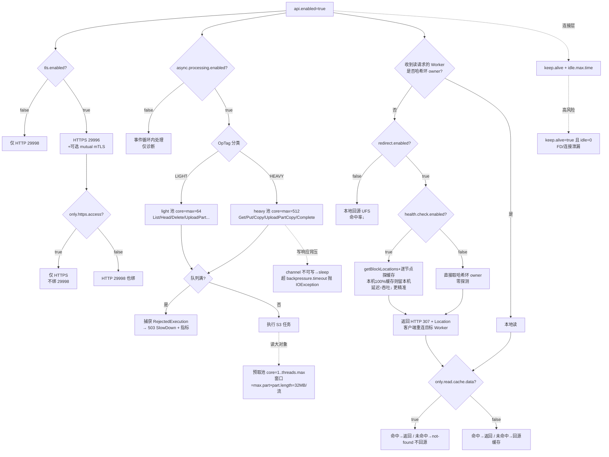

# 05 · Worker S3 API 网关

> 场景组:`alluxio.worker.s3.*` / `alluxio.worker.http.*` / `alluxio.worker.rest.*` / `alluxio.worker.secure.rpc.*` / `alluxio.worker.sts.*`
> 配置数:**56** · 数据来源:`PropertyKey.java` · 生成表:`_data/gen_table.py 05`

---

## 1. 本组概览

Worker S3 API 是 DORA 架构下**直接在每个 Worker 上暴露的 S3 兼容网关**(Netty 实现),让 Spark / Presto / Trino / PyTorch / Ray 等以标准 S3 协议直连 Alluxio 缓存,无需独立 Gateway 进程。

这组配置控制 8 件事,彼此强耦合:

| 子场景 | 关键配置 | 核心矛盾 |
|---|---|---|
| 总开关与协议端口 | `api.enabled`、`https.port`、`only.https.access`、`tls.*` | 启用与否 / HTTP vs HTTPS / 安全 |
| 连接复用 | `connection.keep.alive.enabled`、`connection.idle.max.time` | 吞吐 vs 连接/FD 占用 |
| 异步处理与线程池 | `async.processing.enabled`、`async.{light,heavy}.pool.*` | 事件循环隔离 / 吞吐 vs 内存 |
| 预取 | `async.prefetch.*` | 首字节延迟 vs UFS GET 次数 |
| 请求重定向(缓存亲和) | `redirect.enabled`、`write.redirect.enabled`、`redirect.health.check.enabled` | 缓存命中率 vs 转发开销 |
| 读写与缓存语义 | `writetype`、`only.read.cache.data.enabled` | 一致性/持久化 vs 性能 |
| 认证与授权 | `authentication.*`、`authorization.*`、`signature.validation.*`、`sts.*`、`privileged.users.*` | 安全 vs 兼容/开销 |
| S3 协议兼容行为 | `deletetype`、`list.directory.as.object`、`complete.multipart.upload.min.part.size`、`*.restrictions.*`、`put.object.calculate.md5` | AWS 兼容 vs 灵活性 |

---

## 2. 配置清单速查表(全量 56 项)

<!-- group: 05-worker-s3-gateway | count: 56 | 由 _data/gen_table.py 05 生成 -->
| 配置项 | 默认值 | 类型 | Scope | 一致性 | 说明 |
|---|---|---|---|---|---|
| `alluxio.worker.http.server.connection.idle.timeout` | "5min" | duration | WORKER | — | Worker HTTP 服务(:28080 REST / OCI-mirror 通道)的连接空闲超时 |
| `alluxio.worker.http.server.enabled` | true | boolean | WORKER | ENFORCE | 是否启用 Worker HTTP 服务 |
| `alluxio.worker.http.server.port` | 28080 | int | WORKER | — | Worker HTTP 服务端口 |
| `alluxio.worker.rest.bind.device` | — | string | WORKER | WARN | Worker REST 服务绑定的网卡设备名 |
| `alluxio.worker.rest.port` | 29998 | int | WORKER | WARN | Worker S3 API 的默认 HTTP 端口 |
| `alluxio.worker.s3.access.logging.enabled` | false | boolean | WORKER | WARN | 启用 S3 访问日志 |
| `alluxio.worker.s3.api.enabled` | false | boolean | WORKER | WARN | **S3 网关总开关** |
| `alluxio.worker.s3.async.heavy.pool.backpressure.timeout` | "30sec" | duration | WORKER | WARN | 重线程池等待 Netty channel 可写(背压)的最长时间,超时抛 IOException |
| `alluxio.worker.s3.async.heavy.pool.core.thread.number` | 512 | int | WORKER | ENFORCE | 重线程池核心线程数(默认=最大值,避免热路径 Thread.start) |
| `alluxio.worker.s3.async.heavy.pool.maximum.thread.number` | 512 | int | WORKER | ENFORCE | 重线程池最大线程数;应≥峰值并发 HEAVY 操作数 |
| `alluxio.worker.s3.async.heavy.pool.queue.size` | 4096 | int | WORKER | ENFORCE | 重线程池队列长度(有界,溢出转背压) |
| `alluxio.worker.s3.async.light.pool.core.thread.number` | 64 | int | WORKER | ENFORCE | 轻线程池核心线程数(默认=最大值) |
| `alluxio.worker.s3.async.light.pool.maximum.thread.number` | 64 | int | WORKER | ENFORCE | 轻线程池最大线程数 |
| `alluxio.worker.s3.async.light.pool.queue.size` | 4096 | int | WORKER | ENFORCE | 轻线程池队列长度(有界) |
| `alluxio.worker.s3.async.prefetch.max.part.number` | 8 | int | WORKER | WARN | 每个活跃读流预取的最大 part 数(lookahead 窗口) |
| `alluxio.worker.s3.async.prefetch.part.length` | "4MB" | dataSize | WORKER | WARN | 每个预取 part 的字节数;越小首字节越快但 UFS GET 越多 |
| `alluxio.worker.s3.async.prefetch.queue.size` | 10000 | int | WORKER | WARN | 预取池有界回退队列容量;超出则拒绝(前台读仍服务) |
| `alluxio.worker.s3.async.prefetch.threads.max` | 256 | int | WORKER | WARN | 预取池最大线程数;提交呈突发性,需按需调大 |
| `alluxio.worker.s3.async.processing.enabled` | true | boolean | WORKER | ENFORCE | 把 S3 请求从 Netty 事件循环卸载到异步线程池;仅诊断时关闭 |
| `alluxio.worker.s3.audit.logging.enabled` | false | boolean | WORKER | WARN | 启用 S3 审计日志 |
| `alluxio.worker.s3.audit.logging.queue.capacity` | 10000 | int | WORKER | WARN | S3 审计日志写入队列容量 |
| `alluxio.worker.s3.authentication.enabled` | false | boolean | WORKER | ENFORCE | 是否校验 S3 请求头(认证) |
| `alluxio.worker.s3.authentication.session.provider` | OIDC | enum | WORKER | — | S3 认证的会话提供方:OIDC / ALLUXIO_STS |
| `alluxio.worker.s3.authenticator.classname` | PassAllAuthenticator | class | WORKER | ENFORCE | S3 认证器实现类(默认放行全部) |
| `alluxio.worker.s3.authorization.enabled` | false | boolean | WORKER | ENFORCE | 是否启用授权检查 |
| `alluxio.worker.s3.authorizer.classname` | PassAllAuthorizer | class | WORKER | ENFORCE | S3 授权器实现类(默认放行全部) |
| `alluxio.worker.s3.bucket.naming.restrictions.enabled` | false | boolean | WORKER | ENFORCE | 是否强制 AWS S3 桶命名规则 |
| `alluxio.worker.s3.bucketpathcache.timeout` | "0min" | duration | WORKER | IGNORE | 桶路径存在性正向缓存 TTL;默认 0 关闭以对齐读后写一致性 |
| `alluxio.worker.s3.complete.multipart.upload.min.part.size` | "5MiB" | dataSize | WORKER | ENFORCE | 分片上传每片最小尺寸(末片除外),过小报 EntityTooSmall |
| `alluxio.worker.s3.connection.idle.max.time` | "0sec" | duration | WORKER | ENFORCE | 长连接最大空闲时间;0=不主动过期 |
| `alluxio.worker.s3.connection.keep.alive.enabled` | false | boolean | WORKER | ENFORCE | 是否维持 TCP 长连接供客户端复用 |
| `alluxio.worker.s3.deletetype` | ALLUXIO_AND_UFS | string | WORKER | ENFORCE | 删除语义:同时删 Alluxio+UFS / 仅删 Alluxio |
| `alluxio.worker.s3.header.metadata.max.size` | "2KiB" | dataSize | WORKER | ENFORCE | PUT 请求头中用户自定义元数据的最大尺寸;0=不限 |
| `alluxio.worker.s3.https.port` | 29996 | int | WORKER | WARN | S3 API 的 HTTPS 端口 |
| `alluxio.worker.s3.list.directory.as.object.enabled` | true | boolean | WORKER | ENFORCE | ListObjects 是否把目录作为 0 字节对象返回 |
| `alluxio.worker.s3.only.https.access` | false | boolean | WORKER | WARN | 仅提供 HTTPS 端口,禁用默认 HTTP 端口 |
| `alluxio.worker.s3.only.read.cache.data.enabled` | false | boolean | WORKER | ENFORCE | 仅读缓存内数据;未命中直接返回 not-found(不回源) |
| `alluxio.worker.s3.privileged.users.credentials` | — | string | WORKER | ENFORCE | 特权用户 accessKey→secretKey 的 JSON 映射 |
| `alluxio.worker.s3.put.object.calculate.md5.enabled` | true | boolean | WORKER | ENFORCE | PUT 时是否计算 MD5 |
| `alluxio.worker.s3.receive.packet.size` | 32*1024 | int | WORKER | ENFORCE | S3 请求分块接收包大小(32KiB) |
| `alluxio.worker.s3.redirect.enabled` | true | boolean | WORKER | ENFORCE | 读请求按一致性哈希环重定向到负责 Worker |
| `alluxio.worker.s3.redirect.health.check.enabled` | true | boolean | WORKER | ENFORCE | 重定向前 RPC 探活目标 Worker(**显著增加延迟与吞吐开销**) |
| `alluxio.worker.s3.rest.api.compatible.enabled` | false | boolean | WORKER | WARN | 启用 Worker S3 服务上的部分 RESTful API |
| `alluxio.worker.s3.selective.api.metrics.enabled` | false | boolean | WORKER | WARN | 按 API 方法选择性采集请求指标 |
| `alluxio.worker.s3.selective.api.metrics.list` | GetObject,HeadObject,ListObjects | list | WORKER | WARN | 采集指标的 S3 方法白名单 |
| `alluxio.worker.s3.signature.validation.enabled` | false | boolean | WORKER | ENFORCE | 启用 S3 签名校验(需搭配 AlluxioIamAuthenticator) |
| `alluxio.worker.s3.tagging.restrictions.enabled` | true | boolean | WORKER | ENFORCE | 强制 AWS S3 标签规则(10 标签/128 键/256 值) |
| `alluxio.worker.s3.tls.enabled` | false | boolean | WORKER | ENFORCE | 启用 S3 API 的 TLS |
| `alluxio.worker.s3.tls.mutual.enabled` | false | boolean | WORKER | ENFORCE | 启用 S3 API 的双向 mTLS |
| `alluxio.worker.s3.transfer.packet.size` | 1024*1024 | int | WORKER | ENFORCE | 传输/flush 数据的包大小(1MiB) |
| `alluxio.worker.s3.write.redirect.enabled` | false | boolean | WORKER | ENFORCE | 写请求是否也按哈希环重定向 |
| `alluxio.worker.s3.writetype` | CACHE_THROUGH | enum | WORKER | ENFORCE | S3 写入策略:CACHE_THROUGH / THROUGH |
| `alluxio.worker.secure.rpc.bind.host` | 0.0.0.0 | string | — | — | 安全 RPC 绑定地址 |
| `alluxio.worker.secure.rpc.hostname` | — | string | — | — | 安全 RPC 主机名 |
| `alluxio.worker.secure.rpc.port` | 29997 | int | — | — | 安全 RPC 端口 |
| `alluxio.worker.sts.signature.validation.enabled` | true | boolean | WORKER | ENFORCE | 启用 STS 请求签名校验 |

**端口速查**:S3 HTTP `29998`(rest.port)· S3 HTTPS `29996` · 安全 RPC `29997` · Worker HTTP/OCI `28080`。

---

## 3. 逐项深度分析(充分细节)

> 本组 56 项按配置族逐一深挖:总开关与端口 → HTTP/OCI 通道 → 安全 RPC → 连接复用 → **异步双线程池(off event loop)** → **预取池** → **一致性哈希重定向** → 读写缓存语义 → 认证/授权/签名/会话 → S3 协议兼容 → 传输分包 → 可观测。每族给出:作用、取值/枚举差异、代码级机制、族内/跨族关联。核心实现类:
> - `S3NettyHandler`(每请求 handler,常量与静态开关集中在此)
> - `S3HttpPipelineHandler`(Netty pipeline 装配 + light/heavy 池创建)
> - `S3HttpHandler`(请求聚合 + 按 OpTag 分派到池 + 503 SlowDown)
> - `S3NettyObjectTask` / `S3NettyBucketTask`(具体 S3 动作;重定向逻辑在此)
> - `OpType` / `OpTag`(每个 S3 动作 → LIGHT/HEAVY 分类)
> - `S3PrefetchExecutor` / `S3RangeReader`(预取窗口)
> - `NettyDataServer`(S3 HTTP/HTTPS 端口绑定)

### 3.1 总开关与协议端口(`api.enabled`、`rest.port`、`https.port`、`only.https.access`、`tls.*`、`rest.bind.device`)
- **`api.enabled`(默认 `false`)**:所有其它 `worker.s3.*` 的**前置开关**;description="enable worker netty s3 server"。代码在 `NettyDataServer` 构造里,只有此值 `true` 才创建 `FileSystemContext`、绑定 S3 端口并装配 `S3HttpPipelineHandler`。纯 FUSE / 原生客户端场景保持关闭以减少监听面与线程池常驻。
- **端口三件套**:`rest.port`(29998,const 名 `WORKER_S3_HTTP_PORT`)= S3 明文 HTTP;`s3.https.port`(29996)= S3 HTTPS;二者与 `http.server.port`(28080,见 3.2)、`secure.rpc.port`(29997,见 3.3)是**四个不同端口**,勿混淆。`rest.port` 的 const 名带 `HTTP` 而配置名叫 `rest`,是历史遗留命名不一致。
- **端口绑定的代码级顺序**(`NettyDataServer`,重要):
  1. `tls.enabled=true` → 先绑 HTTPS(29996),pipeline 里加 `SslHandler`;
  2. 若同时 `only.https.access=true` → **绑完 HTTPS 后直接 `return`**,HTTP 端口(29998)**根本不会绑定**;
  3. 否则再绑 HTTP(29998)。
  → 因此:`tls.enabled=false` 时 `only.https.access` 无意义(没有 HTTPS 可"only");只有 `tls.enabled=true` 才生效。
- **`tls.enabled` / `tls.mutual.enabled` 递进**:
  - `tls.enabled=true`:开 HTTPS,单向 TLS(服务端证书)。
  - 追加 `tls.mutual.enabled=true`:`S3HttpPipelineHandler` 读取该值传给 `SslContextProvider.getServerSSLContext(mMutualTls)`,启用 **mTLS**(要求并校验客户端证书)。仅在 `tls.enabled=true` 时读取(`tls.enabled=false` 时 `mMutualTls` 强制 false)。
  - 三者递进增强安全:HTTP → 单向 TLS → 强制 HTTPS → mTLS,代价是握手开销与证书运维(尤其 mTLS 需给每个客户端签发/轮转证书)。
- **`rest.bind.device`(默认空,string)**:Worker REST 服务绑定的**网卡设备名**(而非 IP)——多网卡主机上把 S3/REST 流量固定到某张网卡。留空=按常规地址解析绑定。

### 3.2 Worker HTTP / OCI 镜像通道(`http.server.*`,与 S3 网关平行的独立通道)
这一族**不是** S3 协议,是 Worker 上另一个 HTTP 服务(:28080),常用于 REST / OCI 镜像拉取,与 S3 网关独立端口、独立开关:
- **`http.server.enabled`(默认 `true`)**:开关 Worker HTTP 服务。
- **`http.server.port`(默认 `28080`)**:该服务端口。
- **`http.server.connection.idle.timeout`(默认 `5min`)**:该通道的连接空闲超时;description 说明——空闲(既无读也无写)超过此值即关闭连接,**回收那些没发 TCP RST 就消失的客户端 FD**(容器 OOM、NAT 丢弃);活跃传输保持非空闲不受影响;设 0 禁用空闲检测。⚠️ 注意这是 :28080 通道,**S3 网关的空闲超时是独立的 `s3.connection.idle.max.time`(见 3.4)**,两者默认值不同(28080 默认 5min,S3 默认 0=永不过期)。

### 3.3 安全 RPC 端点(`secure.rpc.*`)
- **`secure.rpc.port`(默认 `29997`)/ `secure.rpc.bind.host`(默认 `0.0.0.0`)/ `secure.rpc.hostname`(默认空)**:Worker 的加密 gRPC 端点三件套。`bind.host`=监听地址(`0.0.0.0`=所有网卡);`hostname`=对外通告的主机名(留空则自动解析);`port`=端口。属安全传输通道配置,与 [17-security](17-security.md) 的 TLS/凭证体系配合。日常保持默认,仅在自定义网络拓扑/双网卡分流时调整。

### 3.4 连接复用:`connection.keep.alive.enabled` × `connection.idle.max.time`(成对理解,FD 泄漏风险)
- **`keep.alive.enabled`(默认 `false`)**:开启后 `NettyDataServer` 给 S3 child channel 设 `SO_KEEPALIVE=true`,维持 TCP 长连接供客户端复用、省握手(HTTPS/TLS 收益尤大),**高 QPS 小对象**吞吐显著提升。这也是 3.5 "off event loop" 设计的直接受益点——长连接被 pin 在某个 event loop 上,若请求不卸载,一个慢请求会拖垮该 loop 上所有 keep-alive 连接。
- **`connection.idle.max.time`(默认 `0sec`)**:pipeline 里 `IdleStateHandler` 的 allIdle(读写皆空闲)阈值。description="max keep-alive time … idle for the specified time → 关闭;设 0 → 不主动过期"。
- ⚠️ **高风险组合 `keep.alive=true` + `idle.max.time=0`**:连接不回收,客户端异常退出(未发 FIN/RST)后服务端也不清理,长跑必现 **FD/连接堆积**。
- ✅ **建议**:开 keep-alive 时把 `idle.max.time` 设为有限值(如 `30s`~`120s`),并与客户端 SDK 连接池 TTL 对齐(略大于客户端,避免服务端先断导致客户端复用到半关连接)。

### 3.5 异步处理与双线程池(性能核心:off event loop + core=max + 有界队列背压)
DORA 的 S3 网关把请求从 Netty **事件循环**卸载到两个业务线程池,防止单个慢请求拖垮绑定在该 event loop 上的所有 keep-alive 连接。这套设计在 `S3HttpPipelineHandler.createLightThreadPool()/createHeavyThreadPool()` 与 `S3HttpHandler.processIfLastContent()` 中实现,细节考究:

- **`async.processing.enabled`(默认 `true`)**:description="dispatched off the Netty event loop into the async light/heavy thread pools … Disable only for diagnostic purposes"。`true` 才创建 light/heavy 池;`false` 则请求在 event loop 内同步 `continueTask()`。生产**必开**。
- **LIGHT vs HEAVY 的精确分类**(来自 `OpType` 枚举的 `OpTag`,而非"元数据 vs 数据"的粗略划分):
  - **HEAVY**(去 heavy 池):`GetObject`、`PutObject`、`CopyObject`、`UploadPartCopy`、`CompleteMultipartUpload`、`GetParquetRaw`。
  - **LIGHT**(去 light 池):`ListObjects`、`HeadObject`、`DeleteObject`、`DeleteObjects`、`UploadPart`、`CreateMultipartUpload`、`AbortMultipartUpload`、所有 tagging、所有 bucket 操作、`AssumeRole*` 等。
  - ⚠️ **反直觉点**:`UploadPart` 是 **LIGHT**(单纯写一片,轻),但 `UploadPartCopy`(服务端 copy 一片)和 `CompleteMultipartUpload`(可能触发合并/落 UFS)是 **HEAVY**;`DeleteObjects`(批删)仍是 LIGHT。分类依据是"是否搬运/生成大量数据",不是请求语义大小。
- **两池默认参数**:
  - **light 池**:core=max=**64**,queue=**4096**。
  - **heavy 池**:core=max=**512**,queue=**4096**,外加 `backpressure.timeout=30sec`。heavy core 默认 512 的注释点明"~512 MB stack"(每线程约 1MB 栈),是内存/并发的权衡起点。
- **core=max 的设计意图(代码级,关键)**:`boundedThreadPool(name, core, max, keepAlive=0, queueSize)` 建的是有界队列 `ThreadPoolExecutor`。当 core=max 且队列未满时,提交要么复用已有线程、要么入队,**永不触发 `addWorker()`→`Thread.start()`**。若 core<max,则核心线程满且队列未满时 JDK 的 `ThreadPoolExecutor` 会在**调用方线程(即 Netty event loop)**上执行 `Thread.start()`(慢 native 系统调用),wedge 住 event loop——这正是代码注释引用的 AC-6490 级联故障。为此代码里 `warnIfCoreSmallerThanMax()` 在 core<max 时**打 WARN 日志**提示运维。→ **调参铁律:core 和 max 必须同步改、保持相等**(或两个都不设,吃安全默认)。
- **队列有界 → 503 SlowDown(代码级)**:队列满时 `es.submit()` 抛 `RejectedExecutionException`;`S3HttpHandler` **捕获它并返回 HTTP 503 `SlowDown`**(而非让异常冒泡成 500 InternalError 刷屏日志),让 AWS-SDK / CRT 客户端按指数退避重试。同时打 `s3_api_async_rejections{kind="light"|"heavy"}` 指标 +1。→ **欠配信号**:该指标上升 + 客户端收到 503 SlowDown。
- **`heavy.pool.backpressure.timeout`(默认 `30sec`,仅 heavy 池)**:heavy 池线程在**写响应**时,若 Netty channel 不可写(`isWritable()==false`,下游 TCP 慢/满),线程会 sleep-等待 channel 可写;此值是等待上限,超时抛 `IOException`("Channel not writable within …"),**防 heavy 线程被僵死/慢 TCP 客户端永久占用**。快路径(`isWritable()==true`)从不 sleep。设 0=禁用超时(线程可能永久等待,**不推荐**)。注意此背压发生在 heavy 线程(已 off event loop),所以 sleep 不会阻塞 event loop。
- ✅ **调优路径**:先看 `s3_api_async_rejections` 与线程池活跃度;heavy 池打满 → 增大 max(同步 core);内存吃紧 → 优先降 queue 而非线程数(线程栈是常驻内存大头)。**均需压测验证(建议验证)**。

### 3.6 预取池 `async.prefetch.*`(worker 侧,lookahead 窗口)
worker 侧独立预取池 `S3PrefetchExecutor.POOL`,服务 `S3RangeReader` 的响应预取与 `S3NettyObjectTask` 的子页读整页预热。与客户端 `AsyncPrefetchCache` 的 FAST/SLOW 分池不同,worker 侧负载"均匀突发的 4MB 页拉取、无冷热之分",故用单池。
- **`prefetch.max.part.number`(默认 `8`)× `prefetch.part.length`(默认 `4MB`)= lookahead 窗口 32MB/流**(description 明说二者共同决定单流窗口上限)。`S3RangeReader` 把首次请求长度 `mLength` 作为 initialPrefetchSize 传入,让首个 `positionRead` **不经 ramp-up 直接铺满窗口**;而 length < partLength 的小/随机请求会得到 `prefetchPartNumber=0`、退化为直接 position read,**避免 part 对齐带来的读放大**。
- **`prefetch.part.length` 越小** → 冷读首字节越快(第一片更早到),但每窗口 UFS GET 次数越多(更碎、更多往返)。
- **池的规格(代码级)**:`boundedThreadPool(core=1, max=threads.max, keepAlive=10s, queueSize=queue.size)`——**注意这里 core=1≠max**(与 light/heavy 池的 core=max 不同),因为预取不在 event loop 热路径上提交(由已卸载的 handler 线程提交),不会有 event-loop wedge 风险,故允许按需扩线程、空闲 10s 回收。
- **`prefetch.threads.max`(默认 `256`)**:池最大线程;提交呈突发性(最坏每个 S3 GET 一次),需按负载调大。
- **`prefetch.queue.size`(默认 `10000`)**:底层 `BoundedHandoffExecutor` 的**有界回退队列**容量(Semaphore 限界,而非 AbortPolicy 直接丢)。超出 `max+queue` 才拒绝;**调用方(`S3RangeReader`、`asyncWarmPage`)已 catch `RejectedExecutionException`,前台 UFS 读仍会服务请求**——预取只是加速手段,拒绝不影响正确性,只是少了一次预热。

### 3.7 一致性哈希重定向(`redirect.enabled` / `write.redirect.enabled` / `redirect.health.check.enabled`,最能体现 DORA 架构)
DORA 中 Worker 构成一致性哈希环,每个对象有一个"负责"它的 Worker(缓存落在那)。客户端可能连到任意 Worker。重定向逻辑在 `S3NettyObjectTask.generateRedirectResponse()`。
- **重定向的实现形态(代码级,重要)**:**不是内部 RPC 转发**,而是返回 **HTTP 307 `TEMPORARY_REDIRECT` + `Location` 头**(指向负责 Worker 的 `scheme://host:redirectPort/objectPath?redirect`),由**客户端自己重连**到目标 Worker。目标 Worker 收到带 `redirect` query 参数的请求即视为"终点",不再二次重定向(防环)。这解释了为何 S3 客户端需支持 307 跟随。
- **`redirect.enabled`(默认 `true`)**:description="readObject request may redirect … based on the consistent hash ring and cache load situation"。收到读请求的 Worker 若非负责节点,307 定向到负责 Worker → 提升缓存命中率、避免同数据在多 Worker 重复缓存。关闭则本地回源 UFS,命中率↓、缓存冗余↑、UFS 压力↑。
- **`write.redirect.enabled`(默认 `false`)**:写路径同款 307 定向(`PutObject`/`CreateMultipartUpload` 等的 `needRedirectAPI()` 读此值)。默认关是因为写通常直接持久化到 UFS、转发多一跳收益有限;开启可增强写后立即读的缓存亲和。
- **`redirect.health.check.enabled`(默认 `true`,代码里 `isRedirectRequestCheck`)**:description 直言"an RPC is used to verify the health of the worker before redirecting … **introduce significant overhead in both latency and throughput**"。开启后 `pickWorkerNetAddress()` 会:
  1. `getBlockLocations` 拿候选 Worker 列表;
  2. 若当前 Worker 在列表内且 `getInAlluxioPercentage()==100`(本机已全量缓存)→ **优先留在本机**,省一跳;
  3. 否则逐个 `checkDataCachedOnWorkerThenTriggerPassiveCache()`(逐 Worker RPC)找**真正缓存了数据**的 Worker;
  4. 都没有 → 取列表首个(哈希环 owner)。
  → 即 health.check=true 用**额外 RPC 探测真实缓存位置**(可命中非 owner 但已缓存的节点),换来更精准的定向;关闭则**直接用哈希环 owner**、零探测开销。
  - **性能敏感 + Worker 稳定**:`redirect.enabled=true` + `health.check=false` 常为更优组合(享缓存亲和、去探测 RPC),代价是可能定向到还没缓存的 owner(首次读回源)。
  - **Worker 频繁伸缩 / 缓存分布不均**:保留 `health.check=true` 更能命中已有缓存、避免定向到失效/空节点。

### 3.8 读写与缓存语义(`writetype`、`only.read.cache.data.enabled`、`deletetype`、`bucketpathcache.timeout`)
- **`writetype`(默认 `CACHE_THROUGH`,枚举 `WriteType`)**:S3 PUT 的落盘策略。`WriteType` 全枚举有 `MUST_CACHE`/`TRY_CACHE`/`CACHE_THROUGH`/`THROUGH`/`ASYNC_THROUGH`/`NONE`,但 description 明确 **S3 网关当前仅支持两种**:
  - `CACHE_THROUGH`:尝试缓存 + **同步**写 UFS(写后即读命中,且已持久化)。
  - `THROUGH`:不缓存、仅**同步**写 UFS(省缓存空间,写后读需回源)。
  - 其余枚举(如 `ASYNC_THROUGH` 异步落盘、`MUST_CACHE` 只缓存不落盘)在 S3 网关**不可用**——若需异步写缓冲,走 [19-write-ttl-quota](19-write-ttl-quota.md) 的 `write.cache.*` 子系统。
- **`only.read.cache.data.enabled`(默认 `false`)**:
  - `true`:ReadObject **只读缓存内数据**,未命中直接返回 not-found、**绝不回源 UFS**。适合"缓存即数据集"、要求延迟可预测的场景(如 AI 训练不接受回源抖动)。
  - ⚠️ 行为变更:上游若把 not-found 误判为"数据缺失"会引发业务误判,需与调用方约定语义。此值是 `S3NettyHandler.ONLY_READ_CACHE` 静态常量,进程级生效。
- **`deletetype`(默认 `ALLUXIO_AND_UFS`,string)**:DELETE 语义,取值来自 `Constants`:
  - `ALLUXIO_AND_UFS`(默认):同时删 Alluxio 缓存 + UFS 底层对象(标准 S3 delete 语义)。
  - `ALLUXIO_ONLY`:仅删 Alluxio 命名空间/缓存,**保留 UFS 对象**——用于"只清缓存不动源数据"的运维场景。
- **`bucketpathcache.timeout`(默认 `0min`=关,IGNORE 一致性)**:桶路径存在性的**正向缓存** TTL(仅缓存"存在且是目录",**不做负缓存**——避免陈旧 NOT_FOUND 遮蔽刚建的桶)。被 HeadBucket / GetBucketLocation / GetBucketVersioning / ListMultipartUploads / DeleteBucket 及少量 object 级的 `checkPathIsAlluxioDirectory` 调用点使用。默认 0 关闭以**对齐 AWS 读后写一致性**;设有限值(如 60s)= 用有界陈旧窗口换更少的 bucket-validate RPC。缓存实现是 `S3NettyHandler` 的 on-demand holder,TTL 首次访问时读取。
- **跨组关联**:写/读语义与 [04-worker-page-store](04-worker-page-store.md) 的 Page Store 命中/淘汰、[19-write-ttl-quota](19-write-ttl-quota.md) 的写缓冲、[15-network-transport](15-network-transport.md) 的 `netty.file.transfer`(零拷贝)共同决定端到端性能。

### 3.9 认证 / 授权 / 签名 / 会话(`authentication.*`、`authorizer.*`、`signature.validation.*`、`sts.*`、`session.provider`、`privileged.users.credentials`)
默认全放行(`PassAllAuthenticator` / `PassAllAuthorizer`),即**开箱不设防**——生产必须显式配置。四层能力互相解耦:
- **认证层**:`authentication.enabled`(默认 `false`,description="check s3 rest request header")+ `authenticator.classname`(默认 `alluxio.s3.auth.PassAllAuthenticator`,放行全部)。生产替换为真实认证器(如 `AlluxioIamAuthenticator`)。
- **授权层**:`authorization.enabled`(默认 `false`)+ `authorizer.classname`(默认 `alluxio.s3.auth.PassAllAuthorizer`,放行全部)。与认证独立开关。
- **签名校验(SigV4)**:
  - `signature.validation.enabled`(默认 `false`):对 S3 请求校验 AWS SigV4 签名。description 明确**仅当 `authentication.enabled=true` 且 `authenticator.classname=alluxio.s3.auth.AlluxioIamAuthenticator` 时才生效**——单独开这个开关而不换认证器无效。
  - `sts.signature.validation.enabled`(默认 `true`,注意**默认开**):对 STS(AssumeRole 等)请求校验签名,同样依赖上面的 IAM 认证器组合。默认 true 意味着一旦启用 IAM 认证器,STS 请求默认就要求合法签名。
- **会话提供方 `authentication.session.provider`(默认 `OIDC`,枚举 `S3SessionProviderType`)**:
  - `OIDC`:会话令牌由 OIDC(OpenID Connect)提供方签发。
  - `ALLUXIO_STS`:使用 Alluxio 安全令牌服务(STS)生成的临时会话令牌。
  - `UNKNOWN`:仅测试用,不应在生产配置。
- **`privileged.users.credentials`(默认空,string)**:特权用户的 `accessKey→secretKey` **JSON 映射**(如 `{"accessKey1":"secretKey1"}`),给绕过/特权访问的账号。⚠️ **明文密钥**——切勿入库/日志/明文配置文件,应走密管/密文注入(K8s Secret、Vault 等)。
- **跨组关联**:与 [17-security](17-security.md) 的整体认证/授权/TLS 体系一致;IAM 认证器与 SessionPolicyAuthorizer 在 `SecurityUtils` 中按 `ALLUXIO_IAM` 预设装配。

### 3.10 S3 协议兼容行为(`deletetype` 已见 3.8;此处:list/multipart/restrictions/md5/header)
多为对齐 AWS S3 语义的开关,通常保持默认:
- **`list.directory.as.object.enabled`(默认 `true`)**:ListObjects/ListObjectsV2 是否把目录当 0 字节对象返回。
  - `true`(默认,历史行为):列举时每个目录都作为 0 字节 `Contents` 条目返回。
  - `false`(更贴近 AWS):**前缀路径本身被抑制**;**合成的父目录**(无 UFS 后端对象、`lastModificationTimeMs==0` 识别)被丢弃,而**真实的 0 字节目录标记对象**(带正的 mtime、由底层对象 LastModified 透传)保留。带 delimiter 的列举不受影响(目录仍走 CommonPrefixes)。→ 影响以"前缀即目录"假设的客户端兼容性,精确行为比"是否返回目录"更细。
- **`complete.multipart.upload.min.part.size`(默认 `5MiB`,ENFORCE)**:分片上传除末片外每片最小尺寸,过小报 `EntityTooSmall`(对齐 AWS)。设 0 放宽尺寸限制。
- **`bucket.naming.restrictions.enabled`(默认 `false`)**:是否强制 AWS 桶命名规则。默认关(比 AWS 宽松,允许非法桶名)。
- **`tagging.restrictions.enabled`(默认 `true`)**:是否强制 AWS 标签规则(**10 标签 / 键 ≤128 字符 / 值 ≤256 字符**)。默认开。
- **`put.object.calculate.md5.enabled`(默认 `true`)**:PUT 时是否计算 MD5(用于 ETag / Content-MD5 校验)。关闭省 CPU,但失去完整性校验。
- **`header.metadata.max.size`(默认 `2KiB`,ENFORCE)**:PUT 请求头中用户自定义元数据(`x-amz-meta-*`)的最大总尺寸;是 `S3NettyHandler.MAX_HEADER_METADATA_SIZE` 常量;设 0=不限。
- **`rest.api.compatible.enabled`(默认 `false`)**:在 Worker S3 服务上额外开放部分 RESTful API(代码里 `WORKER_S3_REST_API_ENABLED`,受支持的 REST 资源如 `parquet_raw`、`sts`)。默认关以保持纯 S3 语义。

### 3.11 传输分包(`receive.packet.size` / `transfer.packet.size`)
- **`receive.packet.size`(默认 `32*1024`=32KiB)**:S3 请求分块**接收**的 chunk 大小,直接用作 Netty `HttpDecoderConfig.setMaxChunkSize()`——控制入站 HTTP body 解码的单块上限。
- **`transfer.packet.size`(默认 `1024*1024`=1MiB)**:**传输/flush** 出站数据的包大小(`S3NettyHandler.PACKET_LENGTH`),决定读响应时每次向 channel 写多大一块。偏大减少 flush 次数(高吞吐大对象),偏小降低单次内存占用与首字节延迟。两者是内存/延迟/吞吐的底层旋钮,一般保持默认。

### 3.12 可观测(access / audit / selective metrics)
- **`access.logging.enabled`(默认 `false`)**:S3 访问日志(记录每次请求,含重定向 URI 等)。
- **`audit.logging.enabled`(默认 `false`)+ `audit.logging.queue.capacity`(默认 `10000`)**:S3 审计日志,经异步 writer `AsyncUserAccessAuditLogWriter`(名 "NETTY_S3_AUDIT_LOG")写出,队列有界(容量即上面的值),并注册 `S3_AUDIT_LOG_QUEUE_SIZE` 指标回调监控积压。
- **`selective.api.metrics.enabled`(默认 `false`)+ `selective.api.metrics.list`(默认 `GetObject,HeadObject,ListObjects`)**:仅对白名单方法采集请求指标,降低高 QPS 下的指标基数与开销。列表在 `S3NettyHandler.SELECTIVE_API_LIST`(转小写后 set 匹配)。
- **跨组关联**:与 [18-observability](18-observability.md) 的全局 metrics/日志体系配合;`s3_api_async_rejections`(见 3.5)是判断线程池欠配的核心指标。

---

## 4. 配置关联关系图

---

## 5. 典型场景配置组合建议

| 场景 | 推荐组合 | 理由 |
|---|---|---|
| **AI 训练 / 高性能只读** | `api.enabled=true`、`redirect.enabled=true`、`health.check=false`、`only.read.cache.data.enabled=true`、`keep.alive=true`+`idle.max.time=60s`、heavy 池按并发上调(core=max)、按对象大小调 `prefetch.part.length` | 最大化缓存亲和与吞吐、延迟可预测(不回源) |
| **数据湖读写混合** | `redirect.enabled=true`、`write.redirect.enabled=true`、`writetype=CACHE_THROUGH`、`health.check=true` | 读写都享缓存亲和,写后即读命中,稳态优先 |
| **纯持久化写入网关** | `writetype=THROUGH`、`only.read.cache.data.enabled=false` | 不占缓存,数据直落 UFS |
| **对外 / 多租户安全** | `tls.enabled=true`+`only.https.access=true`(+`tls.mutual.enabled=true`)、`authentication.enabled=true`+`authenticator.classname=AlluxioIamAuthenticator`、`authorization.enabled=true`、`signature.validation.enabled=true`、`sts.signature.validation.enabled=true`、`session.provider` 按 OIDC/STS 选 | 加密 + 认证 + 鉴权 + SigV4,替换默认 PassAll;签名校验依赖 IAM 认证器组合 |
| **Worker 频繁伸缩 / 缓存分布不均** | `health.check=true` | 用探测 RPC 命中真实缓存位置,避免定向到未缓存/失效节点 |
| **高 QPS 小对象吞吐** | `keep.alive=true`+`idle.max.time=30~120s`、按压测调 light/heavy 池(core=max 同步改)与 queue | 复用 TCP 省握手;有界队列背压防 OOM,监控 `s3_api_async_rejections` |
| **仅诊断线程池问题** | 临时 `async.processing.enabled=false` | 请求回到 event loop 内同步执行,便于定位;**生产严禁常开** |
| **OCI 镜像 / REST 通道调优** | `http.server.enabled=true`、`http.server.port=28080`、`http.server.connection.idle.timeout=5min` | 独立于 S3 网关的通道,空闲超时回收失联客户端 FD |

---

## 6. 风险与注意事项

1. **`keep.alive=true` + `idle.max.time=0`**:连接不回收(客户端未发 FIN/RST 时服务端也不清理),长跑必现 FD/连接堆积 → 始终配有限空闲超时,并略大于客户端连接池 TTL。
2. **线程池 core<max 会触发 event-loop wedge**:core<max 时 JDK `ThreadPoolExecutor` 在核心线程满且队列未满时会在**调用方(Netty event loop)线程**执行 `Thread.start()`(慢 native syscall),wedge 住 event loop——即代码注释引用的 AC-6490 级联。默认 core=max 正为规避此问题;`warnIfCoreSmallerThanMax()` 会打 WARN。**调 core 必同步调 max、保持相等**(或都不设吃默认)。
3. **线程池欠配 → 503 SlowDown**:队列满时抛 `RejectedExecutionException`,handler 返回 HTTP 503 SlowDown 并打 `s3_api_async_rejections{kind}`。该指标上升即需增大对应池的 max(同步 core);内存吃紧优先降 queue 而非线程(线程栈常驻,heavy 512 线程约 512MB 栈)。
4. **`redirect.health.check.enabled=true` 的隐性成本**:官方 description 直言"显著增加延迟和吞吐开销"——每次定向前做 `getBlockLocations` + 逐节点缓存探测 RPC。高性能且 Worker 稳定场景应评估关闭(直接用哈希环 owner)。
5. **重定向是 HTTP 307 而非内部转发**:客户端必须支持跟随 307 `Location`(重连目标 Worker);不支持 307 的 S3 客户端会拿不到数据。评估客户端兼容性。
6. **默认全放行认证/授权**:`PassAllAuthenticator`/`PassAllAuthorizer` 开箱不设防,生产必须显式替换。
7. **签名校验依赖 IAM 认证器组合**:`signature.validation.enabled` / `sts.signature.validation.enabled` 仅当 `authentication.enabled=true` 且 `authenticator.classname=AlluxioIamAuthenticator` 时才生效;单开签名开关而不换认证器无效。注意 `sts.signature.validation.enabled` 默认就是 `true`。
8. **`privileged.users.credentials` 明文密钥**:JSON 明文 accessKey→secretKey,禁止写入版本库/日志/明文配置,走密管/K8s Secret 注入。
9. **`only.read.cache.data.enabled=true` 的语义变更**:未命中返回 not-found 而非回源,需与调用方约定(避免误判"数据缺失")。
10. **`writetype` 仅两种可用**:S3 网关只支持 `CACHE_THROUGH`/`THROUGH`(均同步落 UFS),`WriteType` 其余枚举(ASYNC_THROUGH/MUST_CACHE 等)在此不生效;异步写走 [19](19-write-ttl-quota.md) 的 `write.cache.*`。
11. **`only.https.access` 依赖 `tls.enabled`**:`tls.enabled=false` 时该开关无意义(无 HTTPS 可 "only");误配会以为强制加密实则仍开明文。
12. **`bucketpathcache.timeout` 与读后写一致性**:默认 0(关)以对齐 AWS 读后写一致性;设正值会引入桶存在性的有界陈旧窗口。
13. **一致性级别**:本组绝大多数为 `ENFORCE`——**集群内所有 Worker 必须配置一致**,变更需全量滚动生效,否则行为不可预期。
14. **命名 / 端口易混淆**:`rest.port`(29998,S3 HTTP,const 名却叫 `WORKER_S3_HTTP_PORT`)vs `s3.https.port`(29996)vs `http.server.port`(28080,REST/OCI 独立通道)vs `secure.rpc.port`(29997);S3 网关空闲超时 `s3.connection.idle.max.time`(默认 0)vs OCI 通道 `http.server.connection.idle.timeout`(默认 5min)。
15. **调优建议均需压测验证**:线程池/预取/重定向的取值强依赖负载画像,采用前请结合压测(建议验证)。

---

## 跨组关联速览

- [04-worker-page-store](04-worker-page-store.md) —— 缓存命中判定、Page Store 淘汰(决定 `only.read.cache` 命中率)
- [14-membership-etcd](14-membership-etcd.md) —— 一致性哈希环(重定向的基础)
- [15-network-transport](15-network-transport.md) —— Netty 零拷贝、全局网络参数
- [17-security](17-security.md) —— 认证/授权/TLS 体系
- [18-observability](18-observability.md) —— metrics/审计日志
- [19-write-ttl-quota](19-write-ttl-quota.md) —— 写缓冲 `alluxio.write.cache.enabled`
