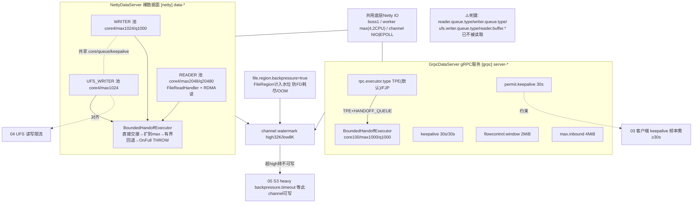

# 06 · Worker 网络 / RPC / Web

> 场景组:`alluxio.worker.network.*`(Netty 数据面)+ `alluxio.worker.rpc.*`(gRPC 控制面执行器)+ `alluxio.worker.web.*` + `alluxio.worker.bind.*`
> 配置数:**60** · 别名 9 · 废弃 0 · 数据来源:`PropertyKey.java` · 生成表:`_data/gen_table.py 06`

---

## 1. 本组概览

本组是 Worker 的**传输与并发引擎**——Netty 数据服务器(块读写数据面)、gRPC RPC 执行器(控制面)、Web UI。它直接决定 worker 的吞吐上限、并发能力、背压行为和内存占用。全部 `Scope=WORKER`。

四个子场景:

| 子场景 | 关键配置 | 核心矛盾 |
|---|---|---|
| Netty 线程池 | `netty.reader.threads.*`、`netty.writer.threads.*`、`netty.ufs.writer.threads.max`、队列类型 | 并发 vs 内存/线程 |
| 背压与水位 | `netty.watermark.high/low`、`netty.file.region.backpressure.enabled`、`reader.buffer.size` | 内存保护 vs 吞吐 |
| gRPC 连接与保活 | `network.keepalive.*`、`permit.keepalive.time`、`flowcontrol.window`、`max.inbound.message.size` | 连通性 vs 资源 |
| RPC 执行器 | `rpc.executor.type`(TPE/FJP)、`rpc.executor.*.pool.size`、队列 | 吞吐 vs 稳定性 |

---

## 2. 配置清单速查表(全量 60 项)

### 2.1 Netty 数据面:线程池
| 配置项 | 默认值 | 类型 | Scope | 一致性 | 说明 |
|---|---|---|---|---|---|
| `alluxio.worker.network.netty.reader.threads.core` | 4 | int | WORKER | WARN | 读页核心线程数 |
| `alluxio.worker.network.netty.reader.threads.max` | 2048 | int | — | — | 读页最大线程(别名 ...block.reader.threads.max) |
| `alluxio.worker.network.netty.reader.queue.size` | 20480 | int | — | — | 读线程池队列大小(别名 ...block.reader.queue.size) |
| `alluxio.worker.network.netty.reader.queue.type` | HANDOFF_QUEUE | enum | WORKER | WARN | 读池队列类型 |
| `alluxio.worker.network.netty.reader.thread.keep.alive.time` | 10sec | duration | WORKER | WARN | 读池非核心线程空闲保活 |
| `alluxio.worker.network.netty.writer.threads.core` | 4 | int | WORKER | WARN | 写页核心线程(与 UFS-writer 池共享) |
| `alluxio.worker.network.netty.writer.threads.max` | 1024 | int | — | — | 写页最大线程(别名 ...block.writer.threads.max) |
| `alluxio.worker.network.netty.writer.queue.size` | 1000 | int | — | — | 写线程池队列(读写/UFS-writer 共享,别名...) |
| `alluxio.worker.network.netty.writer.queue.type` | HANDOFF_QUEUE | enum | WORKER | WARN | 写池队列类型 |
| `alluxio.worker.network.netty.writer.thread.keep.alive.time` | 10sec | duration | WORKER | WARN | 写池非核心线程空闲保活 |
| `alluxio.worker.network.netty.ufs.writer.threads.max` | 1024 | int | — | — | 写 UFS 最大线程(别名 ...file.writer.threads.max) |
| `alluxio.worker.network.netty.ufs.writer.queue.type` | HANDOFF_QUEUE | enum | WORKER | WARN | UFS-writer 池队列类型 |
| `alluxio.worker.network.grpc.writer.threads.max` | 1024 | int | WORKER | WARN | 数据服务写文件最大线程(别名 ...block.write.threads.max) |
| `alluxio.worker.network.ufs.reader.threads.max` | 2048 | int | WORKER | WARN | 从 UFS 加载文件的最大线程 |
| `alluxio.worker.network.netty.boss.threads` | 1 | int | WORKER | WARN | 接受新连接的线程数 |
| `alluxio.worker.network.netty.worker.threads` | — | int | WORKER | WARN | 处理请求的线程数 |

### 2.2 Netty 背压、水位与缓冲
| 配置项 | 默认值 | 类型 | Scope | 一致性 | 说明 |
|---|---|---|---|---|---|
| `alluxio.worker.network.netty.watermark.high` | 32KiB | dataSize | WORKER | WARN | 写队列超此值转不可写(触发背压) |
| `alluxio.worker.network.netty.watermark.low` | 8KiB | dataSize | WORKER | WARN | 回落到此值才恢复可写 |
| `alluxio.worker.network.netty.file.region.backpressure.enabled` | true | boolean | WORKER | WARN | FileRegion 字节计入水位,零拷贝也受背压约束 |
| `alluxio.worker.network.reader.buffer.size` | 4MiB | dataSize | WORKER | WARN | 远程读时客户端未收数据的上限(超则暂停发送) |
| `alluxio.worker.network.reader.buffer.pooled` | true | boolean | WORKER | WARN | 用池化 direct buffer 还是 unpooled |
| `alluxio.worker.network.reader.max.chunk.size.bytes` | 2MiB | dataSize | WORKER | WARN | 远程读最大 chunk |
| `alluxio.worker.network.writer.buffer.size.messages` | 8 | int | WORKER | WARN | 每请求服务端缓冲的写消息数 |
| `alluxio.worker.network.netty.reader.buffer.size.packets` | 16 | int | — | — | 读并行数据包上限 |
| `alluxio.worker.network.netty.writer.buffer.size.packets` | 16 | int | — | — | 写并行数据包上限 |
| `alluxio.worker.network.netty.buffer.receive` | 256KiB | dataSize | — | — | SO_RCVBUF |
| `alluxio.worker.network.netty.buffer.send` | 256KiB | dataSize | — | — | SO_SNDBUF |
| `alluxio.worker.network.netty.backlog` | 1024 | int | — | — | SO_BACKLOG 连接排队数 |
| `alluxio.worker.network.netty.queue.enabled` | true | boolean | WORKER | WARN | 是否启用 netty 缓冲队列 |
| `alluxio.worker.network.netty.file.transfer` | TRANSFER | enum | — | — | 回传方式:MAPPED / TRANSFER(零拷贝) |
| `alluxio.worker.network.zerocopy.enabled` | true | boolean | WORKER | WARN | worker 处理数据流是否零拷贝 |

### 2.3 Netty 保活/关闭/看门狗
| 配置项 | 默认值 | 类型 | Scope | 一致性 | 说明 |
|---|---|---|---|---|---|
| `alluxio.worker.network.keepalive.time` | 30sec | duration | WORKER | WARN | 数据服务保活 ping 间隔 |
| `alluxio.worker.network.keepalive.timeout` | 30sec | duration | WORKER | WARN | 保活响应超时 |
| `alluxio.worker.network.permit.keepalive.time` | 30s | duration | WORKER | WARN | 允许客户端配置的最激进保活频率 |
| `alluxio.worker.network.flowcontrol.window` | 2MiB | dataSize | WORKER | WARN | worker gRPC HTTP2 流控窗口 |
| `alluxio.worker.network.max.inbound.message.size` | 4MiB | dataSize | WORKER | WARN | worker gRPC 最大入站消息 |
| `alluxio.worker.network.netty.channel` | NIO | enum | WORKER | WARN | Netty channel:NIO/EPOLL(EPOLL 不可用回退) |
| `alluxio.worker.network.netty.read.handler.thread.idle.timeout` | 2s | duration | — | — | 读 handler 线程空闲释放时间 |
| `alluxio.worker.network.netty.read.watchdog.enabled` | true | boolean | WORKER | WARN | 定期记录卡住的在途 Netty 读(仅日志) |
| `alluxio.worker.network.netty.read.watchdog.stuck.threshold` | 20sec | duration | WORKER | WARN | 读无进展多久判为卡死并上报 |
| `alluxio.worker.network.netty.shutdown.quiet.period` | 2sec | duration | WORKER | WARN | 关闭静默期(期间无 RPC 才真正关) |
| `alluxio.worker.network.netty.shutdown.timeout` | 15sec | duration | — | — | Netty 关闭最长等待 |
| `alluxio.worker.network.shutdown.timeout` | 15sec | duration | WORKER | WARN | gRPC 服务关闭最长等待 |

### 2.4 gRPC RPC 执行器与端口/Web
| 配置项 | 默认值 | 类型 | Scope | 一致性 | 说明 |
|---|---|---|---|---|---|
| `alluxio.worker.rpc.executor.type` | TPE | enum | WORKER | WARN | 执行器:TPE(ThreadPoolExecutor)/ FJP(ForkJoinPool) |
| `alluxio.worker.rpc.executor.core.pool.size` | 100 | int | WORKER | WARN | RPC 执行器核心线程 |
| `alluxio.worker.rpc.executor.max.pool.size` | 1000 | int | WORKER | WARN | RPC 执行器最大线程 |
| `alluxio.worker.rpc.executor.keepalive` | 60sec | duration | WORKER | WARN | 线程空闲回收时间 |
| `alluxio.worker.rpc.executor.tpe.queue.type` | HANDOFF_QUEUE | enum | WORKER | WARN | TPE 内部队列类型 |
| `alluxio.worker.rpc.executor.tpe.queue.size` | 1000 | int | WORKER | WARN | TPE 有界队列大小 |
| `alluxio.worker.rpc.executor.tpe.allow.core.threads.timeout` | false | boolean | WORKER | WARN | TPE 核心线程是否可超时回收 |
| `alluxio.worker.rpc.executor.fjp.async` | true | boolean | WORKER | WARN | FJP 是否 FIFO 调度 forked 任务 |
| `alluxio.worker.rpc.executor.fjp.parallelism` | — | int | WORKER | WARN | FJP 并行度(别名 ...executor.parallelism) |
| `alluxio.worker.rpc.executor.fjp.min.runnable` | 1 | int | WORKER | WARN | FJP 最小不阻塞核心线程(别名 ...min.runnable) |
| `alluxio.worker.rpc.port` | 29999 | int | ALL | WARN | Worker RPC 端口(别名 alluxio.worker.port) |
| `alluxio.worker.rpc.bind.device` | — | string | WORKER | WARN | RPC 服务绑定网卡 |
| `alluxio.worker.bind.host` | 0.0.0.0 | string | WORKER | WARN | Worker 绑定主机名 |
| `alluxio.worker.web.port` | 30000 | int | WORKER | WARN | Worker Web UI 端口 |
| `alluxio.worker.web.bind.host` | 0.0.0.0 | string | WORKER | WARN | Web 绑定主机 |
| `alluxio.worker.web.bind.device` | — | string | WORKER | WARN | Web 绑定网卡 |
| `alluxio.worker.web.hostname` | — | string | WORKER | — | Web UI 主机名 |

---

## 3. 逐项深度分析(充分细节)

> 本组 60 项按配置族逐一深挖:**Netty 数据面三线程池** → BoundedHandoffExecutor 交接语义 → **背压/水位/FileRegion** → 端到端读缓冲(含疑似死键) → Netty IO 线程/channel/socket → 关闭/看门狗/文件回传 → **gRPC 数据服务保活/流控** → **RPC 执行器 TPE vs FJP** → 端口/绑定/Web。全部 `Scope=WORKER`(端口部分 ALL),一致性多为 `WARN`。
>
> ⚠️ **关键前提(先读)**:worker 数据面有**两个独立的 Netty 服务**:
> - **`NettyDataServer`**(`[netty] data-*` 线程):裸 Netty 块数据传输(读页/写页/S3),用 `NettyExecutors` 的**三个业务线程池**处理请求。
> - **`GrpcDataServer`**(`[grpc] server-*` 线程):worker 的 gRPC 控制/数据服务(`BlockWorker` 等),用 `rpc.executor.*` 配的**一个 RPC 执行器**。
>
> 两者共用同一组 `netty.boss.threads` / `netty.worker.threads` / `netty.channel` / watermark 作为**底层 Netty IO EventLoop** 配置,但**业务处理线程池完全不同**。看配置名带 `network.netty.*` 未必只作用于 NettyDataServer——boss/worker/channel/watermark 两个 server 都读。

### 3.1 Netty 数据面三线程池(reader / writer / ufs-writer)—— 核心

`NettyExecutors`(`worker/netty/NettyExecutors.java`)在类加载时静态构造**三个业务线程池**,均经 `AlluxioExecutorService.boundedThreadPool(...)` 创建:

| 池 | core | max | queue.size | keep.alive | 处理 |
|---|---|---|---|---|---|
| **READER_EXECUTOR** | `reader.threads.core`=4 | `reader.threads.max`=2048 | `reader.queue.size`=20480 | `reader.thread.keep.alive.time`=10s | `FileReadHandler`(读页)+ **RDMA 读**(`DoraRdmaReadRequestHandler` 也复用它) |
| **WRITER_EXECUTOR** | `writer.threads.core`=4 | `writer.threads.max`=1024 | `writer.queue.size`=1000 | `writer.thread.keep.alive.time`=10s | `FileWriteHandler`(写页) |
| **UFS_WRITER_EXECUTOR** | `writer.threads.core`=4(共享) | `ufs.writer.threads.max`=1024 | `writer.queue.size`=1000(共享) | `writer.thread.keep.alive.time`=10s(共享) | 把数据写到 UFS |

**共享关系精确说明**:writer 与 ufs-writer **共享** `writer.threads.core`(4)、`writer.queue.size`(1000)、`writer.thread.keep.alive.time`(10s)三项,但各有独立的 `max`(writer=`writer.threads.max`=1024,ufs-writer=`ufs.writer.threads.max`=1024)。reader 池的三参数(core/max/queue/keepalive)完全独立。

- **reader max=2048 远大于 writer max=1024**:读扇出比写大得多(一个客户端顺序读会并发拉多 chunk;RDMA 读也压这个池),故读池给更高上限、更大队列(20480 vs 1000)。
- **调优信号**:读吞吐打满、reader 池活跃线程逼近 2048 → 增 `reader.threads.max` 并关注内存;写慢且瓶颈在 UFS → 调 `ufs.writer.threads.max`,并对齐 [04组](04-worker-page-store.md) 的 UFS 限流。
- **观测**:每池按 `PoolName`(`[netty] data-reader` / `data-writer` / `ufs-writer`)发 `thread_pool_*` 维度指标(active/current/max/queue_depth)。

#### ⚠️ 重要更正:per-pool `queue.type` 三个键已"失效"
`reader.queue.type` / `writer.queue.type` / `ufs.writer.queue.type`(默认都 `HANDOFF_QUEUE`)**在当前代码里已不再被读取**。`NettyExecutors.java` 明确注释:*"the former per-pool queue-TYPE config keys are dropped by the lockdown"*——三池统一走 `boundedThreadPool`,由 **queue.size** 决定队列形态,而非 queue.type:
- `queue.size > 0` → **`BoundedHandoffExecutor`**(带有界回退队列的直接交接,三池默认都是此形态,size 分别 20480/1000/1000)。
- `queue.size == 0` → `SynchronousQueue`(纯直接交接,无缓冲)。

> PropertyKey 里这三个 `queue.type` 键仍有定义、默认值和"HANDOFF_QUEUE pairs with BoundedHandoffExecutor; other values use a plain ThreadPoolExecutor"的**描述**,但**构造点已不消费它们**——属于配置元数据与实现的漂移。**设这三个键不会改变行为**(建议验证:如需切换队列形态,现在只能通过 `queue.size`;把 size 设 0 才退化为 SynchronousQueue)。

### 3.2 `BoundedHandoffExecutor` 的"同步交接"语义(vs 普通 TPE)—— 机制深挖

三个 netty 池(以及 HANDOFF_QUEUE 型 RPC 执行器)背后是 `BoundedHandoffExecutor`(`util/executor/BoundedHandoffExecutor.java`),它解决了普通 `ThreadPoolExecutor` + `LinkedBlockingQueue` 的经典陷阱(代码里称 **AC-6490 footgun**:core<max 且用无界/大队列时,TPE 会**先填满队列再扩容线程**,导致高 max 形同虚设、并发坍缩到 core)。其行为链:

1. **优先直接交接**:新任务先尝试**直接递给一个空闲 worker**(SynchronousQueue 式 handoff),无空闲则……
2. **扩容到 max**:先把池**长到 `maximumPoolSize`**(而非先入队)——这才是"grow to max, then queue"的正确顺序。
3. **有界回退队列**:池已满时才放进容量=`queue.size` 的**有界回退队列**(`BoundedHandoffQueue`,Semaphore 限容)。
4. **饱和动作 `OnFull`**:池满且回退队列也满时:
   - `THROW`(默认):抛 `RejectedExecutionException`(netty 数据面三池即此,超载显式拒绝而非无界堆积/OOM),并上报 `ThreadPoolMonitor` 拒绝计数。
   - `RUN_ON_CALLER`:在提交线程上就地跑(caller-runs 背压,永不丢任务,但占用提交线程——只能用于可阻塞的提交者,绝不能是 event-loop)。
- **强约束**:`core >= 1`(构造时校验),因为它在构造里 `prestartCoreThread()` **预热一个核心线程**保证回退队列里的任务总有 worker 可取;也因此与 `allowCoreThreadTimeout=true` 互斥(见 3.9 RPC 执行器)。
- **与普通 TPE 的差别一句话**:普通 TPE 是"**队列优先**"(易坍缩并发);BoundedHandoffExecutor 是"**线程优先 + 小有界缓冲 + 明确饱和动作**",专为 gRPC/Netty 这类阻塞 IO 扇出设计。

> `netty.queue.enabled`(默认 true)只作用于 `HybridSynchronousLinkedQueue`(另一种"忙时 Synchronous、满时 Linked"的混合队列)。而 netty 三池现在用的是 `BoundedHandoffExecutor`,**不经过** HybridSynchronousLinkedQueue。当前 worker 默认路径中没有池选用 `HYBRID_SYNCHRONOUS_LINKED_QUEUE`,故 **`netty.queue.enabled` 对三大数据池实际无影响**(仅在有池显式选 HYBRID 队列类型时才生效;建议验证其是否还有现役消费者)。

### 3.3 背压与水位(内存保护核心)—— 机制深挖

写侧背压建立在 Netty channel 的 `WriteBufferWaterMark` 上,`NettyDataServer` 与 `GrpcDataServer` **都**把 watermark 设进 child channel:
- **`watermark.high`(32KiB)/`watermark.low`(8KiB)**:单 channel 出站队列**超 high → channel 转 `isWritable()=false`**(暂停向该连接推数据),队列**回落到 low 才恢复可写**。防慢客户端把响应堆在 worker 堆内存里 OOM。high/low 之间的迟滞带避免抖动。
- **`file.region.backpressure.enabled`(默认 true)—— 重点、勿关**:
  - 机制:开启后给 child channel 设 `MESSAGE_SIZE_ESTIMATOR = FileRegionCountingMessageSizeEstimator`。Netty 默认的 `DefaultMessageSizeEstimator` 把 **`FileRegion`(零拷贝 sendfile 的载体)算作 0 字节**,于是零拷贝响应**绕过水位**——`isWritable()` 永远为真,慢客户端能让出站队列无限增长。
  - 代码级后果(注释原文):FileRegion 排队时**每个排队 chunk 会 pin 住一个打开的 FD**,一个大 GET 就能**耗尽 worker 的 FD 预算**(不止 OOM,更是 FD 泄漏式耗尽)。计入水位后 `ChunkedWriteHandler` 会在排队字节达 high 时停止 `readChunk`、降到 low 再续。
  - 结论:这是**内存 + FD 双重安全阀**,仅作为紧急回滚开关存在(gated behind a property),生产**保持 true**。
- **端到端读缓冲(3 个键,⚠️ 疑似死键)**:`reader.buffer.size`(4MiB)、`reader.buffer.pooled`(true)、`reader.max.chunk.size.bytes`(2MiB)在 PropertyKey 里定义完整(语义为"客户端未接收数据达上限则 worker 暂停发送"的端到端背压 + 池化 direct buffer + 最大 chunk),但**全仓库无任何代码读取这三个键**——疑为老的 block 数据面遗留、在 DORA 页式路径已不生效(建议验证:是否有本仓外的 legacy 客户端路径仍读)。当前**背压实际由 channel watermark + FileRegion 计数承担**,而非这三个键。
- **与 [05组](05-worker-s3-gateway.md) 呼应**:S3 heavy 异步池的 `backpressure.timeout` 等的就是这里的 channel 由不可写恢复为可写;水位设太低会让 S3 侧频繁触发背压超时。

### 3.4 Netty IO 层:boss/worker 线程、channel、socket 选项
这些是**两个 Netty server 共用**的底层 EventLoop / socket 配置:
- **`netty.boss.threads`(默认 1)**:接受新连接(accept)的 EventLoop 线程。单线程 accept 通常足够;超高连接建立速率可增。NettyDataServer 与 GrpcDataServer 各建一组(`data-boss` / `server-boss`)。
- **`netty.worker.threads`(默认 `max(4, 2×CPU)`)**:处理已建连 IO 事件的 EventLoop 线程(注:清单里默认显示为空,实为**默认供给** `max(4,2×CPU)`,非 0;设 0 才退回 Netty 自带的 `2×CPU`)。`data-worker` / `server-worker` 两组;HTTP server 也复用此键。
- **`netty.channel`(默认 `NIO`,可选 `EPOLL`)**:EPOLL 在 Linux 上更高效;**EPOLL 不可用时自动回退 NIO**。选 EPOLL 时代码额外设 `EpollMode.LEVEL_TRIGGERED`。
- **socket 选项(仅 NettyDataServer 且**需显式 set 才生效**)**:`netty.backlog`(SO_BACKLOG=1024,连接排队数)、`netty.buffer.send`(SO_SNDBUF=256KiB)、`netty.buffer.receive`(SO_RCVBUF=256KiB)。代码仅在 `Configuration.isSet(...)` 为真(即用户显式配了)时才 apply,否则用 OS 默认。另外恒设 `SO_REUSEADDR=true`(允许重启期 TIME_WAIT 端口重绑)。
- **数据包并行度**:`netty.reader.buffer.size.packets`(16,`NettyReadHandlerStateMachine` 读)、`netty.writer.buffer.size.packets`(16,`AbstractWriteHandler` 读)——单请求管线内并行的数据包上限。`writer.buffer.size.messages`(8)语义类似(每写请求服务端缓冲的写消息数);均控制单流在管线中的在途量,防单连接吃过多缓冲。

### 3.5 关闭、看门狗、文件回传、零拷贝
- **优雅关闭**:NettyDataServer 用 `netty.shutdown.quiet.period`(2s)+ `netty.shutdown.timeout`(15s);gRPC server 用 `network.shutdown.timeout`(15s,与 netty 关闭超时同值但**是不同键、作用不同 server**)。关闭时先静默 2s 确保无新 RPC 再关闭 EventLoop,最多等 timeout,超时则**强制关闭**并 WARN。滚动升级影响单 worker 摘除平滑度。
- **读看门狗(observability-only)**:
  - `netty.read.watchdog.enabled`(true):开启后周期扫描处于非终止态、卡住的在途 Netty 读并**打日志 + 更新 gauge**;**从不 cancel/改写请求**(纯观测)。
  - `netty.read.watchdog.stuck.threshold`(20s):读**无状态迁移**超此时长即判"卡死"上报。扫描间隔**不单独配**,而是**由阈值派生** = `threshold / 4`(下限 1s),使一次窗口内一个卡读被重报数次、二者不会互相配错。单次扫描最多打 50 行(超出记溢出计数),防卡读风暴刷爆日志。补上"请求终止才打 close/error 日志"留下的观测盲区(如卡在 `READING_DATA` 等 UFS 挂起)。
  - `netty.read.handler.thread.idle.timeout`(2s,`AbstractReadHandler` 读):读 handler 线程空闲多久释放。
- **文件回传方式 `netty.file.transfer`(默认 `TRANSFER`)**:`TRANSFER` 用 `FileChannel.transferTo`(sendfile 零拷贝),`MAPPED` 用 `MappedByteBuffer`。被 `PipelineHandler` 与 `S3NettyHandler` 读。
- **`zerocopy.enabled`(默认 true)**:worker 处理数据流是否走零拷贝路径(`DoraWorkerClientServiceHandler` 读,gRPC 数据路径)。与 `file.region.backpressure` 配合:零拷贝省内存拷贝,但必须靠 FileRegion 计数把零拷贝字节纳入背压,二者是一体两面。

### 3.6 gRPC 数据服务:保活与流控(`GrpcDataServer`)
worker 的 gRPC server(`GrpcDataServer.java`)把下列键设进 `GrpcServerBuilder`:
- **`keepalive.time`(30s)/ `keepalive.timeout`(30s)**:server 每 30s 向**空闲连接**发 HTTP/2 keepalive ping,30s 内无响应则判死并断连(探活客户端)。
- **`permit.keepalive.time`(30s)—— 防 keepalive 风暴**:限制客户端**被允许的最激进 ping 频率**。gRPC server 端 `permitKeepAlive`:客户端若比此更频繁地 ping 空闲连接,server 会发 `GOAWAY`/断连(gRPC 的 "too many pings" 保护)。这是**防滥用/DoS 的服务端闸门**——客户端侧([03组](03-client-net-rpc.md))的 keepalive 间隔应 **≥ 此值**,否则连接被服务端主动踢。
- **`flowcontrol.window`(2MiB)**:HTTP/2 连接级流控窗口;调大允许更多在途未确认数据(高 BDP 链路吞吐更好),代价是每连接内存。
- **`max.inbound.message.size`(4MiB)**:worker 侧单条入站 gRPC 消息上限。⚠️ **注意比客户端默认(常 100MiB)小**——超大请求消息可能在 worker 侧被拒,两端需对齐。
- **RPC 执行器**:gRPC server 的请求处理线程池就是 3.7 的 `rpc.executor.*`(通过 `ExecutorOptions.forHost(WORKER)` 注入,`setThreadPoolType(METADATA_HANDLER)`)。

### 3.7 RPC 执行器:TPE vs FJP(`rpc.executor.*`)—— 机制深挖
worker gRPC 请求处理器的执行器由 `ExecutorServiceBuilder.forHost(WORKER)` 从 `alluxio.worker.rpc.executor.*` 装配,`rpc.executor.type` 选 `TPE`(默认)或 `FJP`,**二者的参数互斥读取**:

**TPE(ThreadPoolExecutor,默认)** — 读以下键:
- `core.pool.size`(100)/ `max.pool.size`(1000):`max` 到顶后无法再替换阻塞线程(即拒绝)。
- `tpe.queue.type`(默认 `HANDOFF_QUEUE`)/ `tpe.queue.size`(1000):
  - **`HANDOFF_QUEUE` → 构造 `BoundedHandoffExecutor`**(见 3.2:线程优先、有界回退、饱和 THROW),`queue.size` 为回退队列容量。
  - ⚠️ **`LINKED_BLOCKING_QUEUE_WITH_CAP` 被显式禁止**(代码 precondition 抛错):它 core<max 时"队列优先",正是 AC-6490 坍缩;要有界 RPC 队列**只能用 `HANDOFF_QUEUE`**。(PropertyKey 描述里写"Supported values are: LINKED_BLOCKING_QUEUE, ARRAY_BLOCKING_QUEUE and SYNCHRONOUS_BLOCKING_QUEUE" 与代码禁止项/默认值有出入——建议验证,以代码 precondition 为准。)
- `tpe.allow.core.threads.timeout`(false):核心线程是否空闲超时回收。⚠️ **当 `tpe.queue.type=HANDOFF_QUEUE` 时必须为 false**(BoundedHandoffExecutor 预热核心线程保暖,置 true 会破坏该保证,构造时校验报错)。

**FJP(ForkJoinPool)** — 读以下键(TPE 下忽略):
- `fjp.parallelism`(默认 `max(8, 2×CPU)`,别名 `...executor.parallelism`):目标并行度(维持的运行线程数;因 join/managed-blocker 实际活跃线程可超此值)。
- `fjp.min.runnable`(1,别名 `...min.runnable`):允许的最少不阻塞核心线程,控制 work-stealing 下的可运行度。
- `fjp.async`(true):true=FIFO 异步模式调度 forked 任务,适合大量事件式细任务。
- `keepalive`(60s):TPE/FJP 通用的空闲线程回收时间(FJP 要求 >0)。

**取舍**:多数场景 **TPE + HANDOFF_QUEUE** 足够且行为可预测(线程优先、明确拒绝、可控背压),推荐默认;FJP 仅在大量细粒度 fork/join 负载下才有 work-stealing 优势,且调参更微妙。

### 3.8 相关但"非主数据面"的线程配置(易误解)
- **`grpc.writer.threads.max`(1024,别名 `...block.write.threads.max`)**:名字像"写文件线程",实际是 `GrpcExecutors` 里 **JOB "write" 池**(core=4,`SynchronousQueue`,给分布式 `mv`/`cp` 和旧客户端用,注释称"队列常空"),**不是**客户端写页主路径(那是 3.1 的 WRITER_EXECUTOR)。
- **`ufs.reader.threads.max`(2048)**:并非线程池,而是 `RpcExecutors.UFS_COLD_READ_CONCURRENCY_LIMITER` 这个**公平 Semaphore 的许可数**——限制"冷读 UFS"的并发度(超过则排队等许可),是 UFS 冷读的并发闸门。

### 3.9 端口 / 绑定 / Web
- **`worker.rpc.port`(29999,别名 `alluxio.worker.port`,Scope=ALL)**:worker gRPC RPC 端口。
- **`worker.bind.host`(0.0.0.0)**:worker 绑定主机(0.0.0.0=所有网卡)。`worker.rpc.bind.device`(空):按网卡名绑定 RPC(与 bind.host 二选一的绑定方式)。
- **`worker.web.port`(30000)/ `worker.web.bind.host`(0.0.0.0)/ `worker.web.bind.device`(空)/ `worker.web.hostname`(空)**:Worker Web UI 的端口、绑定地址、绑定网卡、对外主机名(hostname 用于 UI 展示/回链,与 bind.host 区分:一个是"绑哪",一个是"对外报哪")。

---

## 4. 配置关联关系图

---

## 5. 典型场景配置组合建议

| 场景 | 推荐组合 | 理由 |
|---|---|---|
| **读密集(训练/大扫)** | 增 `netty.reader.threads.max`(默认 2048)、必要时增 `reader.queue.size` | reader 池是读主瓶颈(RDMA 读也压它);⚠️ 别再指望 `reader.buffer.size`(疑似死键) |
| **写/UFS 慢** | 调 `ufs.writer.threads.max`,对齐 [04组](04-worker-page-store.md) UFS 限流 | writer/ufs-writer 共享 core/queue,单独提 ufs 上限 |
| **慢客户端 / 内存 + FD 保护** | **保持 `file.region.backpressure.enabled=true`**、合理 watermark(high 32K/low 8K) | 零拷贝 FileRegion 计入水位,防每 chunk 一个 FD 耗尽 + OOM |
| **高连接数** | 增 `netty.backlog`(显式设才生效)、Linux 上评估 `netty.channel=EPOLL` | 提升连接接纳与 IO 效率(EPOLL 不可用自动回退) |
| **RPC 可控性优先** | `rpc.executor.type=TPE` + `tpe.queue.type=HANDOFF_QUEUE`(默认) | 线程优先 + 有界回退 + 明确拒绝,行为可预测,避开 AC-6490 并发坍缩 |
| **RPC fork/join 型负载** | `rpc.executor.type=FJP` + 调 `fjp.parallelism`/`fjp.min.runnable` | work-stealing 适合大量细粒度任务(否则不建议切) |
| **防客户端 keepalive 风暴** | `permit.keepalive.time` 与客户端 [03组](03-client-net-rpc.md) 保活间隔对齐(客户端 ≥ 30s) | 防被服务端 GOAWAY 踢连接 |
| **大 gRPC 消息** | 对齐 `max.inbound.message.size`(默认 4MiB)与客户端(常 100MiB) | 避免超大请求在 worker 侧被拒 |
| **滚动升级平滑** | 合理 `netty.shutdown.quiet.period`/`timeout` 与 `network.shutdown.timeout` | 静默确认无 RPC 再关,平滑摘除 worker |
| **卡读排障** | 保持 `read.watchdog.enabled=true`,按需调 `stuck.threshold` | 观测 UFS 挂起等卡死读(纯日志/gauge,不影响业务) |

---

## 6. 风险与注意事项

1. **⚠️ 关 `file.region.backpressure.enabled` = OOM + FD 双重风险**:零拷贝 `FileRegion` 默认被估为 0 字节、绕过水位 → 慢客户端不仅能撑爆堆内存,**每个排队 chunk 还 pin 一个打开的 FD**,一个大 GET 可耗尽 worker FD 预算。它只是紧急回滚开关,生产**必须保持 true**。
2. **⚠️ 三个 `*.queue.type` 键(reader/writer/ufs.writer)已失效**:构造点(`NettyExecutors`)不再读它们("dropped by the lockdown"),但 PropertyKey 仍保留定义与描述——**设它们不改变行为**;要改队列形态只能靠 `*.queue.size`(设 0 才退化为 SynchronousQueue)。这是最易踩的"配了没用"陷阱。
3. **⚠️ `reader.buffer.size` / `reader.buffer.pooled` / `reader.max.chunk.size.bytes` 疑似死键**:全仓库无读取者,DORA 页式路径的背压实由 channel watermark + FileRegion 计数承担;调这三个键预计无效(建议验证是否有仓外 legacy 路径)。
4. **`netty.queue.enabled` 对三大数据池无实际影响**:它只作用于 `HybridSynchronousLinkedQueue`,而三池用的是 `BoundedHandoffExecutor`(建议验证是否还有现役 HYBRID 队列消费者)。
5. **线程池 max 过大**:reader max 默认 2048、writer/ufs-writer 各 1024;盲目再调大会耗线程/内存。它们是 `BoundedHandoffExecutor`(超载会 THROW 拒绝而非无界堆积),应结合 `queue.size` 与实测调。
6. **`rpc.executor` 的 HANDOFF_QUEUE 约束**:`tpe.queue.type=HANDOFF_QUEUE` 时 `tpe.allow.core.threads.timeout` **必须 false**(否则构造报错);`LINKED_BLOCKING_QUEUE_WITH_CAP` 被禁用(AC-6490 坍缩)。PropertyKey 对 `tpe.queue.type` 的"Supported values"描述与代码不符,以代码为准(建议验证)。
7. **`permit.keepalive.time` 与客户端不匹配**:客户端 keepalive 比 30s 更频繁 ping 空闲连接会被服务端 GOAWAY/断连;两侧需协调([03组](03-client-net-rpc.md))。
8. **worker 入站消息 4MiB vs 客户端 100MiB**:大消息可能在 worker 侧被拒,注意两端对齐。
9. **两个 Netty server、易混淆的键**:`network.netty.*` 里的 boss/worker/channel/watermark 同时作用于 NettyDataServer 与 GrpcDataServer;`grpc.writer.threads.max` 实为 JOB write 池(mv/cp)、`ufs.reader.threads.max` 实为冷读并发 Semaphore——名字都容易误读为"主数据面线程"。
10. **别名(9)**:多为 `block.reader/writer/write`、`file.writer`、`executor.parallelism/min.runnable`、`worker.port`、`job.task.queue.size` 旧名;避免新旧同设。

---

## 跨组关联速览
- [04-worker-page-store](04-worker-page-store.md) —— 数据/UFS 读写与限流(本组传输其数据)
- [05-worker-s3-gateway](05-worker-s3-gateway.md) —— S3 异步池背压等这里的 channel 可写
- [03-client-net-rpc](03-client-net-rpc.md) —— 客户端连接/保活(与 permit 协调)
- [15-network-transport](15-network-transport.md) —— 全局网络/gRPC 参数
