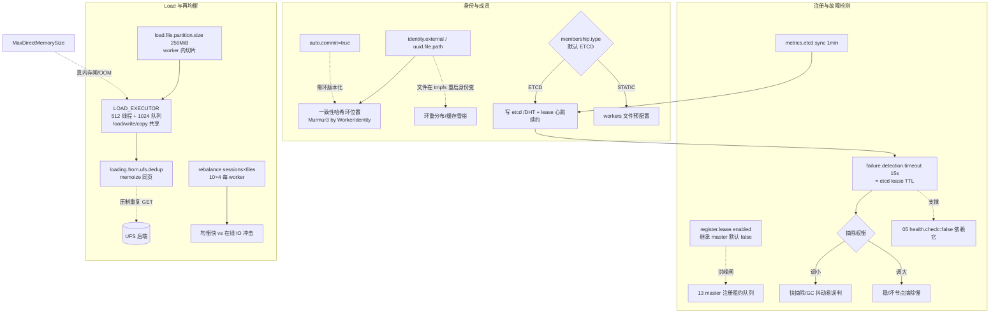

# 07 · Worker 生命周期 / 成员 / 注册 / Rebalance

> 场景组:`alluxio.worker.{identity,membership,register,failure,startup,master,rebalance,load,loading,meta,mark,open,outdated,jvm,metrics,container,hostname,job}.*`
> 配置数:**26** · 别名 3 · 废弃 0 · 数据来源:`PropertyKey.java` · 生成表:`_data/gen_table.py 07`

---

## 1. 本组概览

本组管 Worker 的**身份、加入集群、故障检测、注册、再均衡与分布式 load**——即 worker 在 DORA 集群里"是谁、怎么加入、怎么被判死、数据怎么在 worker 间搬"。多项 `Scope=ALL/ENFORCE`,需集群一致。

四个子场景:

| 子场景 | 关键配置 | 核心矛盾 |
|---|---|---|
| 身份与成员 | `identity.*`、`membership.manager.type`、`static.membership.*` | 稳定身份 vs 运维复杂度 |
| 注册与故障检测 | `register.lease.enabled`、`failure.detection.timeout`、`master.connect.retry.timeout` | 快速摘除 vs 误判 |
| 再均衡(rebalance) | `rebalance.max.parallel.*`、`rebalance.fast.file.scan` | 均衡速度 vs 负载冲击 |
| 分布式 load | `load.file.partition.size`、`loading.from.ufs.dedup.enabled`、`job.*` | 加载吞吐 vs UFS 压力 |

---

## 2. 配置清单速查表(全量 26 项)

### 2.1 身份与成员管理
| 配置项 | 默认值 | 类型 | Scope | 一致性 | 说明 |
|---|---|---|---|---|---|
| `alluxio.worker.identity.external` | — | string | WORKER | IGNORE | worker 唯一身份串(别名 identity.uuid),覆盖自动 UUID |
| `alluxio.worker.identity.uuid.file.path` | ${conf}/worker_identity | string | WORKER | WARN | 存 worker UUID 身份的文件路径 |
| `alluxio.worker.membership.manager.type` | ETCD | enum | ALL | ENFORCE | 成员管理:ETCD / STATIC |
| `alluxio.worker.membership.manager.auto.commit.after.registration` | true | boolean | ALL | ENFORCE | 注册后自动提交成员变更 |
| `alluxio.worker.static.membership.manager.config.file` | ${conf}/workers | string | ALL | — | STATIC 模式的 worker 列表文件 |
| `alluxio.worker.container.hostname` | — | string | WORKER | IGNORE | 容器内运行时的容器主机名 |
| `alluxio.worker.hostname` | — | string | WORKER | — | worker 主机名 |

### 2.2 注册、故障检测与启动
| 配置项 | 默认值 | 类型 | Scope | 一致性 | 说明 |
|---|---|---|---|---|---|
| `alluxio.worker.register.lease.enabled` | =master同名项 | boolean | WORKER | WARN | 注册前先向 master 申请租约 |
| `alluxio.worker.failure.detection.timeout` | 15s | duration | ALL | ENFORCE | 成员故障检测判定 worker 失败的超时 |
| `alluxio.worker.master.connect.retry.timeout` | 1hour | duration | WORKER | — | 连不上 master 多久后放弃并退出 |
| `alluxio.worker.master.periodical.rpc.timeout` | 5min | duration | WORKER | — | worker↔主 master 周期 RPC 超时(防挂起) |
| `alluxio.worker.startup.timeout` | 10min | duration | ALL | WARN | 等待 worker 启动的最长时间 |
| `alluxio.worker.metrics.etcd.sync.interval` | 1min | duration | WORKER | WARN | worker 容量指标同步到 etcd 的间隔 |

### 2.3 再均衡(rebalance)
| 配置项 | 默认值 | 类型 | Scope | 一致性 | 说明 |
|---|---|---|---|---|---|
| `alluxio.worker.rebalance.max.parallel.files.per.worker` | 4 | int | WORKER | WARN | worker-worker 传输时并行 load 文件数 |
| `alluxio.worker.rebalance.max.parallel.worker.sessions` | 10 | int | WORKER | WARN | 每 worker 发起的并行 worker-worker 传输会话数 |
| `alluxio.worker.rebalance.fast.file.scan` | true | boolean | WORKER | WARN | 使用快速文件列表扫描实现 |

### 2.4 分布式 load 与作业
| 配置项 | 默认值 | 类型 | Scope | 一致性 | 说明 |
|---|---|---|---|---|---|
| `alluxio.worker.load.file.partition.size` | 256MiB | dataSize | WORKER | WARN | 分布式 load 时把文件切片并发加载(>0 生效) |
| `alluxio.worker.loading.from.ufs.dedup.enabled` | true | boolean | WORKER | WARN | 多冷读同页时只一个线程回源、其余等待 |
| `alluxio.worker.job.load.executor.threads.max` | 512 | int | WORKER | WARN | 数据服务读文件最大线程(别名含 grpc.reader...) |
| `<unresolved:WORKER_JOB_EXECUTOR_TASK_QUEUE_SIZE>` | =load线程数×2 | int | — | — | load/write/copy 作业线程池共享任务队列(别名 job.task.queue.size) |
| `alluxio.worker.meta.iterator.batch.size` | 2000 | int | WORKER | WARN | DoraMeta 迭代文件元数据的批大小 |
| `alluxio.worker.mark.writing.files.duration` | 10min | duration | ALL | — | 文件"写入中"标记保持时长(每次写重置) |
| `alluxio.worker.open.file.handle.clean.up.ttl` | 30min | duration | ALL | — | 打开的文件句柄空闲多久被回收 |
| `alluxio.worker.outdated.parquet.scan.period` | 15d | duration | WORKER | WARN | 清理过期文件级元数据 parquet 的间隔 |
| `alluxio.worker.jvm.monitor.enabled` | true | boolean | WORKER | WARN | 启用 JVM 暂停监控线程(检测 GC 停顿) |
| `alluxio.worker.remote.io.slow.threshold` | 10s | duration | WORKER | WARN | 单缓冲远程 IO 超此判为慢(采样日志) |

---

## 3. 逐项深度分析(充分细节)

> 本组 26 项按配置族逐一深挖:**worker 身份 → 成员管理 → 注册与故障检测 → 连接/启动/周期 RPC 超时 → 再均衡 → 分布式 load 与线程池 → worker 侧元数据/句柄/监控杂项**。代码求证以 `PropertyKey.java` + 具体实现类为准,并标注与官方描述不符处。

### 3.1 Worker 身份:一致性哈希环的锚,缓存亲和的前提

> 全名 `alluxio.worker.identity.external`(别名 `alluxio.worker.identity.uuid`,`Scope=WORKER`,`IGNORE`)与 `alluxio.worker.identity.uuid.file.path`(默认 `${alluxio.conf.dir}/worker_identity`,`WARN`)。解析逻辑集中在 `WorkerIdentityProvider.get()`(`dora/core/server/worker/.../identity/WorkerIdentityProvider.java`)。

#### 为什么身份是"锚"
DORA 无中心命名空间,数据落哪个 worker 由**一致性哈希环**决定;环上每个节点的位置由该 worker 的 `WorkerIdentity` 哈希算出(客户端 `DefaultConsistentHashProvider.build()` 用 `WorkerIdentity.HashFunnel` 把 `identity 字节 + version` 喂给 Murmur3-32,生成虚拟节点)。**身份变 = 环上位置变 = 之前落在它身上的 key 全部重新归属别的 worker → 缓存整体失配、命中率骤降**。所以身份的**跨重启稳定性**是 DORA 缓存亲和的根基。

#### 解析优先级(代码级,三级 fallback)
`WorkerIdentityProvider.get()` 严格按以下顺序:
1. **配置优先**:若 `isSetByUser(WORKER_IDENTITY_EXTERNAL)` 为真 → 取该串。先尝试 `ParserV1.fromUUID`(当作标准 UUID),抛 `IllegalArgumentException` 再退到 `ParserV2.fromString`(当作**任意字符串**身份)。即 `identity.external` **既可填 UUID 也可填任意唯一串**。
2. **持久化文件**:读 `identity.uuid.file.path`,过滤 `#` 注释行与空行,取第一条非空行按 `ParserV1`(UUID)解析;多于一条会 WARN 只用第一条。
3. **自动生成**:文件不存在(`FileNotFoundException`/`NoSuchFileException`)→ `UUID.randomUUID()` 生成新身份,**写回该文件**(带生成时间戳注释),并把文件设为**只读**(防误改)。

#### 关键容错行为(易踩)
- **读文件遇到非"不存在"类 IO 错误(如权限拒绝、坏块)→ 直接抛 `RuntimeException` 中止启动**——设计上"宁可起不来也不用错误/新身份",避免静默换身份污染环。
- **写回失败(路径不可写)→ 仅 WARN、不中止**:worker 会用刚生成的随机身份继续跑,但**每次重启都生成新身份**。这正是 K8s 里最危险的隐性故障:emptyDir/tmpfs 上 `worker_identity` 重启即丢 → 每次重建换身份 → 反复缓存雪崩。务必把该路径挂到**持久卷**。
- `identity.external` 的 `Scope=IGNORE`——不参与一致性检查,允许每 worker 不同(本就应各异)。

### 3.2 成员管理:MembershipType 与 auto.commit

> `alluxio.worker.membership.manager.type`(枚举 `MembershipType`,`Scope=ALL`,`ENFORCE`)+ `auto.commit.after.registration`(true,`ENFORCE`)+ `static.membership.manager.config.file`(`${conf}/workers`)。

#### 枚举全解(4 个值,注意官方描述有误)
`MembershipType` 实际只有 4 个值(`dora/core/common/.../membership/MembershipType.java`),工厂 `MembershipManager.Factory` 按值 new 出不同实现:

| 值 | 实现 | 说明 |
|---|---|---|
| `ETCD` | `EtcdMembershipManager` | **默认**。worker 启动写入 etcd `/DHT/{clusterName}`,附带 etcd **lease**;lease 由 keepalive 心跳续约,失联则 lease 过期自动删除 → 成员摘除 |
| `STATIC` | `StaticMembershipManager` | 从 `static.membership.manager.config.file`(每行一个 hostname/IP)读固定列表;由 hostname 哈希出 `WorkerIdentity`;`join`/`commit`/`updateCapacityMetrics` 多为 no-op。无心跳、无 etcd |
| `SERVICE_REGISTRY` | `ServiceRegistryMembershipManager` | etcd 服务注册,只跟踪活跃 worker |
| `MOCK` | `MockMembershipManager` | 仅测试 |

> ⚠️ **官方描述过期**:`PropertyKey.java` 的描述文本称 "Default is MASTER which does not enable membership module and uses master to register"——但枚举里**根本没有 MASTER 值**,默认实为 `ETCD`(`setDefaultValue(MembershipType.ETCD.name())`)。DORA 已无 master 注册模块,该句是遗留文案,应以代码为准。(建议验证:文档修正)

#### auto.commit.after.registration 的确切含义
- 仅在 **`user.consistent.hash.ring.versioning.enabled=true`(环版本化)** 时才有意义(见 `PropertyKey` 描述与 `PagedDoraWorker` 注册后逻辑)。
- 版本化环下,worker 注册后先进**暂存(staging)成员列表**,`commit()` 才把它从 staging 挪到**生效(current)成员列表**、对客户端哈希环可见。
- `true`(默认):注册完成自动 `commit()`,失败(非 SUCCESS/NOTHING_TO_COMMIT)会抛异常中止;`false`:注册后停在 staging,需**手动 commit**(CLI/REST)才加入环——用于"批量扩容后统一切环",避免逐个加入引发多次环重算。

### 3.3 注册洪峰控制:register.lease.enabled(与 13 组 master 侧配合)

> `alluxio.worker.register.lease.enabled`(默认 `= ${alluxio.master.worker.register.lease.enabled}`,即**继承 master 侧同名项,后者默认 false**)。

- **作用**:开启后 worker 注册**前先向 master 申请一个 RegisterLease**(`RegisterLease`,带 `mExpiryTimeMs` TTL);拿不到就等,拿到才在有效期内注册。目的是**限制同时注册的 worker 数**,防止大规模集群启动/滚动重启时 N 个 worker 同时向 master 灌注册请求(thundering herd),把 master 打爆。
- **与 [13组](13-coordinator-master.md) master 侧配合**:真正的并发闸在 master——`master.worker.register.lease.enabled` + coordinator 侧的注册租约队列容量(默认 128)。worker 侧此项**必须与 master 侧取值一致**(描述明确 "should be consistent with ...");默认两侧都 false(DORA 走 etcd 成员管理,注册压力已弱化)。
- **取舍**:仅在**超大集群 + 频繁整体重启**且观测到 master 注册期 CPU/RPC 饱和时才开;小集群无需开。

### 3.4 故障检测与连接/RPC 超时

- **`failure.detection.timeout`(15s,ALL,`ENFORCE`)**:**就是 worker 在 etcd 上注册键的 lease TTL**(`EtcdMembershipManager` 用 `getDuration(WORKER_FAILURE_DETECTION_TIMEOUT).getSeconds()` 设 lease TTL,`ServiceDiscoveryRecipe` 起 keepalive 定期续约)。worker 死亡 → 停止续约 → 至多 15s 后 lease 过期、etcd 自动删键 → 客户端/coordinator 视其失联。
  - 调小:更快摘除坏节点(客户端更快避开路由),但**网络抖动/GC 长停顿易误判**健康 worker 死亡 → 缓存反复重分布抖动。
  - 调大:更稳,但坏节点摘除慢、请求可能持续打到死节点。`ENFORCE` 全集群一致。
- **`master.connect.retry.timeout`(1hour,WORKER)**:worker 连不上 master(leading coordinator)时持续重试 1 小时才放弃并退出——避免 master 短暂不可用时 worker 集体自杀。
- **`master.periodical.rpc.timeout`(5min,WORKER)**:worker↔leading master 的**周期性 RPC 的 gRPC deadline**(如 `FileSystemMasterClient` 拉 pin list `getPinnedFileIds` 时 `withDeadlineAfter(...)`)。防止网络抖动/主 master 切换期间 worker 卡死在对**旧 leading master** 的周期 RPC 上。太短则重负载+高延迟时周期 RPC 拿不到响应。
- **`startup.timeout`(10min,ALL,`WARN`)**:worker 启动时并行初始化各服务的最长等待(`AlluxioWorkerProcess` 用 `CommonUtils.invokeAll(callables, WORKER_STARTUP_TIMEOUT)`;security service 同用)。超时视为启动失败。
- **`metrics.etcd.sync.interval`(1min,WORKER)**:仅 ETCD 成员管理下有效。worker 每 1min 把**容量指标**(usedBytes/capacityBytes/pinnedBytes 等)经 membership 实体 `updateCapacityMetrics()` 就地更新回 etcd 的自身注册项——供 coordinator/客户端做容量感知的放置决策。间隔越短容量视图越新、etcd 写越频。
- **与 [05组](05-worker-s3-gateway.md) 呼应**:S3 `redirect.health.check.enabled=false` 时,就依赖这里的 etcd lease 故障检测及时摘除坏节点。

### 3.5 再均衡(rebalance):worker-worker 数据搬迁的两级并发闸

> `rebalance.max.parallel.worker.sessions`(10)、`max.parallel.files.per.worker`(4)、`fast.file.scan`(true),均 `Scope=WORKER`、`WARN`。实现在 `worker/task/` 下的 `RebalanceScheduler`/`RebalanceJob`/`AsyncJobWorker`。

- **触发**:coordinator 在成员变化(扩缩容)后下发 `RebalanceWorkerRequest`;新加入 worker(`ADDED`)从对端/UFS 拉数据,离开 worker(`REMOVED`)把数据送给新 owner。
- **两级并发**(每 worker 独立,非集群级):
  - **`max.parallel.worker.sessions`(10)**:单 worker 同时发起的**"对端会话"数**上限(一个 session = 向一个对端 worker 的一路传输)。`RebalanceScheduler` 用 `Semaphore(maxParallelism)` 控制。
  - **`max.parallel.files.per.worker`(4)**:单会话内**在途文件数**上限。二者相乘即单 worker 的搬迁并发量;`RebalanceJob` 用 `mInFlightUnits` 集合原子 `claim` 去重,防同一单元被重复搬。
  - 全集群峰值 ≈ `workerNum × sessions × files.per.worker`——调大加速均衡,但**网络/磁盘 IO 冲击在线读写**,大集群谨慎。
- **`fast.file.scan`(true)**:声称"快速文件列表扫描实现"。⚠️ **代码里未发现该 PropertyKey 的实际读取点**(仅在 `PropertyKey.java` 定义,`RebalanceJob`/`RebalanceTask`/`AsyncJobWorker` 均未引用)——可能是预留/未接入/已改由他处控制的旋钮。**保持默认,勿依赖其行为**。(建议验证)

### 3.6 分布式 load:切片、去重、共享线程池

> `load.file.partition.size`(256MiB)、`loading.from.ufs.dedup.enabled`(true)、`job.load.executor.threads.max`(**512**)、`job.executor.task.queue.size`(=前者×2=**1024**)。完整 load 数据流见仓库 `dev/docs/DISTRIBUTED-LOAD-DESIGN.md`(**权威**)。

- **`load.file.partition.size`(256MiB,WORKER,`WARN`)**:单文件在 **worker 内部**按此粒度切成 partition 并发加载(`AsyncJobWorker` 每 partition 一个 future 投给 `LOAD_EXECUTOR`)。`>0` 生效;`=0` 不切(整文件一单元);实际会被 coerce 到至少一页大小。
  - `文件 ≤ 256MiB` → 1 partition(绝大多数文件);`> 256MiB` → 多 partition,**同一 worker 内并发**。这是**默认唯一的 intra-file 并发**(coordinator 侧 segment/partition 跨 worker 切分默认关,见 13/09 组)。
  - 大文件是 worker 内并行但仍钉在**单个 worker**,易成拖尾 straggler;调小它可提升单大文件的 worker 内并行度。
- **`loading.from.ufs.dedup.enabled`(true,WORKER,`WARN`)**:多线程冷读同一 page 时**只放一个线程回源 UFS,其余阻塞等其结果复用**。实现在 `LocalCacheManager.load()`:开启时用 `mLoadingPages.computeIfAbsent(pageId, Suppliers.memoize(() -> loadPage(...)))`——首个 caller 建 memoized supplier 真正回源,后续 caller 拿到同一 supplier `.get()` 阻塞等待;关闭时各自独立回源(允许重复 UFS 读)。
  - **大规模冷启动/多路并发首读同热点文件时对保护 UFS 至关重要**(压制重复 GET),与 [04组](04-worker-page-store.md) 的 UFS 限流/instream cache 协同。
  - ⚠️ 取舍:某页 UFS 读慢会**连带阻塞**所有等它的线程(尾延迟);UFS 能吃重复读且追求纯并发时才考虑关。
- **共享线程池 `LOAD_EXECUTOR`**(`worker/grpc/GrpcExecutors.java`):
  - `job.load.executor.threads.max`(**512**,别名含旧 `network.grpc.reader.threads.max`/`block.reader.threads.max`):既是 load **并发上限**,也间接是**直接内存 buffer 上限**(每并发流一份 buffer)。⚠️ 仓库 `DISTRIBUTED-LOAD-DESIGN.md` 写 128,是较老/其它分支默认;**当前 `PropertyKey` 定义为 512**,以代码为准。
  - `job.executor.task.queue.size`(=`threads.max × 2`=**1024**,别名 `job.task.queue.size`):**load / write / copy 三类作业共享**的任务队列。线程有空时直接交给线程(近似同步交接);忙满时队列吸收突发。队列**不占 buffer 内存**(排队子任务不持有直接内存),是"零内存成本"的削峰手段。
  - 提交容量 ≈ `512 + 1024`;再超 → `RejectedExecutionException` → `RESOURCE_EXHAUSTED` → coordinator 重派(churn)。历史上此队列从 SynchronousQueue(0 容量)改为有界队列以消除注册期误拒(见 AC-6700 类改动)。
  - **三个独立资源桶别混**:in-flight Task(coordinator 侧,防过载)/ worker 队列(防误拒,可免费加大)/ 直接内存(`-XX:MaxDirectMemorySize` × 准入比,唯一真内存闸,防 OOM)。

### 3.7 Worker 侧元数据、句柄与监控杂项

- **`meta.iterator.batch.size`(2000,WORKER,`WARN`)**:`DoraMetaReadOnlyBatchIterator.getBatch()` 每批从 worker 的 **RocksDB Dora 元存储**(ufsPath → `DoraMeta.FileStatus` proto)取的条目数。批量取减少 RocksDB 迭代器/反序列化往返开销。用于元数据批量扫描(如下文 parquet 导出)。
- **`outdated.parquet.scan.period`(15d,WORKER,`WARN`)** + **文件级元数据 parquet 导出**:`FileMetaExporter` 把 worker 元存储导出为 `file_meta_<yyyyMMdd-HHmmss>.parquet`(存 `WORKER_FILE_META_EXTRACTION_DIR`),供离线分析/备份。后台**每 60s** 扫描导出目录,删除创建时间早于 `scan.period`(15d)的过期 parquet(并清理非法命名文件)。⚠️ 从命名前缀(`file_meta_`/`KUAISHOU_*` 常量)看,这是**特定客户(Kuaishou)的文件元数据导出特性**,非通用路径——多数部署无需关注。(建议验证:是否对通用版本启用)
- **`open.file.handle.clean.up.ttl`(30min,ALL)**:`DoraOpenFileHandleContainer` 后台 GC 线程**每 1min** 遍历所有打开文件句柄,回收 `now - lastAccessTime ≥ TTL` 的空闲句柄(每次访问刷新 `lastAccessTime`)。清理"打开后长期不动"的陈旧写流/句柄,防泄漏。
- **`mark.writing.files.duration`(10min,ALL)**:`PagedDoraWorker.mWritingFiles` 是一个 Caffeine 缓存(`expireAfterWrite=该值`,`maximumSize=64K`,`FileId → Boolean`),标记**当前正在被写**的文件。写入起始 `put(fileId, true)`,写过程中周期性(每分钟)`markWritingFile()` **重置计时器**;超过 10min 无写入则条目过期、标记消失。作用:让 async-persist、unpinned 清理等后台任务**识别并跳过"仍在写"的文件**,避免过早持久化/清理正在写的对象。
- **`jvm.monitor.enabled`(true,WORKER,`WARN`)**:`AlluxioWorkerProcess` 据此启动 `JvmPauseMonitor` 守护线程——用"睡固定时长实测耗时差"检测 JVM 级停顿(GC 或其它);超阈值按 `JVM_MONITOR_WARN/INFO_THRESHOLD_MS` 打 WARN/INFO 日志。用于**早期发现 Full GC / 长停顿导致的延迟劣化**。
- **`remote.io.slow.threshold`(10s,WORKER,`WARN`)**:单缓冲远程 IO(读/写)耗时超此阈值判为"慢 IO",由**采样日志(SamplingLogger)**记录(防慢 IO 频发时日志刷屏)。是可观测性旋钮,不改行为。
- **`hostname` / `container.hostname`(WORKER,`IGNORE`)**:worker 注册地址由 `AlluxioWorkerProcess.getAddress()` 组装——`host` 经 `NetworkAddressUtils.getConnectHost(WORKER_RPC, conf)` 解析(客户端用于连 worker RPC 的地址),`containerHost` 取 `container.hostname`(默认空)。K8s/Docker 下容器主机名与宿主不同,`container.hostname` 让客户端可直连 Pod。二者 `IGNORE`,每 worker 各异。

---

## 4. 配置关联关系图

---

## 5. 典型场景配置组合建议

| 场景 | 推荐组合 | 理由 |
|---|---|---|
| **K8s 部署(Pod 会重建)** | `identity.uuid.file.path` 挂到**持久卷**(PVC/hostPath),或用 StatefulSet 稳定名 + 设 `identity.external` | 重启身份不变,缓存归属稳定;切忌放 emptyDir/tmpfs(重启即丢) |
| **弹性伸缩** | `membership.manager.type=ETCD`(默认)+ 环版本化(01 组)+ `auto.commit=true` | 动态成员 + 平滑环更新 |
| **批量扩容一次性切环** | `auto.commit.after.registration=false`,扩容完统一 commit | 避免逐个加入触发多次环重算 |
| **固定小集群 / 无 etcd** | `membership.manager.type=STATIC` + `static.membership.manager.config.file` | 预配置列表,免 etcd 依赖 |
| **超大集群 + 频繁整体重启** | worker+master 两侧 `register.lease.enabled=true`(取值一致)+ 调 master 注册租约队列(13 组) | 限制并发注册,防 master 注册洪峰 |
| **网络抖动 / 长 GC 环境** | 适度调大 `failure.detection.timeout`;开 `jvm.monitor.enabled` 观测停顿 | 减少健康节点误判;定位 GC 长停顿 |
| **主 master 频繁切换** | 保持 `master.periodical.rpc.timeout` 默认或略调 | 防 worker 卡在对旧 leading master 的周期 RPC |
| **大规模冷启动 / 多路首读热点** | `loading.from.ufs.dedup.enabled=true`(默认)+ UFS 限流(04 组) | 压制重复 GET,保护 UFS |
| **单大文件 load 慢(worker 内并行不足)** | 调小 `load.file.partition.size`(评估内存) | 提高单 worker 内 partition 并发 |
| **load 频繁被拒(RESOURCE_EXHAUSTED)** | 优先加大 `job.executor.task.queue.size`(零内存成本);内存够再加 `threads.max` | 队列削峰;线程数=内存,先看 `MaxDirectMemorySize` |
| **快速再均衡** | 调大 `rebalance.max.parallel.worker.sessions`/`files.per.worker`(评估冲击) | 加速数据搬迁,注意在线 IO 冲击 |

---

## 6. 风险与注意事项

1. **⚠️ worker 身份不稳定 → 缓存雪崩(头号风险)**:`identity.uuid.file.path` 放在 emptyDir/tmpfs 时,K8s 重建 Pod → 文件丢 → 每次生成新身份 → 哈希环大范围重分布、命中率骤降。**务必把身份文件挂持久卷**;写回失败只 WARN 不中止(静默换身份),需主动监控。
2. **身份文件读错会中止启动(有意)**:非"不存在"类 IO 错误(权限拒绝、坏块)直接抛 `RuntimeException`——宁可起不来也不用错误身份;排障时注意这是设计行为。
3. **官方描述与代码不符**:`membership.manager.type` 描述称默认 MASTER,但枚举无 MASTER 值、实际默认 `ETCD`(建议验证/修文档)。
4. **`failure.detection.timeout` 即 etcd lease TTL**:过小 → 网络抖动/长 GC 下频繁误判摘除 → 缓存反复重分布;`ENFORCE` 全集群一致。
5. **`register.lease.enabled` 需两侧一致**:worker 侧默认继承 master 侧(默认 false);两边取值不一致行为异常。仅超大集群整体重启才需开。
6. **`auto.commit=false` 会让 worker 停在 staging**:忘了手动 commit 则新 worker 不进环、不承载数据;且仅在环版本化开启时才有此语义。
7. **rebalance 并行度过大**:`sessions×files.per.worker` 相乘,搬迁冲击在线读写与网络/磁盘 IO,大集群谨慎调。
8. **`rebalance.fast.file.scan` 疑似未接入**:代码未见读取点,勿依赖其行为(建议验证)。
9. **load 三资源桶别混**:in-flight Task(coordinator)/ worker 队列(可免费加大)/ 直接内存(`MaxDirectMemorySize`,唯一真 OOM 闸)。盲目加 `threads.max` 而内存不足只会让线程阻塞在准入。
10. **`threads.max` 默认值文档不一**:设计文档写 128,当前 `PropertyKey` 为 **512**(队列 1024),以代码为准。
11. **`dedup` 的尾延迟连带**:开启时慢 UFS 页会阻塞所有等待线程;UFS 抗重复读时才考虑关。
12. **parquet 导出疑为特定客户特性**:`outdated.parquet.scan.period` + `FileMetaExporter`(`file_meta_*`/Kuaishou 常量)非通用路径,通用版本多不涉及(建议验证)。
13. **STATIC 成员运维成本**:增删 worker 需改文件并同步,弹性差、无心跳。
14. **别名(3)**:`identity.external`(别名 `identity.uuid`)、`job.load.executor.threads.max`(别名 `network.grpc.reader.threads.max` / `network.block.reader.threads.max`)、`job.executor.task.queue.size`(别名 `job.task.queue.size`),注意新旧名混用。

---

## 跨组关联速览
- [01-client-fs-io](01-client-fs-io.md) —— 一致性哈希环版本化(与成员提交配合)
- [04-worker-page-store](04-worker-page-store.md) —— UFS 限流/instream cache(与 load 去重协同)
- [05-worker-s3-gateway](05-worker-s3-gateway.md) —— 重定向健康检查依赖故障检测
- [14-membership-etcd](14-membership-etcd.md) —— etcd 成员管理与一致性哈希细节
