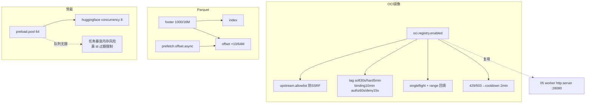

# 08 · Worker 数据格式加速(OCI / Parquet / Preload)

> 场景组:`alluxio.worker.oci.registry.*`(OCI 镜像仓库镜像)+ `alluxio.worker.parquet.*`(Parquet Raw 缓存)+ `alluxio.worker.preload.*`(预载)
> 配置数:**31** · 别名 0 · 废弃 0 · 数据来源:`PropertyKey.java` · 生成表:`_data/gen_table.py 08`

---

## 1. 本组概览

本组是三块**面向特定负载的加速能力**,彼此独立:

| 子场景 | 关键配置 | 用途 |
|---|---|---|
| **OCI 镜像仓库镜像** | `oci.registry.*`(16 项) | worker HTTP 服务上做 OCI Distribution v2 镜像,加速容器镜像拉取(AI/容器场景) |
| **Parquet Raw 缓存** | `parquet.raw.{footer,index,offset}.cache.*` | 缓存 Parquet 元数据(footer/index/offset),加速列式随机读 |
| **预载(preload)** | `preload.data.*`、`preload.huggingface.*` | 主动把数据/模型文件预热到 worker |

多为 `Scope=WORKER`,一致性多为 `—/ENFORCE`。

---

## 2. 配置清单速查表(全量 31 项)

### 2.1 OCI 镜像仓库镜像(oci.registry)
| 配置项 | 默认值 | 类型 | Scope | 一致性 | 说明 |
|---|---|---|---|---|---|
| `alluxio.worker.oci.registry.enabled` | false | boolean | WORKER | — | 在 worker HTTP 服务上启用 OCI v2 镜像(/v2/...) |
| `alluxio.worker.oci.registry.upstream.allowlist` | — | string | WORKER | — | 允许转发的上游 registry 主机白名单(逗号分隔) |
| `alluxio.worker.oci.registry.credential.provider`(见20组) | — | — | — | — | 凭证提供方(在杂项组) |
| `alluxio.worker.oci.registry.persistent.cache.enabled` | false | boolean | WORKER | — | 直接探页存储判命中(而非查内部结构) |
| `alluxio.worker.oci.registry.cache.blacklist.etcd.path` | /alluxio/oci/cache-blacklist/ | string | WORKER | — | etcd 里 cache-bypass 条目的父路径 |
| `alluxio.worker.oci.registry.cache.tag.soft.ttl` | 30sec | duration | WORKER | — | tag→digest 绑定软 TTL(内免上游校验) |
| `alluxio.worker.oci.registry.cache.tag.hard.ttl` | 5min | duration | WORKER | — | tag→digest 绑定硬 TTL(超则走慢路径 GET manifest) |
| `alluxio.worker.oci.registry.cache.binding.ttl` | 10min | duration | WORKER | — | 仓库级对象绑定 + blob 元数据缓存 TTL(两者联动) |
| `alluxio.worker.oci.registry.cache.authz.ttl` | 60sec | duration | WORKER | — | 仓库级授权正向缓存 TTL |
| `alluxio.worker.oci.registry.cache.authz.negative.ttl` | 15sec | duration | WORKER | — | 授权拒绝(deny)缓存 TTL(比正向更短) |
| `alluxio.worker.oci.registry.blob.singleflight.timeout` | 45sec | duration | WORKER | — | blob singleflight 跟随者等 leader 冷拉的上限 |
| `alluxio.worker.oci.registry.blob.stream.timeout` | 60sec | duration | WORKER | — | blob 流单 chunk 写客户端的上限(背压保护) |
| `alluxio.worker.oci.registry.blob.range.prefetch.threads` | 64 | int | WORKER | — | range-miss 触发的后台整 blob 回填并发 |
| `alluxio.worker.oci.registry.blob.range.prefetch.queue` | 128 | int | WORKER | — | range-miss blob 回填池队列容量 |
| `alluxio.worker.oci.registry.upstream.throttle.cooldown` | 2min | duration | WORKER | — | 上游返回 429/503 后的每(registry,repo)冷却期 |

### 2.2 Parquet Raw 缓存
| 配置项 | 默认值 | 类型 | Scope | 一致性 | 说明 |
|---|---|---|---|---|---|
| `<unresolved:WORKER_PARQUET_CACHE_TYPE>` | ONHEAP | enum | SERVER | — | Parquet 缓存类型:ONHEAP/OFFHEAP(footer 恒 on-heap) |
| `<unresolved:WORKER_PARQUET_CACHE_SIZE_TYPE>` | ENTRY | enum | SERVER | — | 缓存容量口径:ENTRY(条目)/MEMSIZE(字节) |
| `alluxio.worker.parquet.raw.footer.cache.size` | 1000 | int | WORKER | ENFORCE | footer 缓存条目数 |
| `alluxio.worker.parquet.raw.footer.cache.mem.size` | 16MiB | dataSize | WORKER | ENFORCE | footer 缓存字节数 |
| `alluxio.worker.parquet.raw.index.cache.size` | =footer条目 | int | WORKER | ENFORCE | index 缓存条目数 |
| `alluxio.worker.parquet.raw.index.cache.mem.size` | 16MiB | dataSize | WORKER | ENFORCE | index 缓存字节数 |
| `alluxio.worker.parquet.raw.offset.cache.size` | =footer条目×10 | int | WORKER | ENFORCE | offset 缓存条目数 |
| `alluxio.worker.parquet.raw.offset.cache.mem.size` | 64MiB | dataSize | WORKER | ENFORCE | offset 缓存字节数 |
| `alluxio.worker.parquet.raw.prefetch.offset` | false | boolean | WORKER | — | 首次访问列时预取该列全部 offset index |
| `alluxio.worker.parquet.raw.prefetch.offset.async` | true | boolean | WORKER | — | offset 预取是否异步 |
| `alluxio.worker.parquet.offset.preload.pool.size` | 8 | int | WORKER | — | Parquet offset 预载线程池 |
| `alluxio.worker.parquet.offset.preload.queue.size` | 500 | int | WORKER | — | Parquet offset 预载队列 |
| `alluxio.worker.parquet.max.object.size` | 5000 | int | WORKER | ENFORCE | Ehcache sizeof 遍历的最大对象图大小 |

### 2.3 预载(preload)
| 配置项 | 默认值 | 类型 | Scope | 一致性 | 说明 |
|---|---|---|---|---|---|
| `alluxio.worker.preload.data.thread.pool.size` | 64 | int | WORKER | IGNORE | 预载数据线程池(每线程载一页) |
| `alluxio.worker.preload.data.thread.pool.queue.capacity` | 无限 | int | WORKER | IGNORE | 预载队列;满则拒绝新任务 |
| `alluxio.worker.preload.task.expiration.ttl` | 10min | duration | WORKER | IGNORE | 预载任务过期 TTL(限制等待队列) |
| `alluxio.worker.preload.huggingface.max.concurrency` | 8 | int | WORKER | IGNORE | 下载单个 HuggingFace 模型文件的最大并发 |

---

## 3. 逐项深度分析(充分细节)

> 本组 31 项分三块独立能力:**OCI 镜像仓库镜像**(16 项,3.1–3.9)→ **Parquet Raw 缓存**(3.10–3.11)→ **预载**(3.12)。核心实现均已翻代码求证,并标注多处"代码 ≠ 官方 description"的偏差(以代码为准)。核心类:`OciRegistryHandler`(~4178 行)、`ParquetStreamer`、`PagedDoraWorker`。

### 3.1 OCI 镜像:总开关、挂载与 off-loop 派发
- **`oci.registry.enabled`(默认 false)**:`HttpServerModule.provideOciRegistryHandler` 是 `@Provides @Singleton`——关则返回 `Optional.empty()`;开则 `new OciRegistryHandler(cacheManager, pageSize, credentialProviders)`,挂到 worker HTTP server([05组](05-worker-s3-gateway.md) :28080)的 Netty pipeline,按 `/v2` 前缀路由(`HttpServerHandler.isOciRegistryPath`)。
- **共享单例**:一个 worker 进程一个 handler,跨所有 Netty channel 共享——保证 Caffeine 缓存跨连接累积。
- **off-loop 派发(关键,AC-7334)**:OCI 请求**不在 Netty I/O event loop 上执行**,而派发到专用池 `OCI_DISPATCH_POOL`(SynchronousQueue,core 16 / max 512),响应再回 event loop 写出;池饱和直接 **503**。原因:`handle()` 会阻塞(singleflight 等待 + 同步上游 I/O),阻塞 I/O 线程会冻结其上所有 keep-alive 连接。
- **`pageSize` 必须与 page store 一致**:handler 用 `WORKER_PAGE_STORE_PAGE_SIZE`,与 [04组](04-worker-page-store.md) 不一致会静默损坏缓存布局。

### 3.2 OCI:SSRF 防护(`upstream.allowlist`)
- **解析**:逗号分隔 → 各项 `trim().toLowerCase` → 不可变 Set;空值 = 允许任意上游(与 description 一致)。
- **校验**:目标 registry 取自 `X-Alluxio-Upstream-Registry` header(OpenResty 前置代理注入)或 `Host`;不在 allowlist → **502 FORBIDDEN_UPSTREAM**。
- **纵深防护**:跨 host 重定向(ACR 307 → Azure Blob CDN)时 `fetchFollowingRedirects` **剥离 `Authorization` header**(防 ACR token 泄露给 blob CDN);`SHARED_CLIENT` 用 `Redirect.NEVER` 手工跟随。
- ⚠️(建议验证):allowlist **只校验初始 registry host,不约束重定向后的 blob CDN host**——靠剥 Authorization 兜底。生产若对出站有严格要求需评估。

### 3.3 OCI:tag→digest 双 TTL 三段逻辑
`mTagBindingCache`(Caffeine,`expireAfterWrite = 硬 TTL`)存 `ResolvedTag`,软 TTL 存在其 `mSoftExpiresAtMillis`。`handleManifest` 三段分支:
1. **软 TTL 内(soft fresh)**:直接用缓存 digest,**不联系上游**(`SOFT_FRESH_HIT`)。默认 30s。
2. **软~硬之间**:发 HEAD(带 `If-None-Match: <上次digest>`)重校验——304/digest 相同 → 刷新软过期、复用(`REVALIDATED_UNCHANGED`);digest 变 → 失效走慢路径(`REVALIDATED_CHANGED`);上游不可达 → 沿用旧 digest 但不延软过期(`REVALIDATE_FAILED_STALE_USED`)。
3. **超硬 TTL(默认 5min)**:Caffeine 已驱逐 → 慢路径 `fetchManifestSingleflight` GET manifest。
- **意义**:软 TTL 内"零上游成本"服务可变 tag(如 `:latest`),软~硬之间用便宜的 HEAD 兜可变性,硬 TTL 保证最终重取。可变 tag 场景需理解软 TTL 窗口内的**陈旧可见性**。

### 3.4 OCI:binding 围栏 + blob 元数据(`binding.ttl` 联动)
- **两缓存共用同一 TTL**(默认 10min):`mRepoBindingCache`(digest↔repo 安全围栏)与 `mBlobMetaCache`(blob 元数据)都 `expireAfterWrite = binding.ttl`。
- **为何联动**:元数据**绝不能比围栏活得久**,否则会在"授权围栏已过期"后仍服务缓存字节。故绑同一 TTL。
- **围栏作用**:只有 `mRepoBindingCache` 存在 `(registry, repo, type, digest)` 绑定时才允许服务缓存内容——per-repo 物理隔离(配合 page store 的 repo-scoped key),防跨 repo 的 digest 复用越权。

### 3.5 OCI:授权正/负缓存(`authz.ttl` / `authz.negative.ttl`)
- **正向** `mRepoAuthzCache`(`expireAfterWrite = authz.ttl`=60s):key = `subject|registry|repo|pull`(subject 为 `anonymous` 或 `token:sha256(token)`,**匿名与认证主体隔离**);miss 时探上游 `GET /v2/<repo>/tags/list?n=1`。
- **负向(deny/not-found)**:该 Caffeine 只有单一 `expireAfterWrite`,负向条目靠 `scheduleNegativeExpiry`——用 `CompletableFuture.delayedExecutor(negative.ttl=15s)` 提前 `invalidate`,让刚获授权的用户不必等满 60s。代码有 `TODO` 提议改用 Caffeine 原生 `expireAfter(Expiry)` 双 TTL。

### 3.6 OCI:etcd blacklist(`cache.blacklist.etcd.path`)—— ⚠️两处 description 偏差
- **机制**:`OciCacheBlacklist` watch etcd 前缀(默认 `/alluxio/oci/cache-blacklist/`),children listener 增删时重建不可变 `Snapshot` 原子发布,读侧无锁。新增 entry 时主动 evict 对应 tag 绑定(不等软 TTL)。
- ⚠️ **纠正 1(High)**:description 说 blacklist "bypass manifest/blob meta 缓存**和 page store**"。**代码实际只 bypass `mTagBindingCache`(tag→digest 绑定)**——manifest body / blob 都是 digest content-addressed,tag 重解析出新 digest 后旧字节仍安全可服务,故不 bypass。运维据 description 误以为能"拉黑清页存储"会判断失误。
- ⚠️ **纠正 2(Low)**:description 说 child key 是 exact-match `<registry>/<repo>`;**实际支持 `:tag`(精确)/`:*`(repo 通配)/ legacy repo 三形态**。

### 3.7 OCI:persistent.cache —— ⚠️description 偏差
- **`persistent.cache.enabled`(默认 false)**:worker 重启后内存缓存(`mBlobMetaCache`)清空,此项让 blob 请求在内存 miss 后**直接探 page store 判命中**:先对上游发一次 HEAD 拿 Content-Length,再**逐页** `hasPageUnsafe(new PageId(fileId, pg))` 扫描将读取的每页,全命中才从缓存服务并回填内存。
- ⚠️ **纠正(Medium)**:description(及字段注释)说通过 **`CacheManager.getUsage`** 判命中,**但代码从不调用 `getUsage`**,实为逐页 `hasPageUnsafe(PageId)`。措辞过时。

### 3.8 OCI:singleflight / stream 背压 / range 回填 / 限流冷却
- **blob singleflight**(`singleflight.timeout`=45s):`ConcurrentHashMap<String, CompletableFuture<Boolean>> mInflightBlobs`;leader `putIfAbsent` 成功者冷拉、完成时 `complete(ok)`;follower `future.get(45s)`——超时 **fall-through** 重入 gate(最多 2 轮),耗尽则 ungated 直连上游(不阻塞)。只 gate "GET+digest+无Range+page store 开"的可缓存子集。manifest 另有独立 singleflight(等待 **60s 硬编码,不可配**)。
- **`blob.stream.timeout`(60s)**:blob 按 256KiB chunk 写 channel,channel 不可写(背压)时等单 chunk 写完的上限,超时视客户端卡死放弃、释放 streamer 线程。另有**硬编码 180s watchdog** 针对上游卡死(区别于客户端背压)。
- **range 回填**(`range.prefetch.threads`=64 / `queue`=128):206 range 响应后后台整 blob GET,逐页写 page store,**SHA-256 校验通过才 commit**(digest-verify-before-commit 完整性围栏);池饱和 → 跳过回填(range 已由上游直服,不影响客户端)。
- **上游限流冷却**(`throttle.cooldown`=2min):`ConcurrentHashMap<registry|repo, 冷却截止ms>`;上游 429/503 时记冷却 = `min(Retry-After, cooldown上限)`(honor Retry-After 但封顶);冷却内直接返本地 429。设 0 禁用。

### 3.9 OCI:凭证 provider 与 page store 落点
- **`alluxio.oci.registry.credential.provider`(默认 `azure-workload-identity`,Scope=ALL)**:SPI(`ServiceLoader<OciCredentialProviderFactory>`)加载,注册两个:`azure-workload-identity`(keyless,Azure Workload Identity → ACR token 交换,配 `oci.registry.azure.{client.id,tenant.id,...}`,见 [12组](12-ufs-backends.md))、`static-token`(用 `oci.registry.static.token`)。**仅在无 client token 的 preload 路径 + Coordinator layout scan 用;serving 路径始终透传 client token**。
- **page store 落点**:blob 字节经 `CacheManager` 落 page store([04组](04-worker-page-store.md));`fileId = UfsFileId.fromUfsPathAndVersion("ociblob://<registry>/<repo>/<digest>", null)`——用 `UfsFileId`(非 StringId)是为了 worker 重启后 `scanFiles()` 重建 FileId 类型兼容(否则重启全 miss)。`(registry,repo,digest)` 为键 → 同 digest 不同 repo 是**不同文件**,repo 边界隔离。
- ⚠️ 源码/description 多处引用的设计文档 `design/Azure-ACR/alluxio_acr_v02_refined_full_design_cn.md` **在仓库中不存在**(悬空引用);现存相关文档仅 `integration/oci-proxy/README.md`。

### 3.10 Parquet Raw 三级缓存(`parquet.raw.*`)
Parquet 读需先读 footer(schema/行组元数据)再按索引定位。本组把三类**元数据**缓存到 worker(实现全在 `ParquetStreamer` 的**进程级 static** Ehcache 3,与 04 组 page store 数据页缓存**完全解耦**):

| 缓存 | Key→Value | 默认容量 |
|---|---|---|
| footer | `path → ParquetMetadata`(schema+全行组元数据) | 1000 条 / 16MiB |
| index | `path → List<String>`(**每行组该列的 max 值列表**) | =footer(1000)/ 16MiB |
| offset | `Pair<path,column> → Map<rowGroup, OffsetIndex>` | footer×10(10000)/ 64MiB |

- **`cache.type`(ONHEAP/OFFHEAP)**:枚举仅 2 值;**footer 恒 on-heap**(含复杂引用对象,off-heap 需序列化,代码无 offheap 分支),`cache.type` 只作用于 index/offset。⚠️ **OFFHEAP 时 index/offset 恒按字节(mem.size),`cache.size.type=ENTRY` 对其无效**(description 未说明该交互)。
- **`cache.size.type`(ENTRY/MEMSIZE)**:全局口径开关,同时决定三缓存按条目还是字节限;OFFHEAP 下对 index/offset 被忽略(见上)。
- **`max.object.size`(5000)**:对应 Ehcache `withDefaultSizeOfMaxObjectGraph`(⚠️ 非 description 说的 per-cache `withSizeOfMaxObjectGraph`,语义等价名不同),仅按字节口径(需 sizeof)时生效。
- ⚠️ **纠正(index 内容)**:description 泛称 "index cache",**实际是每行组该列 `genericGetMax()` 最大值列表**,用于 `findRowGroupIndex` 对其 `binarySearch` 定位行组——**前提是该列已按值排序**,且这是 Alluxio 自建的行组级 max 索引,**不是 Parquet 规范的 Column Index**。
- offset 条目最多(每列每行组一个),故默认容量倍数(footer×10,注释按"每表约 10 列"估)、字节 4 倍(16→64MiB)最大。

### 3.11 Parquet offset 预取(`prefetch.offset` / `.async` / 线程池)
- **`prefetch.offset`(默认 false)**:某列首次访问 cache miss 时,预取**该列全部行组**的 offset index(去重经 `PRELOADING_TASKS`,每列同时一个任务)。
- **`prefetch.offset.async`(默认 true)**:true → 提交 `OFFSET_PRELOAD_POOL` 不阻塞当前读;false → 当前读线程同步预取(读请求等预取完)。
- **`offset.preload.pool.size`(8)/`queue.size`(500)**:`fixedThreadPool`(core=max=8)+ 有界队列;**满时 `CALLER_RUNS`**——预取任务回落到提交线程执行(不丢任务、形成背压),而非拒绝。

### 3.12 预载(`preload.*`)—— ⚠️队列"拒绝"description 偏差
客户端触发([01组](01-client-fs-io.md) `position.reader.preload`)→ gRPC `cacheData` → worker 逐页异步载入 page store。
- **线程池模型**:`preload.data.thread.pool.size`(64)= `BoundedHandoffExecutor` 的 **core=max=64**(直接 handoff + 满则落有界回退队列,**非**普通 `LinkedBlockingQueue`)。
- ⚠️ **纠正(内存风险)**:`queue.capacity` 默认 `Integer.MAX_VALUE` → 回退队列**近乎无限**,description 说的"队列满拒绝新任务"在默认配置下**几乎不触发**。64 线程满后新任务无限入队(每个持 `PageId`+闭包),`mLoadingPages` 同步增长 → 大量/大文件并发预载可致**堆内存膨胀**。
- **`task.expiration.ttl`(10min)**:衡量任务在队列的**等待时长**,出队执行时若 `执行时刻 - 提交时刻 > TTL` 则**跳过执行(丢弃)**——这是给近乎无限队列"box wait queue"的补救,但只在出队时生效、不主动清队,且**仅常规路径有**(HuggingFace chunk 路径无 TTL 过期,建议验证)。
- **"每线程载一页"仅常规路径成立**:常规路径一 task 精确处理一页;HuggingFace 整文件路径把文件切成 `concurrency` 个多页 chunk、一 task 处理一段(多页)——description 措辞不精确。
- **`preload.huggingface.max.concurrency`(8)**:实际并发 = `max(1, min(8, 文件页数))`,按 chunk 切分并发流读;`mConcurrentLoadingHuggingFaceFiles` 保证同一 HF 文件全局只一个整文件预载。HF 走独立 `HuggingFaceUnderFileSystem`(HTTP,非 S3),与 [12组](12-ufs-backends.md) HF 后端是同一模块。
- 预载池**同时服务** position-read 预载与 passive-cache async load。

---

## 4. 配置关联关系图

---

## 5. 典型场景配置组合建议

| 场景 | 推荐组合 | 理由 |
|---|---|---|
| **AI 集群批量拉镜像** | `oci.registry.enabled=true` + `upstream.allowlist=<你的ACR>` | 镜像层就近缓存,减上游拉取 |
| **权限需快速回收** | 调小 `oci.registry.cache.authz.ttl`/`negative.ttl` | 授权变更更快生效 |
| **Presto/Trino 查 Parquet** | 增大 `parquet.raw.*.cache.size`、`prefetch.offset.async=true` | 加速列式随机读 |
| **大模型权重预热** | 调 `preload.huggingface.max.concurrency`、`preload.data.thread.pool.size` | 提升模型文件预热速度 |

---

## 6. 风险与注意事项

1. **OCI 镜像未配 allowlist 的 SSRF 风险**:`enabled=true` 必配 `upstream.allowlist`,否则可被诱导转发到任意主机。
2. **预载队列无限 → 内存风险**:`preload.data.thread.pool.queue.capacity` 默认无限,预载任务暴涨时靠 `task.expiration.ttl` 限制,重负载评估设有限队列。
3. **Parquet 缓存容量口径**:`ENTRY` vs `MEMSIZE` 两种口径别混淆,按实际内存预算选;`ENFORCE` 项需集群一致。
4. **tag 软/硬 TTL 的可见性**:软 TTL 内不校验上游,镜像 tag 被覆盖后在软 TTL 窗口内仍返回旧 digest;对"可变 tag"场景需理解此延迟。
5. **模板名未解析(2)**:`WORKER_PARQUET_CACHE_TYPE`/`CACHE_SIZE_TYPE` 名称走 format 拼接,已按常量归位。

---

## 跨组关联速览
- [05-worker-s3-gateway](05-worker-s3-gateway.md) —— worker HTTP 服务(:28080,OCI 镜像复用)
- [04-worker-page-store](04-worker-page-store.md) —— OCI blob / 预载数据的落点(页存储)
- [01-client-fs-io](01-client-fs-io.md) —— 客户端触发的位置读预载(对照)
- [12-ufs-backends](12-ufs-backends.md) —— HuggingFace UFS 后端
