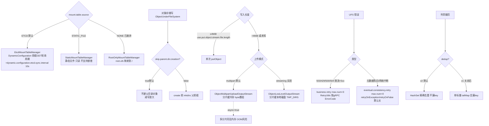

# 10 · UFS 通用行为(挂载 / 元数据 / 一致性)

> 场景组:`alluxio.underfs.*`(通用部分,不含具体后端)+ `alluxio.mount.table.*`
> 配置数:**37** · 别名 3 · 废弃 1 · 数据来源:`PropertyKey.java` · 生成表:`_data/gen_table.py 10`

---

## 1. 本组概览

本组是**所有 UFS 后端共享的通用行为**:挂载表怎么定义、对象存储的通用语义(目录表示、列举去重、multipart 上传)、面对最终一致性/限流的重试、UFS 实例生命周期。具体后端(S3/OSS/HDFS…)的参数见 [11](11-ufs-s3.md)/[12](12-ufs-backends.md)。多为 `Scope=SERVER/MASTER`。

四个子场景:

| 子场景 | 关键配置 | 核心矛盾 |
|---|---|---|
| 挂载表 | `mount.table.source`、`mount.table.root.ufs`、`mount.table.static.conf.file` | 动态(etcd) vs 静态 |
| 对象存储语义 | `object.store.directory.suffix`(见12)、`object.store.breadcrumbs`、`iterative.list.dedup.v2`、`skip.parent.directory.creation` | AWS 兼容 vs 性能 |
| 上传通用 | `object.store.multipart.upload.*`、`streaming.upload.*`、`use.put.object.stream.file.length` | 吞吐 vs 内存/OOM |
| 重试与一致性 | `business.retry.*`、`eventual.consistency.retry.*` | 韧性 vs 延迟 |

---

## 2. 配置清单速查表(全量 37 项)

### 2.1 挂载表(mount table)
| 配置项 | 默认值 | 类型 | Scope | 一致性 | 说明 |
|---|---|---|---|---|---|
| `alluxio.mount.table.source` | ETCD | enum | ALL | WARN | 挂载表来源:ETCD / STATIC |
| `alluxio.mount.table.root.ufs` | ${work}/underFSStorage | string | ALL | ENFORCE | 映射到 Alluxio 根的单一 UFS 地址(别名 dora.client.ufs.root) |
| `alluxio.mount.table.static.conf.file` | — | string | ALL | WARN | 静态挂载表配置文件路径 |
| `alluxio.mount.table.etcd.polling.interval.ms` | 3s | duration | ALL | — | ⚠️已废弃 从 etcd 拉挂载表的间隔 |

### 2.2 对象存储通用语义
| 配置项 | 默认值 | 类型 | Scope | 一致性 | 说明 |
|---|---|---|---|---|---|
| `alluxio.underfs.object.store.breadcrumbs.enabled` | true | boolean | SERVER | WARN | 读/列举时创建 0 字节对象作目录面包屑;关可防写 0 字节对象 |
| `alluxio.underfs.object.store.directory.priority.over.file` | false | boolean | ALL | ENFORCE | 同名文件与目录并存时只显示目录 |
| `alluxio.underfs.object.store.iterative.list.dedup.v2` | true | boolean | SERVER | ENFORCE | 新的迭代列举去重逻辑(修复漏 key 的旧 bug) |
| `alluxio.underfs.object.store.log.object.not.found` | true | boolean | ALL | WARN | 读时对象不存在则记警告 |
| `alluxio.underfs.object.store.mount.shared.publicly` | false | boolean | SERVER | ENFORCE | 对象存储挂载点是否共享给所有用户(HDFS 无效) |
| `alluxio.underfs.object.store.multi.range.chunk.size` | =默认块大小 | dataSize | SERVER | WARN | 多范围对象输入流的 ranged 读默认 chunk |
| `alluxio.underfs.object.store.service.threads` | 20 | int | SERVER | WARN | 并行对象操作(目录改名/删除)线程池 |
| `alluxio.underfs.object.store.skip.parent.directory.creation` | true | boolean | SERVER | WARN | 新文件不建父目录(对象存储用前缀,无需) |
| `alluxio.underfs.object.store.use.put.object.stream.file.length` | 4MiB | dataSize | SERVER | ENFORCE | 写长度≤此值用 putObject 流写 |

### 2.3 上传通用(multipart / streaming)
| 配置项 | 默认值 | 类型 | Scope | 一致性 | 说明 |
|---|---|---|---|---|---|
| `alluxio.underfs.object.store.multipart.upload.async` | false | boolean | SERVER | WARN | 异步上传分片(大文件可能 OOM) |
| `alluxio.underfs.object.store.multipart.upload.timeout` | — | duration | SERVER | ENFORCE | multipart 分片上传超时(有别名) |
| `alluxio.underfs.object.store.streaming.upload.part.timeout` | — | duration | SERVER | ENFORCE | streaming 分片上传超时(有别名) |

### 2.4 重试与最终一致性
| 配置项 | 默认值 | 类型 | Scope | 一致性 | 说明 |
|---|---|---|---|---|---|
| `alluxio.underfs.business.retry.base.sleep` | 50ms | duration | SERVER | WARN | 业务重试指数退避基准 |
| `alluxio.underfs.business.retry.max.sleep` | 30sec | duration | SERVER | WARN | 业务重试退避最大等待 |
| `alluxio.underfs.business.retry.max.num` | 3 | int | SERVER | WARN | 业务重试次数(应对 S3 503/429 限流) |
| `alluxio.underfs.eventual.consistency.retry.base.sleep` | 50ms | duration | SERVER | WARN | 最终一致性重试基准 |
| `alluxio.underfs.eventual.consistency.retry.max.sleep` | 30sec | duration | SERVER | WARN | 最终一致性重试最大等待 |
| `alluxio.underfs.eventual.consistency.retry.max.num` | 0 | int | SERVER | WARN | 最终一致性重试次数(默认 0=不重试) |

### 2.5 生命周期 / 列举 / 校验 / 其它
| 配置项 | 默认值 | 类型 | Scope | 一致性 | 说明 |
|---|---|---|---|---|---|
| `alluxio.underfs.listing.length` | 1000 | int | MASTER | ENFORCE | 单次向 UFS 列举目录项的最大数 |
| `alluxio.underfs.io.threads` | — | int | SERVER | WARN | UFS IO 操作线程数 |
| `alluxio.underfs.outdated.instance.grace.period` | 2min | duration | ALL | WARN | 关闭可能在用的 UFS 实例前的宽限期 |
| `alluxio.underfs.cleanup.enabled` | false | boolean | MASTER | ENFORCE | 周期性清理 UFS(未完成的上传等) |
| `alluxio.underfs.checksum.type` | MD5 | enum | — | — | UFS 校验和类型 |
| `alluxio.underfs.strict.version.match.enabled` | false | boolean | SERVER | ENFORCE | 严格版本匹配选 UFS 连接器(否则前缀匹配) |
| `alluxio.underfs.xattr.change.enabled` | false | boolean | SERVER | ENFORCE | 允许从/向 UFS 读写 xAttr |
| `alluxio.underfs.allow.set.owner.failure` | false | boolean | MASTER | ENFORCE | 允许 UFS 设置 owner 失败(owner 可能不一致) |
| `alluxio.underfs.local.skip.broken.symlinks` | false | boolean | SERVER | ENFORCE | 本地 UFS 列举时把坏符号链接当不存在 |
| `alluxio.underfs.logging.threshold` | 10s | duration | SERVER | IGNORE | UFS API 调用超此时长则记日志 |
| `alluxio.underfs.web.connnection.timeout` | 60s | duration | SERVER | ENFORCE | HTTP 连接默认超时 |
| `alluxio.underfs.persistence.async.temp.dir` | .alluxio_ufs_persistence | string | — | — | UFS 异步持久化临时目录 |
| `alluxio.underfs.virtual.path.supported.schema.prefixes` | virtual,snapshot | list | SERVER | WARN | 虚拟路径支持的 schema 前缀 |
| `alluxio.underfs.version` | 3.4.2 | string | — | — | UFS 版本 |
| `<unresolved:UNDERFS_ATOMIC_WRITE_TEMP_DIR>` | — | string | ALL | WARN | 原子写文件的临时目录 |

---

## 3. 逐项深度分析(充分细节)

> 本组 37 项按配置族逐一深挖:挂载表(ETCD/STATIC_FILE/NONE)→ 对象存储通用语义(基类 `ObjectUnderFileSystem`)→ 列举去重 v1/v2 bug/fix → 两套上传输出流 → 两套重试(business vs eventual consistency)→ UFS 实例生命周期 → UFS 连接器选型(版本匹配)→ 其它元数据/校验/日志。
>
> 核心代码位置:对象存储基类 `dora/core/common/src/main/java/alluxio/underfs/ObjectUnderFileSystem.java`;挂载表 `dora/core/common/src/main/java/alluxio/namespace/*MountTableManager.java`;UFS 实例缓存 `dora/core/server/common/src/main/java/alluxio/underfs/AbstractUfsManager.java`;连接器选型 `dora/core/common/src/main/java/alluxio/underfs/UnderFileSystemFactoryRegistry.java`。

### 3.1 挂载表:ETCD / STATIC_FILE / NONE(`mount.table.*`)

> `mount.table.source` 是 `enum MountTableManager.Type`,枚举 **3 个值**:`ETCD`(默认)、`STATIC_FILE`、`NONE`(已废弃)。工厂 `MountTableManager.create(conf, subscribers)` 按值 new 出不同实现(`dora/core/common/src/main/java/alluxio/namespace/MountTableManager.java`)。
> ⚠️ 注意枚举名是 **`STATIC_FILE`** 而非 `STATIC`;PropertyKey 描述里的 "Available options are ,"(逗号后为空)是文档抓取时反射 `Type.values()` 未加载导致,运行时实际渲染为 `ETCD, STATIC_FILE, NONE`。

#### 枚举全解(3 个值 → 实现类)
| 值 | 状态 | 实现类 | 工厂分支/行为 |
|---|---|---|---|
| `ETCD` | **默认**·现役 | `EtcdMountTableManager`(extends `AbstractMountTableManager`) | 挂载表集中存 etcd,可动态增删改;与成员/哈希环同源([14](14-membership-etcd.md)) |
| `STATIC_FILE` | 现役 | `StaticMountTableManager`(`@Immutable`) | 从 `mount.table.static.conf.file` 加载,**只读**——add/remove/update 全抛 `UnsupportedOperationException` |
| `NONE` | ⚠️废弃·仅测试 | `RootOnlyMountTableManager`(直接 implements 接口) | 把单个 UFS(`mount.table.root.ufs`)映射到根 `/`;工厂打 WARN,类与枚举均 `@Deprecated` |

> 额外装饰:若 `DEBUG_PERFORMANCE_DIAGNOSTICS_ENABLED=true`,上述任一实现被 `PerformanceDiagnosticsMountTableManager` 包一层计时(不改语义,建议验证)。

#### ETCD 加载机制:轮询,而非 push-watch
- 构造时先同步跑一次 `updateMountTable()`(强制首拉)保证首次装载;随后 `DynamicConfiguration.global().watch(this::updateMapAndNotify, MountTableEntity.class)` 注册回调。
- **关键澄清**:这是"伪 watch"。底层没有 etcd 服务端 watch stream,而是 `EtcdDynamicConfiguration` 用 `KVClient` **前缀 GET 全量扫描 + 按 modRevision 判定变更**,定时任务驱动,单线程 `dynamic-config-watcher` 出队触发回调。
- ⚠️ **`mount.table.etcd.polling.interval.ms` 已完全废弃(`@Deprecated`)**:生产代码零引用,设任何值都无效。实际刷新周期改由通用的 **`alluxio.dynamic.configuration.etcd.sync.interval`(默认 10s)** 承载(旧废弃 key 默认为 3s)。写操作(add/remove/update mount)走 `DynamicConfiguration.patch(...)` 的 CAS read-modify-write,返回前已持久化到 etcd。

#### STATIC_FILE 文件格式与校验
- 工厂 `case STATIC_FILE` → `new StaticConfFileProvider(conf).get()`;读 `mount.table.static.conf.file`,未设置直接抛异常。
- 格式:每行 `(alluxioPath  ufsUri  [key=value ...])`,以**一个或多个空白**分隔;`#` 开头或空白行忽略。示例:
  ```
  /ufs1   ufs1://authority/path
  /ufs2   ufs2://authority/path key1=value1 key2=value2
  ```
- 启动期校验(不合法即失败):`parts.length < 2` 报语法错;option 必须 `key=value` 且 `PropertyKey.isValid(key)`;挂载点须以 `/` 开头;**不能挂载根 `/`**;**不支持嵌套挂载**(depth > 1 报错)。

#### `mount.table.root.ufs`(默认 `${work}/underFSStorage`,别名 `alluxio.dora.client.ufs.root`)
- **仅在 `source=NONE` 分支被读取**——doc 声明"effective only when set to NONE"与代码一致;ETCD/STATIC_FILE 分支不使用它。
- `RootOnlyMountTableManager` 把该单一 UFS 映射到 `/`;若地址无 scheme,默认按本地文件系统加 `file://`。NONE 已废弃,仅测试用。

### 3.2 对象存储通用语义(基类 `ObjectUnderFileSystem`)

> S3/GCS/OSS/OBS/COS/TOS/BOS/S3A-V2 等所有对象后端都继承抽象基类 `ObjectUnderFileSystem`。它把对象存储建模为文件系统:"目录"要么是带 folder 后缀的 0 字节标记对象(面包屑),要么从列举的 common prefix 推断。以下语义多数在**基类统一实现**,对所有对象后端一致;`use.put.object.stream.file.length` 和 `multi.range.chunk.size` 例外,在各后端读取。

- **`skip.parent.directory.creation`(默认 `true`,SERVER)**:在 `create(path, options)` 中读取(`ObjectUnderFileSystem` L426-430)。对象存储用前缀模拟目录,不需要真实父目录对象。默认 `true` 时,即便 `CreateOptions.getCreateParent()` 为真也**不调 `mkdirs(parent)`**,省掉每次建文件时多一次 `putObject`。仅当对象存储要求前缀对象存在时才设 `false`。同一守卫也在 S3A/S3A-V2/NAS 各自的 create 路径中重复。

- **`breadcrumbs.enabled`(默认 `true`,SERVER)**:在 `getObjectListingChunkForPath(...)`(L1237-1248)中读取 `mBreadcrumbsEnabled`。当列举返回真实对象/common prefix(说明这是伪目录)时,**懒创建面包屑**:`mkdirsInternal(dir)` → 抽象 `createEmptyObject(folderKey)`(S3A-V2 里是 `putObject` contentLength=0)。
  - **创建守卫**(须全部满足):UFS 非只读 **且** 开关开 **且** 非根 **且** 尚无匹配的 0 字节对象。故 0 字节对象是在**读/列举/isDirectory 路径**上产生的。
  - **关掉的影响**:不再写 0 字节目录标记。目录仍能从 common prefix 逻辑推断出存在,读/列举继续工作;损失的是**列举前缀的效率**(无标记可短路)和纯靠列举产生的空目录不留痕。适合**只读挂载/不污染桶**场景。

- **`iterative.list.dedup.v2`(默认 `true`,SERVER)—— 列举去重的 v1 bug 与 v2 fix**:在内部类 `UfsStatusIterator.updateIterator()`(L1447)分派 `updateIteratorNew()`(v2)或 `updateIteratorLegacy()`(v1)。
  - **为何需要去重**:递归列举时,`populateUfsStatus` 会把对象 key 的 common prefix 合成为伪目录(`dir/a`、`dir/b`、`dir/c` 各自产生前缀 `dir/`)。若这些 key 跨了列举 chunk 边界,`dir/` 会在第 N 个 chunk 尾和第 N+1 个 chunk 头各出现一次——不去重就会重复 emit。
  - **v1(legacy)的 bug**:只记一个高水位标量 `mLastKey`,每收到新 chunk 就用 `tailMap(mLastKey, false)` 丢掉所有 `<= mLastKey` 的项。但**派生出的 `UfsStatus` 子项(剥离到子名、common prefix 折叠成目录后)的排序,与对象存储返回的原始 key 排序并不一致、且跨 chunk 非单调**。后一个 chunk 完全可能出现一个排序**低于** `mLastKey` 的全新子项,`tailMap` 把它当重复无脑丢弃 → **合法、从未见过的 key 悄悄从列举中消失**(即 description 说的"some keys are missing")。根因是把"已 emit"和"排序低于上次末项"这两件不等价的事混为一谈。
  - **v2 的修复**:把标量 `mLastKey` 换成 `HashSet<String> mLastKeys`——**记住上一个 chunk 的全部子 key 集合**;当前 chunk 的某 key **仅当它确实出现在上一个 chunk**(精确 membership 判定)时才移除。既保留了跨边界 common prefix 的真去重,又不再误删仅仅排序偏低的新 key。之所以只比上一个 chunk 就够:对象 key 全局有序,同一 prefix 的所有 key 连续,至多跨一个边界。
  - ⚠️ **保持开启**,关掉会退回有漏 key 的 v1 逻辑。

- **`directory.priority.over.file`(默认 `false`,ALL,静态字段 `DIRECTORY_OVER_SAME_NAME_FILE`)**:对象存储可能出现同名文件与目录并存。开启后两处生效:(a) `getStatus` 先试 `getDirectoryStatus`,仅 `FileNotFoundException` 时才回退到文件(L609-630);(b) 列举 `populateUfsStatus` 中,若某子名已作为文件存在,则用目录条目覆盖之、隐藏文件(L1335-1343)。默认 `false` 时保留先入的条目。

- **`use.put.object.stream.file.length`(默认 `4MiB`,ENFORCE,SERVER)**:在各后端 create 路径读取(如 `S3AV2UnderFileSystem.createObjectInternal` L1353-1363)。当写入长度已知且 **≤ 4MiB** 时,走单次 `PutObjectStream`(一次 `putObject`),避开 multipart 的初始化/合并开销;超过阈值(或长度未知)才落到 streaming/multipart/transfer-manager 上传。

- **`multi.range.chunk.size`(默认 `= ${user.block.size.bytes.default}`,SERVER)**:抽象输入流 `MultiRangeObjectInputStream` 的 ranged 读粒度;各后端 InputStream(OSS/OBS/COS/TOS/BOS/S3)继承并在 `openObject` 传入。`openStream()` 不为整对象开一个 HTTP range,而是**按 chunk 边界对齐开 range**(`endPos = mPos + chunkSize - mPos % chunkSize`),读满 chunk 就 `closeStreamIfBoundary()` 关流、下次读再开下一 chunk。好处:每个 ranged GET 至多一个 chunk,读者可提前停止而不必读到 block 末尾。`<= 0` 抛错。

- **`object.store.service.threads`(默认 `20`,SERVER)**:基类构造弹性线程池 `UFS/object-service`(medium 队列,`CALLER_RUNS` 拒绝策略)。由 `OperationBuffer` 机制使用:**`DeleteBuffer`**(批量 `deleteObjects`,驱动递归 `deleteDirectory`)与 **`RenameBuffer`**(目录改名时并行逐文件 `copyObject`)。即并行化目录删除/改名。

- **`log.object.not.found`(默认 `true`,ALL,静态 `LOG_OBJECT_NOT_FOUND`)**:纯日志级别开关。`getStatus` 遇对象不存在时,`true`→WARN,`false`→DEBUG;行为不变。

- **`mount.shared.publicly`(默认 `false`,SERVER)**:在 **Security Server** 的 `DefaultSecurityServer.getRootMountInfo` 读取,且**受 `isObjectStorage()` 门控**——只对对象存储 UFS 为真(`ObjectUnderFileSystem.isObjectStorage()` 返回 true),HDFS/本地恒 false(故 doc 说"对 HDFS/local 无效")。为真时根挂载以 `MountPOptions.setShared(true)` 创建,使挂载对所有 Alluxio 用户可见/可访问(公开共享),否则仅限挂载用户。

### 3.3 上传通用:两套输出流 + 内存/OOM 风险(`multipart/streaming.upload.*`)

对象存储写有**两套不同的输出流基类**,关键差异在**分片数据缓在哪**:

| 基类 | 分片缓存位置 | 对应超时 key | 子类 / 触发 |
|---|---|---|---|
| `ObjectMultipartUploadOutputStream` | **内存** `byte[]`(取自 `SoftReferenceBufferPool`) | `multipart.upload.timeout` | S3A/S3A-V2/OSS/OBS/COS/BOS/GCS/TOS;S3A 默认走此路(`s3.multipart.upload.enabled=true`) |
| `ObjectLowLevelOutputStream`(streaming,实验) | **本地磁盘临时文件**(`TMP_DIRS`) | `streaming.upload.part.timeout` | S3A/S3A-V2/OSS/OBS;需 `s3.streaming.upload.enabled=true`(默认 false) |

- **`multipart.upload.async`(默认 `false`,SERVER)—— OOM 机理**:在 `ObjectMultipartUploadOutputStream.uploadPart(byte[]...)`(L372-413)读取 `mUploadPartAsync`。
  - `true`:每个 part 的完整 `byte[]` 提交给线程池成 `ListenableFuture`,写线程**不阻塞**、立刻分配下一个 buffer——**多个 part 完整缓冲同时驻留内存**;`buf` 只在 callable `finally` 里 `releaseBuffer` 释放,即上传完成后才释放。`close/flush` 里 `waitForAllPartsUpload()` join 所有 future。
  - `false`(默认):`callable.call()` 内联同步上传,单个 part 上传释放后才分配下一个,**内存至多约一个 part**。
  - **为何 OOM**:峰值内存 ≈ (在途 part 数) × part 大小(S3 默认 16MiB);网络慢于写入时在途 part 堆积、内存不受上传延迟约束。有部分护栏 `SoftReferenceBufferPool`(S3A 由 `s3.multipart.upload.buffer.number` 决定,默认 64),`allocateBuffer()` 会阻塞封顶并发 buffer;但**该值 ≤ 0 表示无限** → 真无界 → OOM。故大文件场景默认关。

- **`multipart.upload.timeout`(无默认,ENFORCE)/ `streaming.upload.part.timeout`(无默认,ENFORCE)**:两者机制相同——分别在各自基类 `waitForAllPartsUpload()` 里 `future.get(timeout, MS)` 等待每个 part;超时则取消所有 future、`abortMultiPartUpload()` 并抛异常。**未设置(默认)时 `future.get()` 无限等待**(字段为 null)。两 key 各作用于自己的输出流家族,不通用。各后端更细的 part.size / buffer.number 在 [12组](12-ufs-backends.md)。

### 3.4 两套重试:business retry vs eventual consistency retry

> 两族都在 `ObjectUnderFileSystem` 构建,**都用同一策略类 `ExponentialBackoffRetry`(extends `SleepingRetry`)**,仅喂入的三个 key 不同。`SleepingRetry.attempt()` 首次不 sleep,循环条件 `attemptCount <= maxRetries`——故 **`max.num=N` = 1 次初试 + N 次重试 = N+1 次总尝试;`max.num=0` = 恰好 1 次、零重试(等于关闭)**。

| 维度 | business retry | eventual consistency retry |
|---|---|---|
| 配置 | `business.retry.*`(base 50ms / max 30s / **max.num=3**) | `eventual.consistency.retry.*`(base 50ms / max 30s / **max.num=0**) |
| 构建方法 | `getBusinessRetryPolicy()`(protected) | `getRetryPolicy()`(private) |
| 重试循环 | `RetryUtils.retry` / `retryCallable` | `ObjectUnderFileSystem.retryOnException` / `retryOnFalse` |
| 触发条件 | 异常携带**可重试 gRPC ErrorCode**:`UNAVAILABLE`/`RESOURCE_EXHAUSTED`/`INTERNAL`/`DEADLINE_EXCEEDED`/`UNKNOWN` | op **抛网络类 IOException**(`EOFException`/`UnknownHostException`/`ConnectTimeoutException`/`SocketException`)**或返回 `false` |
| 对应 HTTP | S3 **503**(SlowDown/ServiceUnavailable)→UNAVAILABLE;**429**(TooManyRequests)→default UNKNOWN;500→INTERNAL;504→DEADLINE_EXCEEDED(均可重试);400/401/403/404/409/412 不重试 | 元数据未达预期(写后 GET/list/delete/rename 尚未反映)/ 瞬态网络中断 |
| 应对 | **服务端限流 + 瞬态 5xx**(S3 SlowDown / 限流) | **最终一致性下的元数据陈旧** |
| 默认启用 | 是(3 次) | 否(0 次 = 单次尝试) |

- **business retry**:通过 `RetryUtils.retry(...)` 包裹**几乎每一次 cloud SDK 调用**(putObject/getObjectTags/初始化/上传/完成/中止 multipart/rename/list)以及各上传输出流的 part 调用——S3A/S3A-V2 就有 48 处 `getBusinessRetryPolicy()` 传入,OSS/OBS/COS/BOS/GCS/TOS 亦然。S3 状态→ErrorCode 映射在 `AlluxioS3Exception.httpStatusToGrpcStatus`。这是**保护作业不被 UFS 限流打断的关键**;频繁限流的生产环境可适度增大 `business.retry.max.num` 与 `max.sleep`。
- **eventual consistency retry**:仅由基类 `retryOnException`(op 抛异常时经 `handleRetriablException` 过滤仅网络类才重试,其余立即 rethrow)与 `retryOnFalse`(op 返回 false 时重试)两个循环使用,包裹 create/delete/rename/getStatus/isDirectory/open 等高层元数据与读操作。**默认 `max.num=0`**——因现代对象存储(AWS S3 自 2020-12 起强读后写一致)已强一致,该元数据重试成为死代码而默认关闭;仍是最终一致的老/兼容对象存储应设 >0。注意两族**正交**:一致性重试关掉,限流重试(business)仍开。

### 3.5 UFS 实例生命周期与并发关闭(`outdated.instance.grace.period`)

- **UFS 实例缓存**:`AbstractUfsManager`(implements `UfsManager`、`MountTableSubscriber`)用 `ConcurrentHashMap<Key, UnderFileSystem>` 缓存实例(key = scheme+authority+path),`getOrAdd()`/`add()` 创建或复用。
- **`outdated.instance.grace.period`(默认 `2min`,ALL)**:当某挂载点的 options 变更(`receiveUpdateEvent`),`compute(...)` 先原子地把缓存中的 UFS 换成新建实例,再把**旧实例的 `close()` 延迟 `grace.period` 后**调度到单线程 `mOutdatedUfsCleaner` 执行。宽限窗口让仍持有旧实例引用的在途操作先做完,再销毁其连接/线程池。
  - ⚠️ **这是基于时间、而非引用计数的尽力而为窗口**(代码有 `TODO(binfan)` 待补 refcount)。**若宽限期短于最长在途操作**,旧实例被提前关闭 → 该操作命中"连接已关闭"类 `IOException`/`IllegalStateException`。生产建议保持默认或按最慢 UFS 操作上调。

### 3.6 UFS 连接器选型:版本匹配(`strict.version.match.enabled` + `version`)

- 连接器选型在 `UnderFileSystemFactoryRegistry.findAllWithRecorder(path, conf, recorder)`;`find()` 取候选列表 `get(0)` 为最终连接器。
- **`version`(默认 `3.4.2`)+ 默认(非严格)匹配**:各工厂 `supportsPath` 自行按前缀/模式判定。HDFS 例:未由用户设置 `version` 则通过,否则走 `HdfsVersion.matches(configured, factoryVersion)`——两串完全相等,**或**都能经正则解析到同一 `HdfsVersion` 枚举即通过(如 `3.4.2` 与 `hadoop-3.4` 都映射到 `HADOOP_3_4`)。这就是"前缀/版本族匹配"。
- **`strict.version.match.enabled`(默认 `false`,ENFORCE,SERVER)**:为 `true` 且 `version` 已设置时,遍历候选工厂并**移除任何 `factory.getVersion()` 不与配置值精确 `.equals()` 相等的工厂**(L121-130)。默认 false 时不做此严格过滤,交由前缀匹配。适用于同一 UFS 类型有多版本连接器共存、需锁定精确版本的场景。

### 3.7 元数据 / 校验 / xAttr / 其它

- **`listing.length`(默认 `1000`,MASTER)**:单次向 UFS 列举目录项的上限。`ObjectUnderFileSystem.getListingChunkLength` 取 `min(该值, 每 UFS 上限)`;`listInternal` 循环 `while (chunk != null) { populateUfsStatus; chunk = getNextChunk(); }`,每次 `getNextChunk()` 发一次分页列举(续传 token),超过该值的大目录触发多次查询。该值也复用为 delete 批大小。调大减少往返、增单次内存/延迟。

- **`checksum.type`(枚举 `ChecksumType`,默认 `MD5`)—— 枚举仅 2 值:`CRC32C`、`MD5`**。用于 UFS 侧校验和计算:HDFS 里 `CRC32C` → 设 Hadoop `dfs.checksum.combine.mode=COMPOSITE_CRC`,否则用 HDFS 默认(MD5-of-CRCs);GCS 里 `MD5` → 用 `blob.getMd5()`,否则 `blob.getCrc32c()`,写入 `ObjectStatus` 校验和参与 fingerprint/一致性判定。(注:shell 的 `checksum` 命令是客户端侧另一路径,不直接读此 key。)

- **`xattr.change.enabled`(默认 `false`,SERVER)**:允许从/向 UFS 读写扩展属性。worker `PagedDoraWorker.setAttribute` 守卫 `if (mXAttrWriteToUFSEnabled || options.getForceUpdateXAttr()) { XattrUtils.setXattrInUfs(...) }`。**不同 UFS 实现不同**:HDFS → `hdfs.setXAttr("user."+name, value)`(user 命名空间);对象存储 → 映射为**对象/桶 tagging**(`setObjectTagging`/`setBucketTagging`)。默认关,开启后 xAttr 才会落 UFS。

- **`allow.set.owner.failure`(默认 `false`,MASTER)**:各 UFS 的 `setOwner` 抛 `IOException` 时,`false`→rethrow(setOwner 失败即失败);`true`→吞掉并 WARN,于是 **Alluxio 与 UFS 的 owner/group 可能不一致**(HDFS `HdfsUnderFileSystem.setOwner`、本地 `LocalUnderFileSystem.setOwner` 均按此模式)。

- **`local.skip.broken.symlinks`(默认 `false`,SERVER)**:本地 UFS `LocalUnderFileSystem.listStatus` 在为 `true` 时用 `file.listFiles(File::exists)`,坏符号链接(目标缺失)因 `exists()` 为 false 被过滤——当作不存在;`false` 时用普通 `listFiles()`。列举含悬空软链的本地目录时启用可避免报错。

- **`logging.threshold`(默认 `10s`,IGNORE,SERVER)**:装饰器 `UnderFileSystemWithLogging` 包裹**每一个** UFS API 调用;`call(...)` 计时,若耗时 `>= mLoggingThreshold` 则 WARN 记方法名/耗时/阈值(成功与异常路径都记)。用于定位慢 UFS 操作。

- **`persistence.async.temp.dir`(默认 `.alluxio_ufs_persistence`)**:UFS 异步持久化临时目录。`PathUtils.getPersistentTmpPath` 在此目录下生成带时间戳/UUID 的唯一临时路径,写完再 rename 到目标,实现写-改名原子性。

- **`atomic.write.temp.dir`(属性名 `alluxio.underfs.atomic.write.temp.dir`,无默认,ALL;`Name` 字段 `private`,故清单里显示为 `<unresolved>`)**:`AtomicFileOutputStream.getTempFilePathFromConf` 读取——已设置则写到 `<tempDir>/alluxio_atomic_write_temp/<date>/<file>-<uuid>`,`close()` 时原子 rename 到目标(`renameFileOverwrite`);未设置则用目标旁的内联临时文件。rename 完成前目标处不可见。

- **`virtual.path.supported.schema.prefixes`(默认 `virtual,snapshot`,list,SERVER)**:`VirtualPathMappingUnderFileSystemFactory.supportsPathInternal` 遍历前缀,路径以任一前缀开头则由虚拟路径 UFS 接管(再委派到真实 UFS 做路径映射)。这是 virtual/snapshot UFS 的 SPI 选型门。

- **⚠️ 三个"死配置"(DORA 代码中未被读取,疑为遗留)**——设置它们**当前不产生任何效果**(建议验证):
  - **`io.threads`**(默认 `max(4, 3×CPU)`):全仓无任何读取点;DORA 未据此建 UFS IO 线程池。
  - **`cleanup.enabled`**(默认 false,MASTER):无 `getBoolean/isSet` 读取;仅出现在两个上传流的 Javadoc 与一处"abort 失败可开启周期清理"的日志提示中。真正的中止残留 multipart 清理由各 UFS 的 `cleanup()`(如 S3A 按 `s3.intermediate.upload.clean.age` 中止过期 upload)承担,但**未发现 leader master 的周期调度**去调用它——description 里"leader master 启动或到 cleanup 间隔时清理"反映的是本代码库不存在的旧 master 行为。
  - **`web.connnection.timeout`**(默认 60s,SERVER):无任何读取点;且**属性名本身有拼写错误**——"connnection" 三个 n(`alluxio.underfs.web.connnection.timeout`)。无活跃的 web/http UFS 消费它。

---

## 4. 配置关联关系图



---

## 5. 典型场景配置组合建议

| 场景 | 推荐组合 | 理由 |
|---|---|---|
| **S3 频繁限流(429/503)** | 增大 `business.retry.max.num`/`max.sleep`(注意 max.num=N → N+1 次尝试) | 提升对限流的韧性,退避封顶 30s |
| **只读挂载、不污染桶** | `object.store.breadcrumbs.enabled=false`(只读 UFS 本就不建面包屑,显式关更保险) | 避免读/列举时写 0 字节目录标记 |
| **老/兼容对象存储(最终一致)** | `eventual.consistency.retry.max.num>0` | 现代 S3 强一致默认 0;老后端需容忍写后读延迟 |
| **大文件写(内存受限)** | `multipart.upload.async=false`(默认);若开 async 务必设 `s3.multipart.upload.buffer.number>0` 封顶 | 防多分片同驻内存 OOM;buffer.number≤0=无界 |
| **磁盘富余、内存紧张的大写** | streaming upload(`s3.streaming.upload.enabled=true`,分片缓磁盘)+ `streaming.upload.part.timeout` | 分片落 TMP_DIRS 而非内存,规避 OOM(实验特性) |
| **动态多挂载** | `mount.table.source=ETCD` | 集中动态管理;刷新周期由 `dynamic.configuration.etcd.sync.interval` 控制 |
| **固定挂载、无 etcd 依赖** | `mount.table.source=STATIC_FILE` + `mount.table.static.conf.file` | 本地文件定义,只读、启动期校验;不支持嵌套挂载 |
| **列举正确性(勿漏 key)** | `iterative.list.dedup.v2=true`(默认) | v1 用单标量水位会漏合法 key |
| **多版本连接器共存需锁版本** | `strict.version.match.enabled=true` + `version` | 精确 `.equals` 过滤连接器,禁用前缀匹配 |
| **慢 UFS 排查** | 调低 `logging.threshold`(默认 10s) | 慢于阈值的 UFS 调用打 WARN,便于定位 |
| **含悬空软链的本地 UFS** | `local.skip.broken.symlinks=true` | 列举时把坏符号链接当不存在,避免报错 |

---

## 6. 风险与注意事项

1. **`multipart.upload.async=true` 的 OOM**:每个在途 part 的完整 `byte[]`(S3 默认 16MiB)同驻内存,`buf` 上传完成才释放;峰值 ≈ 在途 part 数 × part 大小,不受上传延迟约束。护栏 `s3.multipart.upload.buffer.number`(默认 64)封顶,但 **≤ 0 即无界**。默认关是安全考虑;内存紧张的大写考虑改用 streaming(磁盘缓冲)。
2. **关 `iterative.list.dedup.v2` 的漏 key**:v1 用单标量 `mLastKey` + `tailMap` 去重,会把排序低于上次末项的**全新** key 误删——合法 key 从列举中消失。v2 用 `HashSet` 精确去重修复。**勿关**。
3. **`eventual.consistency.retry` 默认 0(=单次尝试,零重试)**:`max.num=N` 语义是 1 次初试 + N 次重试。若后端仍是最终一致,写后读可能失败,须设 >0。与 business retry 正交(它默认 3 次仍开)。
4. **`breadcrumbs`/`skip.parent.directory.creation` 改变桶内容**:两者控制对象存储里 0 字节目录标记的产生;改动会改变桶内实际对象,与外部直接访问该桶的系统需协调。breadcrumb 仅在 UFS 非只读 + 开关开 + 非根 + 无同名 0 字节对象时创建。
5. **`outdated.instance.grace.period` 是尽力而为、非引用计数**:挂载 options 变更后旧 UFS 实例延迟该时长再关(默认 2min)。若短于最长在途操作,旧实例被提前 close → "连接已关闭"类异常。代码有 `TODO` 待补 refcount,当前非硬保证。
6. **`allow.set.owner.failure=true` 导致 owner 漂移**:setOwner 失败被吞掉仅 WARN,Alluxio 与 UFS 的 owner/group 会不一致。
7. **`mount.table.etcd.polling.interval.ms` 已废弃且无效**:ETCD 刷新改由 `dynamic.configuration.etcd.sync.interval`(默认 10s)驱动,且是前缀 GET 轮询而非服务端 push-watch。
8. **⚠️ 三个死配置(设了当前不生效,建议验证)**:`io.threads`(无读取点)、`cleanup.enabled`(无调度器调用 `ufs.cleanup()`)、`web.connnection.timeout`(无读取点 + 属性名拼写为三个 n 的 "connnection")。均疑为遗留,勿依赖。
9. **枚举名 `STATIC_FILE` 而非 `STATIC`;`NONE` 已废弃仅测试**:配置 `mount.table.source` 时用准确枚举值;生产用 ETCD 或 STATIC_FILE。
10. **多为 `ENFORCE`**:挂载/对象语义/上传/版本匹配类多需全集群一致(见速查表一致性列)。

---

## 跨组关联速览
- [11-ufs-s3](11-ufs-s3.md) —— S3 后端具体参数(AssumeRole/凭证/端点)
- [12-ufs-backends](12-ufs-backends.md) —— 各后端 multipart/凭证/超时
- [04-worker-page-store](04-worker-page-store.md) —— UFS 输入流缓存/读限流
- [13-coordinator-master](13-coordinator-master.md) —— 挂载表/元数据同步的服务端处理
