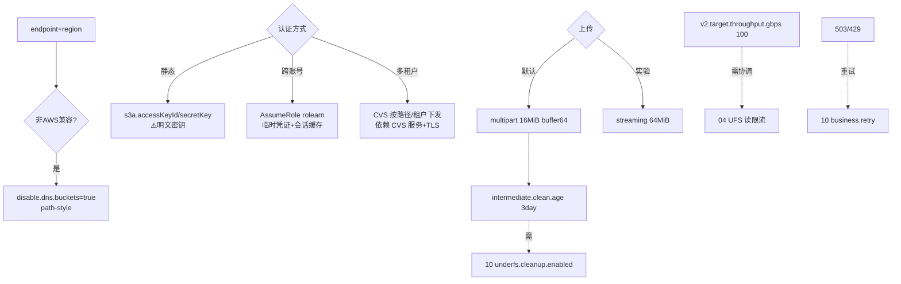

# 11 · UFS S3 / 对象存储后端

> 场景组:`alluxio.underfs.s3.*` + `s3a.*` / `aws.*`(凭证)
> 配置数:**74** · 别名 21 · 废弃 0 · 数据来源:`PropertyKey.java` · 生成表:`_data/gen_table.py 11`

---

## 1. 本组概览

S3 是最常用的 UFS 后端。本组决定 Alluxio 如何连接、认证、读写 AWS S3(及兼容对象存储)。全部 `Scope=SERVER/ALL`(服务端 worker/master 访问 UFS)。**大量别名(21)**——历史 `s3a.*` 前缀迁移到 `s3.*`。

五个子场景:

| 子场景 | 关键配置 | 核心矛盾 |
|---|---|---|
| 连接与端点 | `endpoint`、`region`、`disable.dns.buckets`、`connections.max`、`*.timeout` | 就近/兼容 vs 稳定 |
| 认证:静态密钥 | `s3a.accessKeyId`、`s3a.secretKey`、`credential.provider.class` | 简单 vs 安全 |
| 认证:AssumeRole | `assumerole.*`(18 项) | 临时凭证/多租户 vs 复杂度 |
| 认证:凭证分发(CVS) | `credential.vending.*`(18 项) | 按路径/租户隔离 vs 依赖服务 |
| 上传与 SDK | `multipart.upload.*`、`streaming.upload.*`、`sdk.version`、`v2.async.client.type` | 吞吐 vs 内存 |

---

## 2. 配置清单速查表(全量 74 项)

### 2.1 连接、端点与区域
| 配置项 | 默认值 | 类型 | Scope | 一致性 | 说明 |
|---|---|---|---|---|---|
| `alluxio.underfs.s3.endpoint` | — | string | SERVER | ENFORCE | 区域端点(降延迟/跨区访问) |
| `alluxio.underfs.s3.endpoint.region` | — | string | SERVER | ENFORCE | 端点区域(不设则从 endpoint 推断) |
| `alluxio.underfs.s3.region` | — | string | SERVER | ENFORCE | 桶区域(不设则启用全局桶访问+额外请求) |
| `alluxio.underfs.s3.disable.dns.buckets` | false | boolean | SERVER | ENFORCE | 全部走 path-style 请求 |
| `alluxio.underfs.s3.force.global.bucket.access.enabled` | false | boolean | SERVER | ENFORCE | 全局桶访问(仅当 region/endpoint 未配时) |
| `alluxio.underfs.s3.connections.max` | 1024 | int | SERVER | WARN | 最大并发连接(别名 threads.max) |
| `alluxio.underfs.s3.connection.timeout` | 50sec | duration | SERVER | WARN | 连接 S3 超时(别名 ...timeout.ms) |
| `alluxio.underfs.s3.connection.ttl` | -1 | duration | SERVER | WARN | 连接过期时间;-1 永不过期 |
| `alluxio.underfs.s3.socket.timeout` | 50sec | duration | SERVER | WARN | socket 超时(别名 s3a.socket.timeout) |
| `alluxio.underfs.s3.request.timeout` | 1min | duration | SERVER | WARN | 单请求超时;0=无限(别名 s3a.request.timeout) |
| `alluxio.underfs.s3.max.error.retry` | — | int | SERVER | WARN | 失败请求最大重试(覆盖 SDK 默认,别名 s3a) |
| `alluxio.underfs.s3.proxy.host` | — | string | SERVER | ENFORCE | S3 代理主机 |
| `alluxio.underfs.s3.proxy.port` | — | int | SERVER | ENFORCE | S3 代理端口 |
| `alluxio.underfs.s3.secure.http.enabled` | true | boolean | SERVER | ENFORCE | HTTPS 通信(别名 s3a) |
| `alluxio.underfs.s3.secure.http.trust.all.certs` | false | boolean | SERVER | ENFORCE | HTTPS 时信任所有证书 |
| `alluxio.underfs.s3.admin.threads.max` | 20 | int | SERVER | WARN | 元数据操作最大线程 |
| `alluxio.underfs.s3.upload.threads.max` | 20 | int | SERVER | WARN | multipart 上传最大线程 |

### 2.2 认证:静态密钥与凭证提供方
| 配置项 | 默认值 | 类型 | Scope | 一致性 | 说明 |
|---|---|---|---|---|---|
| `s3a.accessKeyId` | — | string | SERVER | ENFORCE | S3 access key(别名 aws.accessKeyId)⚠️敏感 |
| `s3a.secretKey` | — | string | SERVER | ENFORCE | S3 secret key(别名 aws.secretKey)⚠️敏感 |
| `alluxio.underfs.s3.credential.provider.class` | — | enum | SERVER | WARN | 指定凭证提供方 |
| `alluxio.underfs.s3.owner.id.to.username.mapping` | — | string | SERVER | ENFORCE | S3 canonical id→Alluxio 用户名映射 |
| `alluxio.underfs.s3.default.mode` | 0700 | string | SERVER | WARN | mode 无法发现时的默认(别名 s3a) |
| `alluxio.underfs.s3.inherit.acl` | true | boolean | SERVER | ENFORCE | 对象继承桶 ACL(别名 s3a.inherit_acl) |
| `alluxio.underfs.s3.signer.algorithm` | — | string | SERVER | ENFORCE | 请求签名算法(别名 s3a) |
| `alluxio.underfs.s3.server.side.encryption.enabled` | false | boolean | SERVER | ENFORCE | 服务端加密(别名 s3a) |

### 2.3 认证:AssumeRole(临时凭证)
| 配置项 | 默认值 | 类型 | Scope | 一致性 | 说明 |
|---|---|---|---|---|---|
| `alluxio.underfs.s3.assumerole.enabled` | false | boolean | SERVER | WARN | 启用 AssumeRole 切换角色取临时凭证 |
| `alluxio.underfs.s3.assumerole.rolearn` | — | string | SERVER | WARN | 要 assume 的角色 ARN(启用时必填) |
| `alluxio.underfs.s3.assumerole.credential.process` | — | string | SERVER | WARN | 调用外部进程取临时凭证 |
| `alluxio.underfs.s3.assumerole.session.duration.second` | 3600 | int | SERVER | WARN | 角色会话时长(900~角色上限) |
| `alluxio.underfs.s3.assumerole.session.scope` | USER | enum | SERVER | WARN | 会话范围:USER / USER+PATH |
| `alluxio.underfs.s3.assumerole.session.prefix` | alluxio-assume-role | string | SERVER | WARN | 会话名前缀 |
| `alluxio.underfs.s3.assumerole.session.cache.size` | 1000 | int | SERVER | WARN | master 中会话+S3Client 缓存大小 |
| `alluxio.underfs.s3.assumerole.session.cache.duration.threshold` | 45min | duration | SERVER | WARN | 会话时长超此可缓存复用 |
| `alluxio.underfs.s3.assumerole.s3client.cache.duration.threshold` | 30min | duration | SERVER | WARN | S3Client 生命周期超此可缓存 |
| `alluxio.underfs.s3.assumerole.s3client.min.usable.lifetime` | 15min | duration | SERVER | WARN | S3Client 剩余寿命大于此才安全使用 |
| `alluxio.underfs.s3.assumerole.refresh.max.retry.times` | 10 | int | SERVER | WARN | 刷新会话令牌最大重试 |
| `alluxio.underfs.s3.assumerole.refresh.sleep.base.ms` | 100ms | duration | SERVER | WARN | 刷新令牌重试基准 |
| `alluxio.underfs.s3.assumerole.refresh.sleep.max.ms` | 1sec | duration | SERVER | WARN | 刷新令牌重试最大等待 |
| `alluxio.underfs.s3.assumerole.throttling.max.retry.time` | 30sec | duration | MASTER | WARN | AssumeRole 被限流时最大等待 |
| `alluxio.underfs.s3.assumerole.https.enabled` | true | boolean | SERVER | WARN | 与 STS 通信用 HTTPS |
| `alluxio.underfs.s3.assumerole.proxy.host` | — | duration | SERVER | WARN | STS 通信代理主机 |
| `alluxio.underfs.s3.assumerole.proxy.port` | — | int | SERVER | WARN | STS 通信代理端口 |
| `alluxio.underfs.s3.assumerole.proxy.https.enabled` | true | boolean | SERVER | WARN | STS 代理用 HTTPS |

### 2.4 认证:凭证分发服务(Credential Vending Service, CVS)
| 配置项 | 默认值 | 类型 | Scope | 一致性 | 说明 |
|---|---|---|---|---|---|
| `alluxio.underfs.s3.credential.vending.enabled` | false | boolean | ALL | WARN | 按 S3 路径/租户申请不同临时凭证 |
| `alluxio.underfs.s3.credential.vending.rpc.addresses` | — | list | ALL | WARN | CVS 的 host:port RPC 地址列表 |
| `alluxio.underfs.s3.credential.vending.cache.size` | 2048 | int | ALL | — | 凭证缓存总大小 |
| `alluxio.underfs.s3.credential.vending.client.pool.size.max` | 500 | int | SERVER | WARN | CVS 客户端池最大 |
| `alluxio.underfs.s3.credential.vending.client.pool.size.min` | 0 | int | SERVER | WARN | CVS 客户端池最小(长驻建议 0) |
| `alluxio.underfs.s3.credential.vending.execute.threads` | 50 | int | ALL | WARN | 凭证映射执行线程 |
| `alluxio.underfs.s3.credential.vending.service.duration.seconds` | 3600 | string | ALL | WARN | CVS 凭证时长 |
| `alluxio.underfs.s3.credential.vending.service.prerefresh.seconds` | 300 | int | ALL | WARN | CVS 凭证提前刷新时长 |
| `alluxio.underfs.s3.credential.vending.retry.base.sleep` | 10ms | duration | SERVER | WARN | CVS 重试基准 |
| `alluxio.underfs.s3.credential.vending.retry.max.sleep` | 30sec | duration | SERVER | WARN | CVS 重试最大等待 |
| `alluxio.underfs.s3.credential.vending.retry.max.num` | 3 | int | SERVER | WARN | CVS 重试次数 |
| `alluxio.underfs.s3.credential.vending.tls.enabled` | false | boolean | ALL | — | CVS 通信启用 TLS |
| `alluxio.underfs.s3.credential.vending.tls.ca.cert` | — | string | ALL | — | CVS CA 证书 |
| `alluxio.underfs.s3.credential.vending.tls.client.cert` | — | string | ALL | — | CVS 客户端证书 |
| `alluxio.underfs.s3.credential.vending.tls.client.key` | — | string | ALL | — | CVS 客户端密钥 |
| `alluxio.underfs.s3.credential.vending.tls.client.key.password` | — | string | ALL | — | CVS 客户端密钥密码 ⚠️敏感 |
| `alluxio.underfs.s3.credential.vending.tls.client.no.endpoint.identification` | false | boolean | ALL | — | CVS 客户端不做端点校验 |

### 2.5 上传与 SDK
| 配置项 | 默认值 | 类型 | Scope | 一致性 | 说明 |
|---|---|---|---|---|---|
| `alluxio.underfs.s3.multipart.upload.enabled` | true | boolean | SERVER | ENFORCE | 用 multipart 写 S3 |
| `alluxio.underfs.s3.multipart.upload.partition.size` | 16MiB | dataSize | SERVER | WARN | multipart 单分片大小(别名 part.size) |
| `alluxio.underfs.s3.multipart.upload.buffer.number` | 64 | int | SERVER | ENFORCE | multipart 字节数组上限;≤0 无限 |
| `alluxio.underfs.s3.streaming.upload.enabled` | false | boolean | SERVER | ENFORCE | (实验)streaming 上传(别名 s3a) |
| `alluxio.underfs.s3.streaming.upload.partition.size` | 64MiB | dataSize | SERVER | WARN | streaming 单分片大小(别名 s3a) |
| `alluxio.underfs.s3.intermediate.upload.clean.age` | 3day | duration | SERVER | WARN | 未完成上传的周期清理年龄(别名 s3a) |
| `alluxio.underfs.s3.bulk.delete.enabled` | true | boolean | SERVER | ENFORCE | 批量删除(别名 s3a) |
| `alluxio.underfs.s3.list.objects.v1` | false | boolean | SERVER | ENFORCE | 用 v1 List Objects API(别名 s3a) |
| `alluxio.underfs.s3.list.objects.skip.empty.start.after` | true | boolean | SERVER | ENFORCE | ListObjectsV2 空 start-after 时省略该参数(兼容性) |
| `alluxio.underfs.s3.directory.suffix` | / | string | SERVER | ENFORCE | 目录 0 字节对象的后缀(别名 s3a) |
| `alluxio.underfs.s3.get.object.redirect.enabled` | false | boolean | ALL | ENFORCE | GetObject 是否启用重定向 |
| `alluxio.underfs.s3.sdk.version` | =构建常量 | int | SERVER | ENFORCE | AWS S3 SDK 版本 |
| `alluxio.underfs.s3.v2.async.client.type` | CRT | enum | ALL | ENFORCE | v2 异步客户端:NETTY / CRT |
| `alluxio.underfs.s3.v2.target.throughput.gbps` | 100.0 | double | SERVER | ENFORCE | v2 SDK 目标吞吐(Gbps),越高流量越大 |

---

## 3. 逐项深度分析(充分细节)

> 本组 74 项按配置族逐一深挖:SDK 版本选择 → 端点/区域推断 → v2 客户端 NETTY/CRT → HTTP/TLS/代理 → 连接/超时/重试 → **认证三路线(静态 / AssumeRole / CVS)** → 上传 → 列举兼容 → ACL/SSE/签名 → GetObject 重定向。核心实现类:v1 `S3AUnderFileSystem`、v2 `S3AV2UnderFileSystem`(工厂 `supportsPath` 按 SDK 版本互斥选择)。

### 3.1 SDK 版本选择:v1 / v2 互斥
- **`sdk.version`(默认 = 构建注入 `ProjectConstants.S3_UNDERFS_SDK_VERSION`)**:决定用哪套实现。两个工厂的 `supportsPath()` 按此**互斥**接管 `s3://`/`s3a://`:`==2` 走 **v2**(`S3AV2UnderFileSystem`,AWS SDK v2 异步),否则走 **v1**(`S3AUnderFileSystem`,AWS SDK v1 同步 `AmazonS3`)。
- 影响:v1/v2 对同一配置的**映射不同**(见下,时间参数 v1 用毫秒、v2 用 `Duration`);部分特性仅 v2 有(`get.object.redirect`、`v2.*`、`secure.http.trust.all.certs` 的 CRT 分支)。

### 3.2 端点与区域推断(接非 AWS 兼容存储的关键)
- **优先级链**(`createEndpointConfiguration`):`endpoint.region`(显式)> 从 `endpoint` URL 解析 > `region` > 默认 `us-east-1` + 全局桶访问。
- **`endpoint` + `region` 都不设 → 自动启用 global bucket access**(降级 `us-east-1` 并对每个桶多发 HEAD 探区域,慢且刷 WARN)。**生产务必显式设**至少一个。
- **`force.global.bucket.access.enabled`(false)**:仅在**已配 endpoint 或 region 时**才有意义(强制开全局桶访问);都不配时全局访问本就自动开,该标志无关。
- **`disable.dns.buckets=true`(path-style)**:v1 `withPathStyleAccessEnabled`、v2 `forcePathStyle`——MinIO/Ceph RGW 等多不支持 virtual-hosted(`bucket.endpoint`),接私有兼容存储常需开。

### 3.3 v2 客户端类型:NETTY vs CRT(仅 v2)
- **`v2.async.client.type`(默认 `CRT`)**:枚举 `S3ClientType` 仅 `NETTY`/`CRT`。
  - **NETTY**(`NettyNioAsyncHttpClient`):有明确的 `readTimeout`/`writeTimeout`(由 `socket.timeout` 拆分)。
  - **CRT**(AWS 原生 C 运行时,默认):**无 socket read/write 超时**,改用 `connectionHealthConfiguration`(最小吞吐 1B/s + `socket.timeout` 作 `minimumThroughputTimeout`)检测卡死;独有 `targetThroughputInGbps` 与 `trustAllCertificatesEnabled`。
- **`v2.target.throughput.gbps`(100.0,仅 CRT)**:告诉 CRT 目标吞吐,越高调度越激进、占网越多——需与 [04组](04-worker-page-store.md) UFS 读限流协调,防打爆 S3 触发限流。

### 3.4 HTTP / TLS / 代理 / SSE
- **协议**:`secure.http.enabled`(默认 true)或 `server.side.encryption.enabled`(默认 false)任一为真 → HTTPS,否则 HTTP。即**开 SSE 会强制 HTTPS**。
- **`secure.http.trust.all.certs`(false)**:⚠️ 仅 **v2 CRT** 支持,信任所有证书——**中间人风险,仅测试用**。
- **代理**:`proxy.host`/`proxy.port`(v1 `ClientConfiguration`,v2 `ProxyConfiguration`/`S3CrtProxyConfiguration`,scheme 随协议)。
- **`server.side.encryption.enabled`**:PUT 时设 `AES_256_SERVER_SIDE_ENCRYPTION`。

### 3.5 连接、超时与重试
- **`connections.max`(1024)**:v1 `setMaxConnections`,v2 `maxConcurrency`。⚠️ **代码强制 `connections.max ≥ admin.threads.max + upload.threads.max`**,否则自动抬高并 WARN。
- **超时**:`connect.timeout`(50s)/`socket.timeout`(50s)/`request.timeout`(1min)——v1 转毫秒逐一 set;v2-NETTY 把 `socket.timeout` 拆成 read/write,v2-CRT 用吞吐健康检测(见 3.3)且 `connect.ttl`/`request.timeout` 在 v2 基本不用。
- **`max.error.retry`(未设=用 SDK 默认)**:v1 `setMaxErrorRetry` 覆盖 SDK 默认重试;与 [10组](10-ufs-common.md) 的 `business.retry.*`(应用层 503/429 退避)是两层。
- **`admin.threads.max`(20)/`upload.threads.max`(20)**:元数据操作 / multipart 分片上传的线程池。

### 3.6 认证路线①:静态密钥
- **`s3a.accessKeyId`/`s3a.secretKey`(别名 `aws.*`)**:最简单,但**明文长期密钥**——⚠️切勿入库/日志,走密管/环境注入([17组](17-security.md) Secret Store)。
- **`credential.provider.class`**:显式指定 AWS 凭证 provider(如实例元数据、环境变量链)。

### 3.7 认证路线②:AssumeRole(STS 临时凭证)
核心类 `S3AAssumeRoleGenerator` + `S3AClientWithReferenceCount`。**base 凭证 → STS AssumeRole → 会话凭证 → S3Client**:
- **base 凭证优先级**:`assumerole.credential.process`(调外部进程)> 静态密钥 > 无(则无法 assume)。
- **`rolearn`**:要 assume 的角色 ARN(启用必填,但代码无强制非空校验——漏填会运行期失败)。
- **`session.scope`(`UfsCredentialScope`,默认 `USER`)**:枚举仅 `USER`/`USER_PATH`。USER=会话按用户维度隔离;USER_PATH=按(用户,路径)维度(更细,更多 STS 调用)。⚠️ 官方 description 文字有歧义(把默认 USER 写成"per user and path"),以代码 `setDefaultValue(USER)` 为准。
- **三阈值缓存机制**(减少 STS 调用):
  - **token 缓存启用**:仅当 `session.duration.second`(3600) > `session.cache.duration.threshold`(45min=2700s) 才启用,过期时间 = duration − threshold(如 900s)。
  - **token 复用**:缓存 token 剩余寿命 > `s3client.min.usable.lifetime`(15min)才复用。
  - **S3Client 缓存**:`s3client.cache.duration.threshold`(30min)+ 引用计数(`S3AClientWithReferenceCount`);到 `min.usable.lifetime` 触发刷新重建。
- **刷新退避**:`refresh.sleep.base.ms`(100ms)→ `refresh.sleep.max.ms`(1s),最多 `refresh.max.retry.times`(10)。**STS 限流**时最多等 `throttling.max.retry.time`(30s)。
- **STS 通信**:`sts.https.enabled`(true)、`sts.proxy.{host,port,https.enabled}`。

### 3.8 认证路线③:凭证分发服务 CVS(多租户)
**第三条独立路线**(与 AssumeRole 并列非叠加),核心类 `CredentialVendingRefreshTask` / `VendingMapManager` / `CredentialVendingClientPool`:
- **CVS 是独立外部 gRPC 微服务**:Alluxio 经 `rpc.addresses`(host:port 列表)连它;它按 `s3_uri + tenant_id` 下发临时凭证(GetCredentials/RefreshCredentials)。⚠️ 代码当前**每地址一个池,多地址故障转移未见明确实现**(建议验证)。
- **按路径→租户映射**(`VendingMapManager`,正则):从形如 `s3://<bucket>/<prefix>/<tenant-id-dashed>/<db>.db/*` 的路径提取租户(把 `-` 还原为 `/`);每个(tenant, path)一个 `CredentialVendingRefreshTask`。
- **凭证生命周期**(`SessionCredentialHolder.needRefresh`):`VALID`(剩余 > `prerefresh.seconds`=300)直接用 / `EXPIRING_SOON`(剩余 < prerefresh)→ 异步刷新(不阻塞)/ `EXPIRED` → 同步刷新;刷新优先用 RefreshToken,失败则重新 applyForCredential。
- **`service.duration.seconds`(3600)**:向 CVS 申请的凭证时长。**`execute.threads`(50)**:异步刷新线程池。
- **客户端连接池**(`CredentialVendingClientPool` 继承 `DynamicResourcePool`):`client.pool.size.min`(0,长驻建议 0)/`max`(500);重试 `retry.base.sleep`(10ms)/`max.num`(3)/`max.sleep`(30s)。
- **mTLS**(独立于全局 `network.tls`,走 `GrpcNetworkGroup.CVS`):`tls.enabled` + `tls.ca.cert`(必需)+ 可选客户端证书/密钥(`tls.client.cert/key/key.password`)+ `no.endpoint.identification`(禁 hostname 校验)。
- **`cache.size`(2048)**:**仅 v2** 用 Guava Cache 缓存凭证 provider 对象(v1 不用)。

### 3.9 认证选型与互斥
- 代码用 **if-else 链**:`credential.vending.enabled` 优先 → 否则 `assumerole.enabled` → 否则默认凭证(静态/实例元数据)。**不会双重下发**。
- **选型**:单账号简单 → 静态密钥(密管);跨账号 → AssumeRole;多租户强隔离 → CVS。

### 3.10 上传:multipart vs streaming
- **`multipart.upload`(默认开,`partition.size`=16MiB,`buffer.number`=64)**:`S3AMultipartUploadOutputStream` 用 `SoftReferenceBufferPool` 限缓冲数——`buffer.number>0` 最多保留该数量、超出丢弃重分配;`≤0` 无限(GC 驱动)。防多并发上传耗内存。
- **`streaming.upload`(实验,`partition.size`=64MiB)**:`S3ALowLevelOutputStream`,更大粒度、边写边传省本地盘,但**标注实验**,生产优先 multipart。
- **`intermediate.upload.clean.age`(3day)**:`cleanup()` 里 `abortMultipartUploads(cleanBefore)` 清理超龄未完成分片(否则残片持续计费)——需 [10组](10-ufs-common.md) `cleanup.enabled` 才被 Coordinator 周期调用;⚠️ 设太小可能中断进行中的上传。
- **`bulk.delete.enabled`(true)**:删/改名走 `DeleteObjects` 批量而非逐个。

### 3.11 列举与兼容
- **`list.objects.v1`(false)**:默认用 ListObjectsV2;置 true 用 v1 GET Bucket(对接不支持 V2 的老兼容存储)。
- **`list.objects.skip.empty.start.after`(true)**:某些兼容存储(如 Baidu BOS)把**空 start-after** 解释为"重置到前缀开头"导致分页死循环;默认省略空 start-after 规避。
- **`directory.suffix`(`/`)**:目录 0 字节对象后缀。

### 3.12 ACL / SSE / 签名 / GetObject 重定向
- **`inherit.acl`(true)**:从桶 ACL 继承对象 owner/group 权限;`owner.id.to.username.mapping`(`id1=user1;id2=user2`)把 S3 canonical ID 映射为 Alluxio 用户名;`default.mode`(0700)为无法发现权限时的兜底。
- **`signer.algorithm`(未设)**:v1 `setSignerOverride` 覆盖签名算法;v2 不直接支持。
- **`get.object.redirect.enabled`(false,仅 v2)**:某些兼容存储 GetObject 会 307 重定向到临时下载 URL,开启后 v2 用独立 HTTP 客户端跟随,减开销。

---

### 跨组/易混提示
- 所有 `*.secretKey`/`accessKeyId`/CVS `tls.client.key.password` 为**敏感项**,走 [17组](17-security.md) Secret Store。
- 别名 21 项(`s3a.*`→`s3.*`),新部署用 `s3.*` 新名,勿新旧同设。
- 各后端(OSS/OBS/COS/TOS/BOS/GCS)结构类似但**无 AssumeRole/CVS 这套**,见 [12组](12-ufs-backends.md)。

---

## 4. 配置关联关系图

---

## 5. 典型场景配置组合建议

| 场景 | 推荐组合 | 理由 |
|---|---|---|
| **AWS S3 生产** | 显式 `endpoint`+`region`、AssumeRole 或 CVS、`multipart.upload.enabled=true` | 就近 + 安全凭证 + 稳定上传 |
| **MinIO/Ceph 兼容存储** | `endpoint=<私有>`、`disable.dns.buckets=true`、静态密钥(密管注入) | path-style + 兼容认证 |
| **多租户强隔离** | `credential.vending.enabled=true` + TLS | 按路径/租户下发临时凭证 |
| **大规模冷读保护 S3** | 合理 `v2.target.throughput.gbps` + [04]UFS 限流 + [10]business.retry | 防打爆 + 限流韧性 |
| **残留分片治理** | `intermediate.upload.clean.age` + [10]`cleanup.enabled` | 清理未完成上传省成本 |

---

## 6. 风险与注意事项

1. **静态密钥明文**:`s3a.accessKeyId/secretKey`、CVS `tls.client.key.password` 等为敏感项,**严禁入库/日志/明文配置**,走密管注入。
2. **region 未配的额外请求**:不设 region 触发全局桶访问,增延迟——生产显式设。
3. **`streaming.upload` 实验性**:生产优先 multipart。
4. **`v2.target.throughput.gbps` 过高打爆 S3**:与 UFS 读限流协调,避免触发限流/封禁。
5. **别名(21)**:大量 `s3a.*` 旧名 → `s3.*` 新名;新部署用新名,避免新旧同设。
6. **`secure.http.trust.all.certs=true` 的中间人风险**:仅测试环境用,生产用正式 CA。

---

## 跨组关联速览
- [10-ufs-common](10-ufs-common.md) —— 上传通用/重试/清理(S3 共享)
- [12-ufs-backends](12-ufs-backends.md) —— 其它对象存储(OSS/OBS/COS/TOS 结构类似)
- [04-worker-page-store](04-worker-page-store.md) —— UFS 读限流/instream cache
- [17-security](17-security.md) —— 凭证/密钥管理体系
