# 12 · UFS 各存储后端(OSS / GCS / HDFS / OBS / COS / TOS / BOS / CephFS / NAS / ABFS / HuggingFace / ...)

> 场景组:`alluxio.underfs.{oss,gcs,obs,cos,tos,bos,cephfs,hdfs,nas,ozone,seaweedfs,gemini,huggingface}.*` + `fs.{oss,obs,cos,tos,bos,nas,azure,gcs,huggingface}.*` + `alluxio.oci.registry.azure.*`
> 配置数:**143** · 别名 15 · 废弃 0 · 数据来源:`PropertyKey.java` · 生成表:`_data/gen_table.py 12`

---

## 1. 本组概览

本组是**除 S3 外的所有具体 UFS 后端**参数。对象存储类(OSS/OBS/COS/TOS/BOS/GCS)高度同构——都是"multipart 上传 + 连接/超时 + secure http + 凭证";文件系统类(HDFS/CephFS/NAS)各有特性;还有 ABFS(Azure)、HuggingFace(AI 模型)、OCI Azure 凭证等。全部 `Scope=SERVER/ALL`。

| 后端 | 类型 | 项数(约) | 特点 |
|---|---|---|---|
| OSS(阿里云) | 对象存储 | 22 | 通用模式 + STS/ECS RAM Role |
| GCS(谷歌) | 对象存储 | 12 | 通用模式 + 独立重试族 |
| OBS/COS/TOS/BOS | 对象存储 | 各 4~12 | 通用模式(华为/腾讯/火山/百度) |
| CephFS | 分布式FS | 12 | CephX 认证 + mon/mount |
| HDFS | 分布式FS | 11 | 配置文件 + HAR + trash + prefixes |
| NAS | 文件存储 | 4+4 | uid/gid/version/权限 |
| ABFS(Azure) | 对象存储 | 5 | OAuth2/MSI |
| HuggingFace | 模型仓库 | 3+2 | endpoint/token/models |
| OCI Azure | 凭证 | 7 | 镜像镜像的 workload identity |
| Ozone/SeaweedFS/Gemini | 其它 | 各 1 | prefixes/开关 |

---

## 2. 配置清单速查表(全量 143 项,按后端)

### 2.1 对象存储通用模式(OSS / OBS / COS / TOS / BOS / GCS)
> 这些后端参数结构几乎一致,下表按"参数模式"横向对照(`X`=对应后端有此项)。具体默认值见各后端明细。

| 参数模式 | OSS | OBS | COS | TOS | BOS | GCS | 说明 |
|---|:-:|:-:|:-:|:-:|:-:|:-:|---|
| `multipart.upload.enabled` | X | X | X | X | X | X | 是否 multipart 写(默认多为 true) |
| `multipart.upload.part.size`(16MiB) | X | X | X | — | X | X(partition.size) | 分片大小 |
| `multipart.upload.buffer.number`(64) | X | X | X | X | X | X | 字节数组上限,防 OOM |
| `multipart.upload.threads`(20) | X | X | X | X | X | X | 上传线程 |
| `secure.http.enabled` | X | X | X | X | X | — | HTTPS 通信 |
| `connection.max/connect.max`(1024) | X | — | (fs.cos) | X | X | — | 最大连接 |
| `connection.timeout/connect.timeout`(50s) | X | — | (fs.cos) | X | X | — | 连接超时 |
| `socket.timeout/read/write.timeout` | X | — | (fs.cos) | X(read/write) | X | — | socket/读写超时 |
| `streaming.upload.*` | X | X | — | — | — | — | 实验性流式上传 |
| `intermediate.upload.clean.age`(3day) | X | X | — | X | — | — | 清理未完成上传 |

**OSS 明细(阿里云)**:`connection.max`(1024)、`connection.timeout`(50s,别名 .ms)、`connection.ttl`(-1)、`socket.timeout`(50s)、`default.mode`(0700)、`multipart.upload.{enabled,part.size 16MiB,buffer.number 64,threads 20}`、`streaming.upload.{enabled,partition.size 64MiB,threads}`、`intermediate.upload.clean.age`(3day)、`owner.id.to.username.mapping`、`proxy.host/port`、`retry.max`(3)、`secure.http.enabled`(false)、`ecs.ram.role`、`sts.{enabled,ecs.metadata.service.endpoint,token.refresh.interval.ms 30m}`。

**GCS 明细(谷歌)**:`default.mode`(0700)、`directory.suffix`(/)、`multipart.upload.{enabled,partition.size 16MiB,buffer.number 64,threads 20}`、独立**重试族** `retry.{initial.delay 1000,delay.multiplier 2,max 60,max.delay 1min,total.duration 5min,jitter true}`。

**OBS(华为)**:`multipart.upload.{enabled,buffer.number 64,threads 20}`、`streaming.upload.{enabled,partition.size 64MiB,threads}`、`secure.http.enabled`(true)、`intermediate.upload.clean.age`(3day)。
**COS(腾讯)**:`multipart.upload.{enabled,part.size 16MiB,buffer.number 64,threads 20}`、`secure.http.enabled`(false)。
**TOS(火山)**:`connect.{max 1024,timeout 30000,ttl 60000}`、`read.timeout`/`write.timeout`(30000)、`multipart.upload.*`、`retry.max`(3)、`secure.http.enabled`、`intermediate.upload.clean.age`。
**BOS(百度)**:`connect.timeout`(50s)、`connection.max`(1024)、`disable.dns.bucket`、`io.threads.num`(256)、`multipart.upload.*`、`secure.http.enabled`(false)、`socket.timeout`(50s)。

### 2.2 对象存储凭证(fs.* 前缀)
| 配置项 | 默认值 | Scope | 说明 |
|---|---|---|---|
| `fs.oss.accessKeyId` / `fs.oss.accessKeySecret` / `fs.oss.endpoint` | — | SERVER | OSS 凭证与端点 ⚠️敏感 |
| `fs.obs.accessKey` / `fs.obs.secretKey` / `fs.obs.endpoint` / `fs.obs.bucketType` | —/—/obs.myhwclouds.com/obs | SERVER | OBS 凭证与端点 |
| `fs.cos.access.key` / `fs.cos.secret.key` / `fs.cos.region` / `fs.cos.app.id` / `fs.cos.connection.max` / `fs.cos.connection.timeout` / `fs.cos.socket.timeout` | — | SERVER | COS 凭证与连接 |
| `fs.tos.accessKeyId` / `fs.tos.accessKeySecret` / `fs.tos.endpoint` / `fs.tos.region` | — | SERVER | TOS 凭证与端点 |
| `fs.bos.accessKeyId` / `fs.bos.accessKeySecret` / `fs.bos.endpoint` / `fs.bos.region` | —/—/bj.bcebos.com/bj | SERVER | BOS 凭证与端点 |
| `fs.gcs.credential.path` | — | SERVER | GCS 应用凭证 json 路径 |

### 2.3 HDFS
| 配置项 | 默认值 | Scope | 一致性 | 说明 |
|---|---|---|---|---|
| `alluxio.underfs.hdfs.configuration` | ${conf}/core-site.xml:${conf}/hdfs-site.xml | SERVER | WARN | HDFS 配置文件位置(每节点须有) |
| `alluxio.underfs.hdfs.impl` | DistributedFileSystem | SERVER | ENFORCE | HDFS 实现类 |
| `alluxio.underfs.hdfs.prefixes` | hdfs://,glusterfs:/// | list | SERVER | ENFORCE | 走 HDFS 实现的前缀 |
| `alluxio.underfs.hdfs.remote` | true | boolean | SERVER | ENFORCE | UFS 节点是否远程(影响本地性优化) |
| `alluxio.underfs.hdfs.har.enabled` | false | boolean | SERVER | ENFORCE | 自动解压 HDFS HAR 文件 |
| `alluxio.underfs.hdfs.har.fs.cache.max.size` | 1024 | int | SERVER | ENFORCE | HAR 文件系统缓存最大数 |
| `alluxio.underfs.hdfs.har.fs.cache.expired.time` | 10min | duration | SERVER | ENFORCE | HAR 文件系统缓存过期 |
| `alluxio.underfs.hdfs.trash.enabled` | false | boolean | SERVER | ENFORCE | 删除走 HDFS trash 回收站 |
| `alluxio.underfs.hdfs.multipart.upload.memory.buffer.byte.size` | 128MiB | int | ALL | IGNORE | multipart 内存缓冲大小 |
| `alluxio.underfs.hdfs.multipart.upload.memory.buffer.pool.capacity` | 10 | int | ALL | IGNORE | 并发上传任务数 |
| `alluxio.underfs.hdfs.multipart.upload.retry.attempts` | 3 | int | ALL | IGNORE | 单分片上传重试次数 |

### 2.4 CephFS
| 配置项 | 默认值 | Scope | 说明 |
|---|---|---|---|
| `alluxio.underfs.cephfs.conf.file` | /etc/ceph/ceph.conf | SERVER | Ceph 配置文件 |
| `alluxio.underfs.cephfs.conf.options` | — | SERVER | 额外配置项 |
| `alluxio.underfs.cephfs.mon.host` | 0.0.0.0 | SERVER | Ceph monitor 地址 |
| `alluxio.underfs.cephfs.mds.namespace` | — | SERVER | 要挂载的 CephFS 文件系统 |
| `alluxio.underfs.cephfs.auth.id` | admin | SERVER | Ceph 客户端 id |
| `alluxio.underfs.cephfs.auth.key` / `auth.keyfile` / `auth.keyring` | —/—/...admin.keyring | SERVER | CephX 认证密钥/文件/keyring ⚠️敏感 |
| `alluxio.underfs.cephfs.mount.point` | / | SERVER | 挂载目录 |
| `alluxio.underfs.cephfs.mount.uid` / `mount.gid` | 0/0 | SERVER | 挂载 uid/gid |
| `alluxio.underfs.cephfs.localize.reads` | false | SERVER | 使用 Ceph 本地化读 |

### 2.5 NAS / ABFS(Azure)/ HuggingFace / 其它
| 配置项 | 默认值 | Scope | 说明 |
|---|---|---|---|
| `fs.nas.ipAddress` / `fs.nas.uid` / `fs.nas.gid` / `fs.nas.service.version` | —/—/—/3 | SERVER | NAS 地址与身份(仅 v3) |
| `alluxio.underfs.nas.inputstream.max.buffer.size` | 1MiB | WORKER | NAS 输入流缓冲上限 |
| `alluxio.underfs.nas.liststatus.iterable.max.byte.size.per.response` | 256KiB | WORKER | NAS 列举响应字节上限 |
| `alluxio.underfs.nas.posix.file.permissions` | 0644 | SERVER | NAS 建文件默认权限 |
| `alluxio.underfs.nas.skip.broken.symlinks` | false | SERVER | 坏符号链接当不存在 |
| `fs.azure.account.oauth2.client.endpoint/id/secret` | — | SERVER | ABFS OAuth2 端点/id/secret ⚠️敏感 |
| `fs.azure.account.oauth2.msi.endpoint/tenant` | — | SERVER | ABFS MSI 端点/租户 |
| `fs.huggingface.endpoint` | https://huggingface.co/ | ALL | HuggingFace 端点 |
| `fs.huggingface.token` | — | ALL | HuggingFace token ⚠️敏感 |
| `alluxio.underfs.huggingface.displayed.models` | — | ALL | 根列举时可显示的模型列表 |
| `alluxio.underfs.huggingface.lock.files.tmp.dir` | /tmp/alluxio-huggingface-locks | ALL | HF 锁文件临时目录 |
| `alluxio.underfs.huggingface.read.stream.retry.enabled` | true | ALL | HF 读流重试 |
| `alluxio.underfs.ozone.prefixes` | o3fs://,ofs:// | SERVER | Ozone 前缀 |
| `alluxio.underfs.seaweedfs.enabled` | false | SERVER | 用 SeaweedFS S3 API(别名 s3.seaweedfs) |
| `alluxio.underfs.gemini.ufs.fallback.enabled` | false | SERVER | Gemini 缺数据时回退 UFS |

### 2.6 OCI Azure 凭证(镜像镜像用,见 08 组)
| 配置项 | 默认值 | Scope | 说明 |
|---|---|---|---|
| `alluxio.oci.registry.credential.provider` | azure-workload-identity | ALL | OCI 上游凭证提供方 |
| `alluxio.oci.registry.static.token` | — | ALL | static-token 提供方的预置 Bearer token ⚠️敏感 |
| `alluxio.oci.registry.azure.client.id` / `tenant.id` / `authority.host` / `acr.scope` / `federated.token.file` | 见默认 | ALL | Azure workload identity 参数 |

---

## 3. 逐项深度分析(充分细节)

> 本组 143 项按"**通用模式深挖一次 + 逐后端差异**"组织。先把对象存储(OSS/OBS/COS/TOS/BOS/GCS)共有的"五件套"讲透一次(代码级机制),再逐后端点到各自**特有项**;然后是文件系统类(HDFS/CephFS/NAS)、Azure ABFS、HuggingFace、OCI Azure 凭证、Gemini/Ozone/SeaweedFS。所有实现均是 `UnderFileSystem` 的 SPI 插件(工厂 `supportsPath` + `create`),Scope 绝大多数为 SERVER(UFS 只在服务端解析),少数(HuggingFace / OCI)为 ALL。

### 3.1 对象存储"通用五件套"(一次理解,六处复用)—— 代码级机制

OSS/OBS/COS/TOS/BOS/GCS 六个后端的调优本质相同,底层共享同一套抽象(`ObjectMultipartUploadOutputStream` + `SoftReferenceBufferPool` + `ListeningExecutorService`)。**调一个后端的经验可直接迁移到其它对象存储后端。**

**① multipart 上传(大文件写吞吐核心)**
- `multipart.upload.enabled`(多数默认 **true**):开启后大文件按 part 并行上传,close 时在 UFS 侧合并(complete)。
- `part.size`/`partition.size`(16MiB):单个 part 大小,传入共享的 `ObjectMultipartUploadOutputStream`(见 `OSSMultipartUploadOutputStream` 构造 `super(..., ufsConf.getBytes(PART_SIZE), ...)`)。
- `buffer.number`(64):**字节数组缓冲池上限**,代码里是 `new SoftReferenceBufferPool(BUFFER_NUMBER)`——池化 byte[] 复用、限制常驻内存。**≤0 表示不限**(注释:"a value less than or equal to 0 indicates no limit")。
- `threads`(20):并行上传 part 的线程池大小(`multipart.upload.threads` → executor)。
- **内存估算**:峰值 ≈ `part.size × min(buffer.number, 并发part数) × 并发写流数`。调大 `part.size`/`threads` 提吞吐,但要盯 worker 内存,`buffer.number` 是内存护栏。
- ⚠️ GCS 例外:GCS **无原生 multipart API**,用 `Storage.compose()` 模拟(见 3.7)。

**② 连接 / 超时**
- `connection.max`/`connect.max`(1024):最大并发连接(含数据上传与元数据操作)。高并发/多流场景上调。
- `connection.timeout`/`connect.timeout`(50s)与 `socket.timeout`(50s):建连超时 / socket 读写超时。网络差、UFS 慢时上调。这些值最终映射到各家 SDK 的 `ClientConfig`/`TransportConfig`(如 COS 的 `ClientConfig.setConnectionTimeout/setSocketTimeout/setMaxConnectionsCount`)。
- `connection.ttl`(OSS -1 / TOS 60000ms):连接存活时长,-1 = 永不过期。

**③ secure.http.enabled(HTTPS 开关,默认值各后端不一致——重点)**
- OSS / COS / TOS / BOS 默认 **false**(明文 HTTP);**OBS 默认 true**。
- 代码在初始化时校验:若开 HTTPS 则要求 endpoint 以 `https` 开头(见 OBS `Preconditions.checkArgument(endPoint.startsWith("https"), ...)`)。
- ⚠️ **生产务必显式开 HTTPS**——默认 false 的四个后端最易漏。

**④ 凭证(`fs.*.accessKey*` / `secretKey`)——明文密钥**
- `fs.{oss,obs,cos,tos,bos}.*` 的 accessKey/secretKey 是**明文**,`Scope=SERVER`、一致性多为 `ENFORCE`(全集群一致)。**必须走密管 / Secret Store 注入([17组](17-security.md)),严禁入库或落日志。**
- 免密钥替代:OSS 用 STS/ECS RAM Role(3.2);Azure 用 MSI(3.11);OCI 用 workload identity(3.13)。**能免密钥就别用长期明文 AK/SK。**

**⑤ 中间态清理(`intermediate.upload.clean.age`,3day)**
- OSS/OBS/TOS 有此项:multipart/streaming 上传若未正常 complete/abort 会留下残片,`cleanup` 时清理**早于该 age**的未完成分片。以 OSS `cleanup()` 为例:`listMultipartUploads` 后,对 `initiated` 时间早于 `now - clean.age` 的上传执行 abort。配合 [10组](10-ufs-common.md) 的 `cleanup.enabled` 生效。

### 3.2 OSS 特有:STS / ECS RAM Role + streaming upload + owner 映射(阿里云)

OSS 除通用五件套外,有一整套**阿里云安全最佳实践**与特有项:

- **凭证三级优先级(工厂 `OSSUnderFileSystemFactory.checkOSSCredentials` 决定)**:
  1. `sts.enabled=true` → 走 STS,此时**只校验 `ecs.ram.role` 是否设置**(AK/SK 被忽略);`ecs.ram.role` 为空则工厂校验失败,UFS 建不出来。
  2. `sts.enabled=false` → 校验 `fs.oss.accessKeyId` + `accessKeySecret` + `fs.oss.endpoint` 三者齐全(明文 AK/SK)。
- **STS 自动续期机制(`StsOssClientProvider`,代码级)**:
  - 构造时启动一个**单线程 scheduled executor,每 60s** 调用一次 `createOrRefreshOssStsClient`。
  - 续期条件是 `tokenWillExpiredAfter(refresh.interval.ms)`——**当 STS token 剩余有效期 ≤ `sts.token.refresh.interval.ms`(默认 30m)时才真正刷新**(不是每 30m 无脑刷)。
  - 刷新动作:HTTP GET `sts.ecs.metadata.service.endpoint`(默认 `http://100.100.100.200/latest/meta-data/ram/security-credentials/`)**拼上 `ecs.ram.role`**,解析返回 JSON 的 `AccessKeyId/AccessKeySecret/SecurityToken/Expiration`;首次 `build(endpoint, ak, sk, token, cfg)`,之后 `mOssClient.switchCredentials(...)` **热替换凭证不重建 client**。
  - `100.100.100.200` 是阿里云 ECS 实例元数据服务的固定地址,类比 AWS 的 `169.254.169.254` IMDS。
- **streaming.upload(实验性,与 multipart 二选一)**:`streaming.upload.{enabled(false),partition.size(64MiB),threads(20)}`——流式上传,边写边传(不像 multipart 需先攒满 part)。`enabled` 默认 false,属实验特性。
- **`owner.id.to.username.mapping`**:格式 `"id1=user1;id2=user2"`,由 `CommonUtils.getValueFromStaticMapping`(Guava `Splitter.on(";").withKeyValueSeparator("=")`)解析。`getPermissionsInternal` 三级解析 bucket owner:①静态映射 → ②OSS `owner.getDisplayName()` → ③`owner.getId()`。结果被 memoize 缓存(假定权限不变)。
- **`default.mode`(0700)**:无法从 UFS 探测权限时的兜底 mode(八进制,经 `ModeUtils.getUMask`)。OSS/GCS 都有此项。
- 其它:`retry.max`(3)、`proxy.host/port`(经代理访问 OSS)。

### 3.3 OBS 特有:bucketType(obs/pfs)(华为云)

- **`fs.obs.bucketType`(obs / pfs,必填)**:代码 `Preconditions.checkArgument(conf.isSet(OBS_BUCKET_TYPE), ...)` 要求必设。
  - `obs`=普通**对象存储** bucket;`pfs`=**POSIX File System** bucket(华为 OBS 的并行文件系统语义,更接近真文件系统的 rename/目录语义)。
  - 代码持有 `mBucketType`,并暴露 `mBucketType.equalsIgnoreCase("pfs")` 分支;client 同时拿 `IObsClient`(对象接口)与 `IFSClient`(文件系统接口)两个代理,pfs 时可走 FS 语义。
- **`secure.http.enabled` 默认 true**(唯一默认加密的对象存储后端)。
- OBS 有 streaming + multipart 两套上传(同 OSS 结构),`intermediate.upload.clean.age`(3day)。
- 凭证:`fs.obs.accessKey/secretKey/endpoint`(默认 `obs.myhwclouds.com`)。

### 3.4 COS 特有:app.id 拼 bucket(腾讯云)

- **`fs.cos.app.id`(必填,COS 独有)**:腾讯 COS 的 bucket 命名规范要求 `bucket-appid`。代码 `Preconditions.checkArgument(conf.isSet(COS_APP_ID), ...)`,并在构造时 `mBucketNameInternal = bucketName + "-" + appId`——**用户配的 bucketName 是逻辑名,所有 COS API 实际用拼接后的 internal 名**。
- 连接参数用 **`fs.cos.*` 前缀**(非 `alluxio.underfs.cos.*`):`connection.max`(1024)、`connection.timeout`(50s)、`socket.timeout`(50s)、`region`,映射到 SDK `ClientConfig.setConnectionTimeout/setSocketTimeout/setMaxConnectionsCount`。
- `alluxio.underfs.cos.secure.http.enabled`(默认 false)→ `ClientConfig.setHttpProtocol`;multipart 四件套(`alluxio.underfs.cos.multipart.upload.*`)。
- 凭证:`fs.cos.access.key/secret.key`。

### 3.5 TOS 特有:独立三超时(火山引擎)

- **独立的 connect/read/write 三个超时(int 毫秒,均 30000)**:与其它后端用一个 `socket.timeout` 不同,TOS 拆成 `connect.timeout`/`read.timeout`/`write.timeout`。原因是 TOS SDK 的 `TransportConfig` 分别提供 `connectTimeoutMills/readTimeoutMills/writeTimeoutMills`——代码逐一映射(还有 `maxConnections`=`connect.max` 1024、`maxRetryCount`=`retry.max` 3、`idleConnectionTimeMills`=`connect.ttl` 60000)。
- 用毫秒 int(非 Duration)是为贴合 TOS SDK 的原生 API 精度。
- client:`TOSV2ClientBuilder`,`StaticCredentials(ak, sk)` + region + endpoint。
- multipart 四件套 + `secure.http.enabled`(false) + `intermediate.upload.clean.age`(3day)。
- 凭证:`fs.tos.accessKeyId/accessKeySecret/endpoint/region`。

### 3.6 BOS 特有:io.threads + path-style(百度云)

- **`io.threads.num`(256,独有)**:映射到 `BosClientConfiguration.setIoThreadCount`——BOS SDK 内部 I/O 线程池大小。256 明显高于其它后端的 20,是 BOS SDK 的独立并发模型。
- **`disable.dns.bucket`(false)**:置 true → `setPathStyleAccessEnable(true)`,用**路径风格** URL(`https://endpoint/bucket/object`)而非虚拟主机风格(`https://bucket.endpoint/object`)。私有部署 / DNS 不支持 bucket 子域名时用。
- 连接:`connect.timeout`(50s)/`socket.timeout`(50s)/`connection.max`(1024),映射 `setConnectionTimeoutInMillis/setSocketTimeoutInMillis/setMaxConnections`。
- `secure.http.enabled`(false) + multipart 四件套。
- 凭证:`fs.bos.accessKeyId/accessKeySecret/endpoint`(默认 `bj.bcebos.com`)/`region`(默认 `bj`)。

### 3.7 GCS 特有:独立重试族 + compose 模拟 multipart + 凭证三级(谷歌)

GCS 是对象存储里"最不一样"的一个:

- **独立重试族(6 项,直接映射 google-cloud-storage 的 `RetrySettings`)**:代码 `StorageOptions.newBuilder().setRetrySettings(RetrySettings.newBuilder()...)`:
  | 配置 | 默认 | 映射到 RetrySettings | 含义 |
  |---|---|---|---|
  | `retry.initial.delay` | 1000ms | `setInitialRetryDelay` | 首次退避 |
  | `retry.max.delay` | 1min | `setMaxRetryDelay` | 单次退避上限 |
  | `retry.delay.multiplier` | 2 | `setRetryDelayMultiplier` | 指数倍数 |
  | `retry.max` | 60 | `setMaxAttempts` | 最大尝试次数 |
  | `retry.total.duration` | 5min | `setTotalTimeout` | 总重试时长上限 |
  | `retry.jitter` | true | `setJittered` | 是否抖动 |
  - 退避算法:`delay = min(initial × multiplier^n, max.delay)`,jitter 打散,受 `total.duration`(5min)与 `max`(60)双重封顶。这是**指数退避 + 抖动**的标准形态,由 GCS SDK 内部执行。
- **multipart = `Storage.compose()`(GCS 无原生 multipart)**:`GCSMultipartUploadOutputStream` 把每个 part 传成临时 blob,再用 `compose` 合并。**GCS compose 单次最多 32 个源对象**,超过则**分层递归**(1000 parts → 32 个中间 blob → 1 个最终对象)。complete 时手动算 MD5 写入 metadata(compose 对象 GCS 不自动算 MD5),最后 `moveBlob` 原子搬到目标 key。`multipart.upload.{enabled(true),partition.size(16MiB),buffer.number(64),threads(20)}`。
- **凭证三级(`fs.gcs.credential.path`)**:① 配了 `credential.path` → `GoogleCredentials.fromStream(FileInputStream)` 加载 service account JSON,`createScoped(cloud-platform)`;② 否则 `GoogleCredentials.getApplicationDefault()`——读 `GOOGLE_APPLICATION_CREDENTIALS` 环境变量或 GCP 环境的 metadata service(ADC,免密钥)。**GCP 内运行优先用 ADC / workload identity,免落 JSON key。**
- **`directory.suffix`(/)**:GCS 用"零字节对象 + 后缀"表示目录,`getFolderSuffix()` 返回此值。
- `default.mode`(0700)、`multipart.upload.buffer.number`(64,同五件套语义)。

### 3.8 HDFS(与对象存储范式完全不同)

HDFS 是**真文件系统**,底层委托 Hadoop `DistributedFileSystem`,配置范式与对象存储迥异:

- **`hdfs.configuration`(核心)**:值是 `${conf}/core-site.xml:${conf}/hdfs-site.xml`,代码 `createConfiguration()` 按 **冒号分隔** split,逐个 `hdfsConf.addResource(new Path(path))` 加载到 Hadoop `Configuration`。**这两个 xml 必须在每个节点都存在**(一致性 WARN)——HDFS 的 NameNode 地址、HA(nameservices/failover proxy)、Kerberos 全在里面。这是接 HDFS 的头号配置。
- **`hdfs.impl`(DistributedFileSystem)**:`hdfsConf.set("fs.hdfs.impl", ufsHdfsImpl)`——可替换为自定义 HDFS 兼容实现。
- **`hdfs.prefixes`(hdfs://,glusterfs:///)**:工厂 `supportsPath` 遍历此列表 `startsWith` 判断哪些 scheme 走 HDFS 实现。**`ozone.prefixes`(o3fs://,ofs://)同理**——Ozone 是 HDFS 兼容 FS,复用 `HdfsUnderFileSystem`(见 3.14)。
- **`hdfs.remote`(true)**:UFS 节点是否与 Alluxio worker 异地。代码 `getFileLocations` 里若 remote=true 直接 `return null`(不查块位置,跳过本地性优化),open 时走 positioned read(pread);false 则 `getFileBlockLocations` + `isReadLocal` 判断副本是否在本机做本地化读。
- **HAR(Hadoop Archive)**:`har.enabled`(false)开启自动解压 `.har`;`HdfsHarUnderFileSystem` 用 **Caffeine cache**(`maximumSize`=`har.fs.cache.max.size` 1024,`expireAfterAccess`=`har.fs.cache.expired.time` 10min)缓存 `HarFileSystem` 实例(每个 HAR fs 初始化有开销)。
- **`trash.enabled`(false)**:删除走 HDFS 回收站。代码用 Guava `LoadingCache<FileSystem, Trash>`,`trash.moveToTrash(path)` 成功即返回,失败**回落到 `hdfs.delete`** 直删。可恢复但占空间。
- **HDFS multipart 内存缓冲(3 项,ALL scope)**:HDFS 本可流式直写,这套是为**并行分片 + 类 S3 原子语义**:`memory.buffer.pool.capacity`(10)=并发上传任务数,`memory.buffer.byte.size`(128MiB,建议=HDFS block size)=单缓冲大小,由 `ByteBufferResourcePool` 池化管理;`retry.attempts`(3)=单 part 重试。complete 时 `hdfs.concat()` 合并 part 文件再 rename。
- **Kerberos**:HDFS 的 Kerberos 认证在 hdfs-site.xml + [17组](17-security.md) `security.kerberos.*`,不在本组。

### 3.9 CephFS(CephX 认证 + libcephfs JNI)

CephFS 通过 **cephfs-java(`com.ceph.fs.CephMount`,libcephfs 的 JNI 绑定)** 直连,不走 Hadoop:

- **CephX 认证(4 项)**:`auth.id`(admin)传入 `new CephMount(userId)`;密钥三选一(base64)`mount.conf_set` 进去:`auth.key`(直接给 key 字符串)、`auth.keyfile`(key 文件路径)、`auth.keyring`(keyring 文件,默认 `/etc/ceph/ceph.client.admin.keyring`)。⚠️ `auth.key` 是**明文密钥**,走密管([17组])。
- **客户端配置**:`conf.file`(默认 `/etc/ceph/ceph.conf`)→ `mount.conf_read_file`;`conf.options`(分号分隔 `k=v`)→ 逐条 `mount.conf_set` 覆盖;`mon.host`(0.0.0.0)= Ceph monitor 地址;`mds.namespace` = 要挂载的 CephFS 文件系统名(多 FS 时必填)。
- **挂载**:`mount.uid`(0)→ `client_mount_uid`,`mount.gid`(0)→ `client_mount_gid`,`mount.point`(/)= 挂载子目录(`mount.mount(root)`)。
- **`localize.reads`(false)**:`mount.localize_reads(true)` 启用 Ceph 本地化读(从就近 OSD 副本读)。
- 说明:`getFileLocations` 返回 null(不向 Alluxio 暴露块位置);IO 流走 `CephInputStream`(2MB 缓冲)/`CephOutputStream`(`fsync` on flush)。

### 3.10 NAS(NFSv3 客户端)

NAS 用 **EMC/Dell `com.emc.ecs:nfsclient`(纯 Java NFS 客户端)**,是**真 NFSv3 客户端**(非挂载复用):

- **连接与身份**:`fs.nas.ipAddress`(NFS 服务器)+ `fs.nas.uid`/`fs.nas.gid` 构造 `CredentialUnix(uid, gid, null)`,`new Nfs3(server, exportPath, credential, version)`。`fs.nas.service.version`(3)——**代码目前只支持 v3**(`Nfs3` 类)。
- **缓冲与列举(WORKER scope)**:`inputstream.max.buffer.size`(1MiB)= 读流缓冲;`liststatus.iterable.max.byte.size.per.response`(256KiB)= NFS `readdirplus` 单批返回字节上限,`Nfs3UfsStatusIterator` 用 cookie/cookieverf 分页续读。
- **权限与符号链接**:`posix.file.permissions`(0644)= 建文件默认 mode(NFS SETATTR);`skip.broken.symlinks`(false)= 列举时把坏软链当不存在(避免遍历中断)。

### 3.11 ABFS(Azure)认证三级:SharedKey / OAuth2 / MSI

ABFS 扩展 `HdfsUnderFileSystem`,底层委托 Hadoop `AzureBlobFileSystem`(ADLS Gen2)。`AbfsUnderFileSystem.createAbfsConfiguration()` 按**三级优先级**决定认证方式并写入 Hadoop conf:

1. **SharedKey**(最高):检测到 account key → `fs.azure.account.auth.type=SharedKey`(共享密钥,明文,不推荐)。
2. **OAuth2 Client Secret**:配齐 `fs.azure.account.oauth2.client.{endpoint,id,secret}` 三者 → `auth.type=OAuth` + `oauth.provider.type=ClientCredsTokenProvider`(服务主体,client secret **明文敏感**)。
3. **MSI(Managed Service Identity,兜底默认,推荐)**:`fs.azure.account.oauth2.msi.{endpoint,tenant}` → `auth.type=OAuth` + `oauth.provider.type=MsiTokenProvider`——**托管身份免密钥**,Azure 上首选。
- ⚠️ 优先级意味着:若同时配了 account key 与 MSI,**会走 SharedKey**;要用 MSI 免密钥须**不配** account key / client secret。

### 3.12 HuggingFace(AI 模型仓库作为只读 UFS)

把 HF Hub 当只读 UFS 挂载,`HuggingFaceHttpClient`(HTTP/2)调 HF REST API:

- **端点与 token**:`fs.huggingface.endpoint`(默认 `https://huggingface.co/`,私有/镜像站改此)+ `fs.huggingface.token`(私有模型需要,作 `Authorization: Bearer` 头,**敏感走密管**)。
- **API 路径**:`/api/models/{id}/refs`(分支/commit)、`/api/models/{id}/revision/{commit}`(列文件)、`/{id}/resolve/{commit}/{file}`(HEAD 取元数据 / GET+Range 读字节)。
- **`displayed.models`(list)——为何需要**:HF Hub **没有全量 repo 枚举 API**,根目录 `ls` 无法列出"所有模型"。此项是**白名单**:根 listing 时只展示配置的这些模型(`HubPath.listStatus` 把它们转成 fake dir status)。未在名单的模型**仍可直接指定路径访问**,只是不出现在根列举里。
- **`read.stream.retry.enabled`(true)——大模型下载抗断**:`ResilientHuggingFaceInputStream` 在读失败时**从断点(已读字节数)重开流续读**,最多 5 次、初始 250ms 指数退避;并带**自适应限速**(遇 429 从 64 RPS 降到最低 8 RPS,成功则每 10s 回升 5%)。这直接服务大模型权重(动辄几十 GB)的稳定拉取,与 [08组](08-worker-data-accel.md) 的 HuggingFace 预热并发配合。
- **`lock.files.tmp.dir`(/tmp/alluxio-huggingface-locks)**:协调并发访问的**本地锁文件**目录;特殊路径前缀 `huggingface:///hub/.locks` 被拦到本地 FS 而非 HF API。

### 3.13 OCI Azure 凭证(容器镜像预加载,`azure-workload-identity`)

服务于 [08组](08-worker-data-accel.md) **OCI 容器镜像预加载**——当无客户端提供 token 时,Coordinator/Worker 自行取上游 registry 的拉取凭证:

- **provider 选择(SPI)**:`oci.registry.credential.provider`(默认 `azure-workload-identity`),`OciCredentialProviders.load` 用 `ServiceLoader` 按名字选实现。现有两个:`azure-workload-identity`、`static-token`。
- **`static-token`**:`oci.registry.static.token`(或环境变量 `OCI_REGISTRY_STATIC_TOKEN`)——对所有 registry/repo 返回同一预置 Bearer(**明文敏感**,走密管)。
- **azure-workload-identity 三步 token 交换(`AzureWorkloadIdentityProvider`,免密钥)**:
  1. **投影 SA token → AAD access token**:POST `{authority.host}/{tenant.id}/oauth2/v2.0/token`,`grant_type=client_credentials` + `client_assertion=`(读 `azure.federated.token.file` 的 K8s 投影 SA token)+ `scope={acr.scope}`。
  2. **AAD token → ACR refresh token**:POST `{registry}/oauth2/exchange`。
  3. **refresh token → repo-scoped access token(Bearer)**:POST `{registry}/oauth2/token`,`scope=repository:{repo}:pull`。
  - 参数默认:`authority.host`=`https://login.microsoftonline.com/`,`acr.scope`=`https://containerregistry.azure.net/.default`;`client.id`/`tenant.id` 缺省读 `AZURE_CLIENT_ID`/`AZURE_TENANT_ID` 环境变量。
  - refresh/access token 分层缓存(per registry / per registry|repo),提前 60s(skew)刷新。
  - **这是 K8s workload identity 免密钥范式**——用投影 ServiceAccount token 换 AAD token,无长期 secret。

### 3.14 其它:Gemini / Ozone / SeaweedFS

- **`gemini.ufs.fallback.enabled`(false)**:Gemini 是 Alluxio **自研分布式存储引擎**(闭源,仅 Enterprise)。开启后,若数据已由异步写落到 UFS 而 Gemini 侧缺失,读时**回源到 UFS**——支持"热数据在 Gemini、冷数据回 UFS"的分层。(具体实现闭源,建议验证。)
- **`ozone.prefixes`(o3fs://,ofs://)**:Ozone 是 HDFS 兼容 FS,**复用 `HdfsUnderFileSystem`**,通过前缀被工厂路由(见 3.8)。
- **`seaweedfs.enabled`(false,别名 `s3.seaweedfs.enabled`)**:SeaweedFS 兼容 S3 API,**复用 S3 实现**(`S3AUnderFileSystem` 读此开关);开启后对 SeaweedFS 特有的目录标记(元数据 `X-Seaweedfs-Is-Directory-Key`)做兼容处理,通常配合 S3 endpoint 指向 SeaweedFS 集群。

---

## 4. 配置关联关系图

```mermaid
flowchart TD
    subgraph OBJ[对象存储通用五件套]
      MP[multipart: part.size × buffer.number pool × threads]
      TO[connection.max + connect/socket timeout → SDK ClientConfig]
      HTTPS[secure.http.enabled ⚠️OSS/COS/TOS/BOS默认false OBS默认true]
      CRED[fs.*.accessKey/secretKey ⚠️明文]
      CLEAN[intermediate.upload.clean.age 3day]
    end
    OSS & OBS & COS & TOS & BOS & GCS --> OBJ
    CLEAN -.需.-> CU[10 cleanup.enabled 清残片]
    CRED -.注入.-> SEC[17 Secret Store 密管]

    OSS --> STS[STS/ECS RAM Role<br/>每60s检查·剩余≤refresh.interval才续<br/>免密钥]
    OBS --> BT[bucketType obs/pfs<br/>pfs=POSIX语义]
    COS --> APP[app.id 拼 bucket-appid]
    TOS --> T3[独立 connect/read/write 三超时 → TransportConfig]
    BOS --> IOT[io.threads.num 256 + disable.dns.bucket path-style]
    GCS --> GR[独立retry族 → RetrySettings 指数退避+jitter]
    GCS --> COMP[compose 模拟multipart 单次≤32源 分层递归]

    HDFS --> CFG[hdfs.configuration<br/>core-site+hdfs-site.xml 每节点]
    HDFS --> PFX[hdfs.prefixes / ozone.prefixes<br/>supportsPath startsWith]
    PFX -.复用.-> OZ[Ozone o3fs/ofs]
    HDFS -.认证.-> KRB[17 Kerberos + hdfs-site.xml]
    CEPH[CephFS] --> CX[CephX key/keyfile/keyring ⚠️key明文<br/>libcephfs JNI CephMount]
    NAS[NAS] --> NFS[NFSv3 CredentialUnix uid/gid]

    ABFS --> AUTH3[三级: SharedKey → OAuth2 client.secret → MSI]
    AUTH3 --> MSI[MSI 免密钥 首选<br/>但 account key 存在会优先 SharedKey]

    HF[HuggingFace token+endpoint] --> HFR[read.stream.retry 断点续读+429限速]
    HFR -.预热.-> PRE[08 preload.huggingface]
    HF --> DM[displayed.models 白名单<br/>HF无全量枚举API]
    OCICP[oci.registry.credential.provider] --> WI[azure-workload-identity<br/>三步token交换 免密钥]
    OCICP -.或.-> ST[static-token ⚠️明文]
    WI -.凭证.-> OCIMIR[08 OCI 镜像预加载]
    S3SW[seaweedfs.enabled] -.复用.-> S3[11 S3 实现]
```

---

## 5. 典型场景配置组合建议

| 场景 | 推荐组合 | 理由 |
|---|---|---|
| **阿里云 OSS(ECS 上)** | `sts.enabled=true` + `ecs.ram.role`(不配 AK/SK)、`secure.http.enabled=true` | STS 从 IMDS 取临时凭证免明文;自动续期;显式开 HTTPS |
| **阿里云 OSS(非 ECS)** | `fs.oss.accessKeyId/accessKeySecret/endpoint`(走密管)+ `secure.http.enabled=true` | 无 IMDS 时只能明文 AK/SK,务必密管注入 + 加密 |
| **华为 OBS** | `fs.obs.bucketType` 按实际(obs/pfs)、默认已开 HTTPS | pfs bucket 走 POSIX 语义;OBS 唯一默认 secure |
| **腾讯 COS** | 必配 `fs.cos.app.id`、显式 `secure.http.enabled=true` | app.id 拼 bucket-appid;默认 HTTP |
| **火山 TOS** | 三超时 `connect/read/write.timeout` 按网络调、`secure.http.enabled=true` | 独立超时精细化;默认 HTTP |
| **百度 BOS** | 私有/无子域名 DNS 时 `disable.dns.bucket=true`、`secure.http.enabled=true` | path-style 兼容;默认 HTTP;`io.threads.num` 默认 256 已高 |
| **GCS(GCP 内)** | 不配 `credential.path`,用 ADC/workload identity;重试族默认 | ADC 免落 service account JSON;retry 5min/60 次兜底 |
| **GCS(GCP 外)** | `fs.gcs.credential.path` 指向 SA JSON(走密管) | 无 metadata service 时用显式 key |
| **大文件写吞吐(任意对象存储)** | 上调 `multipart.upload.threads` + `part.size`,盯 `buffer.number × part.size` 内存 | 并行分片提吞吐,内存有护栏 |
| **HDFS(含 HA/Kerberos)** | `hdfs.configuration` 指向完整 core-site+hdfs-site.xml(每节点)+ [17]Kerberos | 连接/HA/认证全在 xml;删除可选 `trash.enabled` |
| **HDFS + HAR 归档** | `har.enabled=true`,按归档数量调 `har.fs.cache.max.size` | 自动解压 .har;缓存 HarFileSystem 省初始化开销 |
| **Ozone** | 用默认 `ozone.prefixes`(o3fs://,ofs://)+ HDFS xml | 复用 HDFS 实现,前缀路由 |
| **CephFS** | `auth.id` + `auth.keyring`(或 key/keyfile 走密管)、`mds.namespace`、`mon.host` | CephX 认证;多 FS 必填 namespace |
| **NAS(NFSv3)** | `fs.nas.ipAddress/uid/gid`、`service.version=3` | 只支持 v3;uid/gid 决定 NFS 身份 |
| **Azure ABFS** | 配 `oauth2.msi.*`,**不配** account key / client secret | MSI 免密钥;有 account key 会被优先当 SharedKey |
| **AI 模型(HuggingFace)** | `fs.huggingface.token`(私有)+ `displayed.models` 白名单 + [08]`preload.huggingface` | 拉私有模型 + 根列举可见 + 预热加速;read.stream.retry 默认开抗断 |
| **SeaweedFS** | `seaweedfs.enabled=true` + S3 endpoint 指向集群 | 复用 S3 实现,少一套后端 |
| **OCI 镜像预加载(Azure ACR)** | `credential.provider=azure-workload-identity` + `azure.{client.id,tenant.id,federated.token.file}` | K8s workload identity 免密钥换 ACR 拉取凭证 |

---

## 6. 风险与注意事项

1. **⚠️ 明文凭证遍布本组**:`fs.{oss,obs,cos,tos,bos}.*` 的 accessKey/secretKey、`fs.gcs.credential.path`、`cephfs.auth.key`、`fs.azure.account.oauth2.client.secret`、`fs.huggingface.token`、`oci.registry.static.token` ——**全部走密管 / Secret Store 注入([17组]),严禁入库、进配置文件明文、落日志**。
2. **⚠️ `secure.http.enabled` 默认值不统一**:**OSS / COS / TOS / BOS 默认 false(明文 HTTP)**,只有 **OBS 默认 true**。生产四个默认 false 的后端务必显式开 HTTPS;且开 HTTPS 后 endpoint 必须以 `https` 开头(代码有 `checkArgument` 校验,配错直接启动失败)。
3. **免密钥优先级理解错会踩坑**:
   - OSS:`sts.enabled=true` 时**只认 `ecs.ram.role`**,`ecs.ram.role` 没配则工厂校验失败建不出 UFS;仅在阿里云 ECS(有 IMDS `100.100.100.200`)上可用。
   - ABFS:认证是**三级优先级 SharedKey > OAuth2 > MSI**——想用 MSI 免密钥,**必须不配 account key 和 client secret**,否则会被优先当 SharedKey / OAuth2。
4. **HDFS 配置文件必须每节点存在**:`hdfs.configuration`(默认 core-site.xml:hdfs-site.xml,冒号分隔)指向的 xml **每个服务端节点都要有**(一致性 WARN),否则 NameNode 地址/HA/Kerberos 全失效。
5. **multipart 内存 = `part.size × 并发 × buffer.number 护栏`**:调大 `part.size`/`threads` 提吞吐时,`buffer.number`(池上限,≤0 = 不限)是内存护栏;设 ≤0 或过大在高并发多流下有 OOM 风险。BOS `io.threads.num` 默认 256 明显更高,注意其内存/句柄开销。
6. **GCS compose 的 32 源上限与分层**:超大文件(part 数 >32)会触发**分层 compose 递归**,产生中间 blob;失败清理不彻底可能残留中间对象(建议验证清理路径)。GCS 无原生 multipart,行为与其它对象存储不同。
7. **COS 必配 app.id**:漏配 `fs.cos.app.id` 直接 `checkArgument` 失败;bucket 实际名是 `bucket-appid`。
8. **CephFS / NAS 依赖原生库与版本**:CephFS 走 libcephfs JNI(`com.ceph.fs.CephMount`),需匹配的原生库;NAS 只支持 **NFSv3**(`fs.nas.service.version=3`),配其它版本不支持。二者 `getFileLocations` 均返回 null,无数据本地性调度。
9. **HuggingFace `displayed.models` 是白名单不是全集**:根 `ls` 只显示配置的模型(HF 无全量枚举 API);未列的模型仍可按路径直连,别误以为"看不到 = 访问不了"。私有模型缺 token 会 401/403。
10. **OCI static-token 全局同 token**:`static-token` provider 对所有 registry/repo 返回同一 Bearer,权限粒度粗且明文;生产优先 `azure-workload-identity` 免密钥。
11. **Gemini 为闭源引擎**:`gemini.ufs.fallback.enabled` 行为依赖闭源实现,分层回源细节建议以实际版本验证。
12. **别名(15)**:多为各后端 timeout 的 `.ms` 旧名(OSS/TOS `connection.timeout.ms` 等)与 `s3.seaweedfs.enabled`;统一用新名,避免新旧混配歧义。

---

## 跨组关联速览
- [10-ufs-common](10-ufs-common.md) —— 上传/重试/清理通用行为
- [11-ufs-s3](11-ufs-s3.md) —— S3(对象存储范式的原型)
- [08-worker-data-accel](08-worker-data-accel.md) —— HuggingFace 预热 / OCI 镜像镜像
- [17-security](17-security.md) —— Kerberos / 凭证 / 密钥管理

---

## 附录A:本组全量配置清单(脚本生成)

> 由 `_data/gen_table.py 12-ufs-backends` 生成,逐 key 一行,保证覆盖本组**全部 143 项**(与上文按子场景组织的中文速查表互补;此处描述为官方英文原文,便于精确检索)。

| 配置项 | 默认值 | 类型 | Scope | 一致性 | 状态 | 说明 |
|---|---|---|---|---|---|---|
| `alluxio.oci.registry.azure.acr.scope` | "https://containerregistry.azure.net/.default" | string | ALL | — | — | AAD scope identifying the ACR data plane, requested when the azure-workload-identity credential provider exchanges the projected token for an AAD a... |
| `alluxio.oci.registry.azure.authority.host` | "https://login.microsoftonline.com/" | string | ALL | — | — | Azure AD authority host the azure-workload-identity credential provider posts the client_credentials grant to. Defaults to the public cloud; overri... |
| `alluxio.oci.registry.azure.client.id` | — | string | ALL | — | — | Override for the Azure AD application (client) id used by the azure-workload-identity credential provider. Defaults to the AZURE_CLIENT_ID environm... |
| `alluxio.oci.registry.azure.federated.token.file` | — | string | ALL | — | — | Override for the path to the kubelet-projected ServiceAccount token used as the client_assertion by the azure-workload-identity credential provider... |
| `alluxio.oci.registry.azure.tenant.id` | — | string | ALL | — | — | Override for the Azure AD tenant id used by the azure-workload-identity credential provider. Defaults to the AZURE_TENANT_ID environment variable i... |
| `alluxio.oci.registry.credential.provider` | "azure-workload-identity" | string | ALL | — | — | Name of the OciCredentialProvider used to mint an upstream OCI registry pull credential when there is no client-supplied token (image preload). Sel... |
| `alluxio.oci.registry.static.token` | — | string | ALL | — | — | Pre-supplied upstream registry Bearer token used by the 'static-token' OCI credential provider. Defaults to the OCI_REGISTRY_STATIC_TOKEN environme... |
| `alluxio.underfs.bos.connect.timeout` | "50sec" | duration | SERVER | WARN | — | Length of the connection timeout when communicating with BOS. |
| `alluxio.underfs.bos.connection.max` | 1024 | int | SERVER | WARN | — | The maximum number of concurrent connections to BOS, including both connections for uploading data and performing metadata operations. This number ... |
| `alluxio.underfs.bos.disable.dns.bucket` | false | boolean | SERVER | ENFORCE | — | Optionally, specify to make all BOS requests path style. |
| `alluxio.underfs.bos.io.threads.num` | 256 | int | SERVER | WARN | — | The number of IO threads to access BOS. |
| `alluxio.underfs.bos.multipart.upload.buffer.number` | 64 | int | SERVER | ENFORCE | — | Limit the number of byte arrays used by BOS during multipart upload of files, setting a value less than or equal to 0 indicates no limit. |
| `alluxio.underfs.bos.multipart.upload.enabled` | true | boolean | SERVER | ENFORCE | — | If true, using multipart upload to write to BOS. |
| `alluxio.underfs.bos.multipart.upload.part.size` | "16MiB" | dataSize | SERVER | ENFORCE | — | Maximum allowable size of a single buffer file when using BOS multipart upload. When the buffer file reaches the partition size, it will be uploade... |
| `alluxio.underfs.bos.multipart.upload.threads` | 20 | int | SERVER | WARN | — | the number of threads to use for multipart upload data to BOS. |
| `alluxio.underfs.bos.secure.http.enabled` | false | boolean | SERVER | ENFORCE | — | Whether or not to use HTTPS protocol when communicating with BOS. |
| `alluxio.underfs.bos.socket.timeout` | "50sec" | duration | SERVER | WARN | — | Length of the socket timeout when communicating with BOS. |
| `alluxio.underfs.cephfs.auth.id` | "admin" | string | SERVER | WARN | — | Ceph client id for authentication. |
| `alluxio.underfs.cephfs.auth.key` | — | string | SERVER | WARN | — | CephX authentication key, base64 encoded. |
| `alluxio.underfs.cephfs.auth.keyfile` | — | string | SERVER | WARN | — | Path to CephX authentication key file. |
| `alluxio.underfs.cephfs.auth.keyring` | "/etc/ceph/ceph.client.admin.keyring" | string | SERVER | WARN | — | Path to CephX authentication keyring file. |
| `alluxio.underfs.cephfs.conf.file` | "/etc/ceph/ceph.conf" | string | SERVER | WARN | — | Path to Ceph configuration file. |
| `alluxio.underfs.cephfs.conf.options` | — | string | SERVER | WARN | — | Extra configuration options for CephFS client. |
| `alluxio.underfs.cephfs.localize.reads` | false | boolean | SERVER | WARN | — | Utilize Ceph localized reads feature. |
| `alluxio.underfs.cephfs.mds.namespace` | — | string | SERVER | WARN | — | CephFS filesystem to mount. |
| `alluxio.underfs.cephfs.mon.host` | "0.0.0.0" | string | SERVER | WARN | — | List of hosts or addresses to search for a Ceph monitor. |
| `alluxio.underfs.cephfs.mount.gid` | "0" | string | SERVER | WARN | — | The group ID of CephFS mount. |
| `alluxio.underfs.cephfs.mount.point` | "/" | string | SERVER | WARN | — | Directory to mount on the CephFS filesystem. |
| `alluxio.underfs.cephfs.mount.uid` | "0" | string | SERVER | WARN | — | The user ID of CephFS mount. |
| `alluxio.underfs.cos.multipart.upload.buffer.number` | 64 | int | SERVER | ENFORCE | — | Limit the number of byte arrays used by COS during multipart upload of files, setting a value less than or equal to 0 indicates no limit. |
| `alluxio.underfs.cos.multipart.upload.enabled` | true | boolean | SERVER | ENFORCE | — | If true, using multipart upload to write to COS. |
| `alluxio.underfs.cos.multipart.upload.part.size` | "16MiB" | dataSize | SERVER | ENFORCE | — | Maximum allowable size of a single buffer file when using COS multipart upload. When the buffer file reaches the partition size, it will be uploade... |
| `alluxio.underfs.cos.multipart.upload.threads` | 20 | int | SERVER | WARN | — | the number of threads to use for multipart upload data to COS. |
| `alluxio.underfs.cos.secure.http.enabled` | false | boolean | SERVER | ENFORCE | — | Whether or not to use HTTPS protocol when communicating with COS. |
| `alluxio.underfs.gcs.default.mode` | "0700" | string | SERVER | WARN | — | Mode (in octal notation) for GCS objects if mode cannot be discovered. |
| `alluxio.underfs.gcs.directory.suffix` | "/" | string | SERVER | ENFORCE | — | Directories are represented in GCS as zero-byte objects named with the specified suffix. |
| `alluxio.underfs.gcs.multipart.upload.buffer.number` | 64 | int | SERVER | WARN | — | Number of byte array buffers pooled for GCS multipart upload. A value <= 0 means unlimited. |
| `alluxio.underfs.gcs.multipart.upload.enabled` | true | boolean | SERVER | ENFORCE | — | If true, use multipart upload (compose) to write to GCS. |
| `alluxio.underfs.gcs.multipart.upload.partition.size` | "16MiB" | dataSize | SERVER | WARN | — | Maximum size of each part when using GCS multipart upload. |
| `alluxio.underfs.gcs.multipart.upload.threads` | 20 | int | SERVER | WARN | — | Number of threads for parallel multipart upload to GCS. |
| `alluxio.underfs.gcs.retry.delay.multiplier` | 2 | int | SERVER | ENFORCE | — | Delay multiplier while retrying requests on the ufs |
| `alluxio.underfs.gcs.retry.initial.delay` | 1000 | duration | SERVER | ENFORCE | — | Initial delay before attempting the retry on the ufs |
| `alluxio.underfs.gcs.retry.jitter` | true | boolean | SERVER | ENFORCE | — | Enable delay jitter while retrying requests on the ufs |
| `alluxio.underfs.gcs.retry.max` | 60 | int | SERVER | ENFORCE | — | Maximum Number of retries on the ufs |
| `alluxio.underfs.gcs.retry.max.delay` | "1min" | duration | SERVER | ENFORCE | — | Maximum delay before attempting the retry on the ufs |
| `alluxio.underfs.gcs.retry.total.duration` | "5min" | duration | SERVER | ENFORCE | — | Maximum retry duration on the ufs |
| `alluxio.underfs.gemini.ufs.fallback.enabled` | false | boolean | SERVER | ENFORCE | — | Whether or not to fallback to ufs to read gemini missing data if the file has been persisted to ufs by async write. |
| `alluxio.underfs.hdfs.configuration` | format( "${%s}/core-site.xml:${%s}/hdfs-site.xml", Name.CONF_DIR, Name.CONF_DIR) | string | SERVER | WARN | — | Location of the HDFS configuration file to overwrite the default HDFS client configuration. Note that, these files must be availableon every node. |
| `alluxio.underfs.hdfs.har.enabled` | false | boolean | SERVER | ENFORCE | — | Whether auto decompress hdfs har file. |
| `alluxio.underfs.hdfs.har.fs.cache.expired.time` | "10min" | duration | SERVER | ENFORCE | — | The expired time of har filesystem cache. |
| `alluxio.underfs.hdfs.har.fs.cache.max.size` | 1024 | int | SERVER | ENFORCE | — | The maximum number of cached har filesystems. Since creating each HAR filesystem incurs some additional overhead, we use caching here. |
| `alluxio.underfs.hdfs.impl` | "org.apache.hadoop.hdfs.DistributedFileSystem" | string | SERVER | ENFORCE | — | The implementation class of the HDFS as the under storage system. |
| `alluxio.underfs.hdfs.multipart.upload.memory.buffer.byte.size` | 1024 * 1024 * 128 | int | ALL | IGNORE | — | The byte buffer size used by multipart upload. Once the buffer is full, the uploader will write the content of the buffer as a new file. Recommend ... |
| `alluxio.underfs.hdfs.multipart.upload.memory.buffer.pool.capacity` | 10 | int | ALL | IGNORE | — | The number of concurrent upload tasks the multipart uploader can conduct. Each upload task needs a buffer resource from the pool, to store temporar... |
| `alluxio.underfs.hdfs.multipart.upload.retry.attempts` | 3 | int | ALL | IGNORE | — | The number of retry attempts can be done for upload a single part of the file. |
| `alluxio.underfs.hdfs.prefixes` | "hdfs://,glusterfs:///" | list | SERVER | ENFORCE | — | Optionally, specify which prefixes should run through the HDFS implementation of UnderFileSystem. The delimiter is any whitespace and/or ','. |
| `alluxio.underfs.hdfs.remote` | true | boolean | SERVER | ENFORCE | — | Boolean indicating whether or not the under storage worker nodes are remote with respect to Alluxio worker nodes. If set to true, Alluxio will not ... |
| `alluxio.underfs.hdfs.trash.enabled` | false | boolean | SERVER | ENFORCE | — | If enabled, when a user deletes a file that's stored in HDFS via Alluxio, Alluxio will make use of HDFS's trash and try to move it to the trash dir... |
| `alluxio.underfs.huggingface.displayed.models` | — | list | ALL | WARN | — | A list of models that can be displayed when a root listing is executed |
| `alluxio.underfs.huggingface.lock.files.tmp.dir` | "/tmp/alluxio-huggingface-locks" | string | ALL | WARN | — | Temporary directory to store lock files for huggingface operations |
| `alluxio.underfs.huggingface.read.stream.retry.enabled` | true | boolean | ALL | WARN | — | Whether to enable retry mechanism for read streams from huggingface |
| `alluxio.underfs.nas.inputstream.max.buffer.size` | 1024 * 1024 | int | WORKER | WARN | — | The maximum size of the inputstream's buffer of NAS. |
| `alluxio.underfs.nas.liststatus.iterable.max.byte.size.per.response` | 256 * 1024 | int | WORKER | WARN | — | The maximum bytes size of the response of liststatus iterablly. |
| `alluxio.underfs.nas.posix.file.permissions` | "0644" | string | SERVER | WARN | — | The default POSIX file permission mode as an octal string applied when Alluxio creates a file on the NAS under file system and no explicit mode is ... |
| `alluxio.underfs.nas.skip.broken.symlinks` | false | boolean | SERVER | WARN | — | When set to true, any time the NAS underfs lists a broken symlink, it will treat the entry as if it did not exist at all. |
| `alluxio.underfs.obs.intermediate.upload.clean.age` | "3day" | duration | SERVER | WARN | — | Streaming uploads or multipart uploads may not have been completed/aborted correctly and need periodical ufs cleanup. If ufs cleanup is enabled, in... |
| `alluxio.underfs.obs.multipart.upload.buffer.number` | 64 | int | SERVER | ENFORCE | — | Limit the number of byte arrays used by OBS during multipart upload of files, setting a value less than or equal to 0 indicates no limit. |
| `alluxio.underfs.obs.multipart.upload.enabled` | true | boolean | SERVER | ENFORCE | — | If true, using multipart upload to write to OBS. |
| `alluxio.underfs.obs.multipart.upload.threads` | 20 | int | SERVER | WARN | — | the number of threads to use for multipart upload data to OBS. |
| `alluxio.underfs.obs.secure.http.enabled` | true | boolean | SERVER | ENFORCE | — | Whether or not to use HTTPS protocol when communicating with OBS. |
| `alluxio.underfs.obs.streaming.upload.enabled` | false | boolean | SERVER | ENFORCE | — | (Experimental) If true, using streaming upload to write to OBS. |
| `alluxio.underfs.obs.streaming.upload.partition.size` | "64MiB" | dataSize | SERVER | WARN | — | Maximum allowable size of a single buffer file when using S3A streaming upload. When the buffer file reaches the partition size, it will be uploade... |
| `alluxio.underfs.obs.streaming.upload.threads` | 20 | int | SERVER | WARN | — | the number of threads to use for streaming upload data to OBS. |
| `alluxio.underfs.oss.connection.max` | 1024 | int | SERVER | WARN | — | The maximum number of OSS connections. |
| `alluxio.underfs.oss.connection.timeout` | "50sec" | duration | SERVER | WARN | 别名:alluxio.underfs.oss.connection.timeout.ms | The timeout when connecting to OSS. |
| `alluxio.underfs.oss.connection.ttl` | -1 | duration | SERVER | WARN | — | The TTL of OSS connections in ms. |
| `alluxio.underfs.oss.default.mode` | "0700" | string | SERVER | WARN | 别名:alluxio.underfs.oss.default.mode | Mode (in octal notation) for OSS objects if mode cannot be discovered. |
| `alluxio.underfs.oss.ecs.ram.role` | — | string | SERVER | WARN | 别名:alluxio.underfs.oss.ecs.ram.role | The RAM role of current owner of ECS. |
| `alluxio.underfs.oss.intermediate.upload.clean.age` | "3day" | duration | SERVER | ENFORCE | — | Streaming uploads or multipart uploads may not have been completed/aborted correctly and need periodical ufs cleanup. If ufs cleanup is enabled, in... |
| `alluxio.underfs.oss.multipart.upload.buffer.number` | 64 | int | SERVER | ENFORCE | — | Limit the number of byte arrays used by OSS during multipart upload of files, setting a value less than or equal to 0 indicates no limit. |
| `alluxio.underfs.oss.multipart.upload.enabled` | true | boolean | SERVER | ENFORCE | — | If true, using multipart upload to write to OSS. |
| `alluxio.underfs.oss.multipart.upload.part.size` | "16MiB" | dataSize | SERVER | ENFORCE | — | Maximum allowable size of a single buffer file when using OSS multipart upload. When the buffer file reaches the partition size, it will be uploade... |
| `alluxio.underfs.oss.multipart.upload.threads` | 20 | int | SERVER | WARN | — | the number of threads to use for multipart upload data to OSS. |
| `alluxio.underfs.oss.owner.id.to.username.mapping` | — | string | SERVER | ENFORCE | — | Optionally, specify a preset oss canonical id to Alluxio username static mapping, in the format "id1=user1;id2=user2". |
| `alluxio.underfs.oss.proxy.host` | — | string | SERVER | WARN | 别名:alluxio.underfs.oss.proxy.host | The proxy host address for OSS connection, if any. |
| `alluxio.underfs.oss.proxy.port` | 0 | int | SERVER | WARN | 别名:alluxio.underfs.oss.proxy.port | The proxy port for OSS connection, if any. |
| `alluxio.underfs.oss.retry.max` | 3 | int | SERVER | WARN | 别名:alluxio.underfs.oss.retry.max | The maximum number of OSS error retry. |
| `alluxio.underfs.oss.secure.http.enabled` | false | boolean | SERVER | ENFORCE | — | Whether or not to use HTTPS protocol when communicating with OSS. |
| `alluxio.underfs.oss.socket.timeout` | "50sec" | duration | SERVER | WARN | 别名:alluxio.underfs.oss.socket.timeout.ms | The timeout of OSS socket. |
| `alluxio.underfs.oss.streaming.upload.enabled` | false | boolean | SERVER | ENFORCE | — | (Experimental) If true, using streaming upload to write to OSS. |
| `alluxio.underfs.oss.streaming.upload.partition.size` | "64MiB" | dataSize | SERVER | ENFORCE | — | Maximum allowable size of a single buffer file when using OSS streaming upload. When the buffer file reaches the partition size, it will be uploade... |
| `alluxio.underfs.oss.streaming.upload.threads` | 20 | int | SERVER | WARN | — | the number of threads to use for streaming upload data to OSS. |
| `alluxio.underfs.oss.sts.ecs.metadata.service.endpoint` | "http://100.100.100.200/latest/meta-data/ram/security-credentials/" | string | SERVER | WARN | 别名:alluxio.underfs.oss.sts.ecs.metadata.service.endpoint | The ECS metadata service endpoint for Aliyun STS |
| `alluxio.underfs.oss.sts.enabled` | false | boolean | SERVER | WARN | 别名:alluxio.underfs.oss.sts.enabled | Whether to enable oss STS(Security Token Service). |
| `alluxio.underfs.oss.sts.token.refresh.interval.ms` | "30m" | duration | SERVER | WARN | 别名:alluxio.underfs.oss.sts.token.refresh.interval.ms | Time before an OSS Security Token is considered expired and will be automatically renewed |
| `alluxio.underfs.ozone.prefixes` | "o3fs://,ofs://" | list | SERVER | ENFORCE | — | Specify which prefixes should run through the Ozone implementation of UnderFileSystem. The delimiter is any whitespace and/or ','. The default valu... |
| `alluxio.underfs.seaweedfs.enabled` | false | boolean | SERVER | ENFORCE | 别名:alluxio.underfs.s3.seaweedfs.enabled | Whether to use Seaweed-Fs s3 API. |
| `alluxio.underfs.tos.connect.max` | 1024 | int | SERVER | WARN | — | The maximum number of TOS connections. |
| `alluxio.underfs.tos.connect.timeout` | 30000 | int | SERVER | WARN | 别名:alluxio.underfs.tos.connect.timeout.ms; alluxio.underfs.tos.connect.timeout | The timeout for a connection to TOS. |
| `alluxio.underfs.tos.connect.ttl` | 60000 | int | SERVER | WARN | — | The expiration time of TOS connections in ms. -1 means the connection will never expire. |
| `alluxio.underfs.tos.intermediate.upload.clean.age` | "3day" | duration | SERVER | ENFORCE | — | Streaming uploads may not have been completed/aborted correctly and need periodical ufs cleanup. If ufs cleanup is enabled, intermediate multipart ... |
| `alluxio.underfs.tos.multipart.upload.buffer.number` | 64 | int | SERVER | ENFORCE | — | Limit the number of byte arrays used by TOS during multipart upload of files, setting a value less than or equal to 0 indicates no limit. |
| `alluxio.underfs.tos.multipart.upload.enabled` | true | boolean | SERVER | ENFORCE | — | If true, using multipart upload to write to TOS. |
| `alluxio.underfs.tos.multipart.upload.part.size` | "16MiB" | dataSize | SERVER | ENFORCE | — | Maximum allowable size of a single buffer file when using OSS multipart upload. When the buffer file reaches the partition size, it will be uploade... |
| `alluxio.underfs.tos.multipart.upload.threads` | 20 | int | SERVER | WARN | — | the number of threads to use for multipart upload data to TOS. |
| `alluxio.underfs.tos.read.timeout` | 30000 | int | SERVER | WARN | 别名:alluxio.underfs.tos.read.timeout.ms; alluxio.underfs.tos.read.timeout | The timeout for a single read request to TOS. |
| `alluxio.underfs.tos.retry.max` | 3 | int | SERVER | WARN | 别名:alluxio.underfs.tos.retry.max | The maximum number of TOS error retry. |
| `alluxio.underfs.tos.secure.http.enabled` | false | boolean | SERVER | ENFORCE | — | Whether or not to use HTTPS protocol when communicating with TOS. |
| `alluxio.underfs.tos.write.timeout` | 30000 | int | SERVER | WARN | 别名:alluxio.underfs.tos.write.timeout.ms; alluxio.underfs.tos.write.timeout | The timeout for a single write request to TOS. |
| `fs.azure.account.oauth2.client.endpoint` | — | string | SERVER | ENFORCE | — | The oauth endpoint for ABFS. |
| `fs.azure.account.oauth2.client.id` | — | string | SERVER | ENFORCE | — | The client id for ABFS. |
| `fs.azure.account.oauth2.client.secret` | — | string | SERVER | ENFORCE | — | The client secret for ABFS. |
| `fs.azure.account.oauth2.msi.endpoint` | — | string | SERVER | ENFORCE | — | MSI endpoint |
| `fs.azure.account.oauth2.msi.tenant` | — | string | SERVER | ENFORCE | — | MSI Tenant ID |
| `fs.bos.accessKeyId` | — | string | SERVER | ENFORCE | — | The access key of BOS bucket. |
| `fs.bos.accessKeySecret` | — | string | SERVER | ENFORCE | — | The secret key of BOS bucket. |
| `fs.bos.endpoint` | "bj.bcebos.com" | string | SERVER | ENFORCE | — | The endpoint key of BOS bucket. |
| `fs.bos.region` | "bj" | string | SERVER | ENFORCE | — | The region of BOS bucket. |
| `fs.cos.access.key` | — | string | SERVER | ENFORCE | — | The access key of COS bucket. |
| `fs.cos.app.id` | — | string | SERVER | — | — | The app id of COS bucket. |
| `fs.cos.connection.max` | 1024 | int | SERVER | — | — | The maximum number of COS connections. |
| `fs.cos.connection.timeout` | "50sec" | duration | SERVER | — | — | The timeout of connecting to COS. |
| `fs.cos.region` | — | string | SERVER | ENFORCE | — | The region name of COS bucket. |
| `fs.cos.secret.key` | — | string | SERVER | ENFORCE | — | The secret key of COS bucket. |
| `fs.cos.socket.timeout` | "50sec" | duration | SERVER | — | — | The timeout of COS socket. |
| `fs.gcs.credential.path` | — | string | SERVER | ENFORCE | — | The json file path of Google application credentials. |
| `fs.huggingface.endpoint` | "https://huggingface.co/" | string | ALL | WARN | — | Huggingface endpoint, the default value is 'https://huggingface.co/' |
| `fs.huggingface.token` | — | string | ALL | WARN | — | Huggingface token used to pull models from hub |
| `fs.nas.gid` | — | int | SERVER | ENFORCE | — | The gid of NAS service. |
| `fs.nas.ipAddress` | — | string | SERVER | ENFORCE | — | The ip address of NAS service. |
| `fs.nas.service.version` | 3 | int | SERVER | ENFORCE | — | The version of NAS service.Currently only version 3 is supported |
| `fs.nas.uid` | — | int | SERVER | ENFORCE | — | The uid of NAS service. |
| `fs.obs.accessKey` | — | string | SERVER | ENFORCE | — | The access key of OBS bucket. |
| `fs.obs.bucketType` | "obs" | string | SERVER | ENFORCE | — | The type of bucket (obs/pfs). |
| `fs.obs.endpoint` | "obs.myhwclouds.com" | string | SERVER | ENFORCE | — | The endpoint of OBS bucket. |
| `fs.obs.secretKey` | — | string | SERVER | ENFORCE | — | The secret key of OBS bucket. |
| `fs.oss.accessKeyId` | — | string | SERVER | ENFORCE | — | The access key of OSS bucket. |
| `fs.oss.accessKeySecret` | — | string | SERVER | ENFORCE | — | The secret key of OSS bucket. |
| `fs.oss.endpoint` | — | string | SERVER | ENFORCE | — | The endpoint key of OSS bucket. |
| `fs.tos.accessKeyId` | — | string | SERVER | ENFORCE | — | The access key of TOS bucket. |
| `fs.tos.accessKeySecret` | — | string | SERVER | ENFORCE | — | The secret key of TOS bucket. |
| `fs.tos.endpoint` | — | string | SERVER | ENFORCE | — | The endpoint key of TOS bucket. |
| `fs.tos.region` | — | string | SERVER | ENFORCE | — | The region name of TOS bucket. |
