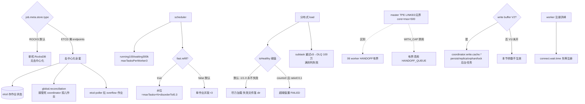

# 13 · Coordinator / Master 元数据与调度

> 场景组:`alluxio.master.*` + `alluxio.coordinator.*` + `alluxio.job.*`
> 配置数:**94** · 别名 30 · 废弃 0 · 数据来源:`PropertyKey.java` · 生成表:`_data/gen_table.py 13`

---

## 1. 本组概览

DORA 中 **Coordinator(即 Master)是无中心命名空间、无 journal 的**——它不持有 inode 树,主要负责:分布式作业调度(load/rebalance)、任务元数据存储(RocksDB/etcd)、worker 注册协调、写缓存后台任务的编排。**大量别名(30)** 源于 `master.*` ↔ `coordinator.*` 的双命名迁移(二者多互为别名)。

五个子场景:

| 子场景 | 关键配置 | 核心矛盾 |
|---|---|---|
| 作业调度器 | `scheduler.*`(etcd/并发/超时)、`disorder.task.tolerance` | 吞吐 vs 稳定 |
| 分布式 load | `dora.load.job.*`、`job.load.partition.*`、失败阈值 | 加载吞吐 vs 容错 |
| 元存储(metastore) | `metastore.dir`、`metastore.rocks.*`、`job.meta.store.type` | 持久化 vs 性能 |
| RPC/网络 | `rpc.executor.*`、`network.*` | 并发 vs 资源 |
| worker 协调 | `worker.register.lease.enabled`、`worker.connect.wait.time` | 注册洪峰控制 |

---

## 2. 配置清单速查表(全量 94 项)

### 2.1 作业调度器(scheduler)
| 配置项 | 默认值 | 类型 | Scope | 说明 |
|---|---|---|---|---|
| `alluxio.master.scheduler.interval.time` | 2s | duration | MASTER | 调度任务间隔(别名 coordinator.*) |
| `alluxio.master.scheduler.initial.wait.time` | 1s | duration | MASTER | 调度器启动前等待(等 worker 注册) |
| `alluxio.master.scheduler.max.tasks.per.worker` | 3 | int | MASTER | 每 worker 同时调度的最大任务数 |
| `alluxio.master.scheduler.running.job.capacity` | 100 | int | MASTER | 同时运行作业上限 |
| `alluxio.master.scheduler.waiting.job.capacity` | 300000 | int | MASTER | 等待作业上限 |
| `alluxio.master.scheduler.sync.job.timeout` | 300s | duration | MASTER | 同步作业执行超时 |
| `alluxio.master.scheduler.dynamic.consistent.hash.ring.enabled` | =user同名 | boolean | MASTER | 调度用存活 worker 构环 |
| `alluxio.master.scheduler.etcd.global.reconciliation.enabled` | true | boolean | MASTER | 去中心化孤儿作业协调(接管死 coordinator 的作业) |
| `alluxio.master.scheduler.etcd.max.retries` | 2 | int | MASTER | 调度器 etcd 操作重试 |
| `alluxio.master.scheduler.etcd.read.timeout` | 10s | duration | MASTER | etcd 读超时 |
| `alluxio.master.scheduler.etcd.write.timeout` | 15s | duration | MASTER | etcd 写超时 |
| `alluxio.master.scheduler.etcd.retry.base.delay` | 100ms | duration | MASTER | etcd 重试退避基准 |
| `alluxio.master.scheduler.job.etcd.path` | /alluxio/jobs/ | string | MASTER | 作业存储 etcd 路径前缀 |
| `alluxio.master.scheduler.job.etcd.poll.interval` | 1s | duration | MASTER | 从 etcd 拉新作业间隔 |
| `alluxio.master.scheduler.load.job.etcd.endpoints` | — | list | MASTER | load 作业分发的 etcd 端点(默认用全局) |
| `alluxio.master.disorder.task.tolerance.percentage` | 0.3 | double | MASTER | 慢任务超此比例暂停调度(别名 coordinator.*) |
| `alluxio.coordinator.scheduler.fast.refill.enabled` | false | boolean | MASTER | 快速回填每 worker 任务(别名多) |
| `alluxio.coordinator.scheduler.sync.job.threads.max` | 128 | int | MASTER | 同时注册的 worker 数(注册洪峰控制) |
| `alluxio.coordinator.task.logging.threshold` | 1min | duration | MASTER | 任务执行超此时长记日志 |

### 2.2 分布式 load 作业与容错
| 配置项 | 默认值 | 类型 | Scope | 说明 |
|---|---|---|---|---|
| `alluxio.job.batch.size` | 200 | int | MASTER | 单作业请求含的任务数 |
| `alluxio.job.max.concurrent.capacity` | -1 | long | MASTER | 所有作业最大并发;-1 无限 |
| `alluxio.job.cleanup.interval` | 1H | duration | MASTER | 终态作业定期清理间隔 |
| `alluxio.job.retention.time` | 7d | duration | MASTER | 完成作业信息保留时长 |
| `alluxio.job.load.partition.enabled` | false | boolean | ALL | 分区读加载(别名 dora.file.partition.read) |
| `alluxio.job.load.partition.size` | 64MB | dataSize | ALL | load 文件分区大小 |
| `alluxio.job.load.sub.task.retry.timeout` | 60s | duration | MASTER | load 子任务重试超时 |
| `alluxio.job.ufs.status.pool.max.size` / `min.size` | 64 / 8 | int | MASTER | 加载 UFS 状态池上下限 |
| `alluxio.job.get.worker.cached.bytes.timeout` | 10min | duration | CLIENT | 获取 worker 已缓存字节超时 |
| `alluxio.master.dora.load.job.subtask.max.retry.attempts` | 5 | int | MASTER | load 子任务永久失败前的最大重试 |
| `alluxio.master.dora.load.job.total.failure.count.threshold` | -1 | int | SERVER | load 总失败数阈值;-1 永不失败 |
| `alluxio.master.dora.load.job.total.failure.ratio.threshold` | 1.00 | double | SERVER | load 总失败比例阈值;1.0 永不失败 |
| `alluxio.master.dora.load.job.retry.dlq.capacity` | 100万 | int | SERVER | 失败任务死信队列容量(满则不再重试) |
| `alluxio.master.dora.load.job.failed.file.list.dir` | ${work}/job_results/load | string | SERVER | 失败文件列表目录 |

### 2.3 元存储(metastore)
| 配置项 | 默认值 | 类型 | Scope | 说明 |
|---|---|---|---|---|
| `alluxio.coordinator.job.meta.store.type` | ROCKS | enum | MASTER | 作业元数据类型:rocks/etcd |
| `alluxio.coordinator.global.file.index.enabled` | false | boolean | MASTER | 维护全局文件索引(load/free/rebalance 同步) |
| `alluxio.coordinator.global.file.index.type` | ROCKS | enum | MASTER | 全局文件索引类型:rocks/heap |
| `alluxio.master.metastore.dir` | ${work}/metastore | string | MASTER | 元存储工作目录(别名 coordinator.*) |
| `alluxio.master.metastore.dir.job` | =metastore.dir | string | MASTER | RocksDB 作业元数据目录 |
| `alluxio.master.metastore.rocks.exclusive.lock.timeout` | 10s | duration | MASTER | RocksDB 关闭/备份前等待在途操作的超时 |
| `alluxio.master.metastore.rocks.parallel.backup` | false | boolean | MASTER | 并行 checkpoint RocksDB |
| `alluxio.master.metastore.rocks.parallel.backup.threads` | — | int | MASTER | 并行备份线程数 |

### 2.4 写缓存后台任务(coordinator 编排,SERVER)
| 配置项 | 默认值 | 类型 | 说明 |
|---|---|---|---|
| `alluxio.coordinator.write.cache.background.tasks.enabled` | true | boolean | 写缓存后台任务总开关 |
| `alluxio.coordinator.write.cache.background.tasks.worker.rpc.threads` | 128 | int | 后台任务 worker RPC 线程 |
| `alluxio.coordinator.write.cache.async.persist.scan.inode.period` / `.threads` | 10min / 8 | — | 扫 inode 做异步持久化 |
| `alluxio.coordinator.write.cache.async.replica.check.scan.inode.period` / `.threads` | 30min / 8 | — | 扫 inode 做异步副本检查 |
| `alluxio.coordinator.write.cache.async.replica.check.worker.offline.grace.period` | 30min | duration | 失联 worker 触发副本恢复的宽限期 |
| `alluxio.coordinator.write.cache.check.ufs.orphan.file.period` / `.threads` | 6h / 8 | — | 检查 UFS 孤儿文件 |
| `alluxio.coordinator.write.cache.cleanup.ufs.orphan.file.grace.duration` | 24h | duration | 清理 UFS 孤儿文件宽限 |
| `alluxio.coordinator.write.cache.clean.invalid.locks.period` | 6h | duration | 清理无效锁周期 |
| `alluxio.coordinator.write.cache.cleanup.invalid.locks.grace.duration` | 24h | duration | 清理无效锁宽限 |
| `alluxio.coordinator.write.cache.cleanup.temp.promote.file.period` / `.grace.duration` | 1min / 1h | — | 清理临时 promote 文件 |
| `alluxio.coordinator.write.cache.trash.gc.ttl` | 1h | duration | 软删 inode 在 trash 的最小保留 |

### 2.5 RPC 执行器 / 网络 / worker 协调 / 端口
| 配置项 | 默认值 | 类型 | 说明 |
|---|---|---|---|
| `alluxio.master.rpc.executor.type` | TPE | enum | 执行器 TPE/FJP |
| `alluxio.master.rpc.executor.core.pool.size` / `max.pool.size` | 500 / 500 | int | 核心/最大线程 |
| `alluxio.master.rpc.executor.tpe.queue.type` | LINKED_BLOCKING_QUEUE | enum | TPE 队列类型(注意与 worker 的 HANDOFF 不同) |
| `alluxio.master.rpc.executor.tpe.queue.size` | 500 | int | TPE 队列大小 |
| `alluxio.master.rpc.executor.tpe.allow.core.threads.timeout` | true | boolean | 核心线程可超时回收 |
| `alluxio.master.rpc.executor.fjp.async/parallelism/min.runnable` | true/—/1 | — | FJP 参数(有别名) |
| `alluxio.master.rpc.executor.keepalive` | 60sec | duration | 线程空闲回收 |
| `alluxio.master.network.flowcontrol.window` | 2MiB | dataSize | gRPC 流控窗口 |
| `alluxio.master.network.keepalive.time` / `.timeout` | 2h / 30sec | duration | gRPC 保活 |
| `alluxio.master.network.permit.keepalive.time` | 30sec | duration | 允许客户端最激进保活 |
| `alluxio.master.network.max.inbound.message.size` | 100MiB | dataSize | 最大入站消息 |
| `alluxio.master.rpc.port` | 19998 | int | RPC 端口(别名 master.port/coordinator.rpc.port) |
| `alluxio.master.web.port` | 19999 | int | Web UI 端口(别名 coordinator.web.port) |
| `alluxio.master.secure.rpc.port` | 19996 | int | 安全 RPC 端口 |
| `alluxio.master.worker.register.lease.enabled` | false | boolean | worker 注册前申请租约(控并发) |
| `alluxio.master.worker.connect.wait.time` | 5sec | duration | 启动后等 worker 注册再收客户端请求 |
| `alluxio.master.worker.info.cache.refresh.time` | 10sec | duration | worker 信息缓存刷新 |
| `alluxio.master.heartbeat.timeout` | 10min | duration | 主备 master 心跳超时 |
| `alluxio.master.hostname` / `bind.host` / `web.hostname` | —/0.0.0.0/... | string | 主机/绑定(别名 coordinator.*) |
| `alluxio.master.jvm.monitor.enabled` | true | boolean | master JVM 暂停监控 |
| `alluxio.master.filesystem.liststatus.result.message.length` | 10000 | int | list-status 每消息条目数 |
| `alluxio.master.persistence.max.total.wait.time` | 1day | duration | ASYNC_THROUGH 持久化检查总等待 |
| `alluxio.master.file.async.persist.handler` | Default...Handler | string | 异步持久化请求处理器 |
| `alluxio.master.ufs.managed.blocking.enabled` | — | boolean | UFS 操作用 managed blocking(慢 UFS 提示) |
| `alluxio.coordinator.failure.detection.timeout` | 15s | duration | coordinator 故障检测超时 |
| `alluxio.coordinator.rebalance.job.worker.timeout` | 60s | duration | rebalance 作业 worker 超时 |
| `alluxio.coordinator.rebalance.job.history.max.retained` | 20 | int | 保留的完成 rebalance 作业数 |
| `MASTER_MOUNT_TABLE_ROOT_{ALLUXIO,OPTION,READONLY}` | / /—/false | — | 根挂载点/UFS 配置/只读(模板名) |

---

## 3. 逐项深度分析(充分细节)

> 本组 94 项按配置族逐一深挖:去中心化调度器(生命周期/并发/etcd/孤儿接管)→ 分布式 load 容错(失败阈值/重试/DLQ/分区/UFS 状态池)→ 作业元存储(RocksDB/etcd/全局索引)→ RPC 执行器(TPE/FJP/队列)→ 网络与端口 → worker 协调(注册/连接/缓存)→ 写缓存后台任务(coordinator 编排,⚠️仅 write buffer V2)→ rebalance 与故障检测 → 持久化/list-status/JVM 监控/挂载根等杂项。每族给出:作用、取值枚举、影响取舍、关联、代码级机制。数据核对自 `PropertyKey.java`、`coordinator/scheduler/Scheduler.java`、`coordinator/job/LoadJob.java`、`concurrent/ExecutorServiceBuilder.java`、`pfs/background/FdbBackgroundTasks.java`。

> **⚠️ 贯穿全组的最重要前提——作业元存储模式决定"去中心化"是否生效**:`coordinator.job.meta.store.type` 默认 **`ROCKS`**(单机 RocksDB),此时 coordinator 是**单节点、无成员管理**的;`scheduler.etcd.*`(含 `global.reconciliation`、`job.etcd.poll.interval`、etcd 超时/重试)以及"接管孤儿作业、overflow 队列"这一整套**只有当 `job.meta.store.type=ETCD` 且 `alluxio.etcd.endpoints` 已设时才被启用**。`Scheduler` 构造里对此有 fail-fast:配 `ETCD` 却没设 endpoints 会在启动时抛 `IllegalStateException`(见 `Scheduler.java` 构造函数)。读本节 3.1 的 etcd 子族时请始终带上这个前提。

### 3.1 去中心化调度器(`scheduler.*` + `disorder.task.tolerance` + `task.logging`)

调度器 `Scheduler`(`coordinator/scheduler/Scheduler.java`,单例)是本组的核心。它用几个固定周期的单线程/有界线程池驱动:`processJobs`(把作业的下一批 task 塞进各 worker 的任务队列)、`scheduleJob`、`updateWorkers`(刷活跃 worker 列表)、`cleanupStaleJob`(清终态作业)、以及仅 etcd 模式下的 `etcd-poller`。

**(a) 调度节奏与启动 grace**
- **`scheduler.interval.time`(默认 `2s`,别名 `coordinator.*`)**:`processJobs` 的固定间隔——每 2s 尝试给运行中的作业补发 task。调小加快 task 下发、增加调度线程 CPU 与 etcd/worker 交互。
- **`scheduler.initial.wait.time`(默认 `1s`,别名 `coordinator.*`)**:调度器**首次运行前的等待**(`processJobs`/`scheduleJob` 的 initialDelay)。这是给 worker 完成注册的宽限,避免刚启动就往空的活跃 worker 集调度。⚠️ 与 3.6 的 `worker.connect.wait.time`(5s)是两个不同层的"等 worker 就绪"。
- **`worker.info.cache.refresh.time`(默认 `10sec`,别名 `coordinator.*`)**:活跃 worker 列表(`updateWorkers`)的刷新周期,也是调度用的 worker 视图时效。太大→新上/下线 worker 感知慢、作业可能仍往已失联 worker 调度;太小→更频繁拉取 worker 信息。

**(b) 并发闸门:三层容量 + 每 worker 队列**
- **`scheduler.running.job.capacity`(默认 100)/ `scheduler.waiting.job.capacity`(默认 300000)**:同时**运行**/**等待**的作业上限。运行满则新作业进等待队列;等待也满则拒绝提交(etcd 模式下 `pollEtcdQueue` 也会因 waiting 达上限而暂停从 etcd 拉 overflow 作业)。
- **`scheduler.max.tasks.per.worker`(默认 3,别名 `coordinator.*`)**:每 worker 的任务队列容量——`enqueueTaskForWorker` 为每个 worker 建一个 `BoundedPriorityBlockingQueue<>(MAX_TASK_PER_WORKER)`,offer 超容量即返回 false、该 task 提交失败并触发 `onTaskSubmitFailure`。这是**每 worker 在飞 task 数的硬上限**,直接决定单 worker 并发。
- **单作业并发(默认模式)**:代码常量 `SINGLE_JOB_CONCURRENCY_NUMS = 3`——非快速模式下,单个作业在飞 task 数 ≥ 3 就不再补发(`processJob` 的 watermark 判断)。即默认每作业最多 3 个并发 task(与 `max.tasks.per.worker` 的 3 是不同维度:前者是"每作业",后者是"每 worker")。
- **`job.max.concurrent.capacity`(默认 -1)**:所有作业的**总并发上限**(按各作业 `batchSize` 累加),`-1`=不限。`checkJobBatchConcurrency` 在提交时校验:已运行/等待作业的 batchSize 之和不能超过它。

**(c) 快速回填模式与"乱序容忍"(重点)**
- **`coordinator.scheduler.fast.refill.enabled`(默认 false,别名 `coordinator.fast.scheduler.node.enable` / `master.fast.scheduler.node.enable`)**:开启后单作业并发上限从固定 3 改为**随集群规模伸缩**的水位:`fastModeWatermark = max(3, maxTasksPerWorker × 活跃worker数 × disorderTolerance)`(`Scheduler.fastModeWatermark`)。大集群上这让单个大作业能同时铺满更多 worker(而非被 3 卡住),显著提升单作业吞吐;floor 到 3 保证小集群不比默认更保守。
- **`disorder.task.tolerance.percentage`(默认 0.3,别名 `coordinator.*`)**:⚠️ **property 描述说"慢任务超此比例就暂停调度",但当前代码里它的实际用途是 (c) 的 fast-mode 水位乘子**(`maxTasksPerWorker × N × 0.3`),即"快速模式下单作业目标并发 = 每 worker 任务数 × 活跃 worker 数 × 0.3"。**未见"慢任务比例触发暂停"的独立实现**——描述与实现不一致,**以水位乘子理解为准(建议验证)**。调大→快速模式下单作业铺得更满(更激进);调小→更保守。仅在 `fast.refill.enabled=true` 时有实际效果。
- **`coordinator.task.logging.threshold`(默认 `1min`)**:单个 task 执行超过此时长就记 call log(慢 task 观测,`JOB_TASK_LOGGING_THRESHOLD`)。仅日志,不影响调度。

**(d) 同步作业与状态检查线程池**
- **`scheduler.sync.job.timeout`(默认 `300s`,别名 `coordinator.*`)**:调度器里**同步作业执行**的超时。
- **`coordinator.scheduler.sync.job.threads.max`(默认 128)**:⚠️ **描述是"可同时注册的 worker 数……观察到 master 压力就调小"(关于 RegisterLease),但代码里它是 `mSyncSchedulerExecutor`(调度器同步执行有界线程池)的 max pool size**(`Scheduler.java`,配 `SYNC_EXECUTOR_QUEUE_CAPACITY` 有界队列,队列满抛 `ResourceExhaustedRuntimeException`)。**描述与实际用途不符(疑为历史遗留描述),按"调度同步线程池上限"理解(建议验证)**。

**(e) etcd 驱动的去中心化(仅 `job.meta.store.type=ETCD` 生效)**
- **`scheduler.etcd.global.reconciliation.enabled`(默认 true,别名 `coordinator.*`)**:去中心化**孤儿作业协调**。机制:coordinator 成员变更监听器发现某 coordinator 失联时,由"负责该地址"的存活 coordinator 调 `mJobMetaStore.reclaimOrphanedJobs(deadAddress)` 把死者遗留的 RUNNING 作业接管回 WAITING 重新调度(`EtcdJobMetaStore` 内校验此开关,并对每 tick 的 reclaim 次数设上限)。这是无中心多 coordinator 高可用的关键——coordinator 挂了作业不丢。**⚠️ 仅在 ETCD 元存储模式下有效;默认 ROCKS 单机模式下没有成员管理、此开关不起作用。**
- **`scheduler.job.etcd.poll.interval`(默认 `1s`,别名 `coordinator.*`)**:etcd 模式下 `etcd-poller` 从 WAITING overflow 队列**拉取新作业到本地内存**的间隔(实际间隔加了 0–1s 随机抖动防多 coordinator thundering-herd)。调短→作业分发更快、etcd 读压力更大。
- **`scheduler.job.etcd.path`(默认 `/alluxio/jobs/`,别名 `coordinator.*`)**:作业元数据在 etcd 的 key 前缀。
- **`scheduler.load.job.etcd.endpoints`(默认空,别名 `coordinator.*`)**:load 作业分发专用 etcd 端点;不设则回落到全局 `alluxio.etcd.endpoints`([14组](14-membership-etcd.md))。
- **etcd 韧性四件套**(均别名 `coordinator.*`):`scheduler.etcd.read.timeout`(`10s`)、`scheduler.etcd.write.timeout`(`15s`,写比读宽)、`scheduler.etcd.max.retries`(`2`)、`scheduler.etcd.retry.base.delay`(`100ms`,指数退避基准)。写超时/重试更宽是因为作业状态写入(CAS 事务)不可丢。
- **`scheduler.dynamic.consistent.hash.ring.enabled`(默认继承 `user.dynamic.consistent.hash.ring.enabled`,一致性 ENFORCE)**:调度驱动的作业用**存活 worker 列表**构一致性哈希环(true)还是**含失联 worker 的全量列表**(false)。true→作业只调度到活 worker、拓扑更贴实时;但环随 worker 上下线抖动、数据落点可能漂移。ENFORCE 全集群须一致。

### 3.2 分布式 load 作业与容错(`dora.load.job.*` + `job.*` + `job.load.partition.*`)

分布式 load 由 `LoadJob`(`coordinator/job/LoadJob.java`)承载,是本组容错设计最精巧的一族。

**(a) 失败阈值——⚠️默认"永不失败"(最易踩)**
- **`dora.load.job.total.failure.count.threshold`(默认 -1,SERVER,别名 `coordinator.*`)/ `dora.load.job.total.failure.ratio.threshold`(默认 1.00,SERVER,别名 `coordinator.*`)**:控制"整个 load 作业何时判为失败"。**关键代码在 `LoadJob.isHealthy()`:只要 `ratioThreshold >= 1.0` 或 `countThreshold < 0` 就直接 `return true`(永远健康)**——默认 `-1` / `1.00` **两个条件都成立,作业永不因文件加载失败而整体失败,尽力加载**。仅当**同时**把 count 设为 ≥0、ratio 设为 (0,1) 时,才按 `失败数 ≤ count 或 失败率 ≤ ratio` 判健康;不健康则作业置 FAILED。生产若要"失败率超限即终止",需**显式设 `ratio.threshold=0.1`(或类似)**,否则"成功"的 load 作业底下可能有大量文件没载上。
- 注意 `isHealthy()` 还内嵌了 pre-scan 未完成时返回 true、配额检查失败/超配额时返回 false 的短路逻辑(与 [19组](19-write-ttl-quota.md) 配额联动)。

**(b) 子任务重试与死信队列(DLQ)**
- **`dora.load.job.subtask.max.retry.attempts`(默认 5,别名无——仅 `master.*`)**:每个 load 子任务永久失败前的最大重试次数。`addSubTaskToRetryOrFail` 在**四个条件任一成立**时直接判该文件失败(不再重试):子任务不可重试 / 作业已不健康(见 a)/ DLQ 已满 / 该子任务重试次数 ≥ 5。否则 `incrementRetryAttempts()` 后入 DLQ。重试次数记在 **master 侧的子任务实例上**(通过 `subTaskIdentityKey` 在 `processResponse` 里按原对象查找保留),避免每次 worker 回报都新建对象导致计数清零、重试无限。主要应对 worker 瞬时过载(如小 worker 池下的 `RESOURCE_EXHAUSTED` 拒绝)。
- **`dora.load.job.retry.dlq.capacity`(默认 1,000,000,SERVER,别名 `coordinator.*`)**:失败子任务的**内存重试队列(死信队列 `mRetrySubTasksDLQ`)容量**。队列满(`size >= capacity`)时,新失败子任务不再进队重试而直接判失败。作业失败时,DLQ 里所有待重试子任务被清出并标记为"因作业失败取消重试"。
- **`dora.load.job.failed.file.list.dir`(默认 `${work.dir}/job_results/load`,SERVER,别名 `coordinator.*`)**:失败文件清单的落盘目录——即便作业整体"成功",失败文件也可从这里核对(配合 a 的"永不失败"语义尤为重要)。

**(c) 作业请求批大小、清理、保留**
- **`job.batch.size`(默认 200)**:单个 job 请求打包的 task 数(也是 `job.max.concurrent.capacity` 累加的单位)。
- **`job.cleanup.interval`(默认 `1H`)/ `job.retention.time`(默认 `7d`)**:终态作业的定期清理间隔 / 完成作业信息保留时长。`cleanupStaleJob`(启动 5s 后按 cleanup 间隔运行)清理超过 retention 的作业记录,防作业元数据无限增长。
- **`job.get.worker.cached.bytes.timeout`(默认 `10min`,CLIENT)**:客户端查询 worker 已缓存字节数的超时(load 进度/校验用)。

**(d) 分区读(大文件切片加载)**
- **`job.load.partition.enabled`(默认 false,ALL,别名 `dora.file.partition.read.enabled`)/ `job.load.partition.size`(默认 `64MB`,ALL,别名 `dora.file.partition.size`)**:开启后一个文件被切成**连续、可由不同 worker 独立加载的分区**(每 64MB 一片),大文件加载并行化。与 [07组](07-worker-mgmt.md)/[04组](04-worker-page-store.md) 的 worker 侧读切片(streaming/buffered)配合。别名跨 `job.*` 与 `dora.file.partition.*` 两族。

**(e) UFS 状态加载池**
- **`job.ufs.status.pool.max.size`(默认 64)/ `min.size`(默认 8)**:加载(遍历)UFS 目录状态时的线程池上下限——大目录 listStatus 并发扫描的并行度。小 UFS 目录用不满,超大目录树可上调 max 加快枚举。

### 3.3 作业元存储与全局文件索引(`job.meta.store.type` + `metastore.*` + `global.file.index.*`)

- **`coordinator.job.meta.store.type`(默认 `ROCKS`,枚举 `MetastoreType`={HEAP, ROCKS, ETCD})**:作业元数据后端。⚠️ **枚举有 3 个值,但此 key 描述只写 "rocks/etcd"——HEAP 不用于作业元存储**。选型语义:
  - `ROCKS`(默认):单机 RocksDB(`RocksDBJobMetaStore`),持久化、抗单 coordinator 重启,但**无多 coordinator 去中心化/孤儿接管**。
  - `ETCD`:`EtcdJobMetaStore`,作业状态存 etcd,**启用去中心化全套**(成员管理、overflow 队列、孤儿 reclaim、CAS 写),需 `etcd.endpoints`([14组](14-membership-etcd.md)),否则启动 fail-fast。
- **`coordinator.global.file.index.enabled`(默认 false)/ `coordinator.global.file.index.type`(默认 `ROCKS`,枚举 `MetastoreType`,此处 "rocks/heap")**:开启后 coordinator 维护**全局文件索引**并在 load/free/rebalance 期间保持同步。type 可选 `ROCKS`(`RocksGlobalFileIndexStore`,持久化)或 `HEAP`(`HeapGlobalFileIndexStore`,纯内存、快但重启即失、吃堆内存)。仅在开启索引特性时相关。
- **`master.metastore.dir`(默认 `${work.dir}/metastore`,别名 `coordinator.*`)/ `master.metastore.dir.job`(默认 = `metastore.dir`)**:元存储工作目录 / RocksDB 存作业元数据的目录(仅 ROCKS 需磁盘;后者可把作业元数据单独指向另一块盘)。
- **RocksDB 备份/关闭**(仅 ROCKS 相关):
  - `metastore.rocks.exclusive.lock.timeout`(默认 `10s`):RocksDB 关闭/重启/恢复前**等待在途操作完成/中止**的超时——到时仍未完成则强制推进(权衡:等太久拖慢关闭,等太短可能打断在途操作)。
  - `metastore.rocks.parallel.backup`(默认 false)/ `metastore.rocks.parallel.backup.threads`(无默认):是否用多线程并行 checkpoint RocksDB 及其线程数,加速大 metastore 的备份。

### 3.4 RPC 执行器(`rpc.executor.*`)——注意与 Worker 的差异

master gRPC 服务的请求处理线程池由 `ExecutorServiceBuilder`(`concurrent/ExecutorServiceBuilder.java`)按配置构建。

- **`rpc.executor.type`(默认 `TPE`,枚举 `RpcExecutorType`={TPE=ThreadPoolExecutor, FJP=ForkJoinPool})**:执行器类型。TPE 走队列 + 线程池;FJP 走工作窃取。
- **核心/最大线程**:`rpc.executor.core.pool.size`(默认 500)/ `max.pool.size`(默认 500)——**master 默认 core=max=500**(worker 默认小得多)。`rpc.executor.keepalive`(默认 `60sec`):空闲线程回收时间。`rpc.executor.tpe.allow.core.threads.timeout`(默认 true):允许核心线程在无工作时超时回收(与 keepalive 配合,空闲时可缩回 0)。
- **TPE 队列(重点差异)**:`rpc.executor.tpe.queue.type`(默认 **`LINKED_BLOCKING_QUEUE`**)+ `rpc.executor.tpe.queue.size`(默认 500)。⚠️ **枚举 `ThreadPoolExecutorQueueType` 有 6 个值**:`LINKED_BLOCKING_QUEUE`(无界)、`LINKED_BLOCKING_QUEUE_WITH_CAP`(有界)、`ARRAY_BLOCKING_QUEUE`(有界)、`SYNCHRONOUS_BLOCKING_QUEUE`、`HYBRID_SYNCHRONOUS_LINKED_QUEUE`(有界)、`HANDOFF_QUEUE`(有界)。
  - master 默认 `LINKED_BLOCKING_QUEUE` 是**无界队列**(`queue.size` 对它无效),用于吸收元数据 RPC 突发;但 core=max=500 意味着并发上限 500,超出的请求全**堆在无界队列里**——⚠️ 极端过载有**内存/排队延迟风险**,超大集群需关注。
  - **⚠️ 代码强约束**:`LINKED_BLOCKING_QUEUE_WITH_CAP` 被**明确禁止用于 RPC 执行器**——`ExecutorServiceBuilder.forHost` 里有 `Preconditions.checkArgument(queueType != LINKED_BLOCKING_QUEUE_WITH_CAP, "…use HANDOFF_QUEUE for a bounded RPC queue")`。原因:core<max 时它是"队列优先"(先填满队列才扩线程),会导致线程数上不去的塌陷。要有界 RPC 队列**必须用 `HANDOFF_QUEUE`**(先扩到 max,再进有界缓冲)——这正是 [06组](06-worker-net-rpc.md) worker 侧的默认。
- **FJP 参数**(仅 `type=FJP` 生效):`rpc.executor.fjp.parallelism`(无默认,别名 `rpc.executor.parallelism`,并行度/内部队列数,须 ≤ maxPoolSize)、`rpc.executor.fjp.min.runnable`(默认 1,别名 `rpc.executor.min.runnable`,最小非阻塞核心线程数)、`rpc.executor.fjp.async`(默认 true,forked task 用 FIFO 调度模式)。

### 3.5 网络与端口(`network.*` + `*.port` + `hostname`/`bind.host`)

- **gRPC 流控与保活**:
  - `network.flowcontrol.window`(默认 `2MiB`):HTTP/2 流控窗口,越大缓冲越多、内存越高。
  - `network.keepalive.time`(默认 `2h`)/ `network.keepalive.timeout`(默认 `30sec`):server 多久 ping 一次空闲客户端 / ping 后等响应多久判连接死。⚠️ **master 的 keepalive.time(2h)远大于 worker(30s)**——master 连接长驻稳定,worker 数据面连接更短命、更快探活。
  - `network.permit.keepalive.time`(默认 `30sec`):**允许客户端配置的最激进保活频率**,超过则 server 侧检测并处置(防客户端过度 ping 打爆 server)。
  - `network.max.inbound.message.size`(默认 `100MiB`):单条入站消息上限(大 listStatus 结果、批量元数据操作会撞这个,与 3.9 的 `liststatus.result.message.length` 配合分页)。
- **端口**:`rpc.port`(默认 19998,别名 `master.port` / `coordinator.rpc.port`)、`web.port`(默认 19999,别名 `coordinator.web.port`,Web UI)、`secure.rpc.port`(默认 19996,别名 `master.secure.port`,安全 RPC/Security Service)。
- **主机/绑定**:`hostname`(别名 `coordinator.hostname`,对外主机名)、`bind.host`(默认 `0.0.0.0`,RPC 绑定)、`web.bind.host`(默认 `0.0.0.0`)、`web.hostname`(默认 = `master.hostname`)。多网卡时用 bind.host 精确绑定;`hostname` 是对外注册/客户端可达地址。

### 3.6 worker 协调:注册洪峰与连接就绪

- **`worker.register.lease.enabled`(默认 false)**:worker 注册前先向 master 申请 **RegisterLease**,master 借此**控制并发注册的 worker 数**。大集群(数千 worker)同时启动/重启时,不加控制的并发注册会打爆 master(元数据写入、RPC 线程、内存)。开启后未获租约的 worker 等待重试。⚠️ **说明**:代码检索显示该 key 在当前 DORA coordinator 侧**未见直接消费者**(相关消费主要在 worker 注册协商链路,不在本组 master 代码内),master 侧的注册并发实际由下条的调度同步线程池与租约协商机制共同约束(建议验证具体生效链路)。
- **`worker.connect.wait.time`(默认 `5sec`)**:master **启动后先等一段时间让 worker 注册,再开始接受客户端请求**——避免刚启动时活跃 worker 集为空、请求被路由到空的一致性哈希环。⚠️ 与 3.1(a) 的 `scheduler.initial.wait.time`(1s,调度器专属 grace)是两个不同层的等待。
- **`worker.info.cache.refresh.time`**:见 3.1(a)(调度用 worker 视图刷新)。
- **`coordinator.scheduler.sync.job.threads.max`(128)**:实际作用见 3.1(d)(调度同步线程池上限)——其描述虽写"可同时注册的 worker 数",但代码用途与注册控制不符(建议验证)。

### 3.7 写缓存后台任务(coordinator 编排,`coordinator.write.cache.*`)——⚠️ 仅 write buffer V2 生效

> 这是本组与 [19组](19-write-ttl-quota.md) 写缓冲底座、[04组](04-worker-page-store.md) worker 侧写缓存流水线配对的**coordinator 编排层**。coordinator 周期性扫描写缓冲元数据(FDB),编排异步持久化、副本检查、孤儿/临时文件/无效锁清理等后台任务,通过 worker RPC 下发执行。

**⚠️ 关键前提(与 04/19 组一致的隐性依赖,最易踩)**:这整套后台任务**只在 write buffer V2 下才被实例化并启动**。`FdbBackgroundTasks.isEnabled()`(`pfs/background/FdbBackgroundTasks.java`)的门控是:
```
WRITE_BUFFER_ENABLED == true
  && WRITE_BUFFER_DUAL_BUFFER_FILE_SYSTEM_TYPE == GENERIC_FDB_BACKED_V2
  && WRITE_CACHE_BACKGROUND_TASKS_ENABLED == true
```
即需要 `alluxio.write.cache.enabled=true` **且** `dual.buffer.file.system.type=GENERIC_FDB_BACKED_V2`([19组 3.2](19-write-ttl-quota.md)) **且** 本节总开关开。**V1 或未开写缓冲时,本节这套 `coordinator.write.cache.*` 参数不生效。**

**(a) 总开关与 worker RPC 线程**
- **`write.cache.background.tasks.enabled`(默认 true,SERVER)**:后台任务总开关(仍受上面 V2 前提约束)。
- **`write.cache.background.tasks.worker.rpc.threads`(默认 128,SERVER)**:后台任务下发 worker RPC 用的**弹性线程池**(`elasticThreadPool`,拒绝策略 CALLER_BLOCKS——池满时调用线程阻塞形成背压)大小。所有后台扫描/清理共用此池向 worker 发 RPC。

**(b) 异步持久化扫描 `AsyncPersistScanner`**
- **`write.cache.async.persist.scan.inode.period`(默认 `10min`)/ `.threads`(默认 8)**:周期扫描写缓冲 inode、把待持久化文件下发 worker 落 UFS 的扫描间隔与并发线程数。

**(c) 异步副本检查 `AsyncReplicaChecker`**
- **`write.cache.async.replica.check.scan.inode.period`(默认 `30min`)/ `.threads`(默认 8)**:周期扫 inode 做副本数检查/补副本的间隔与线程数。
- **`write.cache.async.replica.check.worker.offline.grace.period`(默认 `30min`)**:**失联 worker 触发副本恢复的宽限期**——离线时长小于此值的 worker 仍视为在线(暂不触发补副本),防 worker 短暂抖动/重启就误判丢副本、引发无谓的大规模副本重建。

**(d) UFS 孤儿文件检查/清理**
- **`write.cache.check.ufs.orphan.file.period`(默认 `6h`)/ `.threads`(默认 8)**:检查 UFS 上"孤儿文件"(无对应写缓冲元数据引用)的周期与线程数。
- **`write.cache.cleanup.ufs.orphan.file.grace.duration`(默认 `24h`)**:孤儿文件被**发现后到实际清理的宽限**——防误删仍在途/刚创建的文件。
- ⚠️ 代码里孤儿清理路径(`AsyncUfsOrphanFileCleaner`)与持久化/副本/临时提升路径互斥选择(取决于 random-access UFS page store 是否开启),即两组扫描器不同时运行(建议验证具体切换条件)。

**(e) 无效锁清理**
- **`write.cache.clean.invalid.locks.period`(默认 `6h`)/ `write.cache.cleanup.invalid.locks.grace.duration`(默认 `24h`)**:清理 FDB 上残留无效锁(如崩溃遗留)的周期与发现-清理宽限,防锁泄漏堆积。

**(f) 临时 promote 文件清理**
- **`write.cache.cleanup.temp.promote.file.period`(默认 `1min`)/ `.grace.duration`(默认 `1h`)**:清理"提升(promote)过程中产生的临时文件"的周期与宽限。period 短(1min)是因为这类临时文件生命周期短、堆积会占空间。

**(g) trash GC**
- **`write.cache.trash.gc.ttl`(默认 `1h`,SERVER)**:软删 inode 在 trash 里被 GC 前的**最小保留时长**——这段宽限让 page store 文件清理能读到 inode 完成关联删除,避免"元数据已删、页文件成孤儿"。

### 3.8 rebalance 与故障检测(`coordinator.rebalance.*` + `failure.detection.timeout`)

- **`coordinator.failure.detection.timeout`(默认 `15s`,ALL,ENFORCE)**:成员故障检测中判定某 coordinator 失联的超时——这是 3.1(e) 孤儿作业接管的触发时效(失联判定越快,孤儿作业被接管越快,但太短易误判)。ENFORCE 全集群须一致。
- **`coordinator.rebalance.job.worker.timeout`(默认 `60s`)**:rebalance 作业(membership 变化后重新平衡缓存数据,`RebalanceJob`)等待单个 worker 的超时。
- **`coordinator.rebalance.job.history.max.retained`(默认 20)**:etcd 里保留的**已完成 rebalance 作业**数——新 rebalance 启动时,超过此上限的旧完成作业被删除,防历史无限累积。

### 3.9 持久化 / list-status / JVM 监控 / 心跳 / UFS managed blocking

- **`persistence.max.total.wait.time`(默认 `1day`)**:对用 `ASYNC_THROUGH` 写模式的文件,master 持久化检查器等待其持久化状态的**总等待时长**——超时则放弃等待(防个别文件持久化卡死拖住检查器)。
- **`file.async.persist.handler`(默认 `alluxio.master.file.async.DefaultAsyncPersistHandler`,ENFORCE)**:处理异步持久化请求的处理器类(通常不改)。
- **`filesystem.liststatus.result.message.length`(默认 10000)**:list-status 响应**每条 gRPC 消息包含的条目数**(分页粒度)——大目录 listStatus 被切成多条消息返回,与 3.5 的 `network.max.inbound.message.size`(100MiB)配合防单消息过大。调大→消息更少但单条更大;调小→消息更多。
- **`heartbeat.timeout`(默认 `10min`)**:主/备 master 之间的心跳超时(判定 master 丢失)。
- **`jvm.monitor.enabled`(默认 true)**:master 上启动 JVM 暂停监控线程,检测 GC 或其他原因引起的 JVM-wide 停顿(观测长 GC/STW)。
- **`ufs.managed.blocking.enabled`(默认因 UFS 类型而异,SERVER)**:UFS 操作是否用 **managed blocking**——给 RPC 层一个"UFS 可能慢"的提示。⚠️ **默认值动态**:对象存储(S3/GCS 等)默认 true,其余默认 false,除非显式设置。慢 UFS 场景开启可让 RPC 层更好地处理阻塞。

### 3.10 挂载根(`MASTER_MOUNT_TABLE_ROOT_*`,模板名,ENFORCE)

- **`MASTER_MOUNT_TABLE_ROOT_ALLUXIO`(默认 `/`)/ `_OPTION`(UFS 配置)/ `_READONLY`(默认 false)**:根挂载点的 Alluxio 路径、其 UFS 的配置项、以及是否只读。这三项都是 **ENFORCE**(全集群须严格一致),定义了 coordinator 命名空间的根挂载,须与 [10组](10-ufs-common.md) 的挂载/UFS 配置一致。这是模板生成的 key(`<unresolved:...>`),不是运行时可随意改的普通配置。

---

## 4. 配置关联关系图



---

## 5. 典型场景配置组合建议

| 场景 | 推荐组合 | 理由 |
|---|---|---|
| **多 coordinator 去中心化高可用** | `job.meta.store.type=ETCD` + 设 `etcd.endpoints` + 保持 `scheduler.etcd.global.reconciliation.enabled=true` | 唯有 ETCD 模式启用成员管理/孤儿作业接管;ROCKS 是单机、无高可用 |
| **单 coordinator 抗重启(默认)** | `job.meta.store.type=ROCKS`(默认)+ 合理 `metastore.dir`/`.dir.job`(指持久盘) | RocksDB 持久化作业状态,重启不丢;但无多节点接管 |
| **load 需失败即停** | **同时**设 `total.failure.count.threshold≥0` 与 `total.failure.ratio.threshold=0.1`(而非默认 -1/1.0) | `isHealthy()` 需两个默认条件都被打破才按阈值判失败 |
| **load 尽力加载 + 事后核对** | 保持默认 -1/1.0,读 `dora.load.job.failed.file.list.dir` 下失败清单 | 永不整体失败,失败文件从清单补载 |
| **大文件 load 加速** | `job.load.partition.enabled=true` + 按对象大小调 `job.load.partition.size` | 文件切片并行加载 |
| **大作业铺满大集群** | `coordinator.scheduler.fast.refill.enabled=true` + 视需要调 `disorder.task.tolerance.percentage` | 单作业并发从固定 3 升为随集群规模伸缩的水位 |
| **超大集群启动防打爆** | `worker.register.lease.enabled=true` + 调 `worker.connect.wait.time` + 调 `scheduler.sync.job.threads.max` | 控注册并发洪峰、先等 worker 就绪再收请求 |
| **master RPC 要有界队列** | `rpc.executor.tpe.queue.type=HANDOFF_QUEUE`(不可用 `LINKED_BLOCKING_QUEUE_WITH_CAP`) | 无界队列过载有内存风险;WITH_CAP 被代码禁用,有界须走 HANDOFF |
| **大目录 listStatus** | 调 `filesystem.liststatus.result.message.length` + 关注 `network.max.inbound.message.size` | 分页与单消息上限配合 |
| **写缓存后台任务生效** | `write.cache.enabled=true` + `dual.buffer.file.system.type=GENERIC_FDB_BACKED_V2` + `write.cache.background.tasks.enabled=true` | 三者齐备 coordinator 才编排 persist/replica/清理 |

---

## 6. 风险与注意事项

1. **⚠️ "去中心化"不是默认开的**:`job.meta.store.type` 默认 `ROCKS`=单机、无成员管理、无孤儿作业接管;`scheduler.etcd.*`/`global.reconciliation`/overflow 队列**只有 `ETCD` 模式且设了 `etcd.endpoints` 才生效**(配 ETCD 却漏设 endpoints 会启动 fail-fast)。想要多 coordinator 高可用必须显式切 ETCD。这是本组最易误解的点。
2. **⚠️ load 默认永不失败**:`isHealthy()` 里 `ratio≥1.0` 或 `count<0` 就永远健康;默认(-1/1.0)两条件都成立,大量文件加载失败也不报作业失败。要"失败即停"须**同时**设 count≥0 与 ratio∈(0,1);否则"成功"作业可能大量文件没载上,须查 `failed.file.list.dir`。
3. **⚠️ 写缓存后台任务仅 V2 生效**:`coordinator.write.cache.*` 一整套(persist/replica/orphan/lock/promote/trash)**只在 `write.cache.enabled=true` 且 `dual.buffer.file.system.type=GENERIC_FDB_BACKED_V2` 且 `background.tasks.enabled=true` 时才启动**(`FdbBackgroundTasks.isEnabled()`)。V1/未开写缓冲时这批参数是死配置。与 [04](04-worker-page-store.md)/[19](19-write-ttl-quota.md) 组同源隐性依赖。
4. **master RPC 队列语义**:默认 `LINKED_BLOCKING_QUEUE` **无界**(core=max=500,超出全堆队列),极端过载有内存/延迟风险;要有界**只能用 `HANDOFF_QUEUE`**,`LINKED_BLOCKING_QUEUE_WITH_CAP` 被代码 `Preconditions` 禁用(队列优先塌陷)。
5. **⚠️ 两处描述与实现不符(建议验证)**:`disorder.task.tolerance.percentage` 描述称"慢任务超比例暂停",实际是 fast-refill 模式的水位乘子;`coordinator.scheduler.sync.job.threads.max` 描述称"可同时注册的 worker 数",实际是调度同步线程池上限。按代码用途理解。
6. **别名(30)**:`master.*` ↔ `coordinator.*` 大量互为别名,同一概念两个名——**避免同时设两个名**(以免混淆/覆盖)。
7. **注册洪峰打爆 master**:大集群不开租约控制、`connect.wait.time` 太短,数千 worker 同时注册可能拖垮 master;注意 `worker.register.lease.enabled` 的 master 侧生效链路待确认(见 3.6)。
8. **`ENFORCE` 一致性项**:`MASTER_MOUNT_TABLE_ROOT_*`、`coordinator.failure.detection.timeout`、`scheduler.dynamic.consistent.hash.ring.enabled`、`file.async.persist.handler` 等为 ENFORCE,须全集群一致;挂载根还须与 [10组](10-ufs-common.md) 一致。
9. **`ufs.managed.blocking.enabled` 默认动态**:对象存储默认 true、其余默认 false——排查慢 UFS RPC 行为时勿假设固定默认值。

---

## 跨组关联速览
- [07-worker-mgmt](07-worker-mgmt.md) —— worker 侧注册/load 切片/rebalance
- [14-membership-etcd](14-membership-etcd.md) —— etcd(调度/成员/元数据的存储底座)
- [10-ufs-common](10-ufs-common.md) —— 挂载表/UFS 元数据
- [04-worker-page-store](04-worker-page-store.md) —— 写缓存 worker 侧(coordinator 编排其后台任务)

---

## 附录A:本组全量配置清单(脚本生成)

> 由 `_data/gen_table.py 13-coordinator-master` 生成,逐 key 一行,保证覆盖本组**全部 94 项**(与上文按子场景组织的中文速查表互补;此处描述为官方英文原文,便于精确检索)。

| 配置项 | 默认值 | 类型 | Scope | 一致性 | 状态 | 说明 |
|---|---|---|---|---|---|---|
| `<unresolved:MASTER_MOUNT_TABLE_ROOT_ALLUXIO>` | "/" | — | MASTER | ENFORCE | — | Alluxio root mount point. |
| `<unresolved:MASTER_MOUNT_TABLE_ROOT_OPTION>` | — | — | MASTER | ENFORCE | — | Configuration for the UFS of Alluxio root mount point. |
| `<unresolved:MASTER_MOUNT_TABLE_ROOT_READONLY>` | false | — | MASTER | ENFORCE | — | Whether Alluxio root mount point is readonly. |
| `alluxio.coordinator.failure.detection.timeout` | "15s" | duration | ALL | ENFORCE | — | The timeout to consider a coordinator failure in membership failure detection. |
| `alluxio.coordinator.global.file.index.enabled` | false | boolean | MASTER | WARN | — | If enabled, the coordinator will maintain the global file index and keep in sync during load/free/rebalance. |
| `alluxio.coordinator.global.file.index.type` | MetastoreType.ROCKS | enum | MASTER | WARN | — | The global file index metadata type (rocks/heap) |
| `alluxio.coordinator.job.meta.store.type` | MetastoreType.ROCKS | enum | MASTER | WARN | — | The job metadata type (rocks/etcd) |
| `alluxio.coordinator.rebalance.job.history.max.retained` | 20 | int | MASTER | WARN | — | The maximum number of finished rebalance jobs retained in etcd. When a new rebalance job is launched, older finished jobs beyond this limit are del... |
| `alluxio.coordinator.rebalance.job.worker.timeout` | "60s" | duration | MASTER | WARN | — | The worker timeout of the rebalance job. |
| `alluxio.coordinator.scheduler.fast.refill.enabled` | false | boolean | MASTER | WARN | 别名:alluxio.coordinator.fast.scheduler.node.enable; alluxio.master.fast.scheduler.node.enable | If true, the coordinator refills a job's per-worker tasks up to x active workers (x the disorder tolerance) instead of a fixed 3, giving higher con... |
| `alluxio.coordinator.scheduler.sync.job.threads.max` | 128 | int | MASTER | — | — | The number of workers that can register at the same time. Others will wait and retry until they are granted a RegisterLease. If you observe pressur... |
| `alluxio.coordinator.task.logging.threshold` | "1min" | duration | MASTER | IGNORE | — | When the task execution time exceeds the threshold,the call log is recorded. |
| `alluxio.coordinator.write.cache.async.persist.scan.inode.period` | "10min" | duration | SERVER | — | — | The period for scanning inodes for async persist. |
| `alluxio.coordinator.write.cache.async.persist.scan.inode.threads` | 8 | int | SERVER | — | — | The number of threads used for scanning inodes for async persist. |
| `alluxio.coordinator.write.cache.async.replica.check.scan.inode.period` | "30min" | duration | SERVER | — | — | The period for scanning inodes for async replica check. |
| `alluxio.coordinator.write.cache.async.replica.check.scan.inode.threads` | 8 | int | SERVER | — | — | The number of threads used for scanning inodes for async replica check. |
| `alluxio.coordinator.write.cache.async.replica.check.worker.offline.grace.period` | "30min" | duration | SERVER | — | — | The grace period before a lost worker triggers replica recovery. Workers that have been offline for less than this duration are still considered on... |
| `alluxio.coordinator.write.cache.background.tasks.enabled` | true | boolean | SERVER | — | — | Whether enabled write cache background tasks. |
| `alluxio.coordinator.write.cache.background.tasks.worker.rpc.threads` | 128 | int | SERVER | — | — | The number of threads used for write cache background tasks worker RPCs. |
| `alluxio.coordinator.write.cache.check.ufs.orphan.file.period` | "6h" | duration | SERVER | — | — | The period for checking UFS orphan files. |
| `alluxio.coordinator.write.cache.check.ufs.orphan.file.threads` | 8 | int | SERVER | — | — | The number of threads used for checking UFS orphan files. |
| `alluxio.coordinator.write.cache.clean.invalid.locks.period` | "6h" | duration | SERVER | — | — | The period for cleaning invalid locks in write cache. |
| `alluxio.coordinator.write.cache.cleanup.invalid.locks.grace.duration` | "24h" | duration | SERVER | — | — | The grace duration before cleaning up invalid locks in write cache. |
| `alluxio.coordinator.write.cache.cleanup.temp.promote.file.grace.duration` | "1h" | duration | SERVER | — | — | The grace duration before cleaning up temporary promote files. |
| `alluxio.coordinator.write.cache.cleanup.temp.promote.file.period` | "1min" | duration | SERVER | — | — | The period for cleaning up temporary promote files. |
| `alluxio.coordinator.write.cache.cleanup.ufs.orphan.file.grace.duration` | "24h" | duration | SERVER | — | — | The grace duration before cleaning up UFS orphan files. |
| `alluxio.coordinator.write.cache.trash.gc.ttl` | "1h" | duration | SERVER | — | — | The minimum time a soft-deleted inode must remain in trash before being garbage collected. This grace period allows page store file cleanup to read... |
| `alluxio.job.batch.size` | 200 | int | MASTER | — | — | The number of tasks would be included in a job request. |
| `alluxio.job.cleanup.interval` | "1H" | duration | MASTER | — | — | The interval for the periodic cleanup of finished jobs from the job metastore. This process removes jobs that are in a terminal state (e.g., SUCCEE... |
| `alluxio.job.get.worker.cached.bytes.timeout` | "10min" | duration | CLIENT | IGNORE | — | The timeout that job get worker cached bytes. |
| `alluxio.job.load.partition.enabled` | false | boolean | ALL | — | 别名:alluxio.dora.file.partition.read.enabled | Whether to enable partitioned reads of files during load. A partition is a contiguous subset of a file loaded independently by a worker. |
| `alluxio.job.load.partition.size` | "64MB" | dataSize | ALL | — | 别名:alluxio.dora.file.partition.size | Size of a file partition during load. |
| `alluxio.job.load.sub.task.retry.timeout` | "60s" | duration | MASTER | — | — | The timeout for a load subtask to be retried. |
| `alluxio.job.max.concurrent.capacity` | -1 | long | MASTER | — | — | The maximum concurrency of all current jobs. |
| `alluxio.job.retention.time` | "7d" | duration | MASTER | — | — | The length of time the Alluxio should save information about completed jobs before they are discarded. |
| `alluxio.job.ufs.status.pool.max.size` | 64 | int | MASTER | — | — | The max size of loading ufs status pool. |
| `alluxio.job.ufs.status.pool.min.size` | 8 | int | MASTER | — | — | The min size of loading ufs status pool. |
| `alluxio.master.bind.host` | "0.0.0.0" | string | MASTER | — | — | The hostname that Alluxio master binds to. |
| `alluxio.master.disorder.task.tolerance.percentage` | 0.3 | double | MASTER | WARN | 别名:alluxio.coordinator.disorder.task.tolerance.percentage | The coordinator's scheduling tolerance will be adjusted.Scheduling will be paused once the number of slow tasks exceeds this tolerance. |
| `alluxio.master.dora.load.job.failed.file.list.dir` | format("${%s}/job_results/load", Name.WORK_DIR) | string | SERVER | IGNORE | 别名:alluxio.coordinator.dora.load.job.failed.file.list.dir | The directory to store failed file list of a distributed load job. |
| `alluxio.master.dora.load.job.retry.dlq.capacity` | 1_000_000 | int | SERVER | WARN | 别名:alluxio.coordinator.dora.load.job.retry.dlq.capacity | The capacity of the dead letter queue we persist failed tasks in memory for retrying purpose. Once the queue is full, failed subtasks will not retr... |
| `alluxio.master.dora.load.job.subtask.max.retry.attempts` | 5 | int | MASTER | WARN | — | Maximum retry attempts per load subtask before it is marked as permanently failed. Increase to better tolerate transient worker overload such as RE... |
| `alluxio.master.dora.load.job.total.failure.count.threshold` | -1 | int | SERVER | WARN | 别名:alluxio.coordinator.dora.load.job.total.failure.count.threshold | The load job total load failure count threshold. -1 means never fail. |
| `alluxio.master.dora.load.job.total.failure.ratio.threshold` | 1.00 | double | SERVER | WARN | 别名:alluxio.coordinator.dora.load.job.total.failure.ratio.threshold | The load job total load failure ratio threshold (0,1). 1.00 means never fail. |
| `alluxio.master.file.async.persist.handler` | "alluxio.master.file.async.DefaultAsyncPersistHandler" | string | MASTER | ENFORCE | — | The handler for processing the async persistence requests. |
| `alluxio.master.filesystem.liststatus.result.message.length` | 10000 | int | MASTER | WARN | — | Count of items on each list-status response message. |
| `alluxio.master.heartbeat.timeout` | "10min" | duration | MASTER | WARN | — | Timeout between leader master and standby master indicating a lost master. |
| `alluxio.master.hostname` | — | string | ALL | — | 别名:alluxio.coordinator.hostname | The hostname of Alluxio master. |
| `alluxio.master.jvm.monitor.enabled` | true | boolean | MASTER | WARN | — | Whether to enable start JVM monitor thread on the master. This will start a thread to detect JVM-wide pauses induced by GC or other reasons. |
| `alluxio.master.metastore.dir` | format("${%s}/metastore", Name.WORK_DIR) | string | MASTER | WARN | 别名:alluxio.coordinator.metastore.dir | The metastore work directory. Only some metastores need disk. |
| `alluxio.master.metastore.dir.job` | String.format("${%s}", Name.MASTER_METASTORE_DIR) | string | MASTER | WARN | — | If the metastore is ROCKS, this property controls where the RocksDB stores job metadata. This property defaults to . And it can be used to change j... |
| `alluxio.master.metastore.rocks.exclusive.lock.timeout` | "10s" | duration | MASTER | WARN | — | Before RocksDB is shut down/restarted/restored, Master will wait for ongoing operations to complete/abort. This timeout specifies how long to wait ... |
| `alluxio.master.metastore.rocks.parallel.backup` | false | boolean | MASTER | WARN | — | Whether to checkpoint rocksdb in parallel using the number of threads set by %s. |
| `alluxio.master.metastore.rocks.parallel.backup.threads` | — | int | MASTER | WARN | — | The number of threads used by backing up rocksdb in parallel. |
| `alluxio.master.network.flowcontrol.window` | "2MiB" | dataSize | MASTER | WARN | — | The HTTP2 flow control window used by Alluxio master gRPC connections. Larger value will allow more data to be buffered but will use more memory. |
| `alluxio.master.network.keepalive.time` | "2h" | duration | MASTER | WARN | — | The amount of time for Alluxio master gRPC server to wait for a response before pinging the client to see if it is still alive. |
| `alluxio.master.network.keepalive.timeout` | "30sec" | duration | MASTER | WARN | — | The maximum time for Alluxio master gRPC server to wait for a keepalive response before closing the connection. |
| `alluxio.master.network.max.inbound.message.size` | "100MiB" | dataSize | MASTER | — | — | The maximum size of a message that can be sent to the Alluxio master |
| `alluxio.master.network.permit.keepalive.time` | "30sec" | duration | MASTER | WARN | — | Specify the most aggressive keep-alive time clients are permitted to configure. The server will try to detect clients exceeding this rate and when ... |
| `alluxio.master.persistence.max.total.wait.time` | "1day" | duration | MASTER | — | — | Total wait time for master persistence checker persistence status for files written using ASYNC_THROUGH |
| `alluxio.master.rpc.executor.core.pool.size` | 500 | int | MASTER | WARN | — | The number of threads to keep in thread pool of master RPC ExecutorService. |
| `alluxio.master.rpc.executor.fjp.async` | true | boolean | MASTER | WARN | — | This property is effective when %s is set to ForkJoinPool. if true, it establishes local first-in-first-out scheduling mode for forked tasks that a... |
| `alluxio.master.rpc.executor.fjp.min.runnable` | 1 | int | MASTER | WARN | 别名:alluxio.master.rpc.executor.min.runnable | This property is effective when %s is set to ForkJoinPool. It controls the minimum allowed number of core threads not blocked. A value of 1 ensures... |
| `alluxio.master.rpc.executor.fjp.parallelism` | — | int | MASTER | WARN | 别名:alluxio.master.rpc.executor.parallelism | This property is effective when %s is set to ForkJoinPool. It controls the parallelism level (internal queue count) of master RPC ExecutorService. |
| `alluxio.master.rpc.executor.keepalive` | "60sec" | duration | MASTER | WARN | — | The keep alive time of a thread in master RPC ExecutorServicelast used before this thread is terminated (and replaced if necessary). |
| `alluxio.master.rpc.executor.max.pool.size` | 500 | int | MASTER | WARN | — | The maximum number of threads allowed for master RPC ExecutorService. When the maximum is reached, attempts to replace blocked threads fail. |
| `alluxio.master.rpc.executor.tpe.allow.core.threads.timeout` | true | boolean | MASTER | WARN | — | This property is effective when %s is set to ThreadPoolExecutor. It controls whether core threads can timeout and terminate when there is no work. |
| `alluxio.master.rpc.executor.tpe.queue.size` | 500 | int | MASTER | WARN | — | This property is effective when %s is set to TPE and %s is set to one of the bounded queue types: ,. It specifies the size of the internal task que... |
| `alluxio.master.rpc.executor.tpe.queue.type` | ThreadPoolExecutorQueueType.LINKED_BLOCKING_QUEUE | enum | MASTER | WARN | — | This property is effective when %s is set to TPE. It specifies the internal task queue that's used by RPC ExecutorService. Supported values are: LI... |
| `alluxio.master.rpc.executor.type` | RpcExecutorType.TPE | enum | MASTER | WARN | — | Type of ExecutorService for Alluxio master gRPC server. Supported values are TPE (for ThreadPoolExecutor) and FJP (for ForkJoinPool). |
| `alluxio.master.rpc.port` | 19998 | int | ALL | WARN | 别名:alluxio.master.port; alluxio.coordinator.rpc.port | The port for Alluxio master's RPC service. |
| `alluxio.master.scheduler.dynamic.consistent.hash.ring.enabled` | format("${%s}", Name.USER_DYNAMIC_CONSISTENT_HASH_RING_ENABLED) | boolean | MASTER | ENFORCE | — | If true, in scheduler driven jobs, use live worker list to build consistent hash ring. Otherwise, use all worker list that includes lost workers to... |
| `alluxio.master.scheduler.etcd.global.reconciliation.enabled` | true | boolean | MASTER | — | 别名:alluxio.coordinator.scheduler.etcd.global.reconciliation.enabled | Whether to enable decentralized global orphaned-job reconciliation. When enabled, each coordinator periodically scans for jobs owned by dead coordi... |
| `alluxio.master.scheduler.etcd.max.retries` | 2 | int | MASTER | — | 别名:alluxio.coordinator.scheduler.etcd.max.retries | Maximum number of retries for Etcd operations in the scheduler. |
| `alluxio.master.scheduler.etcd.read.timeout` | "10s" | duration | MASTER | — | 别名:alluxio.coordinator.scheduler.etcd.read.timeout | Timeout for Etcd read operations in the scheduler. |
| `alluxio.master.scheduler.etcd.retry.base.delay` | "100ms" | duration | MASTER | — | 别名:alluxio.coordinator.scheduler.etcd.retry.base.delay | Base delay for exponential backoff when retrying Etcd operations. |
| `alluxio.master.scheduler.etcd.write.timeout` | "15s" | duration | MASTER | — | 别名:alluxio.coordinator.scheduler.etcd.write.timeout | Timeout for Etcd write operations in the scheduler. |
| `alluxio.master.scheduler.initial.wait.time` | "1s" | duration | MASTER | WARN | 别名:alluxio.coordinator.scheduler.initial.wait.time | The initial wait time before the scheduler starts. This grace period is added to make sure workers have registered to master successfully. |
| `alluxio.master.scheduler.interval.time` | "2s" | duration | MASTER | WARN | 别名:alluxio.coordinator.scheduler.interval.time | Scheduling task interval. |
| `alluxio.master.scheduler.job.etcd.path` | "/alluxio/jobs/" | string | MASTER | — | 别名:alluxio.coordinator.scheduler.job.etcd.path | Specifies the Etcd path prefix where load jobs are stored. This prefix is used to organize and store job-related metadata on Etcd |
| `alluxio.master.scheduler.job.etcd.poll.interval` | "1s" | duration | MASTER | — | 别名:alluxio.coordinator.scheduler.job.etcd.poll.interval | The interval at which the scheduler polls for new jobs from the waiting queue on Etcd. A shorter interval enables faster job distribution but incre... |
| `alluxio.master.scheduler.load.job.etcd.endpoints` | — | list | MASTER | — | 别名:alluxio.coordinator.scheduler.load.job.etcd.endpoints | A comma-separated list of Etcd endpoints for load job distribution. If not set, it defaults to the global Etcd endpoints (alluxio.etcd.endpoints). |
| `alluxio.master.scheduler.max.tasks.per.worker` | 3 | int | MASTER | WARN | 别名:alluxio.coordinator.scheduler.max.tasks.per.worker | The maximum number of tasks scheduler can schedule simultaneously on each worker. |
| `alluxio.master.scheduler.running.job.capacity` | 100 | int | MASTER | WARN | 别名:alluxio.coordinator.scheduler.running.job.capacity | The maximum number of jobs running on the scheduler. |
| `alluxio.master.scheduler.sync.job.timeout` | "300s" | duration | MASTER | — | 别名:alluxio.coordinator.scheduler.sync.job.timeout | Timeout for synchronous job execution in the scheduler. |
| `alluxio.master.scheduler.waiting.job.capacity` | 300000 | int | MASTER | WARN | 别名:alluxio.coordinator.scheduler.waiting.job.capacity | The maximum number of jobs wait on the scheduler. |
| `alluxio.master.secure.rpc.port` | 19996 | — | ALL | WARN | 别名:alluxio.master.secure.port | The port for Alluxio master's secure RPC service. |
| `alluxio.master.ufs.managed.blocking.enabled` | — | boolean | SERVER | WARN | — | Whether to run UFS operations with managed blocking. This will provide RPC layer a hint that UFS is possible slow.The default is true for object st... |
| `alluxio.master.web.bind.host` | "0.0.0.0" | string | MASTER | — | — | The hostname Alluxio master web UI binds to. |
| `alluxio.master.web.hostname` | String.format("${%s}", Name.MASTER_HOSTNAME) | string | ALL | — | — | The hostname of Alluxio Master web UI. |
| `alluxio.master.web.port` | 19999 | int | MASTER | WARN | 别名:alluxio.coordinator.web.port | The port Alluxio web UI runs on. |
| `alluxio.master.worker.connect.wait.time` | "5sec" | duration | MASTER | WARN | — | Alluxio master will wait a period of time after start up for all workers to register, before it starts accepting client requests. This property det... |
| `alluxio.master.worker.info.cache.refresh.time` | "10sec" | duration | MASTER | WARN | 别名:alluxio.coordinator.worker.info.cache.refresh.time | The worker information list will be refreshed after being cached for this time period. If the refresh time is too big, operations on the job server... |
| `alluxio.master.worker.register.lease.enabled` | false | boolean | MASTER | — | — | Whether workers request for leases before they register. The RegisterLease is used by the master to control the concurrency of workers that are act... |
