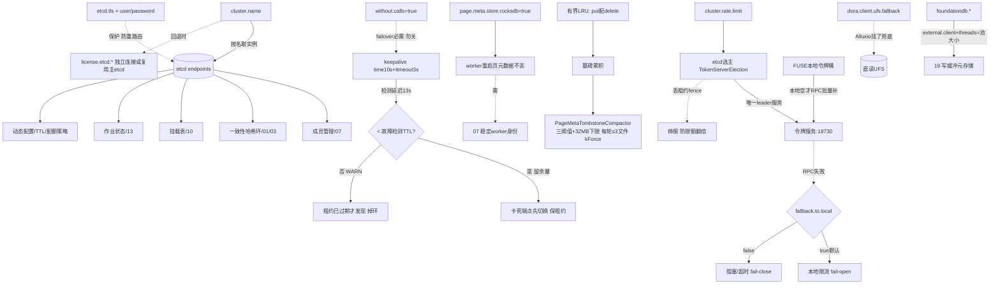

# 14 · 成员管理 / etcd / 一致性哈希 / 集群

> 场景组:`alluxio.etcd.*` + `alluxio.dora.*`(client/worker metastore) + `alluxio.cluster.*` + `alluxio.foundationdb.*` + `license.etcd.*` + `alluxio.node.*`
> 配置数:**56** · 别名 0 · 废弃 0 · 数据来源:`PropertyKey.java` · 生成表:`_data/gen_table.py 14`

---

## 1. 本组概览

etcd 是 DORA 的**协调底座**——成员管理、一致性哈希环、挂载表、作业状态都存 etcd。本组还含 DORA client/worker 的 RocksDB 元存储、集群级 FUSE 限流令牌服务、FoundationDB(可选元存储)、License etcd。多为 `Scope=ALL`。

五个子场景:

| 子场景 | 关键配置 | 核心矛盾 |
|---|---|---|
| etcd 连接 | `etcd.endpoints`、`etcd.tls.*`、`etcd.keepalive.*`、`etcd.username/password` | 稳定/安全 vs 复杂度 |
| Worker RocksDB 元存储 | `dora.worker.metastore.rocksdb.*`、`page.meta.*` | 抗重启 vs 内存/compaction |
| DORA 客户端 | `dora.client.metadata.cache.enabled`、`dora.client.ufs.fallback.enabled` | 性能 vs 新鲜度 |
| 集群 FUSE 限流 | `cluster.rate.limit.*` | 多租户公平 vs 开销 |
| License / FDB | `license.etcd.*`、`foundationdb.*` | 合规/元存储 |

---

## 2. 配置清单速查表(全量 56 项)

### 2.1 etcd 连接与安全
| 配置项 | 默认值 | 类型 | Scope | 说明 |
|---|---|---|---|---|
| `alluxio.etcd.endpoints` | — | list | ALL | etcd 集群地址(http://host:port,逗号分隔)**必配** |
| `alluxio.etcd.username` / `password` | — | string | ALL | etcd 用户/密码 ⚠️敏感 |
| `alluxio.etcd.max.inbound.message.size` | 100MB | dataSize | ALL | etcd 客户端最大入站消息 |
| `alluxio.etcd.num.retries` | 3 | int | ALL | etcd 通信最大重试 |
| `alluxio.etcd.keepalive.time` | 10s | duration | ALL | jetcd gRPC 保活 ping 间隔 |
| `alluxio.etcd.keepalive.timeout` | 3s | duration | ALL | 保活 PONG 超时(检测卡死端点) |
| `alluxio.etcd.keepalive.without.calls` | true | boolean | ALL | 无 RPC 时也发保活(failover 需要) |
| `alluxio.etcd.tls.enabled` | false | boolean | ALL | etcd 通信启用 TLS |
| `alluxio.etcd.tls.ca.cert` / `client.cert` / `client.key` / `client.key.password` | — | string | ALL | etcd TLS 证书链 ⚠️敏感 |
| `alluxio.etcd.tls.client.no.endpoint.identification` | false | boolean | ALL | 不做端点校验 |

### 2.2 Worker RocksDB 元存储与 Page 元数据
| 配置项 | 默认值 | 类型 | Scope | 说明 |
|---|---|---|---|---|
| `alluxio.dora.worker.metastore.rocksdb.dir` | ${work}/metastore | string | WORKER | Dora 元数据 RocksDB 目录 |
| `alluxio.dora.worker.metastore.rocksdb.cache.size` | 128MiB | long | WORKER | 块元数据表 LRU 缓存 |
| `alluxio.dora.worker.metastore.rocksdb.index` / `block.index` | — | enum | WORKER | RocksDB 索引类型 |
| `alluxio.dora.worker.metastore.rocksdb.bloom.filter` | false | boolean | WORKER | 块元表是否用布隆过滤器 |
| `alluxio.dora.worker.metastore.rocksdb.ttl` | -1s | duration | WORKER | Dora 元数据 TTL;≤0 不过期 |
| `alluxio.dora.worker.metastore.rocksdb.cleanup.enabled` | false | boolean | WORKER | 周期清理过期元数据 |
| `alluxio.dora.worker.metastore.rocksdb.cleanup.interval` | 24h | duration | WORKER | 清理间隔 |
| `alluxio.dora.worker.metastore.rocksdb.cleanup.batch.size` | 1000 | int | WORKER | 清理批大小 |
| `alluxio.dora.worker.page.meta.store.rocksdb.enabled` | false | boolean | WORKER | 页元数据持久化到 RocksDB(抗重启) |
| `alluxio.dora.worker.page.meta.compaction.interval` | 30min | duration | WORKER | PageMetaCF tombstone compaction 间隔 |
| `alluxio.dora.worker.page.meta.compaction.min.tombstones` | 10000 | int | WORKER | 触发 compaction 的最小 tombstone 数 |
| `alluxio.dora.worker.page.meta.compaction.tombstone.ratio` | 0.3 | double | WORKER | 触发 compaction 的 tombstone 比例 |

### 2.3 DORA 客户端
| 配置项 | 默认值 | 类型 | Scope | 说明 |
|---|---|---|---|---|
| `alluxio.dora.client.metadata.cache.enabled` | true | boolean | ALL | DORA 客户端元数据缓存(仅只读负载有效) |
| `alluxio.dora.client.ufs.fallback.enabled` | true | boolean | CLIENT | Alluxio 不可用时自动回退直读 UFS |
| `alluxio.dora.job.load.quota.mutual.exclusive` | true | boolean | ALL | 同配额下最多一个 LoadJob 运行 |
| `alluxio.dora.load.job.must.check.quota` | false | boolean | ALL | load 作业必须校验配额 |

### 2.4 集群级 FUSE 限流(令牌服务)
| 配置项 | 默认值 | 类型 | Scope | 说明 |
|---|---|---|---|---|
| `alluxio.cluster.rate.limit.enabled` | false | boolean | ALL | 集群级 per-user FUSE 限流总开关 |
| `alluxio.cluster.rate.limit.server.port` | 18730 | int | ALL | 限流令牌服务端口(coordinator 侧) |
| `alluxio.cluster.rate.limit.batch.fraction` | 0.1 | double | ALL | 每次取令牌占 per-second 限额的比例 |
| `alluxio.cluster.rate.limit.batch.max.size` | 4MB | dataSize | ALL | 单次令牌批上限 |
| `alluxio.cluster.rate.limit.batch.min.size` | 64KB | dataSize | ALL | 单次令牌批下限 |
| `alluxio.cluster.rate.limit.fallback.to.local` | true | boolean | ALL | 令牌服务不可达时本地限流(fail-open) |
| `alluxio.cluster.name` | DefaultAlluxioCluster | string | — | 集群名 |
| `alluxio.node.label` | — | string | ALL | 进程所在节点标签 |

### 2.5 FoundationDB(可选元存储)
| 配置项 | 默认值 | 类型 | Scope | 说明 |
|---|---|---|---|---|
| `alluxio.foundationdb.cluster.file.path` | ${conf}/fdb.cluster | string | ALL | FDB 集群文件路径 |
| `alluxio.foundationdb.external.client.enabled` | true | boolean | ALL | 多线程 FDB 客户端网络 |
| `alluxio.foundationdb.client.threads.per.version` | — | int | ALL | 每 FDB 客户端库版本网络线程 |
| `alluxio.foundationdb.transaction.timeout` | 10sec | duration | ALL | FDB 事务默认超时 |
| `alluxio.foundationdb.transaction.retry.limit` | -1 | int | ALL | FDB 事务冲突重试;-1 无限 |

### 2.6 License etcd
| 配置项 | 默认值 | 类型 | Scope | 说明 |
|---|---|---|---|---|
| `license.etcd.endpoints` | — | list | ALL | license etcd 地址 |
| `license.etcd.username` / `password` | — | string | ALL | license etcd 认证 ⚠️敏感 |
| `license.etcd.connection.initial.timeout.second` | 常量 | int | ALL | 初始连接超时 |
| `license.etcd.connection.error.tolerant.second` | 常量 | int | ALL | 连接错误容忍时长 |
| `license.etcd.listener.disabled` | false | boolean | ALL | 禁用监听新 license |
| `license.etcd.tls.*`(enabled/ca.cert/client.cert/client.key/key.password/no.endpoint.identification) | — | — | ALL | license etcd TLS 链 ⚠️敏感 |

---

## 3. 逐项深度分析(充分细节)

> 本组 56 项按配置族逐一深挖,均**翻代码求证**。主线:etcd 连接(jetcd 客户端构造 `AlluxioEtcdClient`)→ 保活三件套的 failover 机制 → etcd TLS/认证 → Worker RocksDB 元存储(`RocksDBDoraMetaStore` + `RocksStore.checkSetTableConfig`)→ Page 元数据持久化与 tombstone compaction(`PageMetaTombstoneCompactor`)→ DORA 客户端行为 → 集群级 FUSE 限流(`ClusterRateLimitServer/Client` + etcd 选主)→ FoundationDB 初始化(`FDBLibLoader`)→ License etcd(`License.Factory`)→ `cluster.name`/`node.label`。

### 3.1 etcd 连接:整个 DORA 的命脉(`etcd.endpoints` + 连接参数)

etcd 是 DORA 的唯一强协调依赖——**成员管理、一致性哈希环、挂载表、作业/调度状态、动态配置、TTL/配额策略**都以键前缀存于 etcd。客户端为 jetcd(`io.etcd.jetcd.Client`),构造在 `AlluxioEtcdClient`(`dora/core/common/src/main/java/alluxio/membership/AlluxioEtcdClient.java`)。

- **`etcd.endpoints`(必配,list,ALL)**:逗号分隔的 `http://host:port`。多端点是高可用前提——单端点故障时 jetcd 无法故障转移。构造时逐条转为 URI 传给 `Client.builder().endpoints(...)`。
- **`etcd.max.inbound.message.size`(默认 100MB,ALL)**:jetcd gRPC 单条入站消息上限,构造时 `if (maxInboundMessageSize > 0) builder.maxInboundMessageSize(...)`。挂载表/成员列表/批量作业状态较大时,过小会触发 `RESOURCE_EXHAUSTED`;一般无需改。
- **`etcd.username` / `etcd.password`(⚠️敏感,ALL)**:置空则匿名连接;两者非空时 `builder.user(...).password(...)`。description 强调该用户需对前缀 `/` 有完整 readwrite role(整个键空间)。
- **`etcd.num.retries`(默认 3,ALL)**:etcd 通信重试次数,配合 `ExponentialBackoffRetry`(`retryInternal`)——put/get/watch/lease 等操作在瞬时失败时重试,耗尽后抛异常。连接建立超时另由内部常量 `DEFAULT_TIMEOUT_IN_SEC=3s`(`connectTimeout`)与单次 RPC `.get(3s, SECONDS)` 控制。

### 3.2 etcd 保活三件套:failover 的关键(`etcd.keepalive.*`)—— 重点求证

`keepalive.time`(10s)/`keepalive.timeout`(3s)/`keepalive.without.calls`(true),由 `applyKeepAliveConfig(builder, conf)` 静态方法映射到 jetcd 的 `keepaliveTime/keepaliveTimeout/keepaliveWithoutCalls`。这是为解决"etcd 端点卡死(如 defrag)时 gRPC 默认无保活、`LeaseKeepAlive` stream 静默挂起约 60s"而引入的一整套机制(代码注释 AC-6000/AC-7323):

- **`keepalive.time`(10s)**:channel 空闲达此时长即发一次 gRPC HTTP/2 PING,探测端点是否还活着。
- **`keepalive.timeout`(3s)**:发 PING 后等 PONG 的超时;超时即判 channel 断开、触发重连/故障转移。**调小→更快发现卡死端点,但网络抖动下更易误判**。
- **`keepalive.without.calls`(默认 true)—— 不要关**:代码与官方注释均明示 **failover 必需**。原因:长活的服务注册租约靠单一 `LeaseKeepAlive` stream 续租;若关闭"无 RPC 时也保活",gRPC 只在有活跃调用时才发 PING,而 keepalive stream 本身不算"in-flight RPC",于是端点卡死时**探测不到、续租静默挂起、租约到期前无法切换端点**——worker/coordinator 被踢出哈希环。
- **代码级的安全护栏(值得注意)**:`applyKeepAliveConfig` 有两处 `Preconditions.checkArgument` 强制 `keepalive.time > 0` 且 `keepalive.timeout > 0`(设 0/负数直接启动失败)。另有一段 WARN 逻辑:若 **检测延迟 = time + timeout ≥ 有效租约 TTL**(取 `worker.failure.detection.timeout` 与 `coordinator.failure.detection.timeout` 的较小值,见 [07组](07-worker-mgmt.md)),会打印告警——因为"卡死端点在租约已过期后才被发现",节点会先掉环再恢复。**调 keepalive 时必须让 time+timeout 明显小于故障检测超时**(默认 10+3=13s < worker 15s,留 2s 余量)。

### 3.3 etcd TLS 与认证安全(`etcd.tls.*`)

生产必开。`getEtcdClientSslContext` 委托 `SslContextProvider` 构建 Netty `SslContext`,非空时 `builder.sslContext(...)`:

- **`etcd.tls.enabled`(默认 false)**:总开关。
- **证书链(⚠️敏感)**:`tls.ca.cert`(校验 etcd 服务端)、`tls.client.cert` + `tls.client.key`(双向 mTLS 客户端证书)、`tls.client.key.password`(私钥口令)。
- **`etcd.tls.client.no.endpoint.identification`(默认 false)**:置 true 跳过对端点主机名的证书校验——**仅调试/自签场景临时用**,生产开启等于放弃中间人防护。
- **安全取舍**:etcd 存的是"谁能改集群状态"。无 TLS + 无认证时,任何能连到 etcd 端口的人可改成员/哈希环/挂载表 → 数据可被重路由或劫持。生产**必须** TLS + 认证。

### 3.4 Worker RocksDB 元存储(`dora.worker.metastore.rocksdb.*`)—— 块元数据表调优

Worker 侧块元数据存 RocksDB,实现 `RocksDBDoraMetaStore`(`dora/core/server/worker/.../metadata/RocksDBDoraMetaStore.java`)。`cache.size`/`bloom.filter`/`index`/`block.index` 四项经 `RocksStore.checkSetTableConfig` 翻译为 RocksDB `BlockBasedTableConfig`:

- **`rocksdb.dir`(默认 `${work}/metastore`,WORKER)**:元数据库根目录,应落持久盘。
- **`rocksdb.cache.size`(默认 128MiB,WORKER)**:块元数据表的 **LRU block cache**(`new LRUCache(size)` → `setBlockCache`)。热元数据多时上调减少磁盘读。
- **`rocksdb.bloom.filter`(默认 false,WORKER)**:置 true 时 `setFilterPolicy(new BloomFilter())`——加速点查(判断某 key 是否存在),对"存在性检查"密集的元数据访问有益,代价是额外内存/构建开销。
- **`rocksdb.index` / `rocksdb.block.index`(enum,WORKER,unset 用 RocksDB 默认)**:分别设 `IndexType`(`kBinarySearch`/`kHashSearch`/`kTwoLevelIndexSearch`/`kBinarySearchWithFirstKey`,见 `alluxio/rocks/IndexType.java`)与 `DataBlockIndexType`。属高级 RocksDB 调优,无经验建议保持默认。
- **元数据 TTL 与清理**(`rocksdb.ttl` / `cleanup.*`):
  - `rocksdb.ttl`(默认 `-1s`,WORKER):Dora 元数据存活时长,`0s 或负值 = 不过期`。
  - `cleanup.enabled`(默认 false,WORKER):周期清理过期元数据。**代码强约束:清理线程仅在 `cleanup.enabled=true` 且 `ttl > 0` 时才启动**(`if (mCleanupEnabled && mMetaTTL > 0)`)——只开 cleanup 不设正 TTL 无效。
  - `cleanup.interval`(默认 24h,WORKER):`scheduleAtFixedRate` 清理周期。
  - `cleanup.batch.size`(默认 1000,WORKER):每批删除的过期条目数,控单次清理对 RocksDB 的冲击。

### 3.5 Page 元数据持久化 + tombstone compaction(`page.meta.*`)—— 抗重启与 LSM 删除放大

这是本组最值得展开的 worker 机制。

- **`page.meta.store.rocksdb.enabled`(默认 false,WORKER)**:客户端/worker 页缓存的**页元数据后端选择**(`PageMetaStore.create`):
  - `true` → `RocksdbPageMetaBackend`(元数据落 RocksDB,**worker 重启后页元数据不丢**,配合 [07组](07-worker-mgmt.md) 稳定 worker 身份可直接恢复缓存归属,免冷启动重建)。
  - `false`(默认)→ `MemoryPageMetaBackend`(内存,重启即失,需重新拉取/重建)。
  - 大缓存 worker 强烈建议开启,把"重启后缓存失效"降为"重启后立即命中"。
- **tombstone compaction 三阈值**(`page.meta.compaction.*`)—— 由 `PageMetaTombstoneCompactor` 实现:
  - **为什么需要**:页缓存是**有界 LRU**,每插入一页就淘汰一页,即每个 `put` 都配一个 `delete`(打 tombstone)。RocksDB 的删除只是打墓碑,累积后 `getPagesOfFile`/`scanAllPages` 等 range scan 要跨过大量死键——典型的"删除密集 LSM 延迟悬崖"。
  - **`compaction.interval`(默认 30min)**:两轮 compaction 的固定延迟(`scheduleWithFixedDelay`,上一轮跑完才排下一轮,永不重叠/堆积)。间隔越短墓碑积得越少、但 IO 更频繁。
  - **`compaction.min.tombstones`(默认 10000)**:单个 SST 文件至少含这么多墓碑才够格被压缩——避免压小文件(小文件正常 compaction 已能廉价处理)。
  - **`compaction.tombstone.ratio`(默认 0.3)**:单 SST 墓碑占比(`numDeletions / numEntries`)达此比例才够格。
  - **选文件策略(代码细节)**:每轮只挑**同时满足**三阈值(外加硬编码 `MIN_SST_SIZE_BYTES=32MB` 下限)且未在压缩中的 SST,按墓碑数降序、**每轮最多 3 个文件**(`MAX_FILES_PER_ROUND`),对每个文件的 key 区间 `compactRange`。用 `setExclusiveManualCompaction(false)`(不暂停同实例 `FileStatusCF` 的自动 compaction)+ `BottommostLevelCompaction.kForce`(强制压到最底层,已沉底的墓碑真正丢弃而非搬移)。这是"只重写最脏的少数文件"而非"定时全量重写整个列族"的精细设计。
  - **高删除率 worker(缓存频繁淘汰)需重点关注这三值**;墓碑清理不及时会拖慢元数据 range 读。

### 3.6 DORA 客户端行为(`dora.client.*` + load 配额约束)

- **`dora.client.metadata.cache.enabled`(默认 true,ALL,`ENFORCE`)**:DORA 客户端元数据缓存。description 明确 **仅对只读负载有效**——读写混合下缓存可能返回陈旧元数据,不要依赖它保证新鲜度。`ENFORCE` 意味全集群需一致。
- **`dora.client.ufs.fallback.enabled`(默认 true,CLIENT)**:**可用性兜底**——Alluxio 服务不可用时客户端**自动绕过缓存层直读 UFS**。缓存层整体故障时业务不中断(仅变慢/无缓存加速)。生产建议保持开启。
- **load 作业配额约束**(与 [19组](19-write-ttl-quota.md) 配额联动):
  - `dora.job.load.quota.mutual.exclusive`(默认 true,ALL):同一配额下**最多一个 LoadJob 在跑**,防多作业争抢同配额空间导致互相踩踏/超限。
  - `dora.load.job.must.check.quota`(默认 false,ALL):置 true 则 load 作业**必须**关联并校验配额信息才能满足加载要求(强约束"载入前先看配额")。

### 3.7 集群级 FUSE 限流(`cluster.rate.limit.*`)—— 令牌服务 + etcd 选主

多租户 FUSE 环境下按 per-user 限 IO 带宽。架构:coordinator 侧全局令牌服务(Sentinel cluster flow control,`ClusterRateLimitServer`)+ FUSE 侧本地令牌桶客户端(`ClusterRateLimitClient`)。

- **`cluster.rate.limit.enabled`(默认 false,ALL)**:总开关。关时限流器根本不构造,IO 路径零开销;开时 coordinator 起 `RateLimitService`。
- **`cluster.rate.limit.server.port`(默认 18730,ALL)**:令牌服务监听端口(Sentinel Netty transport,无外部 Redis/ZK);FUSE 客户端连此端口取令牌。
- **热路径设计(为何几乎零开销)**:客户端 `consumeOrWait(dimension, uid, bytes)` **先走本地令牌桶** `tryConsumeNow`(≈ 一次原子操作,无 RPC、无时钟读);只有本地桶空、需**批量补充**时才发一次 RPC 向全局服务申请一批令牌(`SphU.entry(resource, batch)`),一次 RPC 摊薄到整批。`settle()` 还会把"预留但未用完"的令牌退回本地桶,使全局配额按**实际传输字节**计量(短读/EOF/失败不多算)。
- **批量参数(`batch.*`,决定单次取多少令牌)**——`newBucket` 公式:`target = min(max.size, max(min.size, limitBytesPerSec × fraction))`,再 `batch = max(1, min(target, limitBytesPerSec))`:
  - `batch.fraction`(默认 0.1,double,ALL):每次取 per-second 限额的比例。fraction 大→单次取多、RPC 更少但突发性更强(短时可超瞬时速率)。
  - `batch.max.size`(默认 4MB,ALL):单批上限,`Integer.MAX_VALUE` 封顶。
  - `batch.min.size`(默认 64KB,ALL):单批下限。
  - **代码护栏**:`batch` 被强制 `≤ limitBytesPerSec`,否则单次补充永远拿不到(全局窗口一秒的令牌都不够一批),低速租户会饿死;`watermark = batch/4` 作为提前补充的水位线。
- **`cluster.rate.limit.fallback.to.local`(默认 true,fail-open)**:映射到 Sentinel `setFallbackToLocalWhenFail`——**令牌服务 RPC 失败时是否退化为本地限流**。
  - `true`(默认):**fail-open**,服务不可达时各客户端本地按限额执行,不阻断 IO(牺牲跨客户端全局精确性换可用性)。
  - `false`:**fail-close**,服务不可达时请求阻塞/超时,直到服务恢复(严格全局限流优先,但令牌服务成 IO 硬依赖)。
- **HA:令牌服务走 etcd 选主(`TokenServerElection`,重点)**:配了 `etcd.endpoints` 时,令牌服务生命周期跟随**leader 选举**——只有**赢得选举**的 coordinator 才起服务,**丢租约立即 fence(停服)**。这样故障转移期间**绝不会有两个服务同时发令牌把集群限额翻倍**;FUSE 客户端通过 `observeLeader` 发现并跟随新 leader(`assignServer` 重连)。赢选举但服务起不来会立即 resign 让位。无 etcd 时退化为"单 coordinator 直接起服务"。停服顺序刻意为"先停服务再让位",避免新旧 leader 短暂同时服务。

### 3.8 FoundationDB(`foundationdb.*`)—— 写缓冲元存储底座的连接层

FDB 是[19组](19-write-ttl-quota.md)写缓冲(PFS)在 `file.metadata.storage=FDB` 或 `dual.buffer.file.system.type=GENERIC_FDB_BACKED_V2` 时的**元数据硬依赖**。连接初始化在 `FDBLibLoader`(`dora/core/common/.../lib/FDBLibLoader.java`),细节值得注意:

- **`foundationdb.cluster.file.path`(默认 `${conf}/fdb.cluster`,ALL)**:FDB 集群文件(含协调者地址),`fdb.open(clusterFilePath)` 用它建连。
- **`foundationdb.external.client.enabled`(默认 true,ALL)**:启用 FDB **多线程客户端网络**。开启后 `setExternalClientLibrary(独立 .so 副本) + setDisableLocalClient()`——为此 `FDBLibLoader` 特意把 `libfdb_c` 额外复制到 `external/` 子目录(因为 `dlopen` 按路径去重,外部客户端库必须与主库不同路径才能拿到新 handle)。⚠️ **进程级单例约束**:`FDB.selectAPIVersion(730)` 返回进程级单例,`setExternalClientLibrary`/`setClientThreadsPerVersion` 必须在**第一个 Database 打开(网络启动)之前**设好——首个调用者定终身。
- **`foundationdb.client.threads.per.version`(int,ALL,0=自动检测)**:每个 FDB 客户端库版本的网络线程数。**它同时是连接池大小**——`openDatabasePool` 创建 N=threadsPerVersion 个 `Database` 实例,每次 `fdb.open()` 轮询分配到不同客户端线程,使操作分散到 N 条网络线程(仅在 external client 启用时生效)。高并发写缓冲元操作时上调可提吞吐。
- **`foundationdb.transaction.timeout`(默认 10sec,ALL)**:事务默认超时,`if (txnTimeoutMs > 0) setTransactionTimeout(...)`,`0=无超时`。⚠️ description 提醒:FDB 自身仍强制 **5 秒读版本陈旧上限**,超时设太大也绕不过 FDB 的 5s read-version 约束。
- **`foundationdb.transaction.retry.limit`(默认 -1,ALL)**:事务冲突重试上限,`if (txnRetryLimit >= 0) setTransactionRetryLimit(...)`,`-1=无限重试`(FDB 默认)。高冲突场景设有限值可避免个别事务无限重试。

### 3.9 License etcd(`license.etcd.*`)—— 独立/复用的许可连接

License 校验(`EnterpriseLicenseChecker`)从 etcd 读取许可字符串。连接由 `License.Factory.licenseEtcdClient()` 决策(`dora/core/common/.../license/License.java`):

- **`license.etcd.endpoints`(list,ALL)**:**若显式设置**,则**构建一个独立的 `AlluxioEtcdClient`**(许可专用,retries 固定 3),带自己的认证与 TLS——即许可 etcd 可与主集群 etcd **物理分离**(如统一许可中心)。
- **若未设置**:回退复用主集群 etcd(`AlluxioEtcdClientHub.getClientInstance(alluxio.cluster.name)`)——即 `cluster.name` 也间接决定许可连接落到哪个 etcd。
- **认证与 TLS(⚠️敏感)**:`license.etcd.username`/`password` + 完整 TLS 链 `tls.enabled`/`ca.cert`/`client.cert`/`client.key`/`client.key.password`/`client.no.endpoint.identification`,语义与 3.3 主 etcd 完全对应,经同一 `getEtcdClientSslContext` 构建。
- **`license.etcd.connection.initial.timeout.second`(常量默认)**:建立初始连接的超时。
- **`license.etcd.connection.error.tolerant.second`(常量默认)**:初次连上后可容忍的连接错误持续时长(超过才判失败)。
- **`license.etcd.listener.disabled`(默认 false,ALL,`ENFORCE`)**:禁用监听新 license 字符串的 etcd listener(即不再热更新许可)。

### 3.10 `cluster.name` 与 `node.label`

- **`alluxio.cluster.name`(默认 `DefaultAlluxioCluster`)—— 非纯装饰,load-bearing**:是**多集群/联邦**的身份键,被广泛消费:etcd membership 客户端按它取实例(`AlluxioEtcdClientHub.getClientInstance(clusterName)`)、多集群成员视图、load/rebalance 作业用它标识"本集群"、写缓冲 FDB 的 `EtcdFileMetaDAO`、动态配置 `EtcdDynamicConfiguration`,以及 3.9 的 license etcd 回退。**多集群共享同一 etcd 时必须各自唯一**,否则成员/配置/作业串台。
- **`alluxio.node.label`(string,ALL)**:进程所在节点的标签,用于按节点标签做放置/亲和等标注(拓扑感知场景)。

---

## 4. 配置关联关系图

---

## 5. 典型场景配置组合建议

| 场景 | 推荐组合 | 理由 |
|---|---|---|
| **生产 etcd** | 多 `endpoints` + `tls.enabled` + 证书链/认证 + 保持 `keepalive.without.calls=true` | 高可用 + 安全 + failover |
| **etcd keepalive 调优** | 保持 `time+timeout`(默认 13s)明显 < worker/coordinator 故障检测超时(默认 15s) | 卡死端点在租约过期前被发现,避免掉环(否则 3.2 会打 WARN) |
| **worker 快速重启恢复** | `page.meta.store.rocksdb.enabled=true` + 稳定身份(07) + `rocksdb.dir` 落持久盘 | 重启页元数据不丢,免冷启动重建 |
| **高删除率 worker(缓存频繁淘汰)** | 调低 `page.meta.compaction.interval` / 调低 `min.tombstones`·`tombstone.ratio` | 更快清墓碑,防 range 读悬崖(注意 IO 更频繁) |
| **元数据无限增长** | `rocksdb.ttl`>0s **且** `cleanup.enabled=true`(两者缺一不启动清理) | 周期清理过期元数据 |
| **热元数据/点查密集** | 上调 `rocksdb.cache.size` + 开 `rocksdb.bloom.filter` | LRU 命中 + 布隆加速存在性检查 |
| **多租户 FUSE 公平** | `cluster.rate.limit.enabled=true` + etcd 选主(配 `etcd.endpoints`) + 调 `batch.*` | per-user 全局限流,leader 唯一防限额翻倍 |
| **限流严格 vs 可用** | `fallback.to.local=true`(默认,fail-open)/ `false`(fail-close) | 令牌服务不可达时:不阻断 IO / 严格拒绝 |
| **缓存层高可用兜底** | 保持 `dora.client.ufs.fallback.enabled=true` | Alluxio 挂了业务不中断(直读 UFS) |
| **写缓冲高吞吐(FDB)** | `foundationdb.external.client.enabled=true` + 上调 `client.threads.per.version` | 多线程网络 + 连接池随线程数扩(仅 external 生效) |
| **许可 etcd 独立** | 显式配 `license.etcd.endpoints` + 独立 TLS/认证 | 许可连接与主集群 etcd 物理分离 |
| **多集群共享 etcd** | 各集群唯一 `cluster.name` | 成员/动态配置/作业身份隔离,防串台 |

---

## 6. 风险与注意事项

1. **etcd 是单点依赖命脉**:etcd 不可用会影响成员/路由/挂载/调度/动态配置/TTL/配额策略——务必高可用部署(多 `endpoints`)+ 监控。
2. **etcd 无认证/无 TLS 的风险**:任何能连端口者可改成员/哈希环/挂载表 → 数据可被重路由劫持;生产必须 TLS + 认证,勿在生产开 `no.endpoint.identification`。
3. **⚠️ 关 `keepalive.without.calls` 破坏 failover**:代码/官方明示 failover 必需(单一 `LeaseKeepAlive` stream 卡死时无法探测),勿关;`keepalive.time`/`timeout` 设 0/负数直接启动失败。
4. **⚠️ keepalive 检测延迟须 < 租约 TTL**:`time+timeout` ≥ `worker/coordinator.failure.detection.timeout` 时,卡死端点在租约过期后才被发现 → 节点先掉环再恢复(3.2 会打 WARN)。调 keepalive 必须留余量。
5. **`page.meta.store.rocksdb.enabled=false` 时重启丢页元数据**:大缓存 worker 重启后需重建,冷启动慢;开启并配稳定身份(07)可秒级恢复。
6. **RocksDB 元数据清理需双条件**:`cleanup.enabled=true` **且** `ttl>0s` 才启动清理线程,只开一个无效,过期元数据不清理会无限增长。
7. **高删除率 worker 的墓碑悬崖**:有界 LRU 每 put 配 delete,墓碑不及时压缩会拖慢元数据 range 读;关注 `page.meta.compaction.*` 三阈值。
8. **`fallback.to.local=false` 的 fail-close**:令牌服务不可达时 IO 阻塞/超时,令牌服务成硬依赖,评估可用性影响。
9. **限流令牌服务须走 etcd 选主**:配了 `etcd.endpoints` 才有 leader 唯一性保证;否则单 coordinator 假设下,多 coordinator 场景可能限额翻倍。
10. **FDB 是写缓冲硬依赖且进程级单例**:`external.client`/`threads.per.version` 必须在首个 Database 打开前设定;FDB 自身仍有 5s read-version 陈旧上限,`transaction.timeout` 设再大也绕不过。
11. **`cluster.name` 多集群必须唯一**:是 membership/动态配置/作业/许可回退的身份键,共享 etcd 时同名会串台。
12. **敏感项走密管**:`etcd.password`/`license.etcd.password`、各 TLS `client.key.password`、证书文件等凭证脱敏、走密钥管理([17组](17-security.md))。

---

## 跨组关联速览
- [07-worker-mgmt](07-worker-mgmt.md) —— worker 成员管理(etcd/static)、稳定身份
- [01-client-fs-io](01-client-fs-io.md) / [03-client-net-rpc](03-client-net-rpc.md) —— 一致性哈希环/worker 选择
- [13-coordinator-master](13-coordinator-master.md) —— 调度器用 etcd 存作业状态
- [16-fuse](16-fuse.md) —— FUSE 限流客户端
- [17-security](17-security.md) —— 凭证/密钥管理

---

## 附录A:本组全量配置清单(脚本生成)

> 由 `_data/gen_table.py 14-membership-etcd` 生成,逐 key 一行,保证覆盖本组**全部 56 项**(与上文按子场景组织的中文速查表互补;此处描述为官方英文原文,便于精确检索)。

| 配置项 | 默认值 | 类型 | Scope | 一致性 | 状态 | 说明 |
|---|---|---|---|---|---|---|
| `alluxio.cluster.name` | "DefaultAlluxioCluster" | string | — | — | — | — |
| `alluxio.cluster.rate.limit.batch.fraction` | 0.1 | double | ALL | WARN | — | Fraction of a tenant's per-second limit that each FUSE client fetches from the token server per refill (one RPC amortized across the batch). Larger... |
| `alluxio.cluster.rate.limit.batch.max.size` | "4MB" | dataSize | ALL | WARN | — | Upper bound on the per-refill token batch a FUSE client fetches from the rate-limit token server. Caps how many tokens a single client can hold loc... |
| `alluxio.cluster.rate.limit.batch.min.size` | "64KB" | dataSize | ALL | WARN | — | Lower bound on the per-refill token batch a FUSE client fetches from the rate-limit token server. |
| `alluxio.cluster.rate.limit.enabled` | false | boolean | ALL | WARN | — | Whether the cluster-wide per-user FUSE rate limiter is enabled. When false the limiter is not constructed and adds zero overhead on the I/O path. |
| `alluxio.cluster.rate.limit.fallback.to.local` | true | boolean | ALL | WARN | — | When the rate-limit token server is unreachable, whether each FUSE client falls back to enforcing the limit locally (fail-open). When false, reques... |
| `alluxio.cluster.rate.limit.server.port` | 18730 | int | ALL | WARN | — | The port the cluster rate-limit token server listens on (coordinator side) and that FUSE token clients connect to. |
| `alluxio.dora.client.metadata.cache.enabled` | true | boolean | ALL | ENFORCE | — | Whether to enable metadata cache for dora client. This is only valid for read only workloads. |
| `alluxio.dora.client.ufs.fallback.enabled` | true | boolean | CLIENT | IGNORE | — | Whether the client automatically falls back to using the UFS for I/O operations when Alluxio service becomes unavailable. |
| `alluxio.dora.job.load.quota.mutual.exclusive` | true | boolean | ALL | ENFORCE | — | Need to limit the number of LoadJobs running at most to one under the same quota? |
| `alluxio.dora.load.job.must.check.quota` | false | boolean | ALL | ENFORCE | — | The load job is associated with quota. If it is associated,the load job needs the quota information to meet the load requirements. |
| `alluxio.dora.worker.metastore.rocksdb.block.index` | — | enum | WORKER | ENFORCE | — | The block index type to be used in the RocksDB block metadata table. If unset, the RocksDB default will be used.See https://rocksdb.org/blog/2018/0... |
| `alluxio.dora.worker.metastore.rocksdb.bloom.filter` | false | boolean | WORKER | ENFORCE | — | Whether or not to use a bloom filter in the Block meta table in RocksDB. If unset, the RocksDB default will be used. See https://github.com/faceboo... |
| `alluxio.dora.worker.metastore.rocksdb.cache.size` | 128L * 1024 * 1024 | long | WORKER | ENFORCE | — | The capacity in bytes of the RocksDB block metadata table LRU cache. If unset, the RocksDB default will be used. See https://github.com/facebook/ro... |
| `alluxio.dora.worker.metastore.rocksdb.cleanup.batch.size` | 1000 | int | WORKER | WARN | — | The batch size for cleaning up expired metadata in RocksDB metastore. When expired entries are found, they will be deleted in batches of this size. |
| `alluxio.dora.worker.metastore.rocksdb.cleanup.enabled` | false | boolean | WORKER | WARN | — | When set to true, the system will periodically cleanup expired metadata entries in the RocksDB-based metastore on workers, helping to optimize stor... |
| `alluxio.dora.worker.metastore.rocksdb.cleanup.interval` | "24h" | duration | WORKER | WARN | — | The interval between automatic cleanup runs for expired metadata in RocksDB metastore |
| `alluxio.dora.worker.metastore.rocksdb.dir` | format("${%s}/metastore", Name.WORK_DIR) | string | WORKER | WARN | — | The base dir of RocksDB to store Dora metadata |
| `alluxio.dora.worker.metastore.rocksdb.index` | — | enum | WORKER | ENFORCE | — | The index type to be used in the RocksDB block metadata table. If unset, the RocksDB default will be used. See https://github.com/facebook/rocksdb/... |
| `alluxio.dora.worker.metastore.rocksdb.ttl` | "-1s") // -1s means no expiry .setDescription("The TTL (Time To Live) in duration of RocksDB of Dora metadata. " + "0s or negative value means no expiry" | duration | WORKER | WARN | — | The TTL (Time To Live) in duration of RocksDB of Dora metadata. 0s or negative value means no expiry |
| `alluxio.dora.worker.page.meta.compaction.interval` | "30min" | duration | WORKER | WARN | — | The delay between PageMetaCF tombstone-compaction rounds. Each round compacts at most a few of the densest SST files, so a short interval keeps tom... |
| `alluxio.dora.worker.page.meta.compaction.min.tombstones` | 10000 | int | WORKER | WARN | — | An SST file in PageMetaCF is eligible for tombstone compaction only when it holds at least this many delete tombstones. Guards against compacting s... |
| `alluxio.dora.worker.page.meta.compaction.tombstone.ratio` | 0.3 | double | WORKER | WARN | — | An SST file in PageMetaCF is eligible for tombstone compaction only when the fraction of its entries that are delete tombstones reaches this ratio.... |
| `alluxio.dora.worker.page.meta.store.rocksdb.enabled` | false | boolean | WORKER | WARN | — | When set to true, the worker persists page metadata in the RocksDB-backed metastore so it survives worker restarts. When false (default), page meta... |
| `alluxio.etcd.endpoints` | — | list | ALL | — | — | A list of comma-separated http://host:port addresses of etcd cluster (e.g. http://localhost:2379,http://etcd1:2379) |
| `alluxio.etcd.keepalive.time` | "10s" | duration | ALL | — | — | gRPC HTTP/2 keepalive ping interval for the jetcd client. When the channel is idle for this long, a PING is sent so a stalled etcd endpoint (e.g. d... |
| `alluxio.etcd.keepalive.timeout` | "3s" | duration | ALL | — | — | How long the jetcd client waits for a keepalive PONG before marking the gRPC channel as broken. Lower values detect stalled endpoints faster but in... |
| `alluxio.etcd.keepalive.without.calls` | true | boolean | ALL | — | — | Whether the jetcd client sends keepalive pings even when no RPCs are in flight. Required for failover when the only active stream (e.g. LeaseKeepAl... |
| `alluxio.etcd.max.inbound.message.size` | "100MB" | dataSize | ALL | — | — | The maximum inbound message size for Etcd client. |
| `alluxio.etcd.num.retries` | 3 | int | ALL | — | — | Number of max retries when communicating with Etcd. |
| `alluxio.etcd.password` | — | string | ALL | — | — | User password for communication with Etcd. |
| `alluxio.etcd.tls.ca.cert` | — | string | ALL | — | — | CA cert file for communication with Etcd. |
| `alluxio.etcd.tls.client.cert` | — | string | ALL | — | — | Client cert file for communication with Etcd. |
| `alluxio.etcd.tls.client.key` | — | string | ALL | — | — | Client key file for communication with Etcd. |
| `alluxio.etcd.tls.client.key.password` | — | string | ALL | — | — | Client key password for communication with Etcd. |
| `alluxio.etcd.tls.client.no.endpoint.identification` | false | boolean | ALL | — | — | The client has no endpoint identification |
| `alluxio.etcd.tls.enabled` | false | boolean | ALL | — | — | Enable TLS for communication with Etcd. |
| `alluxio.etcd.username` | — | string | ALL | — | — | Username for communication with Etcd.Make sure the given user has the full readwrite role permission on all keys with prefix '/'. Refer to etcd off... |
| `alluxio.foundationdb.client.threads.per.version` | — | int | ALL | — | — | Number of network threads per FDB client library version. Only effective when external client directory is configured. 0 means auto-detect (availab... |
| `alluxio.foundationdb.cluster.file.path` | format("${%s}/fdb.cluster", Name.CONF_DIR) | string | ALL | — | — | — |
| `alluxio.foundationdb.external.client.enabled` | true | boolean | ALL | — | — | Whether to enable FDB multi-threaded client networking. When enabled, uses the native client library directory as the external client directory to ... |
| `alluxio.foundationdb.transaction.retry.limit` | -1 | int | ALL | — | — | Maximum number of retries for FDB transactions on conflict. -1 means unlimited retries (FDB default). |
| `alluxio.foundationdb.transaction.timeout` | "10sec" | duration | ALL | — | — | Default transaction timeout in milliseconds for FDB transactions. 0 means no timeout. Note that FDB still enforces a 5-second read version stalenes... |
| `alluxio.node.label` | — | string | ALL | — | — | The label of node where this process resides |
| `license.etcd.connection.error.tolerant.second` | LicenseConstants.LICENSE_ETCD_CONNECTION_ERROR_TOLERANT_SECOND | int | ALL | ENFORCE | — | The max tolerant time of the etcd connection errors after initial connection |
| `license.etcd.connection.initial.timeout.second` | Integer.parseInt( LicenseConstants.LICENSE_ETCD_CONNECTION_INITIAL_TIMEOUT_SECOND) | int | ALL | ENFORCE | — | The timeout to establish initial connection to ETCD |
| `license.etcd.endpoints` | — | list | ALL | — | — | A list of comma-separated http://host:port addresses of license etcd cluster (e.g. http://localhost:2379,http://etcd1:2379) |
| `license.etcd.listener.disabled` | false | boolean | ALL | ENFORCE | — | Whether to disable ETCD listener that listens for new license string. |
| `license.etcd.password` | — | string | ALL | — | — | User password for communication with license Etcd. |
| `license.etcd.tls.ca.cert` | — | string | ALL | — | — | CA cert file for communication with license Etcd. |
| `license.etcd.tls.client.cert` | — | string | ALL | — | — | Client cert file for communication with license Etcd. |
| `license.etcd.tls.client.key` | — | string | ALL | — | — | Client key file for communication with license Etcd. |
| `license.etcd.tls.client.key.password` | — | string | ALL | — | — | Client key password for communication with license Etcd. |
| `license.etcd.tls.client.no.endpoint.identification` | false | boolean | ALL | — | — | Whether to disable endpoint identification for communication with license Etcd. |
| `license.etcd.tls.enabled` | false | boolean | ALL | — | — | Whether to enable TLS for communication with license Etcd. |
| `license.etcd.username` | — | string | ALL | — | — | Username for communication with license Etcd.Make sure the given user has the full readwrite role permission on all keys with prefix '/'. Refer to ... |
