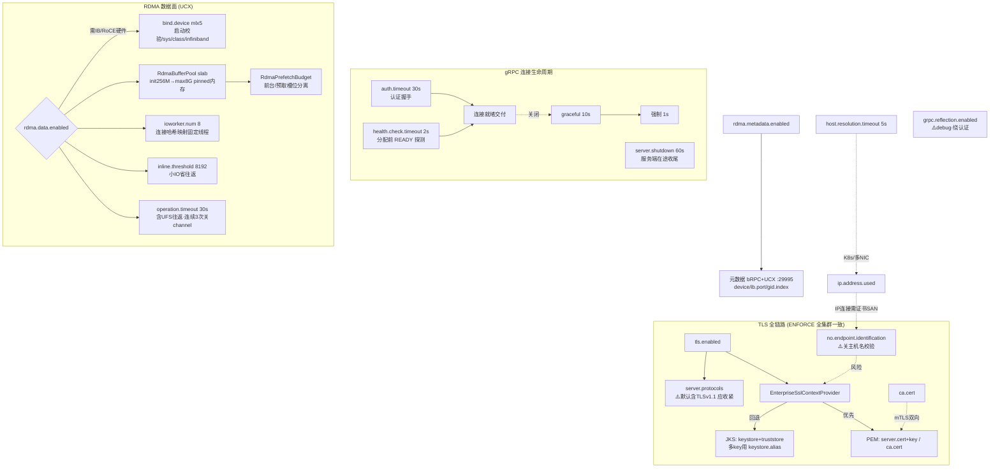

# 15 · 全局网络 / gRPC / 传输(TLS / RDMA)

> 场景组:`alluxio.network.*`(通用连接 + TLS + RDMA)+ `alluxio.grpc.*`
> 配置数:**41** · 别名 3 · 废弃 0 · 数据来源:`PropertyKey.java` · 生成表:`_data/gen_table.py 15`

---

## 1. 本组概览

本组是**跨所有角色的全局传输层**:连接生命周期(超时/关闭)、TLS 全链路加密、RDMA 高性能传输(数据面 + 元数据面)、gRPC 反射。区别于 [03](03-client-net-rpc.md)(客户端)/[06](06-worker-net-rpc.md)(worker),本组是**全局共享**的网络参数。

三个子场景:

| 子场景 | 关键配置 | 核心矛盾 |
|---|---|---|
| 连接生命周期 | `connection.auth.timeout`、`connection.*.shutdown.timeout`、`host.resolution.timeout` | 快速失败 vs 误杀 |
| TLS 全链路 | `tls.enabled`、`tls.keystore.*`、`tls.truststore.*`、`tls.server.protocols` | 安全 vs 性能/运维 |
| RDMA | `rdma.data.*`(数据面)、`rdma.metadata.*`(元数据面) | 极致性能 vs 硬件依赖 |

---

## 2. 配置清单速查表(全量 41 项)

### 2.1 连接生命周期与 gRPC
| 配置项 | 默认值 | 类型 | Scope | 说明 |
|---|---|---|---|---|
| `alluxio.network.connection.auth.timeout` | 30sec | duration | ALL | 等待认证响应的最大时间 |
| `alluxio.network.connection.health.check.timeout` | 2s | duration | ALL | 分配连接前健康检查时长(别名 .ms) |
| `alluxio.network.connection.server.shutdown.timeout` | 60sec | duration | SERVER | gRPC 服务关闭最长等待 |
| `alluxio.network.connection.shutdown.graceful.timeout` | 10s | duration | ALL | 连接优雅关闭最长等待 |
| `alluxio.network.connection.shutdown.timeout` | 1s | duration | ALL | 优雅关闭后强制关闭等待 |
| `alluxio.network.host.resolution.timeout` | 5sec | duration | ALL | 主机名可解析性判定超时(别名 .ms) |
| `alluxio.network.ip.address.used` | false | boolean | ALL | 未配 hostname/bind.host 时用 IP 作连接地址 |
| `alluxio.network.netty.heartbeat.timeout` | 30sec | duration | — | 无流量多久关闭 netty 连接(别名 .ms) |
| `alluxio.grpc.reflection.enabled` | false | boolean | ALL | 启用 gRPC 反射(便于 grpcurl 等工具) |

### 2.2 TLS 全链路
| 配置项 | 默认值 | 类型 | Scope | 说明 |
|---|---|---|---|---|
| `alluxio.network.tls.enabled` | false | boolean | ALL | 全网络(客户端/master/worker)启用 TLS |
| `alluxio.network.tls.keystore.path` | — | string | ALL | keystore(JKS)路径 |
| `alluxio.network.tls.keystore.password` | — | string | ALL | keystore 密码 ⚠️敏感 |
| `alluxio.network.tls.keystore.key.password` | — | string | ALL | keystore 中 key 密码 ⚠️敏感 |
| `alluxio.network.tls.keystore.alias` | — | string | SERVER | 多 key 时指定别名 |
| `alluxio.network.tls.truststore.path` | — | string | ALL | truststore(JKS)路径(客户端侧) |
| `alluxio.network.tls.truststore.password` | — | string | ALL | truststore 密码 ⚠️敏感 |
| `alluxio.network.tls.ca.cert` | — | string | CLIENT | CA 证书(验证服务端证书) |
| `alluxio.network.tls.server.cert` | — | string | SERVER | 服务端证书 |
| `alluxio.network.tls.server.key.password` | — | string | SERVER | 服务端 key 密码 ⚠️敏感 |
| `alluxio.network.tls.server.protocols` | TLSv1.1,1.2,1.3 | list | SERVER | 启用的 TLS 协议 |
| `alluxio.network.tls.client.no.endpoint.identification` | false | boolean | ALL | 不校验服务端主机名(不安全) |
| `alluxio.network.tls.ssl.context.provider.classname` | EnterpriseSslContextProvider | class | ALL | SSL 上下文提供类 |

### 2.3 RDMA 数据面
| 配置项 | 默认值 | 类型 | Scope | 说明 |
|---|---|---|---|---|
| `alluxio.network.rdma.data.enabled` | false | boolean | ALL | 启用 RDMA 数据传输(客户端+worker) |
| `alluxio.network.rdma.data.bind.device` | — | string | ALL | RDMA 设备名(如 mlx5_0:1) |
| `alluxio.network.rdma.data.bind.host` / `hostname` | 0.0.0.0 / — | string | — | RDMA 数据服务绑定/主机 |
| `alluxio.network.rdma.data.port` | 59999 | int | ALL | RDMA 数据服务端口 |
| `alluxio.network.rdma.data.buffer.pool.initial.size` | 256MB | dataSize | — | RDMA 注册缓冲池初始预算 |
| `alluxio.network.rdma.data.buffer.pool.max.size` | 8GB | dataSize | — | RDMA 缓冲池上限(满则停预取) |
| `alluxio.network.rdma.data.buffer.pool.prewarm.size` | 256MB | dataSize | — | 启动预热的 4MB chunk 池大小 |
| `alluxio.network.rdma.data.ioworker.num` | 8 | int | — | RDMA IO worker 线程 |
| `alluxio.network.rdma.data.inline.threshold` | 8192 | int | — | 小于此字节尝试 RDMA inline write |
| `alluxio.network.rdma.data.channel.idle.timeout.ms` | 30s | duration | — | RDMA channel 空闲超时 |
| `alluxio.network.rdma.data.operation.timeout.ms` | 30s | duration | — | RDMA 操作超时(含 worker 侧 UFS IO) |
| `alluxio.network.rdma.data.trace.enabled` | false | boolean | — | RDMA 传输 trace 统计 |
| `alluxio.network.rdma.data.trace.print.interval.ms` | 20s | duration | — | trace 打印间隔 |

### 2.4 RDMA 元数据面
| 配置项 | 默认值 | 类型 | Scope | 说明 |
|---|---|---|---|---|
| `alluxio.network.rdma.metadata.enabled` | false | boolean | ALL | worker RDMA 元数据服务开关 |
| `alluxio.network.rdma.metadata.port` | 29995 | int | ALL | RDMA 元数据服务端口 |
| `alluxio.network.rdma.metadata.device` | — | string | ALL | 元数据服务 RDMA 设备 |
| `alluxio.network.rdma.metadata.gid.index` | -1 | int | ALL | RDMA GID 索引;负=默认 |
| `alluxio.network.rdma.metadata.ib.port` | 1 | int | ALL | RDMA IB 端口 |

---

## 3. 逐项深度分析(充分细节)

> 本组 41 项按配置族逐一深挖,均已翻代码求证:连接生命周期(gRPC channel/server 超时)→ 主机名解析 → netty 心跳 → gRPC 反射 → **TLS 全链路(`EnterpriseSslContextProvider` 双证书模式 + keystore alias 选择 + 协议/主机名校验)** → **RDMA 数据面(UCX 传输、注册缓冲池 slab 分配器、IoWorker、inline、超时/空闲驱逐)** → **RDMA 元数据面(bRPC + UCX)**。权威代码位置:`alluxio.grpc.*`(GrpcChannel/GrpcChannelPool/GrpcServerBuilder)、`alluxio.util.network.tls.EnterpriseSslContextProvider`、`alluxio.rdma.*`(RdmaNode/RdmaBufferPool/RdmaChannel/RdmaChannelPool/RdmaPrefetchBudget)、`alluxio.worker.rdma.RdmaServer`、`alluxio.worker.brpc.WorkerMetadataBrpcServer`。

### 3.1 连接生命周期:gRPC channel 与 server 的多级超时

Alluxio 全部 client↔master↔worker↔security 的控制面 RPC 走 **gRPC(Netty)**。本族参数控制 channel(客户端连接)与 server(服务端)的建立、健康检查与关闭时序,代码集中在 `GrpcChannel` / `GrpcChannelPool` / `GrpcServerBuilder` / `GrpcUtils`。

- **`connection.auth.timeout`(30s,ALL)**:gRPC channel 建立后需完成一次**认证握手**(`AuthenticatedChannelClientDriver.startAuthenticatedChannel(AUTH_TIMEOUT)`,`GrpcChannel.java:130`)。等待认证响应超过此值则连接建立失败。SASL/token 认证([17组](17-security.md))慢或安全服务过载时可能触发;调大可容忍慢认证,但会延长故障感知。该值在类加载时读入静态常量 `AUTH_TIMEOUT`,**改配置需重启进程生效**。
- **`connection.health.check.timeout`(2s,ALL,别名 `.ms`)**:连接**分配给客户端前**的健康检查窗口。`GrpcChannelPool.waitForConnectionReady`(`:269`)轮询 `ManagedChannel.getState(true)`,直到状态变 `READY` 才交付;`TRANSIENT_FAILURE`/`SHUTDOWN` 立即判失败,`IDLE`/`CONNECTING` 继续等,超 2s 未 READY 则丢弃该连接、另建新连接。值太小会在网络抖动时频繁重建连接(放大握手开销),太大会拖慢首个 RPC。
- **关闭三级超时(优雅 → 强制 → server)**:
  - **`connection.shutdown.graceful.timeout`(10s,ALL)**:客户端关 channel 时先 `ManagedChannel.shutdown()`(拒绝新 RPC、等在途 RPC 收尾),`awaitTermination` 最多等 10s(`GrpcChannelPool.shutdownManagedChannel:303`、`GrpcUtils:71`)。
  - **`connection.shutdown.timeout`(1s,ALL)**:优雅超时后 `shutdownNow()` 强制中断,再最多等 1s(`GrpcUtils:73`)。二者构成"先礼(10s)后兵(1s)"的客户端连接关闭链。
  - **`connection.server.shutdown.timeout`(60s,SERVER)**:**服务端** gRPC server 关闭的最长等待,传入 `GrpcServer`(`GrpcServerBuilder.build:350`),coordinator/worker/security 的 RPC server 关闭都用它(`CoordinatorRpcServerService`、`GrpcDataServer:191`、`SecurityServiceRpcServer:122`)。滚动升级/优雅下线时,server 端给在途请求 60s 收尾窗口——比客户端侧宽,是刻意的(服务端要兜住所有在途请求)。
- **调优取舍**:三级超时共同决定**滚动升级的平滑度**。缩短→更快释放连接、故障切换快,但在途请求可能被截断;放大→更平滑但下线/切换变慢。默认值适合大多数场景,只有在明确观察到"关闭卡顿"或"截断错误"时才动。

### 3.2 主机名/IP 解析(`host.resolution.timeout` + `ip.address.used`)

- **`host.resolution.timeout`(5s,ALL,别名 `.ms`)**:master/worker 启动时需确定一个**外部可解析、可达**的连接主机名。`NetworkAddressUtils`(`:421-424` 等多处)用它作 `getLocalHostName()`/`getLocalIpAddress()` 的探测超时——逐个候选名做反向解析/连通性验证,超时即放弃该候选。**DNS 慢/不稳的环境**(如某些云内网、K8s CoreDNS 抖动)可能需要调大,否则启动阶段"选主机名"失败。
- **`ip.address.used`(false,ALL)**:当某服务的 `alluxio.<svc>.hostname` 和 `alluxio.<svc>.bind.host` 都未显式配置时,取值决定 connect host 用 **IP**(true,`getLocalIpAddress`)还是 **主机名**(false,`getLocalHostName`)。**K8s/多 NIC 场景关键**:Pod 的 hostname 常不可被其他 Pod 解析,或多网卡下主机名解析到错误网段时,置 true 用 IP 更稳;反之在有稳定 DNS 且证书按主机名签发(TLS 主机名校验)时应保持 false。⚠️ 与 3.4 的 TLS 主机名校验联动:用 IP 连接但证书只有 DNS SAN 会导致校验失败。

### 3.3 netty 心跳与 gRPC 反射

- **`netty.heartbeat.timeout`(30s,别名 `.ms`)**:仅作用于 **netty 数据面**(非 gRPC),`NettyClient:128` 与 worker 侧 `PipelineHandler:71` 都读它。服务端在**无入站流量**达此时长后关闭 netty 连接;客户端在连接空闲时周期性发心跳保活。⚠️ **客户端与服务端必须配同值**(官方描述明确),否则一方过早关连接、另一方还认为存活,产生连接被重置错误。
- **`grpc.reflection.enabled`(false,ALL,WARN)**:置 true 时在**所有** gRPC server(master/worker/job master/job worker)注册 `ProtoReflectionService`(`GrpcServerBuilder:344-347`),且**刻意 `disableAuthentication()`**——让 `grpcurl`/`grpcui` 无需 proto 定义即可探查服务。**这是 debug 选项**:反射端点绕过认证暴露了服务清单与接口结构,⚠️ 生产环境应保持关闭(信息泄露面)。

### 3.4 TLS 全链路加密(`EnterpriseSslContextProvider` 深挖)

**`tls.enabled`(false,`ENFORCE`)** 一旦开启,`GrpcServerBuilder:64`、`GrpcChannelPool:251`、netty `PipelineHandler:72`、security server 全部切换到 TLS,即**所有** client↔master↔worker↔security 通信加密。`ENFORCE` 意味着全集群必须一致——混合期(部分节点 TLS、部分明文)会握手失败,故**不能滚动灰度开启**,需停机或蓝绿切换。

SSL 上下文由 **`ssl.context.provider.classname`**(默认 `EnterpriseSslContextProvider`,`ENFORCE`)反射实例化。读该类源码,证书装载有**两种互斥模式,PEM 优先**:

#### 模式 A:PEM 文件(优先,现代路径)
- 服务端:`hasPemServerCertAndKey` 判定——**同时** `server.cert`(证书)与 `server.key`(私钥,注:此 key 本身是 `NETWORK_TLS_SERVER_KEY`,不在本组 41 项速查里但被代码使用)都 set 时,走 `createServerSSLContextFromPem`,私钥密码用 `server.key.password`。
- 客户端:`hasPemCA` 判定——`ca.cert` set 时走 `createClientSSLContextFromPem`,用 CA 验证服务端证书。
- **mTLS(双向)**:服务端 `createServerSSLContextFromPem` 中若 `mutualTls=true`,必须设 `ca.cert`(否则抛 IOException),并 `ClientAuth.REQUIRE` 强制校验客户端证书。因此 `ca.cert` 官方描述"也被服务端用于验证客户端证书"即指此路径。
- 均启用 **ALPN + HTTP/2**(gRPC over HTTP/2 必需)。

#### 模式 B:JKS keystore/truststore(回退,传统路径)
未配 PEM 时 LOG.warn 回退到 keystore 路径:
- 服务端 `extractFromKeyStore`(`:503`):从 `keystore.path`(JKS)按 `keystore.password` 打开,用 `keystore.key.password` 取私钥。**多 key 选择逻辑(重点)**:
  - keystore **仅 1 个 alias** → 直接用它,`keystore.alias` **被忽略**。
  - keystore **多个 alias** → **必须**配 `keystore.alias` 指定用哪个 key;若未配或配错(alias 不存在),抛 IOException 并在错误信息里列出所有可用 alias。
  - 取出的必须是 `PrivateKey` + `X509Certificate`,否则报类型错误。
- 客户端 `setTrustManagerWithTrustStore`(`:348`):从 `truststore.path`(JKS)按 `truststore.password` 载入 CA 列表建 TrustManager。
- mTLS 时服务端同样 `ClientAuth.REQUIRE` + 用 truststore 校验客户端。

#### 协议与主机名校验
- **`server.protocols`(默认 `TLSv1.1,TLSv1.2,TLSv1.3`,SERVER,`ENFORCE`)**:`getServerProtocols`(`:484`)解析,过滤空白项,传给 `SslContextBuilder.protocols(...)`;为空则返回 null(用 JDK/netty 内置默认全集)。⚠️ **默认含 TLSv1.1——已被主流合规基线判为不安全**,合规场景务必显式收紧为 `TLSv1.2,TLSv1.3`。
- **`client.no.endpoint.identification`(false,ALL)**:置 true 时用 `NoHostCheckX509TrustManager`(`:600`)包装 TrustManager,在 `checkServerTrusted(...,engine)` 里把 `EndpointIdentificationAlgorithm` 清空——**证书链仍验证(不接受任意证书),但不校验主机名是否匹配 CN/SAN**。代码里明确 `LOG.warn` 警告不安全。适用场景:证书主机名与实际连接地址不符(如用 IP 连接但证书只有 DNS 名,见 3.2)的临时绕过;⚠️ **有中间人风险,生产禁用**,正解是补全证书 SAN。
- **自签名回退**:provider 另有 `getSelfSigned*Context()`(`SelfSignedCertificate` + `InsecureTrustManagerFactory`)用于内部/测试路径(`GrpcChannelPool:257` 的 `alwaysEnableTLS` 分支),生产不应依赖。
- **etcd/CVS 专用 context**:`createEtcdClientSslContext`/`getCVSClientSslContext` 是给 etcd 客户端与 CVS 的独立 mTLS 构建入口(参数直传,不复用本组 keystore),说明 TLS 体系被复用到membership/凭证服务([14](14-membership-etcd.md)/[17](17-security.md))。
- **性能**:TLS 引入握手(非对称加密,首次连接昂贵)+ 每字节对称加解密开销;`SslContext` 在 provider 内**单例缓存**(`mClientContext`/`mServerContext`),握手代价靠**连接复用**摊薄(配合 [03](03-client-net-rpc.md) 连接池 / [05](05-worker-s3-gateway.md) keep-alive)。

### 3.5 RDMA 数据面架构(UCX)—— 绕内核栈的高性能路径

**`rdma.data.enabled`(false,`ENFORCE`)** 开启后,客户端与 worker 的**远程数据读写**改走 RDMA(基于 **UCX/JUCX**,`org.openucx.jucx`),绕过内核 TCP 栈,面向 InfiniBand/RoCE 的 AI/HPC 集群。核心实现 `alluxio.rdma.RdmaNode`(同时具备 server/client 角色,进程内**引用计数单例** `acquireShared`/`releaseShared`)。

#### UCX 连接与传输模型(代码级)
- **UcpContext 特性**:`RdmaNode` 构造时建 `UcpContext`,请求 **AM(Active Message)+ RMA(远程内存访问)+ Wakeup** 特性,并 `setMtWorkersShared(true)`(多 IoWorker 共享 context 的线程安全,故 `registerMemory` 无需额外加锁)。
- **两段式连接**:UCX 用**标准 TCP/IP 地址**做 Connection Manager(CM)握手(`startListen` 建 `UcpListener` 绑 `bindHost:port`),**RDMA 数据设备在 Wireup 阶段**才协商——即 CM 走以太网 IP,数据走 RDMA 网卡,二者解耦(见 `startListen` javadoc)。
- **CM 端口重用重试**:进程异常退出(SIGABRT)后内核 rdma_cm 需时间回收 CM ID,`startListen` 对 "Device busy" **最多重试 10 次、每次 sleep 1s**,避免快速重启 bind 失败。
- **IoWorker 多路复用**:`ioworker.num`(默认 8)决定 `IoWorker[]`(各持一个 `UcpWorker` + 独立线程,daemon)。连接按 `peerWorkerId` 哈希映射到固定 IoWorker(`getIoWorkerIndex`,channel key = `hash(nodeId)<<16 | workerIdx`),保证同一对端的操作在同一 worker 线程,消除跨线程竞争。调大 → 更高并发/更多线程与 CQ 轮询开销。

#### 注册缓冲池 `RdmaBufferPool`(内存预算核心)
RDMA 要求收发缓冲**预注册(pin)**到网卡,`RdmaBufferPool` 用 **chunk-based slab 分配器**消除运行时 `registerMemory` 开销:
- **分桶(bucket)**:6 个 size class(4KB/16KB/64KB/256KB/1MB/**4MB**),每次按 **16MB chunk** 向 UCX 注册一整块,再切成同尺寸 slice 入 free 队列——**摊薄注册系统调用**。
- **三个尺寸参数(内存预算)**:
  - **`buffer.pool.initial.size`(256MB)**:启动初始预算。若 > max 则被 cap 到 max(有 LOG.warn)。
  - **`buffer.pool.prewarm.size`(256MB)**:启动时**预热 4MB 大桶**的字节数(`prewarmSize/16MB` 个 chunk),避免顺序大读时首次注册尖峰。**必须 ≤ initial.size**,超出被 cap。
  - **`buffer.pool.max.size`(8GB)**:池扩张硬上限。`expand()` 前检查 `总已分配 + 本次chunk > max` 则拒绝扩张;**预取(prefetch)在池满时停止**(靠 `tryAllocate` 返回 null 施加背压,非阻塞)。
  - ⚠️ **这是常驻 pinned 内存,直接从 JVM off-heap(DirectByteBuffer)分配并锁定**,会与 page store / JVM 堆 / 其他 DirectBuffer **抢物理内存**且**不可换页**。生产必须按物理内存显式规划,`max.size=8GB` 默认对小内存节点偏大。
- **小桶保底预留**:代码里对前 4 个小桶(4KB/16KB/64KB/256KB)有固定预留字节(16/16/16/64MB),防大桶把内存吃光导致控制类小消息饿死。
- **前台/预取分离预算 `RdmaPrefetchBudget`**:按 `max.size / chunkSize` 算出总 chunk 槽位,**减去前台并发读预留**(`activeReadConcurrencyHint`),剩余给预取;不足时 LOG.warn 建议调大 max.size。即缓冲池同时服务"前台同步读"和"后台预取",通过槽位预算防预取饿死前台。

#### 传输语义与超时
- **`inline.threshold`(8192,仅 user client)**:读响应/写请求数据 **≤ 8192 字节**时走 **inline**(数据随 AM 控制消息一起发,省一次 RMA 往返,见 `RdmaChannel:634` 的 `dataSize <= INLINE_THRESHOLD` 分支与 `RMA_READ_RESPONSE_INLINE`/`RMA_WRITE_REQUEST_INLINE` 消息类型);超过则 **zero-copy RMA**(注册缓冲直接远程读写)。调大→更多小 IO 内联(降小 IO 延迟),但占用控制消息路径带宽。
- **`operation.timeout.ms`(30s)**:单个 RDMA 操作(含**对端 worker 侧 UFS IO**,如 S3 冷读)的完成上限。`RdmaChannel:863` 周期检查在途操作,超时则 fail 并计 `RDMA_OPERATION_TIMEOUTS`;**连续超时 3 次(`MAX_CONSECUTIVE_TIMEOUTS_BEFORE_CLOSE`)关闭该 channel**。因覆盖 UFS 往返,应设得**高于最坏 UFS 延迟**。
- **`channel.idle.timeout.ms`(30s)**:`RdmaChannelPool:380` 后台健康检查中,channel **无读写活动**超此值**且无在途操作**则关闭(`RDMA_CONNECTION_IDLE_CLOSED`),回收 pinned 资源与 QP;有在途则续期。
- **trace 观测**:`trace.enabled`(false)开启 `RdmaTraceStats` 周期打印(inline/zero-copy 各阶段耗时、字节数),`trace.print.interval.ms`(20s)控制打印间隔——排障/调优用,生产常关(日志量)。

#### 绑定与寻址
- **`bind.device`(如 `mlx5_0:1`,ALL)**:指定 RDMA 网卡。单设备时经 `NET_DEVICES` 限制 UCX 数据传输并自动解析对应网卡 IP 作 CM listener bind 与 RDMA connect host 注册;多设备(逗号分隔)时 listener 回退到 `bind.host`;不配则 UCX 自选全部设备。**启动强校验**:`validateBindDevice` 检查设备是否在 `/sys/class/infiniband`(内核 RDMA 子系统标准路径),并能区分"这是 TCP 网卡不是 RDMA 设备""设备不存在",给出可用设备列表。⚠️ **无 RDMA 硬件开启会在此直接启动失败**。
- **`bind.host`(0.0.0.0)/`hostname`/`port`(59999)**:CM listener 的绑定地址/对外连接主机/端口。worker 通过 `getConnectHost(WORKER_RDMA)` 把 RDMA host+port 注册进 `WorkerNetAddress`(`AlluxioWorkerProcess:504`),客户端据此连接;`ioworker.num` 之外的 IP 解析复用 `NetworkAddressUtils`。

#### 生命周期与 UCX 清理陷阱(代码注释求证)
`RdmaNode.close()` 是**六阶段有序关闭**:拒新 → flush IoWorker(完成在途)→ 关所有 channel → drain 队列 → 停 boss/IoWorker 线程 → 释放 UCX。**关键陷阱**:UCX 存在清理顺序循环依赖(`ucp_worker_destroy` 触发 CQ 事件 → 异步线程访问已释放 doorbell 页 → SIGSEGV),故代码**只显式关 listener 释放 CM 端口**(供下个进程立即 rebind),`UcpWorker`/`UcpContext`/缓冲池**故意留给进程退出时 OS 回收**——因 `close()` 仅在进程 shutdown 调用,OS 安全回收所有 mmap/fd/pinned 内存。这解释了为何 RDMA 只在整进程退出时释放,不做进程内反复起停。

### 3.6 RDMA 元数据面(`rdma.metadata.*`)—— worker 元数据 bRPC + UCX

数据面用 UCX RMA,**元数据面走独立的 bRPC(Baidu RPC)JNI 原生栈**(`liballuxio_brpc_jni`),同样可跑在 RDMA 上,进一步降低元数据 RPC 延迟。

- **`metadata.enabled`(false,ALL)**:worker 端 `AlluxioWorkerProcess:286` 据此启动 `WorkerMetadataBrpcServer`(绑 `WORKER_BRPC` host:port);客户端 `FileSystemContext:444` 据此建 `WorkerMetadataBrpcClient` 并走元数据 bRPC 路径。**false 则 server 不启、客户端不用该路径**(回退 gRPC 元数据)。同时影响 `StaticMembershipManager` 是否上报 brpc 端口、`WorkerNetAddress.setBrpcPort`。
- **`metadata.port`(29995,ALL)**:元数据 bRPC 服务端口(`WORKER_BRPC` ServiceType,`NetworkAddressUtils:157`)。
- **`metadata.device`(空,ALL)** / **`metadata.ib.port`(1,ALL)** / **`metadata.gid.index`(-1,ALL)**:直接透传给原生 `nativeStartServer`(`WorkerMetadataBrpcServer:38-40`)与客户端 `WorkerMetadataBrpcClient:83-85`,即 bRPC RDMA 底层的设备/IB 端口/GID 选择。`device` 空 → 原生层选默认活动设备;`gid.index` 为负 → 原生层选默认 GID(RoCE v2 下 GID index 常需按网络配置显式指定)。
- **与数据面的区别**:数据面设备用 `rdma.data.bind.device`(UCX 层,格式 `mlx5_0:1`),元数据面用 `rdma.metadata.device`+`ib.port`+`gid.index`(bRPC 原生层,分离字段)——**两套独立的设备选择参数,可指向不同网卡**。

---

## 4. 配置关联关系图

---

## 5. 典型场景配置组合建议

| 场景 | 推荐组合 | 理由 |
|---|---|---|
| **安全合规(PEM)** | `tls.enabled=true` + `server.cert`/`server.key`(+`server.key.password`)+ 客户端 `ca.cert` + `server.protocols=TLSv1.2,TLSv1.3` | PEM 路径优先、去弱协议;`ca.cert` 同时支撑 mTLS |
| **安全合规(JKS)** | `tls.enabled=true` + `keystore.path`/`password`/`key.password` + `truststore.path`/`password`;多 key 加 `keystore.alias` | 传统 keystore 路径;多 alias 必须指定 |
| **mTLS 双向认证** | 上述 + 服务端配 `ca.cert`(强制 `ClientAuth.REQUIRE`) | 服务端校验客户端证书 |
| **IB/RoCE 高性能集群** | `rdma.data.enabled=true` + `bind.device=mlx5_X:1` + 按物理内存调 `buffer.pool.max.size`/`prewarm.size` + `ioworker.num` | 绕内核栈、极致吞吐/延迟;pinned 内存需规划 |
| **顺序大读吞吐** | 适度调大 `buffer.pool.max.size` 与 `prewarm.size`(≤initial)、观察 `RdmaPrefetchBudget` warn | 4MB 大桶预热、预取槽位充足 |
| **小 IO/低延迟** | 适度调大 `inline.threshold` | 更多小 IO 内联省往返 |
| **UFS 冷读为主** | 调大 `rdma.data.operation.timeout.ms`(高于最坏 UFS 延迟) | 避免冷读误判超时/连续 3 次关 channel |
| **超低元数据延迟** | `rdma.metadata.enabled=true` + `metadata.device`/`ib.port`/`gid.index`(RoCE 常需显式 GID) | 元数据走 bRPC+RDMA;独立设备参数 |
| **K8s/多 NIC** | 评估 `ip.address.used=true`(用 IP)、调大 `host.resolution.timeout`;若用 IP 连接注意证书 SAN | 规避 Pod 主机名不可解析;避免 TLS 主机名校验失败 |
| **无 RDMA 硬件** | 保持 `rdma.data.enabled=false` / `rdma.metadata.enabled=false` | 开启会在设备校验处启动失败 |
| **排障调试** | 临时 `rdma.data.trace.enabled=true`;`grpc.reflection.enabled=true` | trace 统计 / grpcurl 探查;⚠️ 用后关闭 |

---

## 6. 风险与注意事项

1. **`server.protocols` 默认含 TLSv1.1**:已被主流合规基线判为不安全;合规场景务必显式收紧到 `TLSv1.2,TLSv1.3`。为空时用 JDK/netty 内置全集(仍可能含弱协议)。
2. **`tls.client.no.endpoint.identification=true` 的中间人风险**:仅关主机名校验(证书链仍验),代码即 `LOG.warn` 不安全;根因常是"用 IP 连接但证书只有 DNS SAN",正解是补证书 SAN,而非关校验。生产禁用。
3. **`tls.enabled` 是 ENFORCE,不能滚动灰度**:全集群必须一致;混合期(部分 TLS/部分明文)握手失败,需停机或蓝绿切换。
4. **TLS 双证书模式易配错**:PEM(`server.cert`+`server.key`+`ca.cert`)优先于 JKS;服务端 PEM 需 cert 与 key **同时** set 才生效,否则回退 JKS(有 LOG.warn)。多 alias keystore **必须**配 `keystore.alias`,否则启动抛异常。mTLS 必须配 `ca.cert`/truststore。
5. **RDMA pinned 内存预算**:`buffer.pool.max.size`(默认 8GB)是**常驻锁定的 off-heap 内存**,不可换页,直接与 page store/JVM 堆/其他 DirectBuffer 抢物理内存;小内存节点默认偏大,必须显式规划。`prewarm.size` 必须 ≤ `initial.size` ≤ `max.size`(超出被 cap+warn)。
6. **RDMA 硬件前提与启动校验**:无 IB/RoCE 设备开启会在 `validateBindDevice`(查 `/sys/class/infiniband`)直接启动失败;把 TCP 网卡误配为 RDMA 设备也会被检出报错。跨异构网络需评估。
7. **RDMA 只在进程退出时释放**:因 UCX 清理顺序循环依赖(否则 SIGSEGV),`RdmaNode.close()` 只关 listener,其余 UCX/pinned 内存留给 OS 回收——不适合进程内反复起停。
8. **`operation.timeout.ms` 覆盖 UFS 往返**:默认 30s,UFS 冷读慢时应调高,否则连续 3 次超时会关闭 channel。
9. **`netty.heartbeat.timeout` 客户端/服务端必须同值**:否则一方过早关连接产生 reset 错误(仅 netty 数据面)。
10. **`grpc.reflection.enabled` 绕过认证**:反射端点无鉴权暴露服务清单/接口,是 debug 选项,生产必关。
11. **`ip.address.used` 与 TLS 主机名校验联动**:用 IP 连接但证书只有 DNS SAN 会校验失败(见风险 2)。
12. **超时类参数多为类加载静态常量**:如 `auth.timeout`/`inline.threshold`/`operation.timeout`/`channel.idle.timeout` 在类加载读入,**改配置需重启进程**生效。
13. **敏感项**:所有 `tls.*.password`(keystore/truststore/key/server.key.password)含私钥/口令,走密管;`server.key.password` 已标 `DisplayType.CREDENTIALS`。

---

## 跨组关联速览
- [03-client-net-rpc](03-client-net-rpc.md) —— 客户端连接/保活(本组的客户端侧具体化)
- [06-worker-net-rpc](06-worker-net-rpc.md) —— worker 网络/gRPC
- [05-worker-s3-gateway](05-worker-s3-gateway.md) —— S3 API 的 TLS/mTLS
- [17-security](17-security.md) —— 认证/密钥管理(与 TLS 配合)

---

## 附录A:本组全量配置清单(脚本生成)

> 由 `_data/gen_table.py 15-network-transport` 生成,逐 key 一行,保证覆盖本组**全部 41 项**(与上文按子场景组织的中文速查表互补;此处描述为官方英文原文,便于精确检索)。

| 配置项 | 默认值 | 类型 | Scope | 一致性 | 状态 | 说明 |
|---|---|---|---|---|---|---|
| `alluxio.grpc.reflection.enabled` | false | boolean | ALL | WARN | — | If true, grpc reflection will be enabled on alluxio grpc servers, including masters, workers, job masters and job workers. This makes grpc tools su... |
| `alluxio.network.connection.auth.timeout` | "30sec" | duration | ALL | WARN | — | Maximum time to wait for a connection (gRPC channel) to attempt to receive an authentication response. |
| `alluxio.network.connection.health.check.timeout` | "2s" | duration | ALL | WARN | 别名:alluxio.network.connection.health.check.timeout.ms | Allowed duration for checking health of client connections (gRPC channels) before being assigned to a client. If a connection does not become activ... |
| `alluxio.network.connection.server.shutdown.timeout` | "60sec" | duration | SERVER | WARN | — | Maximum time to wait for gRPC server to stop on shutdown |
| `alluxio.network.connection.shutdown.graceful.timeout` | "10s" | duration | ALL | WARN | — | Maximum time to wait for connections (gRPC channels) to stop on shutdown |
| `alluxio.network.connection.shutdown.timeout` | "1s" | duration | ALL | WARN | — | Maximum time to wait for connections (gRPC channels) to stop after graceful shutdown attempt. |
| `alluxio.network.host.resolution.timeout` | "5sec" | duration | ALL | WARN | 别名:alluxio.network.host.resolution.timeout.ms | During startup of the Master and Worker processes Alluxio needs to ensure that they are listening on externally resolvable and reachable host names... |
| `alluxio.network.ip.address.used` | false | boolean | ALL | WARN | — | If true, when alluxio.<service_name>.hostname and alluxio.<service_name>.bind.host of a service not specified, use IP as the connect host of the se... |
| `alluxio.network.netty.heartbeat.timeout` | "30sec" | duration | — | — | 别名:alluxio.network.netty.heartbeat.timeout.ms | The amount of time the server will wait before closing a netty connection if there has not been any incoming traffic. The client will periodically ... |
| `alluxio.network.rdma.data.bind.device` | — | string | ALL | WARN | — | The RDMA device name (e.g. 'mlx5_0:1') that Alluxio's RDMA transport should use for both the UCX listener and data transfer. Device names can be ob... |
| `alluxio.network.rdma.data.bind.host` | "0.0.0.0" | string | — | — | — | The hostname that the Alluxio RDMA data server runs on. |
| `alluxio.network.rdma.data.buffer.pool.initial.size` | "256MB" | dataSize | — | — | — | Initial size budget of the RDMA registered buffer pool at startup. |
| `alluxio.network.rdma.data.buffer.pool.max.size` | "8GB" | dataSize | — | — | — | Maximum size of the RDMA registered buffer pool. The pool will not expand beyond this limit. Prefetching stops when the pool is full. |
| `alluxio.network.rdma.data.buffer.pool.prewarm.size` | "256MB" | dataSize | — | — | — | Amount of RDMA registered buffer pool memory to pre-warm in the 4MB chunk bucket at startup. This must not exceed alluxio.network.rdma.data.buffer.... |
| `alluxio.network.rdma.data.channel.idle.timeout.ms` | "30s" | duration | — | — | — | Idle timeout for RDMA channels.If there is no read/write activity on the channel for this duration,the channel will be closed. This is only used wh... |
| `alluxio.network.rdma.data.enabled` | false | boolean | ALL | ENFORCE | — | Whether to enable RDMA for data transfer. When enabled, both client and worker will use RDMA for remote read/write operations. |
| `alluxio.network.rdma.data.hostname` | — | string | — | — | — | The hostname of the Alluxio RDMA data service that clients use to connect to. |
| `alluxio.network.rdma.data.inline.threshold` | 8192 | int | — | — | — | This is only used when RDMA data transport is enabled for user clients. The threshold in bytes under which RDMA write will be attempted as inline. |
| `alluxio.network.rdma.data.ioworker.num` | 8 | int | — | — | — | Number of RDMA IO worker threads for the Alluxio RDMA data node. This is only used when RDMA data transport is enabled. |
| `alluxio.network.rdma.data.operation.timeout.ms` | "30s" | duration | — | — | — | Maximum time to wait for an RDMA operation to complete before timing out. Covers the full round-trip including Worker-side UFS I/O (which may invol... |
| `alluxio.network.rdma.data.port` | 59999 | int | ALL | WARN | — | The port for the Alluxio RDMA data service. |
| `alluxio.network.rdma.data.trace.enabled` | false | boolean | — | — | — | Whether to start printing RDMA data transport trace stats report. |
| `alluxio.network.rdma.data.trace.print.interval.ms` | "20s" | duration | — | — | — | Interval for printing out RDMA data transport trace statistics logs. |
| `alluxio.network.rdma.metadata.device` | — | string | ALL | WARN | — | The RDMA device used by the metadata service. When unset, the metadata transport chooses its default active device. |
| `alluxio.network.rdma.metadata.enabled` | false | boolean | ALL | WARN | — | Whether the worker RDMA metadata service is enabled. When false, the worker metadata transport server will not start and clients will not use the w... |
| `alluxio.network.rdma.metadata.gid.index` | -1 | int | ALL | WARN | — | The RDMA GID index used by the metadata service. Negative means the metadata transport chooses its default GID. |
| `alluxio.network.rdma.metadata.ib.port` | 1 | int | ALL | WARN | — | The RDMA IB port used by the metadata service. |
| `alluxio.network.rdma.metadata.port` | 29995 | int | ALL | WARN | — | The port for the Alluxio RDMA metadata service. |
| `alluxio.network.tls.ca.cert` | — | string | CLIENT | WARN | — | The path to the CA certificate file for TLS connections. This is used to verify the server certificate when the client connects to the server. If t... |
| `alluxio.network.tls.client.no.endpoint.identification` | false | boolean | ALL | — | — | If true, don't verify the server's hostname against the Common Name (CN) or Subject Alternative Name (SAN) in the server's certificate. This is not... |
| `alluxio.network.tls.enabled` | false | boolean | ALL | ENFORCE | — | If true, enables TLS on all network communication between all Alluxio clients, masters, and workers. |
| `alluxio.network.tls.keystore.alias` | — | string | SERVER | WARN | — | When the keystore contains multiple keys/aliases, this parameter must be set with the alias name of the key to use for the server. If the keystore ... |
| `alluxio.network.tls.keystore.key.password` | — | string | ALL | WARN | — | The password for the key in the keystore. |
| `alluxio.network.tls.keystore.password` | — | string | ALL | WARN | — | The password for the keystore. |
| `alluxio.network.tls.keystore.path` | — | string | ALL | WARN | — | The path to the keystore (in JKS format) for the server side ofa TLS connection. |
| `alluxio.network.tls.server.cert` | — | string | SERVER | WARN | — | The path to the server certificate file for TLS connections. This is used by the server to present its certificate to the client. If this is not se... |
| `alluxio.network.tls.server.key.password` | — | string | SERVER | WARN | — | The password for the server key file for TLS connections. This is used by the server to present its key to the client. If this is not set, the serv... |
| `alluxio.network.tls.server.protocols` | "TLSv1.1,TLSv1.2,TLSv1.3" | list | SERVER | ENFORCE | — | Comma-separated list of protocol names to enable on the server. If unset, the default internal list is used, which typically includes all the suppo... |
| `alluxio.network.tls.ssl.context.provider.classname` | "alluxio.util.network.tls.EnterpriseSslContextProvider" | class | ALL | ENFORCE | — | Full name of the class that will be instantiated for providing SSL contexts. |
| `alluxio.network.tls.truststore.password` | — | string | ALL | WARN | — | The password for the truststore. |
| `alluxio.network.tls.truststore.path` | — | string | ALL | WARN | — | The path to the truststore (in JKS format) for the client side of a TLS connection. |
