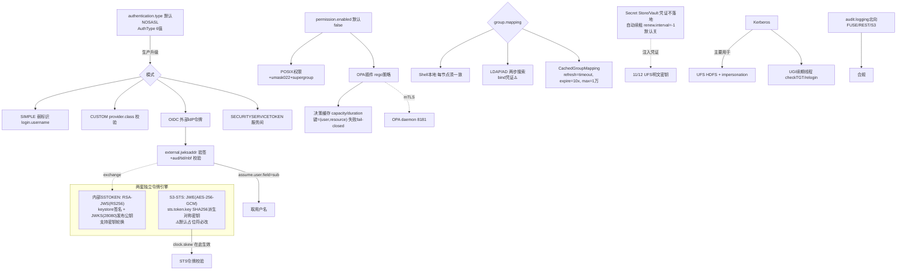

# 17 · 安全 / 认证 / 授权 / 审计

> 场景组:`alluxio.security.*` + `alluxio.security_server.*` + `alluxio.user.security.*` + `alluxio.underfs.security.*` + `alluxio.access.*` + `alluxio.audit.*` + `alluxio.hadoop.{security,kerberos}.*`
> 配置数:**118** · 别名 5 · 废弃 0 · 数据来源:`PropertyKey.java` · 生成表:`_data/gen_table.py 17`

---

## 1. 本组概览

本组是 Alluxio 的**完整安全体系**:谁能进(认证)、能做什么(授权)、组从哪来(group mapping)、Kerberos、密钥怎么存(Secret Store/Vault)、独立的 Security Service、审计。默认**几乎全关**(NOSASL/permission 关),生产必须显式加固。

七个子场景:

| 子场景 | 关键配置 | 核心矛盾 |
|---|---|---|
| 认证模式 | `authentication.type`、`client.authentication.type`、`login.username` | 安全 vs 易用 |
| 令牌/JWT | `authentication.token.*`(JWKS/aud/tid/duration) | 安全 vs 兼容 |
| 授权 | `authorization.permission.enabled`、`authorization.plugin.opa.*` | 细粒度 vs 开销 |
| Group Mapping | `group.mapping.class`、`group.mapping.ldap.*` | 组织集成 |
| Kerberos | `kerberos.*`、`hadoop.kerberos.*` | HDFS/企业集成 |
| Secret Store | `secret.store.hashicorp.vault.*` | 密钥安全 |
| Security Server / STS | `security.server.*`、`security_server.rpc.*`、`sts.*` | 令牌服务 |
| 审计 | `access.logging.*`、`audit.logging.*` | 合规 vs 开销 |

---

## 2. 配置清单速查表(全量 118 项)

### 2.1 认证模式
| 配置项 | 默认值 | 类型 | Scope | 说明 |
|---|---|---|---|---|
| `alluxio.security.authentication.type` | NOSASL | enum | ALL | 认证模式:NOSASL / SIMPLE / CUSTOM |
| `alluxio.security.client.authentication.type` | NOSASL | enum | CLIENT | 客户端认证:NOSASL / OIDC |
| `alluxio.security.authentication.custom.provider.class` | — | class | ALL | CUSTOM 模式的实现类 |
| `alluxio.security.login.username` | — | string | CLIENT | SIMPLE/CUSTOM 下请求 Alluxio 的用户 |
| `alluxio.security.login.impersonation.username` | HDFS_USER | string | CLIENT | 被模拟用户 |
| `alluxio.security.stale.channel.purge.interval` | 3day | duration | ALL | 不活跃 channel 视为未认证的间隔 |

### 2.2 令牌 / JWT
| 配置项 | 默认值 | 类型 | 说明 |
|---|---|---|---|
| `alluxio.security.authentication.token.external.jwksaddr` | — | string | 校验 JWT 的 JWKS 端点(外部签发) |
| `alluxio.security.authentication.token.aud` | — | string | 校验 token 的 aud 声明 |
| `alluxio.security.authentication.token.tid` | — | string | 校验 token 的 tid 声明 |
| `alluxio.security.authentication.token.assume.user.field` | sub | string | 取哪个 field 作用户名 |
| `alluxio.security.authentication.token.assume.group.field` / `role.field` | — | string | 取 field 作组/角色 |
| `alluxio.security.authentication.token.default.duration` / `max.duration` | 3600sec / 43200sec | duration | 会话令牌默认/最大寿命 |
| `alluxio.security.authentication.token.nbf.check` | false | boolean | 校验 nbf(not-before) |
| `alluxio.security.authentication.token.allowed.clock.skew` | 0sec | duration | 时间戳校验允许时钟偏移 |
| `alluxio.security.authentication.service.token.path` | — | string | 服务启动认证的 token 文件 |
| `alluxio.security.authentication.delegation.token.use.ip.service.name` | true | boolean | 委托令牌用 master IP 作服务名 |

### 2.3 授权(permission + OPA 插件)
| 配置项 | 默认值 | 类型 | Scope | 说明 |
|---|---|---|---|---|
| `alluxio.security.authorization.permission.enabled` | false | boolean | ALL | 基于文件权限的访问控制 |
| `alluxio.security.authorization.permission.supergroup` | supergroup | string | MASTER | 超级组(全超级权限) |
| `alluxio.security.authorization.permission.umask` | 022 | string | ALL | 创建文件/目录的 umask |
| `alluxio.security.authorization.cache.max.size` / `expiration.time` | 10000 / 5min | — | CLIENT | 授权缓存 |
| `alluxio.security.authorization.plugins.enabled` | false | boolean | MASTER | 启用授权插件 |
| `alluxio.security.authorization.plugin.name` / `paths` | — | string | MASTER | 插件名/classpath |
| `alluxio.security.authorization.plugin.opa.address` / `port` | localhost / 8181 | — | MASTER | OPA 守护地址/端口 |
| `alluxio.security.authorization.plugin.opa.policy.path` | / | string | MASTER | OPA 策略路径 |
| `alluxio.security.authorization.plugin.opa.cache.capacity` / `cache.duration` | 10000 / 60s | — | MASTER | OPA 决策缓存 |
| `alluxio.security.authorization.plugin.opa.cache.acl.file.level` | true | boolean | MASTER | ACL 检查在文件级(否则目录级) |
| `alluxio.security.authorization.plugin.opa.ssl.*`(enabled/ca/cert/key.path) | false/... | — | MASTER | OPA SSL |
| `alluxio.security.authorization.plugin.opa.retry.times.on.network.error` | 3 | int | MASTER | OPA 网络错误重试 |
| `alluxio.underfs.security.authorization.plugin.name` / `paths` | — | string | MASTER | UFS 授权插件 |

### 2.4 Group Mapping(含 LDAP)
| 配置项 | 默认值 | 类型 | 说明 |
|---|---|---|---|
| `alluxio.security.group.mapping.class` | ShellBasedUnixGroupsMapping | class | 用户→组映射服务 |
| `alluxio.security.group.mapping.cache.timeout` | 1min | duration | 组映射缓存过期(别名 .ms) |
| `alluxio.security.group.mapping.ldap.url` | — | string | LDAP URL |
| `alluxio.security.group.mapping.ldap.base` | — | string | LDAP 搜索 base |
| `alluxio.security.group.mapping.ldap.bind.user` / `bind.password` / `bind.password.file` | — | string | LDAP 绑定凭证 ⚠️敏感 |
| `alluxio.security.group.mapping.ldap.search.filter.user` / `filter.group` | (&(objectClass=user)...) / (objectClass=group) | string | 搜索过滤 |
| `alluxio.security.group.mapping.ldap.attr.member` / `attr.group.name` | member / cn | string | 成员/组名属性 |
| `alluxio.security.group.mapping.ldap.search.timeout` | 10000 | int | LDAP 搜索超时 |
| `alluxio.security.group.mapping.ldap.ssl` / `ssl.keystore*` | false/... | — | LDAP SSL |

### 2.5 Kerberos
| 配置项 | 默认值 | 类型 | 说明 |
|---|---|---|---|
| `alluxio.security.kerberos.server.principal` / `server.keytab.file` | — | string | 服务端 principal/keytab |
| `alluxio.security.kerberos.client.principal` / `client.keytab.file` | — | string | 客户端 principal/keytab |
| `alluxio.security.kerberos.client.use.ticket.cache` | true | boolean | 用 ticket cache |
| `alluxio.security.kerberos.client.ticketcache.login.enabled` | false | boolean | 无有效 ticket 时用原生命令填充 |
| `alluxio.security.kerberos.auth.to.local` | 默认规则 | string | principal→本地用户映射规则 |
| `alluxio.security.kerberos.min.seconds.before.relogin` | 1min | duration | 重登录最小间隔 |
| `alluxio.security.kerberos.unified.instance.name` | — | string | 统一实例名 |
| `alluxio.hadoop.security.authentication` | — | string | HDFS 认证方法 |
| `alluxio.hadoop.security.krb5.conf` | — | string | krb5 配置文件 |
| `alluxio.hadoop.kerberos.keytab.login.autorenewal` | — | boolean | keytab 登录自动续期 |
| `alluxio.hadoop.security.debug` | false | boolean | Hadoop 安全调试日志 |
| `alluxio.security.underfs.hdfs.kerberos.client.principal` / `keytab.file` | — | string | UFS HDFS Kerberos |
| `alluxio.security.underfs.hdfs.impersonation.enabled` | true | boolean | UFS HDFS 模拟 |
| `alluxio.security.underfs.hdfs.kerberos.login.per.instance` | false | boolean | 每 HDFS 实例登录 |

### 2.6 Secret Store(HashiCorp Vault)
| 配置项 | 默认值 | 类型 | 说明 |
|---|---|---|---|
| `alluxio.security.secret.store.enabled` | false | boolean | 启用 Secret Store |
| `alluxio.security.secret.store.hashicorp.vault.enabled` | false | boolean | 启用 Vault 提供方 |
| `alluxio.security.secret.store.hashicorp.vault.address` | — | string | Vault 地址 |
| `alluxio.security.secret.store.hashicorp.vault.authentication` | TOKEN | enum | Vault 认证方法 |
| `alluxio.security.secret.store.hashicorp.vault.token` | — | string | Vault token ⚠️敏感 |
| `alluxio.security.secret.store.hashicorp.vault.cache.enabled` | false | boolean | 缓存 Vault secret |
| `alluxio.security.secret.store.hashicorp.vault.{open,read}.timeout` | 5s / 30s | duration | 连接/读超时 |
| `alluxio.security.secret.store.hashicorp.vault.client.retry` / `.retry.interval` | 5 / 1s | — | 客户端重试 |
| `alluxio.security.secret.store.hashicorp.vault.auth.incremental.time` / `auth.renew.threshold` | 12h / 30m | duration | 认证凭证续租 |
| `alluxio.security.secret.store.hashicorp.vault.secret.incremental.time` / `secret.renew.threshold` | 12h / 30m | duration | secret 续租 |
| `alluxio.security.secret.store.renew.interval` | -1 | duration | 自动续租检查间隔;-1 关 |

### 2.7 Security Server / STS / 客户端池
| 配置项 | 默认值 | 类型 | 说明 |
|---|---|---|---|
| `alluxio.security.server.rpc.port` | 19995 | int | Security 服务 RPC 端口 |
| `alluxio.security.server.hostname` / `bind.host` | — / 0.0.0.0 | string | Security 服务主机/绑定 |
| `alluxio.security.server.web.port` / `web.bind.host` | 19994 / 0.0.0.0 | — | Security 服务 Web |
| `alluxio.security.server.jwks.address` | localhost:28080/v1/sts/jwks.json | string | JWKS 端点 |
| `alluxio.security.server.token.keystore.password` / `key.password` / `alias` | — | string | 令牌签名 keystore ⚠️敏感 |
| `alluxio.security_server.rpc.executor.*`(type/core/max/queue/keepalive/fjp) | TPE/256/512/512/... | — | Security 服务 RPC 执行器 |
| `alluxio.security.sts.callers.credentials` | {"anonymous":...} | string | STS 调用者 accessKey→secretKey ⚠️敏感 |
| `alluxio.security.sts.token.key` | ChangeMeToASecureRandomString! | string | STS 令牌加密签名密钥 ⚠️必改 |
| `alluxio.security.underfs.mount.temporary.credential.enabled` | false | boolean | 挂载临时会话模式 |
| `alluxio.user.security.server.client.pool.max` / `min` / `gc.threshold.ms` | 256 / 1 / 300sec | — | Security 服务客户端池 |
| `alluxio.security.user.information.executor.min.thread.number` / `schedule.interval` | 1 / 1min | — | UGI 续期线程/间隔 |

### 2.8 审计 / 访问日志
| 配置项 | 默认值 | 类型 | Scope | 说明 |
|---|---|---|---|---|
| `alluxio.audit.logging.enabled` | false | boolean | ALL | 系统审计日志(FUSE/REST/S3 北向操作) |
| `alluxio.access.logging.enabled` | false | boolean | ALL | 缓存访问日志(内部缓存访问分析) |
| `alluxio.access.logging.poll.interval` | 5s | duration | ALL | 访问日志异步刷盘间隔(别名 audit.*) |

---

## 3. 逐项深度分析(充分细节)

> 本组 118 项按配置族逐一深挖:认证模式(AuthType 全枚举)→ 令牌/JWT 校验链 → 授权(permission + OPA 决策缓存)→ Group Mapping(Shell/LDAP)→ Kerberos + UGI 续期 → Secret Store(Vault)→ **两套独立令牌引擎**(内部 SSTOKEN 的 RSA-JWS vs S3-STS 的 JWE)→ Security Server RPC/线程池/客户端池 → 审计。翻代码求证枚举与机制,准确 > 冗长。
>
> **权威代码位置**:`AuthType.java`(枚举)、`TokenUtils.java` + `JWTTokenParser.java` + `JWTTokenInternal.java`(外部/内部 JWT 校验)、`SecurityServiceTokenGenerator.java`(内部 SSTOKEN,RSA-JWS)、`sts/StatelessTokenEngine.java`(S3 STS,JWE)、`util/SecurityUtils.java`(STS key / 时钟偏移 / duration 校验)、`opa/**`(OPA 授权 + 决策缓存)、`group/**`(Group Mapping + 缓存)、`secret/provider/VaultSecretProvider.java`(Vault)、`KerberosName.java` + `UserGroupInformationExecutor.java`(Kerberos/UGI)。

### 3.1 认证模式:`authentication.type` / `client.authentication.type`(AuthType 全枚举)

**⚠️ 速查表与官方描述都写"三种模式 NOSASL/SIMPLE/CUSTOM",但代码 `AuthType.java` 实际有 6 个枚举值**——描述是历史遗留,实际支持面更广:

| AuthType 值 | 含义(代码级) | 谁在用 |
|---|---|---|
| `NOSASL` | **不认证**,Alluxio 内部无用户信息;服务端信任客户端声明的任何身份 | 默认;开箱即用/测试 |
| `SIMPLE` | 客户端登录名由 `login.username` 决定(取不到则回退 OS 用户);**服务端不校验**客户端声明 | 弱标识 + POSIX 权限 |
| `CUSTOM` | 同 SIMPLE 取名,但服务端由 `custom.provider.class`(须实现 `alluxio.security.authentication.AuthenticationProvider`)**校验** | 自定义认证 |
| `KERBEROS` | Kerberos 认证;**注释明确标 "this authentication is not supported"**(Alluxio 服务间未启用;Kerberos 主要用于 UFS HDFS,见 3.5) | (服务间未启用) |
| `OIDC` | OIDC/JWT 令牌认证(现代云原生) | `client.authentication.type` 可选 |
| `SECURITYSERVICETOKEN` | 内部生成并使用的 Security Service Token(SSTOKEN,见 3.7) | 服务间内部认证 |

- **`authentication.type`(默认 `AuthType.NOSASL`,Scope=ALL,`ENFORCE`)**:全局认证模式。`SecurityUtils.isAuthenticationEnabled()` 判定即"type != NOSASL"。`isSecurityServiceTokenEnabled()` 判定 type==SECURITYSERVICETOKEN。
- **`client.authentication.type`(默认 `AuthType.NOSASL`,Scope=CLIENT)**:官方描述"仅 NOSASL/OIDC 两种",供客户端侧独立选择(如客户端走 OIDC 令牌而不改全局)。
- **`authentication.custom.provider.class`(class,ALL,`WARN`)**:CUSTOM 模式的服务端认证实现类,必须实现 `AuthenticationProvider` 接口。
- **`login.username`(CLIENT,`ENFORCE`)**:SIMPLE/CUSTOM 下客户端向 Alluxio 声明的用户;未设则回退到 OS 登录用户。
- **`login.impersonation.username`(默认 `IMPERSONATION_HDFS_USER`=`_HDFS_USER_` 占位符,CLIENT,`IGNORE`)**:SIMPLE/CUSTOM 下声明**被模拟(impersonate)**的用户——如服务账号代表最终用户访问。`AuthenticationUtils.getImpersonationUser()` 在令牌刷新时取此值作 authorizedUser(见 3.2 token 刷新逻辑)。
- **`stale.channel.purge.interval`(默认 `3day`,ALL,`WARN`)**:不活跃客户端 channel 超此时长即视为**未认证**,下次使用时强制重新认证。防长连接的认证态无限期有效(旁路凭证轮换)。
- **生产建议**:必须离开 NOSASL。最小方案 SIMPLE+`permission.enabled`(仅弱标识);企业方案 OIDC/CUSTOM + JWT + OPA/permission;服务间用 SECURITYSERVICETOKEN。`ENFORCE` 一致性=全集群该项必须一致。

### 3.2 令牌 / JWT:外部 IdP 令牌校验链(`authentication.token.*`)

这组是 **OIDC/外部 IdP 令牌**的校验参数。校验入口 `TokenUtils.validateExternalToken()` → `JWTTokenParser.parseJWT()`(jose4j 验签)→ `TokenUtils.isValidExternalToken()`(claim 校验)。

**(1) 验签:`token.external.jwksaddr`(ALL,`ENFORCE`)** —— `JWTTokenParser` 支持两种取公钥方式(代码分支):
- `https://` / `http://` 前缀 → `HttpsJwksVerificationKeyResolver`,**从 JWKS 端点在线拉公钥验签**(自动缓存/轮换 kid)。
- `file://` 前缀 → 读本地 JWKS JSON 文件构造 `JwksVerificationKeyResolver`(离线/固定公钥)。
- jose4j consumer 构造时:`setSkipDefaultAudienceValidation()`(aud 校验交给下面的手写逻辑)+ `setRequireSubject()`(**必须有 sub**)+ `setRequireExpirationTime()`(**必须有 exp**)。未配 jwksaddr 则 consumer 为 null,`parseJWT` 返回 null,校验直接失败。

**(2) claim 校验:`isValidExternalToken()`(逐项对照代码)**:
- **`token.aud`(ALL)**:若配置,则 token 的 `aud` claim 必须**包含**该值(`claims.getAudience().contains(expectedAudience)`);缺 aud claim 直接拒。未配则跳过 aud 校验。
- **`token.tid`(ALL)**:若配置,token 的 `tid`(租户 ID)claim 必须**等于**该值(`StringUtils.equals`);缺 tid 直接拒。多租户隔离用。
- **`token.nbf.check`(默认 false,ALL)**:仅当为 true 才校验 `nbf`(not-before);此时缺 nbf claim 或 now < nbf 都拒。默认关(不强制 nbf)。
- **exp**:恒校验——`now.isAfter(exp)` 即过期拒(与 jose4j 的 requireExpirationTime 双重保障)。
- **⚠️ `token.allowed.clock.skew`(默认 `0sec`,ALL)——校验位置需纠偏**:此参数在 `isValidExternalToken()` 的 nbf/exp 手写比较里**并未使用**(用的是裸 `NumericDate.now()`,无容差)。它实际生效在 **S3-STS 的 JWE 校验**(`StatelessTokenEngine.validate()` 的 `setAllowedClockSkewInSeconds(...)`,见 3.7)。`SecurityUtils` 在加载时校验其**非负**(否则抛异常)。**(结论:外部 IdP JWT 目前对 nbf/exp 无时钟容差;需要容差的是 STS JWE。建议验证是否符合部署预期。)**

**(3) 身份字段抽取:`assume.user/group/role.field`**:
- **`assume.user.field`(默认 `sub`,ALL)**:从 token 取哪个 claim 作 Alluxio 用户名。`validateExternalToken` 校验该 claim 必须存在,取其值作 `authorizedUser`/`connectionUser`。
- **`assume.group.field` / `assume.role.field`(默认空,ALL)**:若设置,`AbstractTokenAuthenticator` 用对应 claim 覆盖用户的组/角色(令牌驱动的 RBAC/组信息,旁路本地 group mapping)。默认空=不从 token 取组/角色。

**(4) token 生命周期与刷新**:
- **`token.default.duration`(默认 `3600sec`=1h,SERVER)/ `token.max.duration`(默认 `43200sec`=12h,SERVER)**:临时会话令牌默认/最大寿命。`SecurityUtils` 加载时**强校验**:default ≥ 900ms、max ≥ default,否则抛异常。default 被内部 SSTOKEN 生成器(3.7)与 S3-STS AssumeRole 默认时长共用;max 用于 STS 请求时长上限钳制。
- **`TokenUtils.isTokenNeedRefresh()`**:令牌剩余寿命 < 60s(`TOKEN_NEED_REFRESH`)即触发刷新;S3 服务本地 exchange 刷新,其它经 gRPC 找 Security Server 换新。
- **内外令牌区分**:`JWTTokenParser.isAlluxioToken()` 用**跳过验签**的 consumer 只读 issuer——issuer == `ALLUXIO_SECURITY_SERVICE_TOKEN_ISSUER` 判定为内部 SSTOKEN(走 INTERNAL JWKS 验签),否则外部 IdP 令牌(走 EXTERNAL jwksaddr 验签)。外部令牌进入内部体系时会 `exchangeInternalServiceToken` 换成内部 SSTOKEN(schema IDPROVIDER→SECURITYSERVICETOKEN)。

**(5) 服务启动令牌 / 委托令牌**:
- **`authentication.service.token.path`(ALL)**:服务(worker/coordinator/security service/CLI)**启动时**认证用的 token 文件路径。`TokenUtils.getTokenWithConfPath()`:先读环境变量 `SERVICE_TOKEN`,空则读此文件(文件格式 `service_token=...` 等键值行)。
- **`delegation.token.use.ip.service.name`(默认 true,ALL,`ENFORCE`)**:委托令牌用 **master IP** 作服务名;false 用 hostname。默认 true 以避免 hostname 差异导致的服务名不匹配;master IP 会变则应保持 true。

### 3.3 授权 (1):文件权限 `authorization.permission.*`

- **`authorization.permission.enabled`(默认 false,ALL,`ENFORCE`)**:POSIX 风格文件权限总开关(owner/group/other 的 rwx)。`SecurityUtils.isAuthorizationEnabled()` 即读此项。**默认 false = 无授权**:任何(已认证)用户可访问任意路径。
- **`authorization.permission.supergroup`(默认 `supergroup`,MASTER,`ENFORCE`)**:超级组,组内所有用户具超级权限(绕过权限检查)。
- **`authorization.permission.umask`(默认 `022`,ALL,`ENFORCE`)**:创建文件/目录的 umask。初始创建权限 777,目录与文件差 111;umask 022 → 目录 755、文件 644(官方描述)。
- **`authorization.cache.max.size`(默认 10000)/ `cache.expiration.time`(默认 `5min`)(CLIENT,`IGNORE`)**:客户端侧授权结果缓存(条目上限 + 过期),摊薄重复权限判定。`IGNORE`=不做集群一致性检查(纯客户端本地行为)。
- **`authorization.capability.enabled`(默认 false)**:capability token 授权开关(能力令牌模型,与 `CapabilityToken` 配套);当前多为内部/实验能力。

### 3.4 授权 (2):OPA 插件 `authorization.plugin.*` + `underfs.security.authorization.plugin.*`(重点)

OPA(Open Policy Agent)是 Alluxio Enterprise 的**策略化细粒度授权**主力方案(rego 策略),经 REST 调 OPA daemon 决策。代码在 `dora/integration/authorization/opa/`,SPI 注册,核心类 `DefaultOPAInodeAttributeProvider`(决策缓存)+ `DefaultOPARestfulAPIHelper`(HTTP 调用)。

**(1) 插件装载**:
- **`authorization.plugins.enabled`(默认 false,MASTER,`ENFORCE`)**:授权插件总开关。
- **`authorization.plugin.name`(MASTER,`ENFORCE`)/ `plugin.paths`(classpath,冒号分隔)**:master 授权插件名 + classpath(隔离加载)。`underfs.security.authorization.plugin.name`/`paths` 是 **UFS 层**的同类插件(对 under filesystem 做授权)。
- 客户端侧 `SecurityUtils.isClientAuthorizationEnabled()` = plugin.name 与 plugin.paths 都已设置。

**(2) OPA 连接**:
- **`plugin.opa.address`(默认 `localhost`)/ `opa.port`(默认 `8181`)**:OPA daemon 地址/端口。`DefaultOPARestfulAPIHelper.formURL()` 拼成 `http(s)://addr:port/<policyPath>`。
- **`plugin.opa.policy.path`(默认 `/`,MASTER)**:rego 策略路径(HTTP POST 到此路径查询决策)。**支持按 UFS 挂载覆盖**:`getBasePolicyPath()` 会 resolve 挂载表,用该 UFS 的 policy.path 覆盖集群级默认(无挂载表则用集群默认)。
- **`plugin.opa.ssl.enabled`(默认 false)+ `ssl.ca.path`/`ssl.cert.path`/`ssl.key.path`(默认 `/`)(MASTER,`ENFORCE`)**:OPA 走 HTTPS 时的双向 TLS。`OPARestfulCallHelper.getSocketFactoryPEM()` 读 PEM(经 BouncyCastle),构造带 CA+cert+key 的 `SSLConnectionSocketFactory`(mTLS 到 OPA)。
- **`plugin.opa.retry.times.on.network.error`(默认 3,MASTER)**:HTTP POST 遇 `IOException` 的重试次数;`RestfulCall.post()` 每次重试间**固定 sleep 1s**(代码写死,非可配)。非网络异常直接抛。HTTP 200 才取结果,非 200 记 error 返回空串。

**(3) 决策缓存(性能关键)—— `DefaultOPAInodeAttributeProvider` 的 Guava Cache**:
- **`plugin.opa.cache.capacity`(默认 10000,MASTER)**:缓存条目上限(`maximumSize`)。
- **`plugin.opa.cache.duration`(默认 `60s`,MASTER)**:每条决策缓存寿命(`expireAfterWrite`)。
- **缓存键 = `Pair<user, resource>`**,值 = `PermissionSet`(按 action 位记录 ALLOWED/DENIED/UNKNOWN)。命中且该 action 状态明确(ALLOWED/DENIED)→ 直接返回;UNKNOWN 才回落 OPA daemon 查询并回填。**OPA 每次查询是一次 HTTP 往返,缓存 duration 太小会显著拖慢元数据操作**(每次 open/list 都可能触发授权)。
- **`plugin.opa.cache.acl.file.level`(默认 true,MASTER,`ENFORCE`)**:true=ACL 检查在**文件级**,false=**目录级**(粒度/缓存命中率的取舍——目录级更粗、命中率高但精度低)。
- **失败即拒(fail-closed)**:`checkPermission` 里 OPA 调用抛异常时 `allowed=false`(拒绝),安全默认。

### 3.5 Group Mapping:`group.mapping.*`(Shell / LDAP + 缓存)

用户→组映射(供权限/OPA 用组信息)。接口 `GroupMappingService`,外层恒包一层 `CachedGroupMapping`。

- **`group.mapping.class`(默认 `ShellBasedUnixGroupsMapping`,ALL,`ENFORCE`)**:映射实现类。内置三种:`ShellBasedUnixGroupsMapping`(调本地 shell `id -Gn` 取组,单机简单但**每节点用户/组须一致**)、`LdapGroupsMapping`(接 LDAP/AD)、`IdentityUserGroupsMapping`(用户名即组名,测试)。
- **`group.mapping.cache.timeout`(默认 `1min`,ALL,`ENFORCE`,别名 `.cache.timeout.ms`)**:`CachedGroupMapping` 的缓存刷新周期。代码:`refreshAfterWrite`=timeout(到期异步刷新,不阻塞读)、`expireAfterWrite`=**10×timeout**(硬过期)、`maximumSize`=**10000(硬编码)**;**timeout ≤ 0 则禁用缓存**(每次直查底层)。异步 reload 单线程执行,失败保留旧值(不 fail lookup)。
- **LDAP 参数(`group.mapping.ldap.*`,`LdapGroupsMapping`)**:
  - `ldap.url`:LDAP 服务地址(`Context.PROVIDER_URL`)。
  - `ldap.base`:搜索 base DN。
  - `ldap.bind.user` / `ldap.bind.password` / `ldap.bind.password.file` ⚠️敏感:SIMPLE bind 凭证;代码 `getPassword()` **优先读明文 password,未设则读 password.file**(文件内容 trim)。
  - `ldap.search.filter.user`(默认 `(&(objectClass=user)(sAMAccountName={0}))`,AD 风格)/ `filter.group`(默认 `(objectClass=group)`):**两步搜索**——先按 user filter 查到用户 DN,再按 `(&<filter.group>(<attr.member>={userDN}))` 查该用户所属组。
  - `ldap.attr.member`(默认 `member`)/ `ldap.attr.group.name`(默认 `cn`):成员属性 / 组名属性(仅返回该属性以加速)。
  - `ldap.search.timeout`(默认 10000ms):`SearchControls` 时间上限;搜索范围 SUBTREE。
  - `ldap.ssl`(默认 false)+ `ssl.keystore` / `ssl.keystore.password` / `ssl.keystore.password.file` ⚠️敏感:LDAPS;代码通过 `System.setProperty("javax.net.ssl.keyStore"...)` 设置(**JVM 全局副作用**,多 LDAP 源需注意)。
  - **重试**:`LdapGroupsMapping` 内建 `CountingRetry(3)`(硬编码 3 次),失败重建 `DirContext` 再试。

### 3.6 Kerberos:`kerberos.*` / `hadoop.{security,kerberos}.*` / `underfs.hdfs.kerberos.*` + UGI 续期

Kerberos 在 Alluxio 主要用于 **UFS HDFS 集成**(服务间认证注释标"not supported")。principal 映射走 Hadoop 的 `KerberosName`。

- **服务端**:`kerberos.server.principal` / `server.keytab.file`(coordinator/worker/plugin/security server 用)。
- **客户端**:`kerberos.client.principal` / `client.keytab.file`;或 `client.use.ticket.cache`(默认 true,用 ticket cache);`client.ticketcache.login.enabled`(默认 false)= 无有效 ticket 时用**原生 Kerberos 命令**填充 ticket cache(仅当用原生 Kerberos 库、且 principal+keytab 都配好时生效)。
- **`kerberos.auth.to.local`(默认 `Constants.KERBEROS_DEFAULT_AUTH_TO_LOCAL`=`"DEFAULT"`)**:principal→本地用户名映射规则(Hadoop `auth_to_local` 语法);`KerberosName.setRules()` 加载;仅服务名存在时不套规则;规则后仍非 simple name 则抛异常。
- **`kerberos.min.seconds.before.relogin`(默认 `1min`)**:两次重登录最小间隔(防频繁 relogin 打爆 KDC)。
- **`kerberos.unified.instance.name`**:统一实例名(多实例 principal 归一)。
- **UGI 续期线程(`UserGroupInformationExecutor`)**:`security.user.information.executor.min.thread.number`(默认 1)+ `schedule.interval`(默认 `1min`)——后台按间隔 renew UGI(keytab 场景 checkTGT/reloginFromKeytab),保证长跑服务的 Kerberos ticket 不过期。
- **Hadoop 层**:`hadoop.security.authentication`(HDFS 认证方法,如 kerberos/simple)、`hadoop.security.krb5.conf`(krb5.conf 路径)、`hadoop.kerberos.keytab.login.autorenewal`(keytab 登录自动续期)、`hadoop.security.debug`(默认 false,Hadoop 安全调试日志)。均 Scope=SERVER,`ENFORCE`。
- **UFS HDFS 专用**:`underfs.hdfs.kerberos.client.principal` / `client.keytab.file`(访问 HDFS 的 Kerberos 身份,独立于 Alluxio 服务身份);`underfs.hdfs.impersonation.enabled`(默认 true,代理用户身份访问 HDFS——最终用户身份透传);`underfs.hdfs.kerberos.login.per.instance`(默认 false,是否每个 HDFS UFS 实例独立登录)。与 [12组](12-ufs-backends.md) HDFS 配置文件配合。

### 3.7 令牌引擎:两套完全独立的实现(内部 SSTOKEN 的 RSA-JWS vs S3-STS 的 JWE)—— 重点纠偏

**⚠️ 速查表把 `sts.token.key` 描述为"STS 令牌加密签名密钥",易与 Security Server 的令牌 keystore 混为一谈。代码里是两套架构不同的令牌引擎,务必区分:**

**(A) 内部 Security Service Token(SSTOKEN)—— `SecurityServiceTokenGenerator`,RSA-JWS 签名**
- 算法 **RS256(RSA-SHA256)JWS 签名**;RSA 密钥对**从 keystore 加载**:
  - `security.server.token.keystore.password`(keystore 文件口令)、`token.keystore.key.password`(密钥口令)、`token.keystore.alias`(密钥别名)—— ⚠️敏感,Scope=SERVER,`WARN`。
- issuer = `ALLUXIO_SECURITY_SERVICE_TOKEN_ISSUER`;寿命 = `token.default.duration`。
- **公钥经 JWKS 端点发布**:`security.server.jwks.address`(默认 `http://localhost:28080/v1/sts/jwks.json`)—— 这是**内部 SSTOKEN 的验签公钥端点**(与 3.2 的 `external.jwksaddr` 是不同源:后者是外部 IdP 的)。`JWTTokenParser` 的 INTERNAL 实例从此地址取公钥验内部令牌。
- **支持密钥轮换**:生成器保留 `mOldRSAKeyList`,旧 token 用旧公钥仍可验证(平滑轮换)。

**(B) S3 STS 会话令牌 —— `StatelessTokenEngine`,JWE 对称加密(非签名)**
- 用于 **S3 AssumeRole**(`sts.callers` 调 STS 换临时凭证);token 是 **JWE**:`A256KW` 密钥封装 + `AES_256_GCM` 内容加密——**加密的、不透明的**(不是签名的明文 JWT)。
- **`sts.token.key`(默认 `ChangeMeToASecureRandomString!`,WORKER,`ENFORCE`)**:此串经 **SHA-256** 派生出 AES-256 对称主密钥(`mMasterKey`)。⚠️ **默认值是占位符,生产必须改成强随机串**——不改则任何人都能用同一密钥**解密/伪造** STS 会话令牌(令牌里含临时 secretKey、policy、parentArn)。`SecurityUtils` 加载时校验其**非空**(空则抛异常)。
- issuer `Alluxio-STS`、audience `Alluxio-S3`;令牌内嵌临时 secretKey / policy / metadata / parentArn。
- 校验 `validate()`:`setExpectedIssuer/Audience` + `setRequireExpirationTime` + `setRequireSubject` + **`setAllowedClockSkewInSeconds(allowed.clock.skew)`**(这里才用到 3.2 的时钟偏移)+ `setDisableRequireSignature`(因为是 JWE 非 JWS)。过期→`EXPIRED_TOKEN`,其它非法→`INVALID_IDENTITY_TOKEN`。
- **`sts.callers.credentials`(默认 `{"anonymous":"anonymousSec"}`,WORKER,`ENFORCE`)⚠️敏感**:STS 调用者的 accessKey→secretKey JSON 映射(校验 AssumeRole 请求签名)。`SecurityUtils.loadStsRelatedConfig()`:解析 JSON,**空 key/value 抛异常**;未设则 WARN + 空映射(STS 调用者无法认证)。**默认含 anonymous,生产必须收紧/替换**。
- STS AssumeRole 时长:请求可带 DurationSeconds(受 min/max 常量约束),未带则用 `token.default.duration`;上限受 `token.max.duration` 钳制。

**(C) Security Server 运行参数**
- **`security.server.rpc.port`(默认 19995,ALL,`WARN`)/ `server.hostname`(ALL,`WARN`)/ `server.bind.host`(默认 `0.0.0.0`,SECURITY)**:Security 服务 gRPC 端点。
- **`security.server.web.port`(默认 19994)/ `web.bind.host`(默认 `0.0.0.0`)(NONE,`IGNORE`)**:Web UI。
- **`security_server.rpc.executor.*`(Scope=SECURITY,`WARN`)**:Security 服务 gRPC 的执行器线程池(与其它组的 RPC executor 同构):
  - `type`(默认 `TPE`=ThreadPoolExecutor;可选 `FJP`=ForkJoinPool)。
  - TPE 分支:`core.pool.size`(256)、`max.pool.size`(512)、`tpe.queue.type`(默认 `HANDOFF_QUEUE`)、`tpe.queue.size`(512)、`tpe.allow.core.threads.timeout`(false)、`keepalive`(`60sec`)。
  - FJP 分支:`fjp.parallelism`(别名 `.parallelism`)、`fjp.min.runnable`(1,别名 `.min.runnable`)、`fjp.async`(true,FIFO 调度)。
- **Security Server 客户端池(`user.security.server.client.pool.*`,ALL,`WARN`)**:worker/客户端连 Security 服务的连接池——`pool.max`(256,别名 `user.block.worker.client.pool.size`)、`pool.min`(1)、`pool.gc.threshold.ms`(`300sec`,空闲超此即关)。
- **`underfs.mount.temporary.credential.enabled`(默认 false)**:挂载处于**临时会话模式**——其 worker 依赖临时会话令牌(STS 换来的临时凭证)与后端通信,而非长期凭证。

### 3.8 Secret Store(HashiCorp Vault):`secret.store.*` —— 凭证不落地

把 S3/UFS 等凭证**存 Vault**,Alluxio 运行时按需取,配置文件不存明文密钥——**这是解决 [11](11-ufs-s3.md)/[12](12-ufs-backends.md) "明文密钥"风险的正解**。实现 `VaultSecretProvider`(基于 `com.bettercloud.vault` 客户端)。

- **`secret.store.enabled`(默认 false,SERVER,`ENFORCE`)/ `hashicorp.vault.enabled`(默认 false,ALL,`ENFORCE`)**:Secret Store 总开关 / Vault 提供方开关。
- **`vault.address`(ALL)/ `vault.token`(ALL)⚠️敏感 / `vault.authentication`(默认 `TOKEN`,枚举 `SecretStoreAuthType`——代码里当前**只有 TOKEN 一个值**)**:Vault 连接与认证。
- **`vault.open.timeout`(默认 `5s`)/ `read.timeout`(默认 `30s`)**:建连超时 / 读超时(传给 VaultConfig,单位换算成秒)。
- **`vault.client.retry`(默认 5)/ `client.retry.interval`(默认 `1s`)**:Vault 客户端失败重试次数 / 间隔。
- **缓存**:`vault.cache.enabled`(默认 false)—— 缓存 Vault secret,减少每次取密钥的往返(代价:短暂陈旧)。
- **自动续租(lease renewal)**:Vault 的 token/secret 有 TTL,需续租否则失效:
  - `vault.auth.renew.threshold`(默认 `30m`)/ `secret.renew.threshold`(默认 `30m`):auth 凭证 / secret 的 TTL 低于阈值即自动续租。
  - `vault.auth.incremental.time`(默认 `12h`)/ `secret.incremental.time`(默认 `12h`):续租时申请的增量租期;**<0 表示用 Vault 服务端默认增量租期**(`renewAuth()` 代码分支)。
  - **`secret.store.renew.interval`(默认 `-1`,SERVER,`ENFORCE`)**:周期性自动续租**检查间隔**;**-1 = 不启用周期续租**(须显式设正值才会后台 renew)。
- **能力**:每个 secret 支持 KV v1/v2(per-secret client version,冲突则告警)与 `AWS_IAM_USER` 路径类型;`getSecret(name)` 校验该 secret 的 path/key 都已配置,否则报错。

### 3.9 审计与访问日志:`audit.logging.*` / `access.logging.*`

- **`audit.logging.enabled`(默认 false,ALL,`ENFORCE`)**:系统审计日志——记录 Alluxio **北向接口 FUSE/REST/S3** 的操作(谁在何时对何资源做了何操作)。**合规场景必开**。
- **`access.logging.enabled`(默认 false,ALL,`ENFORCE`)**:缓存**访问**日志——记录内部缓存访问(供缓存命中/热点分析),与审计是不同用途。
- **`access.logging.poll.interval`(默认 `5s`,ALL,别名 `audit.logging.poll.interval`)**:访问日志**异步刷盘**间隔——异步落盘降低对热路径的开销。

---

## 4. 配置关联关系图

---

## 5. 典型场景配置组合建议

| 场景 | 推荐组合 | 理由 |
|---|---|---|
| **企业生产安全基线** | `authentication.type=CUSTOM/OIDC`、`permission.enabled=true`、`group.mapping=LDAP`、`audit.logging.enabled=true`、改 `sts.token.key` | 认证+授权+组集成+审计全开,且消除默认弱密钥 |
| **细粒度策略授权** | `authorization.plugins.enabled=true` + `plugin.name`/`paths` + OPA(`opa.address/port/policy.path`)+ 决策缓存调优 | rego 策略化授权;缓存 duration 大→省 OPA 往返,小→更实时 |
| **OPA over mTLS** | `plugin.opa.ssl.enabled=true` + `ssl.ca/cert/key.path` + 调 `retry.times.on.network.error` | 生产 OPA 走 HTTPS 双向 TLS |
| **凭证不落地** | `secret.store.enabled=true` + `hashicorp.vault.enabled=true` + `vault.address/token` + `renew.interval`>0 | UFS 密钥走 Vault,且开周期续租(默认 -1 不续租) |
| **HDFS Kerberos 环境** | `underfs.hdfs.kerberos.client.principal/keytab` + `impersonation.enabled=true` + `hadoop.security.krb5.conf` + UGI 续期(`user.information.executor.*`) | 企业 HDFS 集成 + ticket 不过期 |
| **云原生 OIDC** | `client.authentication.type=OIDC` + `token.external.jwksaddr`(https 或 file://)+ `token.aud`/`tid` + `assume.user.field` | 外部 IdP 令牌验签 + claim 校验 |
| **多租户令牌隔离** | `token.tid`=本租户 + `token.aud`=本服务 + `assume.group/role.field` | 令牌驱动的租户/组/角色隔离 |
| **S3 STS 临时凭证** | 改 `sts.token.key`(强随机)+ 收紧 `sts.callers.credentials` + `underfs.mount.temporary.credential.enabled` | AssumeRole 临时凭证不落地 |

---

## 6. 风险与注意事项

1. **默认 NOSASL 不设防**:开箱不认证,服务端信任客户端声明的任何身份;生产必须升级认证模式(`ENFORCE`,全集群一致)。注意 `AuthType` 实际 6 值(NOSASL/SIMPLE/CUSTOM/KERBEROS/OIDC/SECURITYSERVICETOKEN),官方描述只提 3 值是历史遗留;`KERBEROS` 服务间"not supported",主要用于 UFS HDFS。
2. **⚠️ `sts.token.key` 默认占位符**:`ChangeMeToASecureRandomString!` 经 SHA-256 派生**对称 JWE 密钥**;不改则任何人可用同密钥**解密/伪造 S3-STS 会话令牌**(内含临时 secretKey/policy)——**部署必改强随机串**(空值会直接抛异常)。
3. **两套令牌引擎勿混淆**:内部 SSTOKEN 是 **RSA-JWS 签名**(靠 `security.server.token.keystore.*` + JWKS 28080 发布公钥,支持轮换);S3-STS 是 **JWE 对称加密**(靠 `sts.token.key`)。`security.server.jwks.address`(内部)与 `token.external.jwksaddr`(外部 IdP)是**两个不同源**,勿配串。
4. **`allowed.clock.skew` 生效位置**:此参数在**外部 IdP JWT** 的 nbf/exp 校验里**未用到**(裸 now 比较,无容差),仅在 **S3-STS JWE 校验**生效。若期望外部令牌有时钟容差,需确认实现(建议验证)。
5. **`permission.enabled=false` 默认无授权**:任何已认证用户可访问任意路径,生产需开启 POSIX 权限或 OPA。OPA 调用异常时 **fail-closed(拒绝)**,是安全默认但依赖 OPA 可用性——OPA 挂则全部拒绝,注意可用性/重试(`retry.times.on.network.error`,重试间固定 sleep 1s)。
6. **敏感项密集**:LDAP `bind.password`(及 ssl keystore 密码)、Vault `token`、`security.server.token.keystore.password/key.password`、`sts.callers.credentials`——全部走 Secret Store/密管,严禁入库。`sts.callers.credentials` 默认含 `anonymous`,生产必须收紧。
7. **OPA 决策缓存的性能/一致性**:缓存键 `(user,resource)`,`cache.duration`(60s)太小→每次 open/list 触发 OPA HTTP 往返拖慢元数据;太大→策略变更生效延迟。`cache.acl.file.level` 目录级更粗、命中率高但精度低。
8. **Group Mapping 副作用**:`ShellBasedUnixGroupsMapping` 要求每节点用户/组一致;LDAP SSL 通过 `System.setProperty` 设 JVM 全局 keystore(多源冲突风险);LDAP 内建重试固定 3 次;缓存 `expireAfterWrite`=10×`cache.timeout`,`maximumSize` 硬编码 1 万。
9. **Vault 续租默认关**:`secret.store.renew.interval=-1` 表示**不周期续租**,Vault token/secret TTL 到期会失效——需显式设正值 + 配 `auth/secret.renew.threshold`。
10. **审计默认关**:合规场景务必开 `audit.logging.enabled`;区分 `access.logging.enabled`(缓存访问分析,异步刷盘 5s),二者用途不同。

---

## 跨组关联速览
- [05-worker-s3-gateway](05-worker-s3-gateway.md) —— S3 认证/授权/签名(本组体系的 S3 入口)
- [11-ufs-s3](11-ufs-s3.md) / [12-ufs-backends](12-ufs-backends.md) —— UFS 凭证(应走 Secret Store)
- [15-network-transport](15-network-transport.md) —— TLS(与认证配合)
- [18-observability](18-observability.md) —— 审计日志的落地与观测

---

## 附录A:本组全量配置清单(脚本生成)

> 由 `_data/gen_table.py 17-security` 生成,逐 key 一行,保证覆盖本组**全部 118 项**(与上文按子场景组织的中文速查表互补;此处描述为官方英文原文,便于精确检索)。

| 配置项 | 默认值 | 类型 | Scope | 一致性 | 状态 | 说明 |
|---|---|---|---|---|---|---|
| `alluxio.access.logging.enabled` | false | boolean | ALL | ENFORCE | — | Whether or not cache access logs are enabled, which records internal cache accesses for further analysis. |
| `alluxio.access.logging.poll.interval` | "5s" | duration | ALL | — | 别名:alluxio.audit.logging.poll.interval | The interval at which the access logs are asynchronously flushed to disk. |
| `alluxio.audit.logging.enabled` | false | boolean | ALL | ENFORCE | — | Whether or not system audit logs are enabled, which records operations on Alluxio's northbound FUSE/REST/S3 interfaces. |
| `alluxio.hadoop.kerberos.keytab.login.autorenewal` | — | boolean | SERVER | ENFORCE | — | Kerberos authentication keytab login auto renew. |
| `alluxio.hadoop.security.authentication` | — | string | SERVER | ENFORCE | — | HDFS authentication method. |
| `alluxio.hadoop.security.debug` | false | — | — | — | — | Enable hadoop security debug log |
| `alluxio.hadoop.security.krb5.conf` | — | string | SERVER | ENFORCE | — | Kerberos krb file for configuration of Kerberos. |
| `alluxio.security.authentication.custom.provider.class` | — | class | ALL | WARN | — | The class to provide customized authentication implementation, when alluxio.security.authentication.type is set to CUSTOM. It must implement the in... |
| `alluxio.security.authentication.delegation.token.use.ip.service.name` | true | boolean | ALL | ENFORCE | — | Whether to use master IP address as the service name of delegation tokens. If set to false, the hostname of master will be used instead. This is se... |
| `alluxio.security.authentication.service.token.path` | — | string | ALL | — | — | Specifies the path to the service token file, used for authentication when starting a service, worker/coordinator/security service/CLI. |
| `alluxio.security.authentication.token.allowed.clock.skew` | "0sec" | duration | ALL | — | — | Allowed clock skew when verifying token timestamps.This is used to account for any time differences betweenthe token issuer and Alluxio services. |
| `alluxio.security.authentication.token.assume.group.field` | — | string | ALL | — | — | Custom field in the token as the requested authentication groups.if set, the value of this field is used to specify the Alluxio groups. |
| `alluxio.security.authentication.token.assume.role.field` | — | string | ALL | — | — | Custom field in the token as the requested authentication role.if set, the value of this field is used to specify the Alluxio role. |
| `alluxio.security.authentication.token.assume.user.field` | "sub" | string | ALL | — | — | Custom field in the token as the requested authentication user.if set, the value of this field is used to specify the Alluxio username. |
| `alluxio.security.authentication.token.aud` | — | string | ALL | — | — | The audience claim in the token, used to verify the token.If set, the token must contain an 'aud' claim that matches this value. |
| `alluxio.security.authentication.token.default.duration` | "3600sec" | duration | SERVER | — | — | Default lifetime of a temporary session token. The internal refreshed token has the same lifetime. |
| `alluxio.security.authentication.token.external.jwksaddr` | — | string | ALL | ENFORCE | — | The HTTPS JWKS endpoint or JSON file for retrieving keys to validate JWT tokens. This is used when the token is signed by an external authority, an... |
| `alluxio.security.authentication.token.max.duration` | "43200sec") // 12 hours .setDescription("Maximum lifetime of a temporary session token." | duration | SERVER | — | — | Maximum lifetime of a temporary session token. |
| `alluxio.security.authentication.token.nbf.check` | false | boolean | ALL | — | — | Whether to check the 'not before' claim in the token. If true, the token is not valid before the 'nbf' time. |
| `alluxio.security.authentication.token.tid` | — | string | ALL | — | — | The token ID claim in the token, used to verify the token.If set, the token must contain a 'tid' claim that matches this value. |
| `alluxio.security.authentication.type` | AuthType.NOSASL | enum | ALL | ENFORCE | — | The authentication mode. Currently three modes are supported: NOSASL, SIMPLE, CUSTOM. The default value NOSASL indicates that no authentication is ... |
| `alluxio.security.authorization.cache.expiration.time` | "5min" | duration | CLIENT | IGNORE | — | The expiration time for each entry in the authorization cache. |
| `alluxio.security.authorization.cache.max.size` | 10000 | int | CLIENT | IGNORE | — | The maximum number of entries in the authorization cache. |
| `alluxio.security.authorization.capability.enabled` | false | boolean | — | — | — | — |
| `alluxio.security.authorization.permission.enabled` | false | boolean | ALL | ENFORCE | — | Whether to enable access control based on file permission. |
| `alluxio.security.authorization.permission.supergroup` | "supergroup" | string | MASTER | ENFORCE | — | The super group of Alluxio file system. All users in this group have super permission. |
| `alluxio.security.authorization.permission.umask` | "022" | string | ALL | ENFORCE | — | The umask of creating file and directory. The initial creation permission is 777, and the difference between directory and file is 111. So for defa... |
| `alluxio.security.authorization.plugin.name` | — | string | MASTER | ENFORCE | — | Plugin for master authorization. |
| `alluxio.security.authorization.plugin.opa.address` | "localhost" | string | MASTER | ENFORCE | — | OPA daemon address |
| `alluxio.security.authorization.plugin.opa.cache.acl.file.level` | true | boolean | MASTER | ENFORCE | — | Check ACL at file level otherwise directory level |
| `alluxio.security.authorization.plugin.opa.cache.capacity` | 10000 | int | MASTER | ENFORCE | — | The cache capacity in number of record. |
| `alluxio.security.authorization.plugin.opa.cache.duration` | "60s" | duration | MASTER | ENFORCE | — | The time in seconds to cache one OPA decision. |
| `alluxio.security.authorization.plugin.opa.policy.path` | "/" | string | MASTER | ENFORCE | — | The policy path and name |
| `alluxio.security.authorization.plugin.opa.port` | 8181 | int | MASTER | — | — | OPA daemon port |
| `alluxio.security.authorization.plugin.opa.retry.times.on.network.error` | 3 | int | MASTER | — | — | Retry times in network error |
| `alluxio.security.authorization.plugin.opa.ssl.ca.path` | "/" | string | MASTER | ENFORCE | — | If SSL is enabled, ca file path is expected. |
| `alluxio.security.authorization.plugin.opa.ssl.cert.path` | "/" | string | MASTER | ENFORCE | — | If SSL is enabled, cert file path is expected. |
| `alluxio.security.authorization.plugin.opa.ssl.enabled` | false | boolean | MASTER | ENFORCE | — | Whether SSL connection is enabled in OPA daemon |
| `alluxio.security.authorization.plugin.opa.ssl.key.path` | "/" | string | MASTER | ENFORCE | — | If SSL is enabled, key file path is expected. |
| `alluxio.security.authorization.plugin.paths` | — | string | MASTER | ENFORCE | — | Classpath for master authorization plugin, separated by colons. |
| `alluxio.security.authorization.plugins.enabled` | false | boolean | MASTER | ENFORCE | — | Enable plugins for authorization. |
| `alluxio.security.client.authentication.type` | AuthType.NOSASL | enum | CLIENT | — | — | The authentication mode for client. Currently two modes are supported: NOSASL, OIDC. The default value NOSASL indicates that no authentication is e... |
| `alluxio.security.group.mapping.cache.timeout` | "1min" | duration | ALL | ENFORCE | 别名:alluxio.security.group.mapping.cache.timeout.ms | Time for cached group mapping to expire. |
| `alluxio.security.group.mapping.class` | "alluxio.security.group.provider.ShellBasedUnixGroupsMapping" | class | ALL | ENFORCE | — | The class to provide user-to-groups mapping service. Master could get the various group memberships of a given user. It must implement the interfac... |
| `alluxio.security.group.mapping.ldap.attr.group.name` | "cn" | string | — | — | — | — |
| `alluxio.security.group.mapping.ldap.attr.member` | "member" | string | — | — | — | — |
| `alluxio.security.group.mapping.ldap.base` | — | string | — | — | — | — |
| `alluxio.security.group.mapping.ldap.bind.password` | — | string | — | — | — | — |
| `alluxio.security.group.mapping.ldap.bind.password.file` | — | string | — | — | — | — |
| `alluxio.security.group.mapping.ldap.bind.user` | — | string | — | — | — | — |
| `alluxio.security.group.mapping.ldap.search.filter.group` | "(objectClass=group)" | string | — | — | — | — |
| `alluxio.security.group.mapping.ldap.search.filter.user` | "(&(objectClass=user)(sAMAccountName={0}))" | string | — | — | — | — |
| `alluxio.security.group.mapping.ldap.search.timeout` | 10000 | int | — | — | — | — |
| `alluxio.security.group.mapping.ldap.ssl` | false | boolean | — | — | — | — |
| `alluxio.security.group.mapping.ldap.ssl.keystore` | — | string | — | — | — | — |
| `alluxio.security.group.mapping.ldap.ssl.keystore.password` | — | string | — | — | — | — |
| `alluxio.security.group.mapping.ldap.ssl.keystore.password.file` | — | string | — | — | — | — |
| `alluxio.security.group.mapping.ldap.url` | — | string | — | — | — | — |
| `alluxio.security.kerberos.auth.to.local` | Constants.KERBEROS_DEFAULT_AUTH_TO_LOCAL | string | — | — | — | — |
| `alluxio.security.kerberos.client.keytab.file` | — | string | — | — | — | The keytab file is used by Alluxio clients. When %s is set, Alluxio clients can authenticate using the keytab file. |
| `alluxio.security.kerberos.client.principal` | — | string | — | — | — | The principal is used by Alluxio clients. |
| `alluxio.security.kerberos.client.ticketcache.login.enabled` | false | boolean | — | — | — | Whether the Alluxio client will use native Kerberos command to populate ticket cache if a valid ticket is not found. This is only in effect when Al... |
| `alluxio.security.kerberos.client.use.ticket.cache` | true | boolean | CLIENT | — | — | Whether the client forces to disable the kerberos ticket cache |
| `alluxio.security.kerberos.min.seconds.before.relogin` | "1min" | duration | — | — | — | — |
| `alluxio.security.kerberos.server.keytab.file` | — | string | — | — | — | The keytab file is used by the Alluxio servers coordinator/workers/plugin/security servers. |
| `alluxio.security.kerberos.server.principal` | — | string | — | — | — | The principal is used by the Alluxio servers. |
| `alluxio.security.kerberos.unified.instance.name` | — | string | — | — | — | — |
| `alluxio.security.login.impersonation.username` | Constants.IMPERSONATION_HDFS_USER | string | CLIENT | IGNORE | — | When %s is set to SIMPLE or CUSTOM, user application uses this property to indicate the IMPERSONATED user requesting Alluxio service. If it is not ... |
| `alluxio.security.login.username` | — | string | CLIENT | ENFORCE | — | When alluxio.security.authentication.type is set to SIMPLE or CUSTOM, user application uses this property to indicate the user requesting Alluxio s... |
| `alluxio.security.secret.store.enabled` | false | boolean | SERVER | ENFORCE | — | Enable Secret Store. |
| `alluxio.security.secret.store.hashicorp.vault.address` | — | string | ALL | ENFORCE | — | Sets the address (URL) of the Vault server instance to which API calls should be sent. |
| `alluxio.security.secret.store.hashicorp.vault.auth.incremental.time` | "12h" | duration | ALL | ENFORCE | — | The incremental leasing time of auth credential, -1 means use default incremental lease time in vault server. |
| `alluxio.security.secret.store.hashicorp.vault.auth.renew.threshold` | "30m" | duration | ALL | ENFORCE | — | The renew threshold of auth credential, vault secret provider will renew auth credential automatically if TTL of secret is shorter than threshold. |
| `alluxio.security.secret.store.hashicorp.vault.authentication` | SecretStoreAuthType.TOKEN | enum | ALL | ENFORCE | — | The authentication method of secret store. Current support auth method: TOKEN. |
| `alluxio.security.secret.store.hashicorp.vault.cache.enabled` | false | boolean | ALL | ENFORCE | — | Enable the cache of vault secrets. |
| `alluxio.security.secret.store.hashicorp.vault.client.retry` | 5 | int | ALL | ENFORCE | — | The number of times that vault client will be retried when a failure occurs. |
| `alluxio.security.secret.store.hashicorp.vault.client.retry.interval` | "1s" | duration | ALL | ENFORCE | — | The number of ms that the vault client will wait in between retries. |
| `alluxio.security.secret.store.hashicorp.vault.enabled` | false | boolean | ALL | ENFORCE | — | Enable the Vault secret provider for Secret Store. |
| `alluxio.security.secret.store.hashicorp.vault.open.timeout` | "5s" | duration | ALL | ENFORCE | — | The time to wait before giving up on establishing an HTTP(S) connection to the Vault server. |
| `alluxio.security.secret.store.hashicorp.vault.read.timeout` | "30s" | duration | ALL | ENFORCE | — | After an HTTP(S) connection has already been established, this is the time to wait for all data to finish downloading. |
| `alluxio.security.secret.store.hashicorp.vault.secret.incremental.time` | "12h" | duration | ALL | ENFORCE | — | The incremental leasing time of vault secret. |
| `alluxio.security.secret.store.hashicorp.vault.secret.renew.threshold` | "30m" | duration | ALL | ENFORCE | — | The renew threshold of auth credential, vault secret provider will renew secrets automatically if TTL of secret is shorter than threshold. |
| `alluxio.security.secret.store.hashicorp.vault.token` | — | string | ALL | ENFORCE | — | The token used to authenticate with Vault. |
| `alluxio.security.secret.store.renew.interval` | "-1" | duration | SERVER | ENFORCE | — | Periodical auto-renew check time for secrets and auth credential, -1 means periodical auto-renew is not enabled. |
| `alluxio.security.server.bind.host` | "0.0.0.0" | string | SECURITY | — | — | The host that the security server binds to. |
| `alluxio.security.server.hostname` | — | string | ALL | WARN | — | The Security service's hostname. |
| `alluxio.security.server.jwks.address` | "http://localhost:28080/v1/sts/jwks.json" | string | NONE | IGNORE | — | The JWKS endpoint to retrieve and cache keys from security server. |
| `alluxio.security.server.rpc.port` | 19995 | int | ALL | WARN | — | The port for Alluxio Security RPC service's port. |
| `alluxio.security.server.token.keystore.alias` | — | string | SERVER | WARN | — | The alias of the key in the keystore file that storesthe keys utilized by the security server. |
| `alluxio.security.server.token.keystore.key.password` | — | string | SERVER | WARN | — | The password for the key in the keystore file that storesthe keys utilized by the security server. |
| `alluxio.security.server.token.keystore.password` | — | string | SERVER | WARN | — | The password for the keystore file that storesthe keys utilized by the security server. |
| `alluxio.security.server.web.bind.host` | "0.0.0.0" | string | NONE | IGNORE | — | The hostname that the Alluxio security server's web server runs on. |
| `alluxio.security.server.web.port` | 19994 | int | NONE | IGNORE | — | The port Alluxio security server's web UI runs on. |
| `alluxio.security.stale.channel.purge.interval` | "3day" | duration | ALL | WARN | — | Interval for which client channels that have been inactive will be regarded as unauthenticated. Such channels will reauthenticate with their target... |
| `alluxio.security.sts.callers.credentials` | "{\"anonymous\":\"anonymousSec\"}" | string | WORKER | ENFORCE | — | A JSON object mapping accessKey to secretKey for STS callers authentication, e.g., '{"accessKey1":"secretKey1","accessKey2":"secretKey2"}'. |
| `alluxio.security.sts.token.key` | "ChangeMeToASecureRandomString!" | string | WORKER | ENFORCE | — | A key for internal Alluxio use only. This key is used by the stateless token engine to encrypt and sign Session Tokens, ensuring the confidentialit... |
| `alluxio.security.underfs.hdfs.impersonation.enabled` | true | boolean | — | — | — | — |
| `alluxio.security.underfs.hdfs.kerberos.client.keytab.file` | — | string | — | — | — | — |
| `alluxio.security.underfs.hdfs.kerberos.client.principal` | — | string | — | — | — | — |
| `alluxio.security.underfs.hdfs.kerberos.login.per.instance` | false | boolean | — | — | — | Whether to login per HDFS underfs instance |
| `alluxio.security.underfs.mount.temporary.credential.enabled` | false | boolean | — | — | — | This flag indicates whether the current mount is in temporary session model. If it is, its workers will depend on the temporary session token to co... |
| `alluxio.security.user.information.executor.min.thread.number` | 1 | int | — | — | — | The thread number to renew the UserGroupInformation |
| `alluxio.security.user.information.executor.schedule.interval` | "1min" | duration | — | — | — | The interval of the UserGroupInformation scheduling |
| `alluxio.security_server.rpc.executor.core.pool.size` | 256 | int | SECURITY | WARN | — | The number of threads to keep in thread pool of security server RPC ExecutorService. |
| `alluxio.security_server.rpc.executor.fjp.async` | true | boolean | MASTER | WARN | — | This property is effective when %s is set to ForkJoinPool. if true, it establishes local first-in-first-out scheduling mode for forked tasks that a... |
| `alluxio.security_server.rpc.executor.fjp.min.runnable` | 1 | int | SECURITY | WARN | 别名:alluxio.security_server.rpc.executor.min.runnable | This property is effective when %s is set to ForkJoinPool. It controls the minimum allowed number of core threads not blocked. A value of 1 ensures... |
| `alluxio.security_server.rpc.executor.fjp.parallelism` | — | int | SECURITY | WARN | 别名:alluxio.security_server.rpc.executor.parallelism | This property is effective when %s is set to ForkJoinPool. It controls the parallelism level (internal queue count) of master secure RPC ExecutorSe... |
| `alluxio.security_server.rpc.executor.keepalive` | "60sec" | duration | SECURITY | WARN | — | The keep alive time of a thread in security server RPC ExecutorServicelast used before this thread is terminated (and replaced if necessary). |
| `alluxio.security_server.rpc.executor.max.pool.size` | 512 | int | SECURITY | WARN | — | The maximum number of threads allowed for security server RPC ExecutorService. When the maximum is reached, attempts to replace blocked threads fail. |
| `alluxio.security_server.rpc.executor.tpe.allow.core.threads.timeout` | false | boolean | SECURITY | WARN | — | This property is effective when %s is set to ThreadPoolExecutor. It controls whether core threads can timeout and terminate when there is no work. ... |
| `alluxio.security_server.rpc.executor.tpe.queue.size` | 512 | int | SECURITY | WARN | — | This property is effective when %s is set to TPE and %s is set to one of the bounded queue types: ,. It specifies the size of the internal task que... |
| `alluxio.security_server.rpc.executor.tpe.queue.type` | ThreadPoolExecutorQueueType.HANDOFF_QUEUE | enum | SECURITY | WARN | — | This property is effective when %s is set to TPE. It specifies the internal task queue that's used by RPC ExecutorService. Supported values are: LI... |
| `alluxio.security_server.rpc.executor.type` | RpcExecutorType.TPE | enum | SECURITY | WARN | — | Type of ExecutorService for Alluxio security gRPC server. Supported values are TPE (for ThreadPoolExecutor) and FJP (for ForkJoinPool). |
| `alluxio.underfs.security.authorization.plugin.name` | — | string | MASTER | ENFORCE | — | Name of the authorization plugin for the under filesystem. |
| `alluxio.underfs.security.authorization.plugin.paths` | — | string | MASTER | ENFORCE | — | Classpaths for the under filesystem authorization plugin, separated by colons. |
| `alluxio.user.security.server.client.pool.gc.threshold.ms` | "300sec" | duration | ALL | WARN | — | A security server client is closed if it has been idle for more than this threshold. |
| `alluxio.user.security.server.client.pool.max` | 256 | int | ALL | WARN | 别名:alluxio.user.block.worker.client.pool.size | The maximum number of security server clients cached in the security server worker client pool. |
| `alluxio.user.security.server.client.pool.min` | 1 | int | ALL | WARN | — | The minimum number of security server clients cached in the security server worker client pool. |
