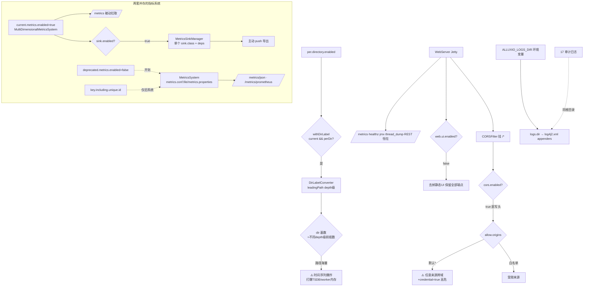

# 18 · 可观测性(Metrics / Web / 日志)

> 场景组:`alluxio.metrics.*` + `alluxio.web.*` + `alluxio.logs.*` + `alluxio.logger.*`
> 配置数:**26** · 别名 0 · 废弃 0 · 数据来源:`PropertyKey.java` · 生成表:`_data/gen_table.py 18`

---

## 1. 本组概览

本组管**指标采集、Web UI、日志**——集群可观测性的三大支柱。多为 `Scope=ALL/SERVER`。

三个子场景:

| 子场景 | 关键配置 | 核心矛盾 |
|---|---|---|
| Metrics | `metrics.sink.*`、`metrics.per.directory.*`、`current/deprecated.metrics.enabled` | 可观测粒度 vs 基数/开销 |
| Web UI | `web.ui.enabled`、`web.cors.*`、`web.threads`、`web.threaddump.*` | 便捷 vs 安全/资源 |
| 日志 | `logs.dir`、`logger.type` | — |

---

## 2. 配置清单速查表(全量 26 项)

### 2.1 Metrics
| 配置项 | 默认值 | 类型 | Scope | 说明 |
|---|---|---|---|---|
| `alluxio.metrics.conf.file` | ${conf}/metrics.properties | string | ALL | 指标系统配置文件路径 |
| `alluxio.metrics.sink.enabled` | false | boolean | ALL | 启用指标 sink(导出) |
| `alluxio.metrics.sink.class` | — | string | ALL | 指标 sink 实现类 |
| `alluxio.metrics.sink.deps` | — | list | ALL | sink 所需 jar |
| `alluxio.metrics.current.metrics.enabled` | true | boolean | ALL | 启用当前指标 |
| `alluxio.metrics.deprecated.metrics.enabled` | false | boolean | ALL | 启用旧指标 |
| `alluxio.metrics.per.directory.enabled` | false | boolean | ALL | 把挂载点作为关键指标 label |
| `alluxio.metrics.per.directory.depth` | 3 | int | ALL | 作为 label 的 Alluxio 路径深度 |
| `alluxio.metrics.key.including.unique.id.enabled` | false | boolean | ALL | 指标 key 含 hostname 等唯一 id |
| `alluxio.metrics.executor.task.warn.size` | 1000 | int | ALL | 活跃任务超此值告警 |
| `alluxio.metrics.executor.task.warn.frequency` | 5sec | duration | ALL | 告警频率 |

### 2.2 Web UI
| 配置项 | 默认值 | 类型 | Scope | 说明 |
|---|---|---|---|---|
| `alluxio.web.ui.enabled` | true | boolean | SERVER | master/worker 启用 Web UI(关则仅 REST/metrics) |
| `alluxio.web.file.info.enabled` | true | boolean | SERVER | Web UI 显示详细文件信息 |
| `alluxio.web.refresh.interval` | 15s | duration | SERVER | Web UI 自动刷新间隔 |
| `alluxio.web.threads` | 1 | int | SERVER | 服务 Web UI 的线程数 |
| `alluxio.web.threaddump.log.enabled` | false | boolean | SERVER | 访问 thread dump API 时同时打日志 |
| `alluxio.web.resources` | ${home}/webui/ | string | SERVER | Web UI 资源路径(勿改) |
| `alluxio.web.cors.enabled` | false | boolean | SERVER | 启用 REST API 的 CORS |
| `alluxio.web.cors.allow.origins` | * | string | SERVER | 允许的来源 |
| `alluxio.web.cors.allow.methods` | * | string | SERVER | 允许的方法 |
| `alluxio.web.cors.allow.headers` | * | string | SERVER | 允许的头 |
| `alluxio.web.cors.exposed.headers` | * | string | SERVER | 暴露的响应头 |
| `alluxio.web.cors.allow.credential` | false | boolean | SERVER | 请求含凭证 |
| `alluxio.web.cors.max.age` | -1 | int | SERVER | CORS 结果缓存秒数;-1 不缓存 |

### 2.3 日志
| 配置项 | 默认值 | 类型 | Scope | 说明 |
|---|---|---|---|---|
| `alluxio.logs.dir` | ${work}/logs | string | ALL | 服务日志目录(改用环境变量) |
| `alluxio.logger.type` | Console | string | ALL | 日志器类型(仅测试代码设置) |

---

## 3. 逐项深度分析(充分细节)

> 本组 26 项按配置族逐一深挖,并**翻代码求证机制**:先厘清最关键的**两套并存的指标系统**(这是理解本组 metrics 全部开关的前提)→ sink 导出 → per-directory 基数机制(`DirLabelConverter`)→ unique-id → executor 告警 → Web 服务器/端点拓扑 → CORS 过滤器(逐头求证)→ Web 线程模型(注意非"单线程")→ 其余 Web 项 → 日志。
>
> 权威实现文件:
> - `dora/core/common/src/main/java/alluxio/metrics/MetricsSystem.java`(**旧/deprecated** Dropwizard 系统,类头已标 `@Deprecated`)
> - `dora/core/common/src/main/java/alluxio/metrics/MultiDimensionalMetricsSystem.java`(**新/current** Prometheus/`io.prometheus` 系统,4300+ 行)
> - `dora/core/common/src/main/java/alluxio/metrics/sink/MetricsSinkManager.java`(新系统的 sink 加载器)
> - `dora/core/common/src/main/java/alluxio/metrics/DirLabelConverter.java`(per-directory 标签的路径截断)
> - `dora/core/server/common/src/main/java/alluxio/web/{WebServer,CORSFilter,StacksServlet}.java`(Web 服务器 / CORS / thread dump)

### 3.0 关键前提:两套并存的指标系统(current vs deprecated)

代码里有**两套完全独立的指标系统**,`current.metrics.enabled` / `deprecated.metrics.enabled` 各控其一,理解这一点后本组所有 metrics 开关才对得上号:

| 维度 | **新系统(current)** | **旧系统(deprecated)** |
|---|---|---|
| 实现类 | `MultiDimensionalMetricsSystem`(Prometheus `io.prometheus` 原生,带 label 维度) | `MetricsSystem`(Dropwizard `MetricRegistry`,类头 `@Deprecated`) |
| 开关 | `metrics.current.metrics.enabled`(默认 **true**) | `metrics.deprecated.metrics.enabled`(默认 **false**) |
| 导出/sink | `metrics.sink.*`(→ `MetricsSinkManager`,3.1) | `metrics.conf.file`=`metrics.properties`(→ `MetricsSystem.startSinks`,3.1b) |
| 抓取端点 | `/metrics`(`WebHandler`,Prometheus 文本格式) | `/metrics/json`(`MetricsServlet`)、`/metrics/prometheus`(Dropwizard→Prometheus 桥) |
| 支持 label | ✅(`method`/`dir`/`transport`/`result`… 多维) | ❌(名字里塞 `instance.name.hostname`,靠拼字符串) |
| per-directory | ✅(`withDirLabel`,3.2) | ❌ |

- **默认形态**:只有新系统开(current=true、deprecated=false)。生产监控走 **`/metrics` + Prometheus 抓取**即可,无需动 `metrics.properties`。
- **`deprecated.metrics.enabled`(false)**:代码求证——`MetricsSystem.startSinks()` / `startSinksFromConfig()` 开头即 `if (!sDeprecatedMetricsEnabled) return;`(第 184、243 行)。**关着时,`metrics.conf.file`/`metrics.properties` 整条链路是死的**,任何 `sink.*.class=...` 配置都不生效。只有需要兼容旧监控面板/旧 Dropwizard JSON 时才临时开。
- ⚠️ **易踩点**:`metrics.sink.*`(新)与 `metrics.conf.file`(旧)是**两条不相干的导出路径**,分别归属两套系统——不要混用(见 3.1 / 3.1b)。

### 3.1 新系统 sink 导出:`metrics.sink.enabled` + `class` + `deps`(`MetricsSinkManager`)

新系统的**主动导出(push sink)**由 `MetricsSinkManager.startSink()` 驱动,在 `MultiDimensionalMetricsSystem.initMetrics()` 里当 `metrics.sink.enabled=true` 才调用(第 3714 行 `if (METRICS_SINKS_ENABLED) MetricsSinkManager.startSink()`)。逐配置项 + 代码级机制:

- **`metrics.sink.enabled`(默认 false,ALL)**:新系统 push sink 总开关。⚠️ **关着不影响 `/metrics` 拉取端点**——被动拉取(Prometheus scrape `/metrics`)始终可用;这个开关只管**主动 push** 类 sink(如定期推 Graphite/自定义后端)。
- **`metrics.sink.class`(默认空,ALL)**:sink 实现类全限定名。代码求证:`MetricsSinkManager` 用反射 `sinkClass.getConstructor(Properties.class).newInstance(allProps)` 实例化,**要求 sink 有 `(java.util.Properties)` 单参构造**;`allProps` 是**整个 Alluxio 配置转成的 Properties**(`Configuration.toMap()` 全量注入),故自定义 sink 可从中读任意 `alluxio.*` 参数。
  - ⚠️ 关键实现细节:`MetricsSinkManager` **只加载一个 sink 类**(静态字段 `sSink`,非列表)——即新系统一次只支持一个 push sink。多目标导出需在自定义 sink 内部 fan-out,或依赖被动拉取。
  - 未配置 `sink.class` 时 `startSink()` 直接跳过(`if (!isSet(METRICS_SINK_CLASS)) return;`),故 `sink.enabled=true` 但没配 `class` = 无 push sink。
- **`metrics.sink.deps`(默认空 list,ALL)**:sink 实现所需的**外部 jar / 目录**列表(逗号分隔)。代码求证:非空时 `MetricsSinkManager` 用一个 `URLClassLoader(urls, 当前线程 contextClassLoader)` 从这些路径加载 sink 类,**避免把第三方 sink 依赖塞进 Alluxio 主 classpath**——用于导出到需额外驱动的后端(如某些 TSDB 客户端)。为空则直接 `Class.forName(className)`(走主 classpath)。
- **生命周期**:`startSink()` 成功后注册一个 JVM shutdown hook 停 sink;失败**只 LOG.error 不抛**(soft-fail,可观测性不阻断进程启动)。

### 3.1b 旧系统 sink:`metrics.conf.file`(`metrics.properties`)

- **`metrics.conf.file`(默认 `${conf}/metrics.properties`,ALL)**:**旧系统专用**。各进程启动时调 `MetricsSystem.startSinks(conf.getString(METRICS_CONF_FILE))`(worker/security/fuse/client 均有),但**首行就被 `deprecated.metrics.enabled=false` 短路**(见 3.0),默认整条链路不跑。
- 文件语法:`sink.[name].class=<Sink 实现>` + `sink.[name].[option]=<值>`(代码用正则 `^sink\.(.+)\.(.+)` 解析 `SINK_REGEX`)。旧系统 sink 构造签名不同——是 `(Properties, MetricRegistry)` **双参**(第 261 行),与新系统单参不兼容。仓库自带样例仅 `sink.jmx.class=alluxio.metrics.sink.JmxSink`。可用旧 sink:`ConsoleSink`/`CsvSink`/`GraphiteSink`/`JmxSink`/`Slf4jSink`(见 `metrics/sink/` 目录)。
- 结论:新部署**基本用不到此项**;仅当显式开 `deprecated.metrics.enabled` 兼容老监控时才配。

### 3.2 per-directory 标签:基数爆炸的机制根源(`DirLabelConverter`,重点)

把 Alluxio/UFS 路径当指标 label,是**最大的基数风险来源**,机制已翻到底:

- **`metrics.per.directory.enabled`(默认 false,ALL)** + **`metrics.per.directory.depth`(默认 3,ALL)**。
- **触发点**:`MultiDimensionalMetricsSystem.withDirLabel(...)`(第 3728 行)——**仅当 `current.metrics.enabled && per.directory.enabled` 同时为真**才给指标追加一个 `dir` 标签,否则返回原始 label 集(即默认零开销)。受影响的指标是**关键数据面指标**:`alluxio_data_throughput`、`alluxio_ufs_data_access`、`alluxio_cache_hit/miss/external_read` 等(源码里带 `withDirLabel(() -> DIR_LABEL, ...)` 的那批)。
- **`dir` 值怎么算(基数公式)**:`DirLabelConverter.fromUfs(path)`(第 44-55 行):经 `MountTableManager` 把 UFS 路径转成 Alluxio 路径 `uri`,再取 `uri.getLeadingPath(min(uri.getDepth()-1, DIR_DEPTH))`——即**取路径前缀的前 `depth` 级目录**作为标签值。
  - **`depth=3`** ⇒ 标签值 = 路径前 3 级目录(如 `/warehouse/db/table`)。
  - ⚠️ **基数 ≈ 集群中"深度≤depth 的不同目录前缀"个数**。`depth` 每加 1,标签取值集通常**成倍甚至指数级膨胀**;每个 `dir` 取值都会为每条受影响指标各造一条时间序列 → **打爆 Prometheus/TSDB 与 worker 内存**。
  - 未挂载或转换失败时返回空串 `""`(不额外造序列)。
- **选型**:
  - **路径少且稳定(如少量固定表/挂载点)**:可开,`depth` 取能区分业务的最小值(常 1~2)。
  - **路径海量/动态(训练数据、多租户目录、按日期分区)**:**必须保持 `per.directory.enabled=false`**,否则基数失控。
  - 想按目录观测又怕爆:优先在应用/查询侧用 Prometheus `label_replace`/recording rule 聚合,而非在采集侧展开高基数。

### 3.3 `metrics.key.including.unique.id.enabled`(默认 false,ALL)—— 旧系统专用的 hostname 后缀

- **仅作用于旧系统**:代码求证——`MetricsSystem.getMetricNameWithUniqueId()`(第 436 行)在 `sUniqueIDEnabled` 为真时把 `instance.metricName` 拼成 `instance.metricName.hostname`(worker/security/client 指标)。新系统靠 label 区分实例,不走这条。
- **作用**:多实例(多 worker/多 client)在旧 Dropwizard 名字空间里靠 hostname 后缀区分,否则同名指标在聚合端互相覆盖。
- ⚠️ **代价**:同 3.2,把 hostname 塞进指标名 = 基数随实例数线性增长(旧系统无 label,只能靠名字膨胀)。默认关。开此项前提是先开 `deprecated.metrics.enabled`,否则无意义。

### 3.4 executor 任务告警:`metrics.executor.task.warn.{size,frequency}`

- **`metrics.executor.task.warn.size`(默认 1000,ALL)** + **`metrics.executor.task.warn.frequency`(默认 5sec,ALL)**:被 `InstrumentedExecutorService` 使用——当某个受监控线程池的**活跃任务数(排队 + 运行)超过 `size`** 时,**按 `frequency` 间隔**打一条 WARN 日志。
- **用途**:线程池积压的早期预警(如异步持久化、compaction、RPC handler 池排队)。这是**日志告警**而非指标,`frequency` 起限流作用(防积压时刷屏)。
- **调参**:大规模集群若 1000 触发过于频繁(误报),按实际池容量上调 `size`;想更早发现积压则下调。属低风险微调,默认即可。

### 3.5 Web 服务器拓扑与端点(理解 `web.*` 的前提)

`WebServer`(`dora/core/server/common/.../web/WebServer.java`)是 master/worker 共用的 Jetty 基类,启动时**无条件**挂载以下端点(与 UI 页面独立):

| 端点 | 用途 | 是否受 `web.ui.enabled` 影响 |
|---|---|---|
| `/metrics` | **新系统** Prometheus 抓取(`MultiDimensionalMetricsSystem.WebHandler`) | 否(始终在) |
| `/metrics/json` | 旧系统 Dropwizard JSON(`MetricsServlet`) | 否 |
| `/metrics/prometheus` | 旧系统 Dropwizard→Prometheus 桥(`PrometheusMetricsServlet`) | 否 |
| `/metrics/jmx` | JMX 指标 | 否 |
| `/healthz` | K8s 健康检查 | 否 |
| `/api/v1/common/thread_dump` | 线程 dump(`StacksServlet`,见 3.8) | 否 |
| REST API `/api/v1/*` | 各进程 REST(worker 侧在子类挂载) | 否 |
| 静态 UI(`index.html`+资源) | Web 页面 | **是**(见 3.6) |

CORS 过滤器 `CORSFilter` 挂在 **`/*`(所有路径)**,覆盖上述全部端点(第 155 行)。⚠️ 因此 CORS 若放开,连 `/metrics`、thread_dump、REST 一并对跨域开放。

### 3.6 `web.ui.enabled`(默认 true,SERVER)与 `web.resources` / `web.file.info.enabled`

- **`web.ui.enabled`(true)**:代码求证——`WorkerWebServer` 第 97 行 `if (getBoolean(WEB_UI_ENABLED)) { 挂静态资源 + DefaultServlet + 404→index 重写 }`。**关掉只去掉静态 UI 页面**;3.5 表里的 `/metrics`、REST、healthz、thread_dump **全部保留**。
  - **安全加固推荐**:对外只需被监控/被健康检查的进程,可 `web.ui.enabled=false` 去掉 UI 攻击面,同时 Prometheus 仍能抓 `/metrics`。
- **`web.resources`(默认 `${home}/webui/`,SERVER)**:UI 静态资源根目录(worker 用 `${web.resources}/worker/build/`)。官方注释"User should never modify"——由打包布局决定,**不要改**。
- **`web.file.info.enabled`(默认 true,SERVER,`ENFORCE`)**:控制 Web UI 是否展示**详细文件信息**(浏览目录/文件明细)。`ENFORCE` = 全集群一致。关掉可减少 UI 暴露的文件级元数据(合规/最小暴露场景)。(注:本仓库未见服务端直接读取此 key 的活跃代码路径,主要经 Web UI init 传给前端;**建议验证**当前版本的实际生效面。)
- **`web.refresh.interval`(默认 15s,SERVER)**:Web UI 开启自动刷新时的刷新间隔,经 WebUI init(`MasterWebUIInit`/`WorkerWebUIInit`)下发前端。纯 UI 体验项,无服务端负载敏感性。

### 3.7 CORS:`web.cors.*`(逐响应头翻代码,安全重点)

`CORSFilter.doFilter()`(全文 50 行)机制**极其直接**——当 `web.cors.enabled=true` 时,把各配置值**原样写进响应头**,无任何校验/白名单收窄:

| 配置项(默认) | 写入的响应头 | 说明 |
|---|---|---|
| `web.cors.enabled`(false) | —(总开关) | 关则整个 filter 体不执行,不加任何 CORS 头 |
| `web.cors.allow.origins`(`*`) | `Access-Control-Allow-Origin` | ⚠️ 默认 `*`=任意来源 |
| `web.cors.allow.methods`(`*`) | `Access-Control-Allow-Methods` | 默认任意方法 |
| `web.cors.allow.headers`(`*`) | `Access-Control-Allow-Headers` | 默认任意请求头 |
| `web.cors.exposed.headers`(`*`) | `Access-Control-Expose-Headers` | 默认暴露任意响应头 |
| `web.cors.allow.credential`(false) | `Access-Control-Allow-Credentials`(仅 true 时写) | 允许带凭证跨域 |
| `web.cors.max.age`(-1) | `Access-Control-Max-Age` | 预检缓存秒数;-1=不缓存 |

- **代码求证的唯一"智能"逻辑**:`if (!origins.equals("*")) resp.addHeader("Vary","Origin");`——收紧了 origins 才加 `Vary: Origin`(缓存正确性)。除此之外**全是直写**。
- ⚠️⚠️ **高危组合**:`allow.origins=*` + `allow.credential=true`。标准浏览器会拒绝"通配 origin + 携带凭证",但**本 filter 会把两者都照写**——若前面有反代/网关改写 origin,或客户端非标准,则等于**任意站点可带凭证跨域访问全部 Web/REST/metrics 端点**(CSRF、凭证泄露、敏感元数据泄露)。
- **生产必做**:一旦 `cors.enabled=true`,**务必把 `allow.origins` 收成明确白名单**(如 `https://console.example.com`),并按最小权限收紧 `allow.methods`/`allow.headers`;`allow.credential` 非必要不开。默认全关(`cors.enabled=false`)是安全的,不用 CORS 就别开。

### 3.8 `web.threads`(默认 1,SERVER)—— 注意:不是"单线程"

- ⚠️ **纠正常见误解**:默认 1 **不等于** Web 只有 1 个线程。代码求证(`WebServer` 第 106-110 行):
  - `minThreads = webThreadCount * 2 + 1`(默认 **3**)
  - `maxThreads = webThreadCount * 2 + 100`(默认 **102**)
  - 注释解释 Jetty 至少需要 `1 + selectors + acceptors` 个线程,故做了 `*2+常数` 的放大。
- 因此默认已能处理相当并发的 Web/REST/`/metrics` 请求。**`web.threads` 是"基线倍率"旋钮**:高频抓取 `/metrics`、大量 REST 或多客户端同时看 UI 时可上调(如设 4 → min 9 / max 108),但一般默认足够。
- 内存/线程代价随 `maxThreads` 走,超大值需评估(每线程栈内存)。

### 3.9 `web.threaddump.log.enabled`(默认 false,SERVER)

- 代码求证:`StacksServlet.doGet()`——访问 thread dump 端点(`/api/v1/common/thread_dump`)时,**总是**把线程栈写回 HTTP 响应;若此项为 true,**额外**调 `ThreadUtils.logThreadInfo(LOG, ...)` 把同一份线程信息**也落进服务日志**。
- **用途**:排障时留痕(响应可能没被保存,日志留底便于事后分析)。生产可常关,遇到 hang/死锁排查时临时开或按需触发。

### 3.10 日志:`logs.dir` 与 `logger.type`

- **`logs.dir`(默认 `${work}/logs`,ALL,`WARN`)**:服务日志目录。⚠️ **官方明确"仅内部使用,改目录请设环境变量 `$ALLUXIO_LOGS_DIR`"**,代码/脚本求证:
  - `libexec/alluxio-config.sh`:`ALLUXIO_LOGS_DIR=${ALLUXIO_LOGS_DIR:-${ALLUXIO_HOME}/logs}`,再 `-Dalluxio.logs.dir=${ALLUXIO_LOGS_DIR}` 注入 JVM;且脚本**主动检测**并警告 "setting alluxio.logs.dir through ALLUXIO_JAVA_OPTS ... will be ignored. Use environment variable ALLUXIO_LOGS_DIR instead"。
  - `conf/log4j2.xml`:`<Property name="logs.dir">${sys:alluxio.logs.dir:-/opt/alluxio/logs}</Property>`,所有 appender(coordinator/worker/fuse/audit/access…)以此为根。
  - 结论:**改日志目录只应改 `ALLUXIO_LOGS_DIR` 环境变量**,直接改属性会被脚本忽略/覆盖。
- **`logger.type`(默认 `Console`,ALL,`IGNORE`)**:选择进程用哪个 log4j2 appender(如 `WORKER_LOGGER`/`COORDINATOR_LOGGER`/`Console`)。官方注释"仅测试代码设置"——**生产由启动脚本按进程角色自动注入正确值**(见 `-Dalluxio.logger.type=...`),用户**不应手动改**。`IGNORE` 一致性 = 不参与集群一致性校验。

---

## 4. 配置关联关系图

---

## 5. 典型场景配置组合建议

| 场景 | 推荐组合 | 理由 |
|---|---|---|
| **生产监控(默认推荐)** | 保持 `current.metrics.enabled=true`,让 Prometheus 直接抓 `/metrics` | 新系统被动拉取即可,**无需** `sink.enabled` / `metrics.properties` |
| **需主动 push 到自定义后端** | `metrics.sink.enabled=true` + `metrics.sink.class=<自定义 Sink>`(+ `metrics.sink.deps` 若需外部 jar) | 走 `MetricsSinkManager`,单 sink push;类需 `(Properties)` 构造 |
| **兼容旧 Dropwizard 面板** | `deprecated.metrics.enabled=true` + 配 `metrics.properties`(`sink.jmx.class=...` 等) | 仅此时旧链路才生效;新旧可并存 |
| **按目录看指标(路径少且稳定)** | `per.directory.enabled=true` + `per.directory.depth`=能区分业务的最小值(常 1~2) | 挂载点/顶层目录级可观测,基数可控 |
| **路径海量/动态集群** | `per.directory.enabled=false`(默认) | `dir` 基数 ≈ 不同 depth 级前缀数,开启即时间序列爆炸 |
| **多旧实例区分(仅旧系统)** | `deprecated.metrics.enabled=true` + `key.including.unique.id.enabled=true` | 旧系统无 label,靠 hostname 后缀区分;新系统不需要 |
| **安全加固 / 仅监控节点** | `web.ui.enabled=false`(保留 `/metrics`+healthz+REST) | 去掉 UI 攻击面,监控/健康检查不受影响 |
| **必须开 CORS** | `cors.enabled=true` + `allow.origins=<明确白名单>` + 收紧 `methods`/`headers`,`allow.credential` 非必要不开 | filter 直写头无校验,通配=任意跨域 |
| **高频抓取 / 大量 REST** | 上调 `web.threads`(如 4 → min9/max108) | 默认 1 已给 min3/max102,极高并发再抬 |
| **排障留痕** | `web.threaddump.log.enabled=true` + 按需访问 thread_dump 端点 | 线程栈同时落日志便于事后分析 |
| **改日志目录** | 设环境变量 `ALLUXIO_LOGS_DIR`(**不要**改 `alluxio.logs.dir` 属性) | 属性会被启动脚本忽略/覆盖 |

---

## 6. 风险与注意事项

1. **⚠️ 两套指标系统别混用**:`metrics.sink.*`(新,`MetricsSinkManager`,单 sink,`(Properties)` 构造)与 `metrics.conf.file`/`metrics.properties`(旧,`MetricsSystem`,`(Properties,MetricRegistry)` 构造)是两条不相干的导出链。旧链默认被 `deprecated.metrics.enabled=false` 整体短路——没开它,`metrics.properties` 里配什么都不生效。这是最易踩的隐性依赖。
2. **⚠️ `per.directory.enabled` 基数爆炸**:开启后 `DirLabelConverter` 把路径前 `depth` 级(默认 3)作 `dir` 标签,时间序列数 ≈ 不同前缀数 × 受影响指标数;`depth` 每 +1 通常成倍膨胀,路径海量时打爆 Prometheus/TSDB 与 worker 内存。路径不稳定的集群保持默认关闭。
3. **⚠️ CORS 直写无校验,高危组合 `origins=*` + `credential=true`**:`CORSFilter` 把配置值原样写响应头,且挂在 `/*`(含 `/metrics`、thread_dump、REST)。通配 origin 配上允许凭证,在非标准客户端/反代改写场景下 = 任意站点带凭证跨域,CSRF/凭证与元数据泄露。开 CORS 必收白名单。
4. **`sink.enabled=false` 不影响拉取**:该开关只管新系统的主动 push sink;`/metrics` 被动抓取始终可用。误以为"没开 sink 就没指标"会导致误配。
5. **`web.threads` 不是线程总数**:默认 1 实际给出 min3/max102(代码 `*2+1` / `*2+100`)。不必因"默认 1"而盲目上调;真高并发再抬,并注意 `maxThreads` 的栈内存代价。
6. **`web.ui.enabled=false` 保留端点**:关 UI 只去静态页,`/metrics`/healthz/REST/thread_dump 仍在——这是安全加固的正确姿势,不会误伤监控。
7. **`web.resources` / `logger.type` 勿手改**:前者官方注"never modify",由打包布局决定;后者"仅测试代码设置",生产由启动脚本按角色注入。
8. **改日志目录只走环境变量**:`logs.dir` 官方"仅内部使用",`libexec/alluxio-config.sh` 会主动忽略经 `ALLUXIO_JAVA_OPTS` 传的 `alluxio.logs.dir` 并警告,应改 `ALLUXIO_LOGS_DIR`。
9. **`key.including.unique.id.enabled` 仅旧系统有效且增基数**:新系统靠 label 区分实例,此项对新系统无意义;开它需先开 deprecated,且会让旧指标名随实例数膨胀。
10. **`web.file.info.enabled` 生效面待核**:当前版本服务端未见活跃读取路径,主要经 WebUI init 影响前端展示,精确生效面**建议验证**。

---

## 跨组关联速览
- [17-security](17-security.md) —— 审计/访问日志(合规观测)
- [05-worker-s3-gateway](05-worker-s3-gateway.md) —— S3 选择性指标 / 访问审计日志
- [13-coordinator-master](13-coordinator-master.md) / [06-worker-net-rpc](06-worker-net-rpc.md) —— Web UI 端口
