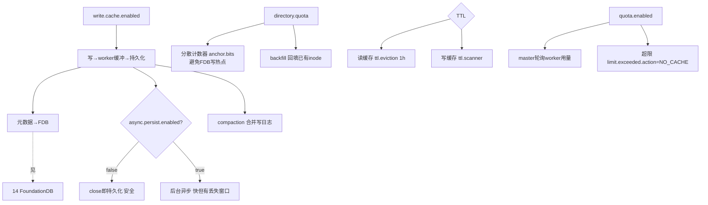

# 19 · 写入 / TTL / 配额

> 场景组:`alluxio.write.*`(写缓冲/写缓存 PFS)+ `alluxio.ttl.*` + `alluxio.quota.*` + `alluxio.concurrent.write.*`
> 配置数:**52** · 别名 1 · 废弃 0 · 数据来源:`PropertyKey.java` · 生成表:`_data/gen_table.py 19`

---

## 1. 本组概览

本组是**全局的写缓冲(write buffer/cache)子系统 + TTL 生命周期 + 配额**。写缓冲是 DORA 的高级写路径:写先进临时缓冲、再异步持久化,元数据存 FoundationDB(FDB),支持 block 级 compaction、目录配额、TTL 过期扫描。这里的 `write.cache.*` 是**系统级底座**([01](01-client-fs-io.md)/[04](04-worker-page-store.md)/[16](16-fuse.md) 的写缓存都建立其上)。多为 `Scope=ALL/CLIENT/SERVER`。

四个子场景:

| 子场景 | 关键配置 | 核心矛盾 |
|---|---|---|
| 写缓冲总开关与形态 | `write.cache.enabled`、`dual.buffer.file.system.type`、`file.metadata.storage`、`pfs.*` | 写性能 vs 复杂度/一致性 |
| 异步持久化与 compaction | `write.buffer.async.persist.*`、`write.cache.async.persist.*`、`compaction.enabled` | 吞吐 vs 资源 |
| 目录配额(PFS) | `write.cache.pfs.directory.quota.*` | 隔离 vs 开销 |
| TTL / 配额 | `ttl.*`、`quota.*`、`write.cache.ttl.*` | 空间回收 vs 扫描开销 |

---

## 2. 配置清单速查表(全量 52 项)

### 2.1 写缓冲总开关与形态
| 配置项 | 默认值 | 类型 | Scope | 说明 |
|---|---|---|---|---|
| `alluxio.write.cache.enabled` | false | boolean | ALL | 写缓冲总开关(写先经 worker 缓冲再持久化) |
| `alluxio.write.cache.dual.buffer.file.system.type` | GENERIC_FDB_BACKED_V1 | enum | ALL | 双写缓冲文件系统类型(别名 file.system.type) |
| `alluxio.write.cache.file.metadata.storage` | FDB | enum | ALL | 写缓冲元数据存储:MEMORY(测试)/ FDB |
| `alluxio.write.cache.local.file.system.path` | /tmp/alluxio_fs_local | string | ALL | 写缓冲本地文件系统路径 |
| `alluxio.write.cache.pfs.block.size` | 16MiB | dataSize | CLIENT | 写缓存 block 大小(compaction 粒度) |
| `alluxio.write.cache.pfs.cluster.name` | default | string | ALL | PFS 集群名(FDB subspace 命名空间) |
| `alluxio.write.cache.compaction.enabled` | true | boolean | ALL | 写日志 compaction |
| `alluxio.concurrent.write.enabled` | false | boolean | ALL | 并发写(同时改 FUSE 与 worker 行为) |
| `WRITE_BUFFER_ROCKSDB_LOCAL_WRITE_REGEX` | (?!) | string | ALL | 匹配仅本地写的文件(模板名) |
| `WRITE_BUFFER_ROCKSDB_QUORUM_WRITE_REGEX` | (?!) | string | ALL | 匹配 quorum 写的文件(模板名) |

### 2.2 异步持久化 / multipart(write buffer)
| 配置项 | 默认值 | 类型 | Scope | 说明 |
|---|---|---|---|---|
| `alluxio.write.buffer.async.persist.enabled` | false | boolean | ALL | 是否**异步**持久化;false=关闭时**同步**持久化(两者都落 UFS,区别在时机) |
| `alluxio.write.cache.async.persist.schedule.period` | 1s | duration | CLIENT | 异步持久化调度周期 |
| `alluxio.write.cache.async.persist.thread.pool.size` | 16 | int | CLIENT | 异步持久化线程池 |
| `alluxio.write.cache.async.persist.submit.batch.size` | 2048 | int | CLIENT | 异步持久化提交批大小 |
| `alluxio.write.cache.async.persist.cache.free.delay` | 10min | duration | CLIENT | 持久化后释放缓存的延迟;≤0 关 |
| `alluxio.write.cache.async.file.check.period` | 10min | duration | CLIENT | 写缓冲文件检查周期(超期优先持久化) |
| `alluxio.write.cache.async.check.orphan.timeout` | 10min | duration | ALL | 孤儿文件检测超时 |
| `alluxio.write.buffer.multipart.upload.enabled` | false | boolean | CLIENT | 写缓冲 multipart 上传 |
| `alluxio.write.buffer.multipart.upload.part.size` | 16MB | dataSize | CLIENT | multipart 分片大小 |
| `alluxio.write.buffer.multipart.upload.threads` | 8 | int | CLIENT | multipart 上传线程 |
| `alluxio.write.buffer.multipart.upload.buffer.number` | 16 | int | CLIENT | 缓冲池大小;0=不池化 |
| `alluxio.write.buffer.multipart.upload.max.buffers.per.stream` | 16 | int | CLIENT | 单流最大并发缓冲 |

### 2.3 PFS 元存储与目录配额(FDB)
| 配置项 | 默认值 | 类型 | 说明 |
|---|---|---|---|
| `alluxio.write.cache.metastore.cache.enabled` | false | boolean | FDB metastore 加本地读穿缓存 |
| `alluxio.write.cache.metastore.cache.positive.ttl` / `negative.ttl` | 3sec / 1sec | duration | 读穿缓存正/负条目 TTL |
| `alluxio.write.cache.pfs.id.allocator.batch.size` | 32K | int | inode/写日志 ID 分配批(FDB 事务) |
| `alluxio.write.cache.pfs.scatter.buckets` | 16384 | int | inode ID 分配器 scatter 桶数 |
| `alluxio.write.cache.pfs.worker.id.cache.size` | 100万 | int | worker-id 映射缓存 |
| `alluxio.write.cache.pfs.directory.quota.cache.refresh.interval` | 10s | duration | 目录配额内存缓存刷新 |
| `alluxio.write.cache.pfs.directory.quota.backfill.scan.batch` | 64 | int | 配额 backfill 每事务处理 inode 数 |
| `alluxio.write.cache.pfs.directory.quota.backfill.scan.interval` | 1s | duration | backfill 队列轮询间隔 |
| `alluxio.write.cache.pfs.directory.quota.backfill.worker.threads` | 8 | int | backfill 线程池 |
| `alluxio.write.cache.pfs.directory.quota.counter.anchor.bits` | 8 | int | 配额计数器分散锚点位数 |
| `alluxio.write.cache.pfs.directory.quota.orphan.cleanup.interval` | 6h | duration | 泄漏计数器清理间隔 |
| `alluxio.write.cache.pfs.directory.quota.backfill.batch.delay` | 0ms | duration | (测试)backfill 批间人为延迟 |

### 2.4 TTL(读缓存 + 写缓存)
| 配置项 | 默认值 | 类型 | Scope | 说明 |
|---|---|---|---|---|
| `alluxio.ttl.policy.enabled` | false | boolean | ALL | TTL 策略特性开关 |
| `alluxio.ttl.eviction.check.interval` | 1h | duration | ALL | 读缓存 TTL 淘汰检查间隔 |
| `alluxio.ttl.policy.etcd.polling.interval.ms` | 3s | duration | ALL | 从 etcd 拉 TTL 策略间隔 |
| `alluxio.write.cache.ttl.scanner.enabled` | false | boolean | SERVER | 写缓存 TTL 后台扫描器 |
| `alluxio.write.cache.ttl.scan.interval` / `interval.min` | 1h / 1h | duration | SERVER | 写缓存 TTL 扫描间隔/下限 |
| `alluxio.write.cache.ttl.scan.batch.size` | 500 | int | SERVER | TTL 扫描每页条目 |
| `alluxio.write.cache.ttl.scan.max.per.round` | 10000 | int | SERVER | 每轮处理过期文件上限 |
| `alluxio.write.cache.ttl.scan.threads` | 16 | int | SERVER | TTL 扫描并发线程 |
| `alluxio.write.cache.ttl.refresh.enabled` | false | boolean | SERVER | 允许 ttl refresh 命令回填 TTL |

### 2.5 配额(quota)
| 配置项 | 默认值 | 类型 | Scope | 说明 |
|---|---|---|---|---|
| `alluxio.quota.enabled` | false | boolean | ALL | 配额特性开关 |
| `alluxio.quota.limit.exceeded.action` | NO_CACHE | enum | ALL | 超配额动作:NO_CACHE 等 |
| `alluxio.quota.coordinator.heartbeat.threads` | max(8,CPU) | int | ALL | coordinator 管理配额用量的线程 |
| `alluxio.quota.worker.heartbeat.interval.ms` | 1s | duration | ALL | master 轮询 worker 配额用量间隔 |
| `alluxio.quota.worker.heartbeat.timeout.ms` | 30s | duration | ALL | worker 响应配额用量的超时 |
| `alluxio.quota.etcd.polling.interval.ms` | 3s | duration | ALL | 从 etcd 拉配额定义间隔 |
| `alluxio.quota.evictor.capacity.modifier.size` | -1MiB | dataSize | ALL | 恢复配额用量的淘汰器行为微调 |

---

## 3. 逐项深度分析(充分细节)

> 本组 52 项按配置族逐一深挖:总体架构 → 双写缓冲类型 → 异步持久化 → compaction → **PFS/FDB 内部机制** → 目录配额 → multipart → 并发写 → RocksDB preset → TTL → quota。

### 3.1 写缓冲总体架构与形态(`write.cache.*` 基础)
- **`write.cache.enabled`(默认 false,ALL)**:总开关。开启后写先进 worker 临时缓冲、再持久化到 UFS——DORA 支撑**随机写/追加/训练 checkpoint** 的底座([01](01-client-fs-io.md) 客户端、[04](04-worker-page-store.md) 服务端、[16](16-fuse.md) FUSE 的写缓存都建立其上)。这是一整套"PFS(Paged File System)写缓冲子系统"的入口。
- **`file.metadata.storage`(默认 `FDB`,ALL)**:写缓冲的 inode/写日志**元数据**存哪。`FDB`(FoundationDB)=生产;`MEMORY`=仅测试(重启即失)。选 FDB 则 FoundationDB 成硬依赖([14组](14-membership-etcd.md))。
- **`pfs.cluster.name`(默认 `default`,ALL)**:PFS 集群名,用作 **FDB subspace 命名空间**——多个 Alluxio 集群可共享同一 FDB 实例而互不干扰(键前缀隔离)。多集群共用 FDB 时**必须各自唯一**,否则元数据串台。
- **`pfs.block.size`(默认 `16MiB`,CLIENT)**:写缓存的 **block 粒度**——写日志与 page store 文件按 block 级组织与 compaction。影响 compaction 单元与空间放大计算。
- **`write.cache.local.file.system.path`(默认 `/tmp/alluxio_fs_local`,ALL)**:写缓冲的本地文件系统路径(暂存)。⚠️ 默认在 `/tmp`,生产应指向持久化/大容量盘,避免 `/tmp` 空间不足或重启清空。

### 3.2 双写缓冲文件系统类型 `dual.buffer.file.system.type`(V1 vs V2,重点)

> 全名 `alluxio.write.cache.dual.buffer.file.system.type`(别名 `alluxio.write.cache.file.system.type`),枚举 `DualBufferFileSystemType`,**默认 `GENERIC_FDB_BACKED_V1`**,Scope=ALL。这是**写缓冲的架构选型开关**,由 `DualBufferFileSystemFactory` 按值 new 出完全不同的实现——决定"能不能用 V2 才有的一整套能力"。

#### 枚举全解(6 个值)
| 值 | 状态 | 实现 | 用途 |
|---|---|---|---|
| `GENERIC_FDB_BACKED_V1` | **默认**·现役 | `WriteBufferFileSystem` + `WriteBufferFileMetaDAO`(DAO 抽象) | 写缓冲 phase 1,元数据经 DAO(MEMORY/FDB,见 `file.metadata.storage`) |
| `GENERIC_FDB_BACKED_V2` | 现役·进阶 | `FdbBasedFileSystem`(直连 FDB)+ inode 恢复策略 | 写缓冲 phase 2,能力最全(见下) |
| `ROCKS_DB_PRESET` | 现役 | `RocksDBWriteFileSystem`(quorum write) | sf rocksdb 项目专用 |
| `MULTI_WORKSPACE_GENERIC` | 现役·特殊 | 内存 metastore + UFS 作 page store | 多工作区;**不经工厂**创建(AlluxioFuse 专门路径) |
| `LANCE_DB_PRESET` | ⚠️废弃 | `LocalWriteBufferFileSystem` | lancedb;FUSE 位置写路径已移除,退化到普通随机写流 |
| `GENERIC_LOCAL_UFS_BACKED` | ⚠️废弃 | `LocalWriteBufferFileSystem` | dora+本地 UFS;同上废弃原因 |

#### V1 vs V2 架构差异(核心)
工厂(`DualBufferFileSystemFactory.createInstance`)对两者的构造截然不同:
- **V1**:`new WriteBufferFileSystem(WriteBufferFileMetaDAO.create(conf), ...)`——写缓冲文件元数据经一层 **DAO 抽象**(可 MEMORY 或 FDB,由 `write.cache.file.metadata.storage` 决定,默认 FDB)。
- **V2**:`new FdbBasedFileSystem(...)` **直连 FoundationDB**,并额外 `initializeInodeRecoveryStrategy(fdbFs.getMetastore())`——把 metastore 与文件系统操作解耦,支持**从 UFS 恢复缺失 inode**(见下)。

#### V2 独有能力(为什么要用 V2)
V2 是"phase 2"的完整形态,以下能力**只有 V2 有,V1 不具备**:

1. **FUSE 分布式 POSIX 锁**(`alluxio.fuse.posix.lock.enabled`,见 [16组](16-fuse.md)):
   - 代码强约束——`FUSE_POSIX_LOCK_ENABLED=true` 时若类型不是 V2,**直接抛 `IllegalArgumentException`**("FUSE POSIX locks are only supported when ... is set to GENERIC_FDB_BACKED_V2")。
   - 实现走 `FuseFdbLockManager` + `FdbMetastoreImpl` + 每挂载一个 UUID 的 `FuseLockHandler`——**锁状态落 FDB**,故能跨节点/跨 FUSE 实例分布式加锁(多客户端并发写同文件的 flock/fcntl 语义)。

2. **Worker 侧写缓存后台任务全套**(`PagedDoraWorker`,仅当 `write.buffer.enabled` **且** 类型=V2 时才启动;否则全部为 `null`):
   - `FdbLockManager`(setWorkerId)、`AsyncPersistHandler`(异步持久化)、`CopyFileHandler`(补副本/瞬态拷贝)、`ReportFilesHandler`、`CompactionHandler`(compaction)。
   - ⚠️ **重要推论**:[04组](04-worker-page-store.md) 的 `worker.write.cache.async.persist.*`、`compaction.threads`、`copy.missing.replica.*` 和 [13组](13-coordinator-master.md) 的 `coordinator.write.cache.background.tasks.*` 这些参数,**只有在 V2 下才真正生效**——V1 不启动这套 handler。

3. **Inode 恢复策略**(`UfsInodeRecoveryStrategy`,策略模式):当 write buffer 里 inode 缺失但文件在 UFS(read buffer)存在时,**按原 inode ID 从 UFS 恢复**——覆盖"inode 被逐出缓存 / 需从 UFS 提升 / 崩溃后重建"场景,保证元数据一致性。V1 无此机制。

4. **V2 "direct file" + 去重 page store 模型**(由 `WriteCacheFsckCommand` 的 V2 校验反推):V2 的文件在 worker 上以**去重的 page store 文件**存储、由 **worker id** 引用;fsck 会校验 page store 文件长度、worker id 一致性、去重正确性。这是 V1 的 DAO 模型不具备的 on-disk 布局。

#### 选型建议
- **默认 V1** 是保守选择(phase 1,稳定)。
- 需要下列任一能力 → **必须切 V2**:FUSE 分布式 POSIX 锁、完整的 worker 异步持久化/compaction/补副本后台流水线、inode 崩溃恢复。
- V2 **硬依赖 FoundationDB**(`FdbMetastore`),需 FDB 高可用部署([14组](14-membership-etcd.md))。
- 切换需评估:V1↔V2 的 on-disk/元数据布局不同,**不是简单改个开关就能热切**,已有写缓冲数据的迁移需专门验证(建议验证)。

### 3.3 异步持久化全链(`write.buffer/cache.async.persist.*`)
- **`write.buffer.async.persist.enabled`(默认 false)**:开关修饰的是"**异步**",不是"是否持久化"——两种取值都会落 UFS,区别在时机与是否阻塞 close:
  - `false`(默认):**异步关闭 → 同步持久化**,文件 close 时同步落 UFS(阻塞 close,但写完即安全、无丢失窗口)。默认选更安全的同步。
  - `true`:**异步持久化**,close 快、后台落盘,但持久化前有在途数据丢失窗口。
- **异步流水线全参**(仅 `enabled=true` 生效):
  - `schedule.period`(1s):异步持久化服务扫描待持久化文件的周期。调短→更快落盘、更多扫描开销。
  - `thread.pool.size`(16):并行持久化线程数。UFS 慢/文件多时上调。
  - `submit.batch.size`(2048):每次提交的异步持久化任务批大小——批越大调度开销越低、单批延迟越高。
  - `async.file.check.period`(10min):检查写缓冲中文件的周期;**在缓冲里超过此周期的文件被优先持久化**(防老文件长期滞留缓冲)。
  - `async.persist.cache.free.delay`(10min):持久化完成后**延迟释放缓存**的时长——留一个读命中窗口(刚写完的文件常被立即读);≤0 关闭延迟(持久化即释放,省空间但牺牲写后读命中)。
  - `async.check.orphan.timeout`(10min):孤儿文件(缓冲有、无对应 inode 引用)检测超时。
- **与 worker/coordinator 侧的分工**:本组是**客户端/发起侧**的异步持久化参数;真正在 worker 上执行持久化的线程/队列/重试在 [04组](04-worker-page-store.md)(`worker.write.cache.async.persist.*`,含 24h 重试),编排扫描在 [13组](13-coordinator-master.md)。⚠️ 这套 worker 侧 handler **仅 V2 启动**(见 3.2)。

### 3.4 Compaction(写日志合并,控空间放大)
- **`write.cache.compaction.enabled`(默认 true,ALL)**:写缓冲对每个 block 内的**写日志**(每次写追加一条日志)周期性合并,减少日志数、控制空间放大。关闭会导致写日志无限累积、读放大与空间放大。
- **触发条件**(与 [01组](01-client-fs-io.md) 客户端配合):写日志数超 `trigger.compaction.on.write.log.count`(1024)或空间放大超 `compaction.space.amplification.percent`(50%,且逻辑文件 ≥ `min.file.size`=64MiB)→ 触发;每块最多 `max.write.logs.per.block.for.compaction`(8)条日志参与。
- **执行**:worker 侧 `compaction.threads`(16,[04组](04-worker-page-store.md))做实际合并;`submit.compaction.task.to.worker.enabled`(true)决定提交给 worker 执行。

### 3.5 PFS / FDB 内部机制(`write.cache.pfs.*` + `metastore.cache.*`)—— 高级/防热点
写缓冲元数据在 FoundationDB 上,以下参数是**为在 FDB 上避免写热点、控事务开销**而设,属高级调优,一般保持默认:
- **ID 分配器**(`pfs.id.allocator.batch.size`=32K):inode / 写日志 ID **每次向 FDB 批量申请** 32768 个,减少 FDB 事务次数。代价:进程重启会**浪费未用完的一批 ID**(ID 空间足够大,可接受)。
- **ID scatter 防热点**(`pfs.scatter.buckets`=16384=2^14):顺序 ID 会落在相邻 FDB key 上 → 尾部分片写热点/事务冲突。scatter 把 ID 空间当 N 列矩阵,**顺序 ID 按列存储**(公式 `scattered = (seq % N) * BUCKET_LEN + seq / N`),使连续 ID 散落到不同 key 区域。此值首次初始化后**持久化在集群信息表,后续以持久值为准**(改配置不影响已初始化集群)。
- **worker-id 映射缓存**(`pfs.worker.id.cache.size`=1M):worker-id ↔ long 引用双向映射的缓存条目上限,避免每次查 FDB,同时限内存。
- **metastore 读穿缓存**(`write.cache.metastore.cache.enabled`=false):给单例 FDB metastore 加一层**本地 read-through 缓存**。开启后:
  - `positive.ttl`(3s):命中(存在)条目 TTL。
  - `negative.ttl`(1s):未命中(不存在)条目 TTL;设 0 关闭负缓存。
  - ⚠️ 缓存会引入短暂陈旧窗口——强一致场景权衡。
- **目录配额计数器锚点**(`pfs.directory.quota.counter.anchor.bits`=8→2^8=256):见 3.6,同样是防 FDB 单 key 写热点的分散计数。

### 3.6 目录配额(PFS directory quota)—— FDB 上的分布式计数
写缓冲支持**目录级配额**(限制某目录树的用量),实现精巧,全参:
- **分散计数器**(`counter.anchor.bits`=8 → 2^8=256 锚点):每个配额的用量计数器**分散到 FDB 256 个 key**,避免高并发写同目录时的单 key 写冲突热点(与 3.5 的 ID scatter 同源思想)。
- **backfill(回填)**:新设配额时需把已有 inode 的用量补记入计数器——
  - `backfill.scan.batch`(64):每 FDB 事务处理的 inode 数(上限受事务冲突约束)。
  - `backfill.scan.interval`(1s):backfill leader 轮询回填/反回填队列的间隔。
  - `backfill.worker.threads`(8):回填线程池,限并发 FDB 写事务。
  - `backfill.batch.delay`(0ms):测试用,每批后人为 sleep 拖慢回填。
- **`directory.quota.cache.refresh.interval`(10s)**:配额在写热路径每次都查,故缓存在内存、定期从 FDB 刷新。
- **`directory.quota.orphan.cleanup.interval`(6h)**:清理泄漏计数器槽(配额被删但计数器残留)。

### 3.7 写缓冲 multipart 上传(`write.buffer.multipart.upload.*`)—— 大写优化
- **`multipart.upload.enabled`(默认 false,CLIENT)**:开启后**大写在内存缓冲、按 part 刷出,close 时在元数据层合并**——避免大文件单流写的内存/超时问题。
- **`part.size`(16MB)**:每个 part 大小。
- **`threads`(8)**:并行上传 part 的线程数。
- **`buffer.number`(16)**:缓冲池 byte array 数;**设 0 关闭池化**(按需分配、用完丢弃,省常驻内存但增 GC)。
- **`max.buffers.per.stream`(16)**:单个 multipart 流最多并发持有的缓冲数——到上限后 buffer 分配阻塞(背压),防单流吃爆内存。
- **内存估算**:峰值 ≈ `part.size × max.buffers.per.stream × 并发流数`,调参时注意 worker/客户端内存。

### 3.8 并发写 `concurrent.write.enabled`(默认 false,ALL)
- 开启后**同时改变 FUSE 与 worker 两侧行为**:FUSE 把所有**写锁转成读锁**;worker 的 handle **允许并发写多个文件**。
- **收益**:多文件/多线程并发写吞吐显著提升(如并行写大量小文件)。
- ⚠️ **风险**:写锁降级为读锁**放宽了并发写保护**——同一文件的并发写可能相互覆盖/交错,仅适合"各线程写不同文件"或应用层自己保证不冲突的场景。默认关是安全考虑。

### 3.9 RocksDB preset 写模式(`write.buffer.rocksdb.*.regex`)
仅当 `dual.buffer.file.system.type=ROCKS_DB_PRESET`(sf 项目)时相关:
- **`quorum.write.regex`(默认 `(?!)`)**:正则匹配"走 **RocksDB quorum 写**(多副本一致)"的文件路径。
- **`local.write.regex`(默认 `(?!)`)**:正则匹配"仅**本地写**"的文件路径。
- 默认 `(?!)` 是**永不匹配**的正则(即默认两者都不启用),需显式配置路径模式才生效。用于在同一挂载下按路径区分"强一致 quorum 写" vs "快速本地写"。

### 3.10 TTL:读缓存 vs 写缓存两套(全参)
两套独立 TTL 机制:
- **读缓存 TTL**:`ttl.policy.enabled`(默认 false)+ `ttl.eviction.check.interval`(1h)——过期数据从**读缓存**淘汰;策略从 etcd 拉(`ttl.policy.etcd.polling.interval`=3s)。
- **写缓存 TTL 扫描器**(`write.cache.ttl.scanner.*`,默认关):后台扫描 **TRANSIENT 写缓存**中过期文件并清理:
  - `scanner.enabled`(false):总开关。
  - `scan.interval`(1h,与读缓存 eviction 对齐)+ `scan.interval.min`(1h,有效间隔下限,防配置过小把 FDB 扫爆)。
  - `scan.batch.size`(500):每次 FDB range-scan 取的 TTL 索引条目数。
  - `scan.max.per.round`(1万):每轮最多处理的过期文件数(限单轮开销)。
  - `scan.threads`(16):并发清理线程,积压多时加快清理。
  - `ttl.refresh.enabled`(false):允许 `ttl refresh` 命令**回溯**给已缓存文件补打写缓存 TTL。

### 3.11 配额(quota)运行机制(全参)
- **`quota.enabled`(默认 false,`ENFORCE`)**:总开关。开启后 master 周期轮询各 worker 用量(`worker.heartbeat.interval`=1s / `worker.heartbeat.timeout`=30s worker 需在此内响应),coordinator 用 `coordinator.heartbeat.threads`(max(8,CPU))汇总管理。
- **`limit.exceeded.action`(NO_CACHE)**:超配额动作——默认 NO_CACHE(不再缓存新数据,但**不阻断读写**,数据仍直落 UFS)。
- **`evictor.capacity.modifier.size`(-1MiB)**:微调"恢复配额用量的淘汰器"行为——正值(如 64MB)让淘汰器每次多腾一点空间(减少频繁触发),负值收紧。
- 配额定义从 etcd 拉(`quota.etcd.polling.interval`=3s);与 [14组](14-membership-etcd.md) `dora.job.load.quota.mutual.exclusive` / `must.check.quota` 配合(load 作业的配额约束)。

---

## 4. 配置关联关系图

---

## 5. 典型场景配置组合建议

| 场景 | 推荐组合 | 理由 |
|---|---|---|
| **随机写/训练 checkpoint** | `write.cache.enabled=true` + `file.metadata.storage=FDB` + `local.file.system.path`=持久盘 | 支撑随机写底座、暂存不在 /tmp |
| **需 POSIX 锁 / 完整后台流水线** | `dual.buffer.file.system.type=GENERIC_FDB_BACKED_V2` | V2 才有 FUSE 分布式锁 + worker 异步持久化/compaction/补副本 + inode 恢复 |
| **写安全优先** | `write.buffer.async.persist.enabled=false`(默认) | close 即同步持久化,无丢失窗口 |
| **写吞吐优先** | `async.persist.enabled=true` + 调 `thread.pool.size`/`submit.batch.size` | 异步持久化(接受丢失窗口) |
| **大文件写** | `write.buffer.multipart.upload.enabled=true` + 按内存调 `max.buffers.per.stream` | 分片并行、close 合并 |
| **多线程写不同文件** | `concurrent.write.enabled=true` | 提升并发写吞吐(仅限不冲突场景) |
| **多集群共享 FDB** | 各集群唯一 `pfs.cluster.name` | subspace 隔离,防元数据串台 |
| **多租户空间隔离** | `quota.enabled=true` + 目录配额 | 目录级用量限制 |
| **缓存空间回收** | `ttl.policy.enabled=true` + 写缓存 `ttl.scanner.enabled=true` | 读写缓存过期清理 |

---

## 6. 风险与注意事项

1. **⚠️ worker 写缓存后台任务依赖 V2**:`worker.write.cache.async.persist.*`/`compaction.threads`/`copy.missing.replica.*`([04](04-worker-page-store.md))与 coordinator 编排([13](13-coordinator-master.md))**仅在 `dual.buffer.file.system.type=GENERIC_FDB_BACKED_V2` 时才启动**;V1 下这些 handler 为 null,相关参数不生效。这是最易踩的隐性依赖。
2. **`async.persist.enabled=true` 的丢失窗口**:持久化前数据在缓冲,节点故障丢失;关键数据用 close-persist(默认)或评估副本。
3. **写缓冲硬依赖 FDB**:`file.metadata.storage=FDB` 时 FoundationDB 是硬依赖,需高可用部署([14组](14-membership-etcd.md))。
4. **`pfs.cluster.name` 多集群唯一**:多集群共享一个 FDB 时若同名,元数据 subspace 串台。
5. **`concurrent.write.enabled` 放宽写保护**:写锁降级为读锁,同文件并发写可能互相覆盖;仅用于各线程写不同文件的场景。
6. **`local.file.system.path` 默认在 /tmp**:生产应改持久化/大容量盘,避免空间不足或重启清空暂存。
7. **目录配额 backfill 的开销**:大目录新设配额时 backfill 扫描有 FDB 事务开销,`worker.threads`/`scan.batch` 需平衡。
8. **TTL 扫描默认关**:`write.cache.ttl.scanner.enabled=false`,需空间回收时显式开,否则过期写缓存不清理。
9. **`quota.enabled` 是 ENFORCE**:全集群一致。
10. **V1↔V2 非热切**:on-disk/元数据布局不同,切换需迁移验证(见 3.2)。

---

## 跨组关联速览
- [01-client-fs-io](01-client-fs-io.md) —— 客户端写回缓存(建立在本组底座上)
- [04-worker-page-store](04-worker-page-store.md) —— 服务端写缓存持久化/compaction
- [16-fuse](16-fuse.md) —— FUSE 写回缓存 / 随机写流
- [14-membership-etcd](14-membership-etcd.md) —— FoundationDB(写缓冲元存储)
- [13-coordinator-master](13-coordinator-master.md) —— coordinator 编排写缓存后台任务

---

## 附录A:本组全量配置清单(脚本生成)

> 由 `_data/gen_table.py 19-write-ttl-quota` 生成,逐 key 一行,保证覆盖本组**全部 52 项**(与上文按子场景组织的中文速查表互补;此处描述为官方英文原文,便于精确检索)。

| 配置项 | 默认值 | 类型 | Scope | 一致性 | 状态 | 说明 |
|---|---|---|---|---|---|---|
| `<unresolved:WRITE_BUFFER_ROCKSDB_LOCAL_WRITE_REGEX>` | "(?!)" | — | ALL | — | — | The regex to match files that will be written with to local only |
| `<unresolved:WRITE_BUFFER_ROCKSDB_QUORUM_WRITE_REGEX>` | "(?!)" | — | ALL | — | — | The regex to match files that will be written with rocksdb quorum write |
| `alluxio.concurrent.write.enabled` | false | boolean | ALL | — | — | Whether to enable concurrent writing. When this configuration is set to true, it will simultaneously change the behavior of both FUSE and the worke... |
| `alluxio.quota.coordinator.heartbeat.threads` | Math.max(8, Runtime.getRuntime().availableProcessors()) | int | ALL | — | — | The number of threads in the Coordinator to poll and manage worker quota usage. |
| `alluxio.quota.enabled` | false | boolean | ALL | ENFORCE | — | Whether quota feature is enabled |
| `alluxio.quota.etcd.polling.interval.ms` | "3s" | duration | ALL | — | — | Interval for polling ETCD for the latest quota definitions. By default the interval is 3s. |
| `alluxio.quota.evictor.capacity.modifier.size` | "-1MiB" | dataSize | ALL | — | — | This configuration tweaks the behavior of the evictor which restores quota usage. A positive value like 64MB means the evictor will try to free 64M... |
| `alluxio.quota.limit.exceeded.action` | QuotaLimitExceededAction.NO_CACHE | enum | ALL | — | — | The action to take when usage under a quota limit is exceeded. |
| `alluxio.quota.worker.heartbeat.interval.ms` | "1s" | duration | ALL | — | — | The master polls all workers for the latest quota usage regularly. This property specifies the interval between two polls. |
| `alluxio.quota.worker.heartbeat.timeout.ms` | "30s" | duration | ALL | — | — | The master polls all workers for the latest quota usage regularly. This property specifies the worker needs to respond the quota usage within this ... |
| `alluxio.ttl.eviction.check.interval` | "1h" | duration | ALL | — | — | — |
| `alluxio.ttl.policy.enabled` | false | boolean | ALL | ENFORCE | — | Whether TTL policy feature is enabled |
| `alluxio.ttl.policy.etcd.polling.interval.ms` | "3s" | duration | ALL | — | — | Interval for polling ETCD for the latest TTL policy definitions. By default the interval is 3s. |
| `alluxio.write.buffer.async.persist.enabled` | false | boolean | ALL | — | — | Whether to enable asynchronous persistence of files from the write buffer to the underlying storage. If false, files are persisted upon close. |
| `alluxio.write.buffer.multipart.upload.buffer.number` | 16 | int | CLIENT | — | — | The number of buffers in the pool for write buffer multipart upload. Set to 0 to disable pooling: a new buffer is allocated on demand and dropped o... |
| `alluxio.write.buffer.multipart.upload.enabled` | false | boolean | CLIENT | — | — | Whether to enable multipart upload for the write buffer file system. When enabled, large writes are buffered in memory and flushed as part files, t... |
| `alluxio.write.buffer.multipart.upload.max.buffers.per.stream` | 16 | int | CLIENT | — | — | The maximum number of buffers a single multipart upload stream can hold concurrently. If the stream has reached this limit, further buffer allocati... |
| `alluxio.write.buffer.multipart.upload.part.size` | "16MB" | dataSize | CLIENT | — | — | The size of each part in bytes for write buffer multipart upload. |
| `alluxio.write.buffer.multipart.upload.threads` | 8 | int | CLIENT | — | — | The number of threads used for uploading parts in write buffer multipart upload. |
| `alluxio.write.cache.async.check.orphan.timeout` | "10min" | duration | ALL | — | — | This configuration specifies the timeout duration for orphan file detection. |
| `alluxio.write.cache.async.file.check.period` | "10min" | duration | CLIENT | — | — | The period for checking files in the write buffer. Files that have been in the buffer longer than this period will be prioritized for persistence. |
| `alluxio.write.cache.async.persist.cache.free.delay` | "10min" | duration | CLIENT | — | — | The delay time for releasing the cache after data persistence is completed. A value less than or equal to 0 disables delayed release. |
| `alluxio.write.cache.async.persist.schedule.period` | "1s" | duration | CLIENT | — | — | The scheduling period for the asynchronous persistence service to check for and persist files from the write buffer. |
| `alluxio.write.cache.async.persist.submit.batch.size` | 2048 | int | CLIENT | — | — | The batch size of submitting async persist tasks. |
| `alluxio.write.cache.async.persist.thread.pool.size` | 16 | int | CLIENT | — | — | The size of the thread pool for asynchronously persisting files from the write buffer to the underlying storage. |
| `alluxio.write.cache.compaction.enabled` | true | boolean | ALL | — | — | Whether to enable write log compaction for the write cache. When enabled, write logs within a block will be periodically merged to reduce the numbe... |
| `alluxio.write.cache.dual.buffer.file.system.type` | DualBufferFileSystemType.GENERIC_FDB_BACKED_V1 | enum | ALL | — | 别名:alluxio.write.cache.file.system.type | The type of the dual write buffer file system. |
| `alluxio.write.cache.enabled` | false | boolean | ALL | — | — | Whether to enable the write buffer feature. When enabled, writes will go through a temporary buffer on workers before being persisted to the underl... |
| `alluxio.write.cache.file.metadata.storage` | WriteBufferFileMetaDAO.Type.FDB | enum | ALL | — | — | The storage type for write buffer file metadata. Options are `MEMORY` for in-memory storage (for testing) and `FDB` for FoundationDB. |
| `alluxio.write.cache.local.file.system.path` | "/tmp/alluxio_fs_local" | string | ALL | — | — | The local file system path for write buffer. |
| `alluxio.write.cache.metastore.cache.enabled` | false | boolean | ALL | IGNORE | — | Whether to wrap the singleton FDB metastore instance with the local read-through cache. |
| `alluxio.write.cache.metastore.cache.negative.ttl` | "1sec" | duration | ALL | IGNORE | — | The TTL for negative entries in the write-cache metastore read-through cache. Set to 0sec to disable negative-entry caching. |
| `alluxio.write.cache.metastore.cache.positive.ttl` | "3sec" | duration | ALL | IGNORE | — | The TTL for positive entries in the write-cache metastore read-through cache. |
| `alluxio.write.cache.pfs.block.size` | "16MiB" | dataSize | CLIENT | — | — | The block size used by the write cache. Write logs and page store files are organized and compacted at block-level granularity. |
| `alluxio.write.cache.pfs.cluster.name` | "default" | string | ALL | — | — | The name of the PFS cluster. Used to namespace FDB subspaces so that multiple clusters can share the same FoundationDB instance. |
| `alluxio.write.cache.pfs.directory.quota.backfill.batch.delay` | "0ms" | duration | ALL | — | — | Test/debug throttle: an artificial delay a directory-quota backfill worker sleeps after each processed batch, slowing the backfill (regardless of s... |
| `alluxio.write.cache.pfs.directory.quota.backfill.scan.batch` | 64 | int | ALL | — | — | How many child inodes a directory-quota backfill worker stamps (or strips) per FoundationDB transaction. The ceiling is driven by transaction-confl... |
| `alluxio.write.cache.pfs.directory.quota.backfill.scan.interval` | "1s" | duration | ALL | — | — | How often the directory-quota backfill leader polls the backfill/unbackfill queues for items to dispatch and for COMPUTING/CLEARING quotas whose qu... |
| `alluxio.write.cache.pfs.directory.quota.backfill.worker.threads` | 8 | int | ALL | — | — | Size of the directory-quota backfill worker thread pool. Bounds the number of concurrent backfill write transactions against FoundationDB. |
| `alluxio.write.cache.pfs.directory.quota.cache.refresh.interval` | "10s" | duration | ALL | — | — | How often the in-memory directory-quota cache is reloaded from FoundationDB. The cache is consulted on every write hot path instead of issuing per-... |
| `alluxio.write.cache.pfs.directory.quota.counter.anchor.bits` | 8 | int | ALL | — | — | Log2 of the number of anchor positions each directory-quota usage counter is scattered across in the FoundationDB inode keyspace (2^value anchors; ... |
| `alluxio.write.cache.pfs.directory.quota.orphan.cleanup.interval` | "6h" | duration | ALL | — | — | How often the directory-quota backfill leader sweeps leaked usage counters: counter slots whose quota id no longer has a limit row (left behind whe... |
| `alluxio.write.cache.pfs.id.allocator.batch.size` | 32 * 1024 | int | ALL | — | — | The number of IDs to allocate per FDB transaction in the inode and write log ID allocators. A larger batch reduces FDB transactions but increases t... |
| `alluxio.write.cache.pfs.scatter.buckets` | 16384 | int | ALL | — | — | The number of scatter buckets used by the inode ID allocator. This value is persisted in the cluster info table on first initialization and subsequ... |
| `alluxio.write.cache.pfs.worker.id.cache.size` | 1024 * 1024 | int | ALL | — | — | The maximum number of entries cached in each direction of the worker-id to long-reference mapping (see WorkerIdMapper). Bounds memory while avoidin... |
| `alluxio.write.cache.ttl.refresh.enabled` | false | boolean | SERVER | — | — | Whether to allow the on-demand `ttl refresh` command, which walks a path prefix and retroactively stamps the write-cache TTL onto already-cached fi... |
| `alluxio.write.cache.ttl.scan.batch.size` | 500 | int | SERVER | — | — | Number of TTL index entries fetched per FDB range-scan page inside the write-cache TTL scanner. |
| `alluxio.write.cache.ttl.scan.interval` | "1h" | duration | SERVER | — | — | How often the write-cache TTL scanner runs. Defaults to 1h to match the read-cache TTL eviction cadence (alluxio.ttl.eviction.check.interval); lowe... |
| `alluxio.write.cache.ttl.scan.interval.min` | "1h" | duration | SERVER | — | — | Floor on the effective write-cache TTL scan interval; defaults to 1h to match the scan-interval default, so by default the scanner runs no more oft... |
| `alluxio.write.cache.ttl.scan.max.per.round` | 10000 | int | SERVER | — | — | Maximum number of expired files the write-cache TTL scanner processes per scheduled run. |
| `alluxio.write.cache.ttl.scan.threads` | 16 | int | SERVER | — | — | Number of threads the write-cache TTL scanner uses to purge expired files concurrently within a round. Higher values drain a backlog faster; each t... |
| `alluxio.write.cache.ttl.scanner.enabled` | false | boolean | SERVER | — | — | Whether to enable the background write-cache TTL scanner that automatically purges expired files from the TRANSIENT write cache. |
